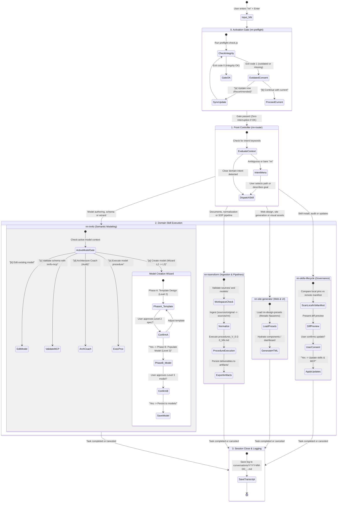

# Interaction Flows & Statechart

**Architecture**: Finite State Machine (FSM) · **Design Pattern**: Front Controller · **Entry Point**: `nn`

---

## 1. Overview

Rather than relying on ambiguous conversational narrative, user-agent interactions in **cogNNitive** are architected as a **Deterministic State Machine (FSM)** coordinated by a **Front Controller** (`nn-router`). 

Whenever a user inputs `nn` or any domain trigger into an agent such as OpenCode, Claude Code, or Antigravity, the system transitions across explicit states with strict guards and governance protocols.

---

## 2. Master Ecosystem Statechart

---

## 3. Decision & State Transition Matrix

The table below defines the deterministic transition rules executed by the agent runtime:

| Current State | Event / Input | Guard / Condition | Agent Action | Next State |
| :--- | :--- | :--- | :--- | :--- |
| **`IDLE`** | User enters `nn` | Preflight exit code 1 | Halt execution, display outdated dependencies, prompt `[a]` or `[b]` | **`AWAITING_PREFLIGHT_CONSENT`** |
| **`IDLE`** | User enters `nn` | Preflight exit code 0 | Greet with canonical badge, inspect intent | **`ROUTER_TRIAGE`** |
| **`ROUTER_TRIAGE`** | No additional intent | Input is solely `nn` | Ask user to describe their situation in 1 sentence; present recommended option first | **`AWAITING_USER_INTENT`** |
| **`ROUTER_TRIAGE`** | "create model" / "wizard" | Matches `nn-innfo` domain | Activate `nn-innfo`, present Entry Menu `[a]` to `[y]` | **`INNFO_ENTRY`** |
| **`ROUTER_TRIAGE`** | "ingest pdf" / "transform" | Matches `nn-trannsform` | Activate `nn-trannsform`, verify workspace layout | **`TRANNNSFORM_SETUP`** |
| **`ROUTER_TRIAGE`** | "generate website" / "ui" | Matches `nn-site-generator` | Prompt for visual palette preset (`nn-design-presets`) | **`SITEGEN_STYLE_SELECTION`** |
| **`ROUTER_TRIAGE`** | "update skills" / "audit" | Matches `nn-skills-lifecycle` | Compare local commits against remote manifest | **`LIFECYCLE_DIFF_PREVIEW`** |
| **`INNFO_ENTRY`** | Option `[a]` selected | New model requested | Launch Phase A (Template design Level 2) | **`WIZARD_PHASE_A`** |
| **`WIZARD_PHASE_A`** | User approves template | Level 2 validated | Transition to Phase B (Model population Level 3) | **`WIZARD_PHASE_B`** |
| **`ACTIVE_BRANCH`** | Workflow finished / exit | Work complete or abort | Save transcript in `conversations/YYYY-MM-DD_...md` | **`CONVERSATION_LOGGED`** |

---

## 4. Governance & Interaction Rules

Every interaction path strictly enforces cogNNitive's foundational UX governance rules:

1. **Zero Unilateral Mutation (Consent First)**:  
   The agent NEVER creates, renames, moves, or deletes user files (such as files in `sources/original/`) without explicit confirmation.
2. **Recommended Option First**:  
   Option `[a]` or `[1]` in every choice menu MUST be prefixed with `(Recommended)`.
3. **Multi-Selection Clarification**:  
   When options are non-exclusive, the agent explicitly states: `"You can select one option or a combination (e.g. A and B)"`.
4. **Mandatory Conversation Logging**:  
   All sessions persist an audited Markdown record under `<workspace_root>/conversations/YYYY-MM-DD_<model_or_topic>.md`.
