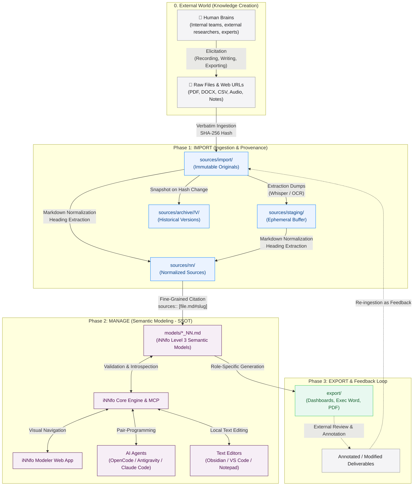

# Knowledge Lifecycle & Operational Architecture

The core mission of **cogNNitive** is to transform scattered ideas, insights, and data from human brains and heterogeneous digital files into a **living, structured knowledge base** governed by AI, without vendor lock-in and with radical provenance traceability.

---

## 1. System Architecture Overview

---

## 2. Phase 0: External Knowledge Elicitation

Knowledge does not begin inside software—it originates in human minds:
* **Internal contributors**: Meeting notes, operational procedures, whiteboard brainstorms, strategic memos.
* **External sources**: Academic research papers, industry benchmarks, book insights, recorded interviews, web articles.

To contribute to the knowledge base, thoughts must be **elicited** into digital files (PDF, audio, spreadsheets, text documents, or web URLs). **cogNNitive imposes zero changes on how authors work.** Authors continue using their preferred recording devices, office suites, or note-taking apps.

---

## 3. Phase 1: Ingestion & Provenance (`IMPORT`)

When files are imported into a cogNNitive workspace:

1. **Immutable Ingestion (`sources/import/`)**:
   - The original file is stored verbatim with its SHA-256 checksum.
   - The file is strictly read-only and never altered by system tools.
2. **Intermediate Staging Buffer (`sources/staging/`)**:
   - Extraction tools (Whisper audio transcription, OCR engines) place raw intermediate dumps (`.srt`, `.vtt`, raw OCR text) into `sources/staging/`.
   - `sources/staging/` is excluded from Git and model citations—it serves purely as an operational scratchpad.
3. **Normalized Markdown (`sources/nn/`)**:
   - Documents are converted to structured Markdown with clean heading anchors (`#heading-slug`).
   - Every file carries standardized YAML frontmatter recording `source_file`, `sha256`, `size_bytes`, `normalized_at`, `normalized_by`, `canonical` identity (BibTeX / DOI), and external `cited_works`.
4. **External Watch Roots & Immutable Timestamped Sources**:
   - Workspaces can watch external directories on demand without daemons (`node scripts/index.js --scan-external`).
   - Dynamic sources are ingested with second-precision timestamps (`<basename>_YYYYMMDD-HHmmss.<ext>`), creating immutable time-series snapshots that prevent broken links and preserve complete citation permanence.
5. **Dynamic Snapshot Archive (`sources/archive/`)**:
   - For legacy or unversioned modified sources, previous versions are archived under `sources/archive/<name>/V<N>/<name>.md`.

---

## 4. Phase 2: Semantic Modeling (`MANAGE`)

The normalized sources are synthesized into **iNNfo Level 3 Semantic Models** (`models/*_NN.md`), serving as the **Single Source of Truth (SSOT)**:

* **Separation of Concerns**:
  - **Templates (`specs/templates/`)**: The structural schema defining Concepts, Fields, Unit Markers, and Matrices.
  - **Models (`models/`)**: Concrete data instances containing populated entities.
* **Granular Traceability**:
  - Elements declare exact source anchors via `sources:: [interview.md#market-expansion, notes.md#budget]`.
  - Line numbers are prohibited; stable heading slugs ensure links survive formatting updates.
* **Multi-Modal Access**:
  - **Plain Text / Git**: Edit with Obsidian, VS Code, or command-line scripts with zero vendor lock-in.
  - **iNNfo Modeler**: Local-first browser app to visually explore entity graphs and matrix intersections.
  - **AI Pair-Programming**: Use conversational AI tools (OpenCode, Antigravity, Claude Code) to query, refine, and cross-validate models.

---

## 5. Phase 3: Deliverables & Closed Feedback Loop (`EXPORT`)

The knowledge base produces actionable outputs:

1. **Role-Specific Deliverables (`export/`)**:
   - Interactive HTML dashboards, executive Word briefs, PDF documentation, and technical task breakdowns.
2. **Provenance Preservation**:
   - Deliverables embed metadata identifying the parent model and version (`derived_from: [Business_Model_V_1-0-0_NN]`).
3. **Closed-Loop Feedback**:
   - When a stakeholder outside the system reviews, annotates, or amends a deliverable, that revised file is dropped into `sources/import/feedback/` or `sources/import/`.
   - The scanner recognizes the lineage, compares diffs against the baseline model, and guides the agent to apply updates interactively (`apply_feedback`).

---

## 6. Dynamic Sources & Impact Checking

When living sources change over time (e.g., weekly financial reports, updated customer roadmaps):

* **Automatic Scan Warning**: Running `node scripts/index.js --scan` detects hash discrepancies, creates snapshot archives, and flags any downstream models citing modified or deleted heading anchors.
* **On-Demand Citation Audit**: Running `node scripts/index.js --check-impact` validates all model citations across the workspace, ensuring no broken or drifted citations exist.
