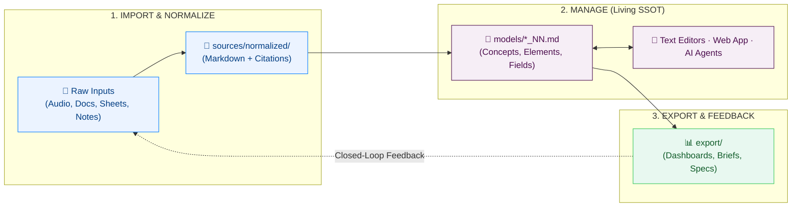

# Knowledge Evolution Framework

Turn ideas, insights, and data scattered through human brains and computer files into a **living knowledge base powered by AI** that continuously evolves, maintains absolute traceability, and never locks you into proprietary silos.

- [Open iNNfo Modeler App](https://cognnitive.com/innfo/app/)
- [Real-World Use Cases](use-cases.md)
- [Explore Agent Skills](https://cognnitive.com/actionn)

---

## Turn 💡 ideas 📄 documents 📰 articles 📊 data 📁 files 📽️ slides ✉️ emails 📅 meetings 🌐 webs 📝 audios 📕 PDFs into actionable, living knowledge

---

## The Knowledge Lifecycle (`IMPORT` ➔ `MANAGE` ➔ `EXPORT`)

Knowledge in an organization begins in minds and existing documents. cogNNitive structures this journey through three transparent phases and a continuous feedback loop:

---

## How It Works: Phase by Phase

### 0. The External World: Where Ideas Originate
Knowledge initially resides in human brains—internal team members, external researchers, subject-matter experts, book authors, and meeting participants. To be usable, this knowledge is **elicited** into digital files (recordings, transcripts, notes, PDFs, spreadsheets, presentations, or URLs). 

**cogNNitive never forces you to change how you capture thoughts.** You continue using whatever note-taking tools, voice recorders, or document editors you prefer.

### 1. IMPORT: Ingestion, Staging, and Normalization
When external files enter the cogNNitive workspace:
* **`sources/import/` (Immutable Originals)**: Original raw files are stored and protected.
* **`sources/staging/` (Extraction Buffer)**: Intermediate raw outputs (Whisper transcripts, OCR dumps) live in a temporary scratchpad.
* **`sources/normalized/` (Normalized Markdown)**: Content is normalized into clean Markdown with permanent heading sections (`#heading-slug`) and provenance frontmatter.

### 2. MANAGE: Semantic Modeling (Single Source of Truth)
Normalized sources are structured into predictable **Models** (`models/*_NN.md`):
* **Predictable Semantic Structure**: Concepts define the schema, Elements represent specific entity instances, and Fields store typed attributes.
* **Radical Fine-Grained Traceability**: Every element cites its exact provenance using section anchors (`sources:: [meeting.md#budget]`).
* **Universal Access Freedom**:
  1. **Text Editors**: Open and edit directly with Obsidian, VS Code, Notepad, or Logseq.
  2. **iNNfo Modeler**: Use the zero-install web UI to visually navigate graphs and edit matrices.
  3. **AI Pair-Programming Agents**: Direct OpenCode, Antigravity, or Claude Code in natural language to expand and refine models.

### 3. EXPORT: Artifacts and Closed Feedback Loop
From the verified model, project role-tailored **Artifacts** into `export/`:
* **Tailored Views**: Interactive HTML dashboards, executive Word documents, PDF reports, or task specs filtered by role or department.
* **Closed-Loop Feedback**: Exported artifacts carry lineage metadata (`derived_from: [Model_NN]`). When a stakeholder reviews, annotates, or amends an artifact, it can be re-imported into sources to continuously evolve the model.

---

## Real-World Use Cases: Zero Abstractions

Explore how cogNNitive delivers tangible value across different roles:

* **🚀 [Startup Founders](use-cases.md#1--the-startup-founder--early-stage-team)**: Turn messy discovery calls and investor notes into a living business model where pivots propagate in 1 hour instead of 2 weeks.
* **💼 [Sales Directors (Consulting)](use-cases.md#2--the-sales-director-mid-size-consulting-firm)**: Unify rate cards, service matrices, and credentials in Git; cut RFP response turnaround from 5 days to 3 hours with mathematically verified citations.
* **🎨 [Freelance Designers](use-cases.md#3--the-freelance-web-designer--solopreneur)**: Structure information architecture directly citing client kickoff recordings; eliminate unpaid scope creep with clickable specification sign-offs.
* **🎬 [YouTube Creators](use-cases.md#4--the-youtube-video--technical-content-creator)**: Research papers and benchmarks become cited video scripts, auto-generated B-roll cues, and instant bibliography descriptions.

👉 **[Read the full deep-dive with pipeline workflows and ROI metrics &rarr;](use-cases.md)**

---

## 6 Key Benefits

1. **Immediate Clarity & Speed**: Turn chaotic meetings, raw recordings, and scattered files into structured, actionable knowledge in minutes.
2. **Zero Vendor Lock-in**: 100% plain Markdown files in your own Git repository. You retain complete ownership of your knowledge forever.
3. **AI You Can Actually Trust**: Deterministic section-level citations eliminate hallucinations and ensure your AI pair-programmer operates on ground truth.
4. **Effortless Company Updates**: When business assumptions, prices, or specs change, update the model and all downstream artifacts reflect the change automatically.
5. **Universal Freedom of Access**: Work visually with the web modeler app, textually in VS Code / Obsidian, or conversationally via your AI agent.
6. **100% Free & Open Source**: Built for the open community under the MIT license. No hidden cloud subscriptions or artificial limits.

---

## What cogNNitive is NOT

Clear boundaries keep the ecosystem honest, simple, and yours:

- **Not a database engine**: Models are plain Markdown files in your Git repo.
- **Not a closed SaaS platform**: Runs locally on your machine or directly in your browser.
- **Models never execute code**: `_NN.md` files are pure declarative data—no hidden macros or background scripts.
- **Not an unvalidated one-shot converter**: The lifecycle is continuous, verified, and reversible.
