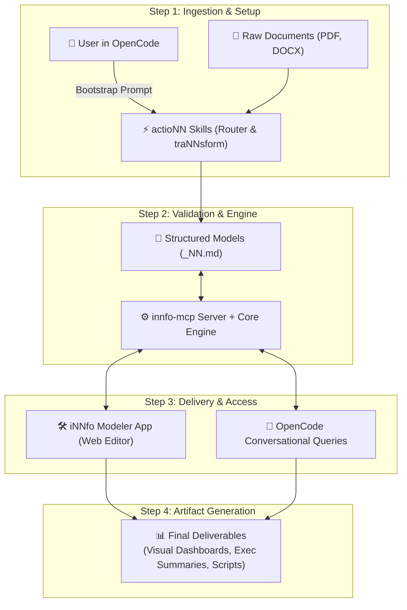
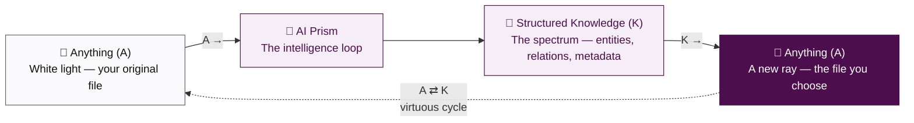

# Knowledge Management made ridiculously simple for humans and AI.

Turn scattered documentation into living, structured knowledge that your AI agent understands.

- [Open iNNfo Modeler App](https://cognnitive.com/innfo/app/)
- [Explore Agent Skills](https://cognnitive.com/actionn)

---

## What is cogNNitive?

An open, unified ecosystem designed to make documentation readable and editable by humans and AI.

- **iNNfo — Knowledge Modeling**: A simple specification chain for structuring Markdown documents. Clear, validated, and engine-backed. Read the [Especificaciones iNNfo y Arquitectura de Documentos](specifications.md).
- **actioNN — AI Agent Skills**: Modular capabilities that teach your OpenCode AI agent specialized domain workflows automatically.
- **iNNfo Modeler — Visual App**: A browser-based workspace editor to view, edit, and validate knowledge graphs without installing servers.

---

## Ecosystem & Information Flow

---

## 6 Key Benefits

1. **Zero Vendor Lock-in**: Plain text Markdown files stored in your own Git repository. You own your knowledge forever.
2. **AI That Never Guesses**: Deterministic validation guarantees your OpenCode agent always works with reliable data.
3. **No Setup Friction**: Works directly inside OpenCode Desktop with a single prompt. No complex setup required.
4. **Always Up to Date**: Detects structural drift and outdated information automatically before it causes mistakes.
5. **Visual & Flexible**: Edit visually in your browser app or textually through conversational AI instructions.
6. **100% Free & Open Source**: Built for the open community under the MIT license. No hidden subscriptions or API costs.

---

## How to Use It (OpenCode)

1. **Open OpenCode Desktop**: Open OpenCode Desktop on your computer and open your project workspace folder.
2. **Prompt Your Agent**: Tell your AI agent: `I want to use https://cognnitive.com/use`
3. **Enjoy Living Knowledge**: OpenCode automatically installs the skills, configures tools, and presents your interactive workflow menu.

---

## The `A ⇄ K` Paradigm

*Turn Anything into structured Knowledge, and back into Anything using AI.*

- **Anything In (A)**: Any file you have — PDF, DOCX, meeting notes, spreadsheet, or raw text. This is your white light.
- **The AI Prism (⇄)**: Not a shallow format converter. AI decomposes the original file into a structured knowledge layer — entities, relations, and metadata.
- **Anything Out (A)**: AI re-composes that knowledge into the new file you need — dashboard, summary, spec, or script. The color you choose.

The cycle is fully reversible (**`A ⇄ K`**): inputs and outputs stay decoupled through a single semantic core, and every pass through the prism enriches the knowledge behind the file.

---

## What cogNNitive is NOT

Clear boundaries keep the ecosystem honest, simple, and yours. If it isn't listed here, it isn't the product.

- **Not a database**: Models are plain Markdown files in your own Git repository. No proprietary storage engine, no hidden silo, no lock-in.
- **Not a hosted platform**: No mandatory cloud service or managed infrastructure that owns your knowledge. Everything runs locally or in your browser.
- **Models never execute code**: `_NN.md` files are data, not programs — no macros, scripts, arbitrary commands, or auto-installed plugins. Opening a model never runs anything.
- **Not a real-time collaboration platform**: No live multi-user editing, presence, or sync protocol. Collaboration is the engineering way: files in Git, branches, and reviews.
- **Not a vector database / RAG platform**: It structures knowledge so retrieval works, but it does not store embeddings or manage retrieval infrastructure. Connect the vector tool of your choice.
- **Not a document authoring suite**: It does not replace your wiki, CMS, or word processor. It organizes the knowledge those tools produce into validated, linked models.
- **Not a universal format**: OKF-compatible and plain Markdown, but not the single format for all knowledge. Your source of truth stays yours.
- **Not a one-shot AI converter**: The `A ⇄ K` cycle is reversible and iterative. A single unvalidated lossy conversion is not the product — living, validated models are.
