# Knowledge Evolution Framework

Turn ideas, insights, and data scattered through human brains and computer files into a **living knowledge base powered by AI** that continuously evolves, maintains absolute traceability, and never locks you into proprietary silos.

- [Open iNNfo Modeler App](https://cognnitive.com/innfo/app/)
- [Explore Agent Skills](https://cognnitive.com/actionn)

---

## Turn 💡 ideas 📄 documents 📰 articles 📊 data 📁 files 📽️ slides ✉️ emails 📅 meetings 🌐 webs 📝 audios 📕 PDFs into actionable, living knowledge

---

## The Knowledge Lifecycle (`IMPORT` ➔ `MANAGE` ➔ `EXPORT`)

Knowledge in an organization begins in minds and existing documents. cogNNitive structures this journey through three transparent phases and a continuous feedback loop:

```mermaid
flowchart LR
    subgraph EXT["0. External World"]
        B["🧠 Brains\n(Internal & External)"] -->|"Elicitation\n(Audio, Notes, Docs)"| F["📁 Files & URLs\n(Local disk paths / Web)"]
    end

    subgraph P1["1. IMPORT (Sources)"]
        F -->|"Verbatim Copy + SHA-256"| S_IMP["sources/import/"]
        S_IMP -->|"Intermediate Buffer (Whisper/OCR)"| S_STG["sources/staging/"]
        S_STG -->|"Normalization to Markdown"| S_NN["sources/nn/"]
        S_IMP -->|"Snapshot on Change"| S_ARC["sources/archive/"]
    end

    subgraph P2["2. MANAGE (iNNfo Models)"]
        S_NN -->|"Fine-Grained Citation\nsources:: [file.md#slug]"| M["models/*_NN.md\n(Single Source of Truth)"]
    end

    subgraph P3["3. EXPORT (Deliverables)"]
        M -->|"Role-Specific Vistas"| A["export/\n(Dashboards, Word, PDF, Web)"]
    end

    A -.->|"Human Feedback & Revision Loop"| F

    classDef ext fill:#F4F4F6,stroke:#8E8E93,color:#1C1C1E;
    classDef p1 fill:#EBF3FF,stroke:#007AFF,color:#003D82;
    classDef p2 fill:#F6EEF6,stroke:#4D0E4E,color:#4D0E4E;
    classDef p3 fill:#E8F8F0,stroke:#34C759,color:#105C29;

    class B,F ext;
    class S_IMP,S_STG,S_NN,S_ARC p1;
    class M p2;
    class A p3;
```

---

## How It Works: Phase by Phase

### 0. The External World: Where Ideas Originate
Knowledge initially resides in human brains—internal team members, external researchers, subject-matter experts, book authors, and meeting participants. To be usable, this knowledge is **elicited** into digital files (recordings, transcripts, notes, PDFs, spreadsheets, presentations, or URLs). 

**cogNNitive never forces you to change how you capture thoughts.** You continue using whatever note-taking tools, voice recorders, or document editors you prefer.

### 1. IMPORT: Ingestion, Staging, and Normalization
When external files enter the cogNNitive workspace:
* **`sources/import/` (Immutable Originals)**: A verbatim copy is stored alongside its cryptographic SHA-256 hash. Originals remain untouched.
* **`sources/staging/` (Extraction Buffer)**: Raw intermediate outputs (such as Whisper audio transcripts, raw OCR dumps, or SRT subtitle streams) live in a staging buffer. This folder is ignored by Git and models—it is never cited directly.
* **`sources/nn/` (Cognitivized Markdown)**: The content is normalized into human- and AI-readable Markdown with clear heading sections (`#heading-slug`) and mandatory provenance frontmatter (`source_file`, `sha256`, timestamps, canonical identity).
* **`sources/archive/` (Dynamic Versioning)**: If an original file changes, previous normalized versions are preserved automatically in snapshot folders (`sources/archive/<name>/V<N>/`).

### 2. MANAGE: Semantic Modeling (Single Source of Truth)
Normalized sources are structured into Level 3 iNNfo models (`models/*_NN.md`):
* **Predictable Semantic Structure**: Concepts define the schema, Elements represent specific entity instances, Fields store typed attributes, and Matrices formalize entity relationships.
* **Radical Fine-Grained Traceability**: Every element cites its exact provenance using section anchors (`sources:: [strategy.md#vision-goals]`).
* **Triple Access Freedom**:
  1. **Plain Text Editors**: Open and edit directly with Obsidian, VS Code, Notepad, or Logseq.
  2. **iNNfo Modeler**: Use the zero-install web UI to visually navigate graphs and edit matrices.
  3. **AI Pair-Programming Agents**: Direct OpenCode, Antigravity, or Claude Code in natural language to expand and refine models.

### 3. EXPORT: Deliverables and Closed Feedback Loop
From the verified model, generate tailored deliverables into `export/`:
* **Tailored Vistas**: Interactive HTML dashboards, executive Word documents, PDF reports, or task specs filtered by role or department.
* **Closed-Loop Feedback**: Exported documents carry metadata. When a stakeholder reviews, annotates, or amends a deliverable outside the system, that document can be re-imported into `sources/import/`. The system identifies the origin, detects diffs, and updates the underlying model.

---

## 6 Key Architectural Pillars

1. **Zero Vendor Lock-in**: Everything is plain Markdown stored on your local filesystem and Git. No proprietary databases, no opaque binary stores, no hosted lock-in.
2. **Fine-Grained Traceability**: Citations point directly to granular heading anchors (`#slug`), not vague document-level links or fragile line numbers.
3. **Dynamic Source Drift Detection**: When an updated file is imported, the built-in **Impact Check** audits all downstream models and alerts you if cited sections have moved or changed.
4. **Respected Workflow**: Your team captures knowledge using whatever physical or digital tools they already know. Ingestion happens transparently.
5. **Deterministic AI Pair-Programming**: AI agents operate against validated schemas with deterministic verification rather than guessing hallucinated structures.
6. **100% Free & Open Source**: Released under the MIT license. Local-first, community-driven, and designed to last decades.

---

## What cogNNitive is NOT

Clear boundaries keep the ecosystem honest, simple, and yours:

- **Not a database engine**: Models are plain Markdown files in your Git repo.
- **Not a closed SaaS platform**: Runs locally on your machine or directly in your browser.
- **Models never execute code**: `_NN.md` files are pure declarative data—no hidden macros or background scripts.
- **Not an unvalidated one-shot converter**: The lifecycle is continuous, verified, and reversible.
