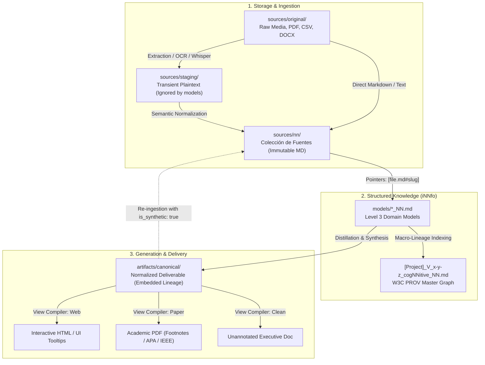

# Unified Citation, Traceability & Provenance Architecture

The **cogNNitive** citation, traceability, and provenance pipeline provides end-to-end deterministic epistemic traceability across all stages of knowledge transformation.

Anchored in the **`A ⇄ K` Paradigm** (*Anything $\leftrightarrow$ Structured Knowledge through the AI Intelligence Loop*), it guarantees that every claim, metric, and entity attribute in domain models and generated deliverables can be verified back to an immutable, hash-anchored primary source.

---

## 1. The `A ⇄ K` Paradigm & Executive Flow



1. **Anything In ($A_1$)**: Unstructured, binary, or raw inputs (audio transcripts, PDFs, DOCX, CSV datasets, unstructured notes).
2. **AI Prism / Intelligence Loop**: Deterministic normalization, schema profiling, and validation into typed models.
3. **Structured Knowledge ($K$)**: Level 2 specifications and Level 3 domain models with explicit typed fields and matrices.
4. **Anything Out ($A_2$)**: Multi-format synthesized deliverables (reports, interactive dashboards, academic articles, APIs).
5. **Closed Feedback Loop ($A_2 \to A_1$)**: Deliverables re-enter the workspace orbit as citable, validated evidence for higher-order reasoning, while preventing *model collapse* through anti-autophagy flags.

---

## 2. Storage Topology & Directory Tiering

```text
project_root/
├── sources/
│   ├── original/              # Raw inputs (PDF, MP3, DOCX, CSV). Pristine, read-only.
│   ├── staging/               # TRANSIENT intermediate dumps (OCR txt, Whisper SRT). Ignored by models.
│   └── nn/                    # LA COLECCIÓN DE FUENTES. Immutable, normalized Markdown files.
├── models/                    # Level 3 domain models (*_NN.md) adhering to Level 2 templates.
├── procedures/                # Executable procedure specifications and scripts.
├── artifacts/
│   ├── canonical/             # Normalized Markdown deliverables with embedded lineage blocks.
│   └── exports/               # Rendered target views (PDF, HTML dashboards, .bib files, clean docs).
└── [Project]_V_x-y-z_cogNNitive_NN.md # Workspace Provenance Model (W3C PROV graph).
```

### The Staging Layer (`sources/staging/`)
When extracting non-textual media (audio, video, OCR image scans), raw dumps can clutter the citable knowledge base.
- **Pristine Origin**: The raw binary stays in `sources/original/`. Its SHA-256 is the root identity of the evidence.
- **Transient Staging**: Extraction tools write intermediate text to `sources/staging/<basename>.txt` or `.srt`. This directory is gitignored.
- **Agent Isolation**: AI Agents and Level 3 models **NEVER cite `sources/staging/`**. Citations must only target validated Markdown in `sources/nn/`.

---

## 3. Semantic Normalization by Input Modality

Normalizing documents into `sources/nn/` produces machine-navigable, human-readable Markdown:

| Modality | Ingestion Challenge | Agent Normalization Behavior | Heading Granularity |
|---|---|---|---|
| **Audio / Video (SRT/VTT)** | Fragmented cues, timestamp noise, disfluencies. | Group dialogue into grammatically fluid paragraphs. Cluster by speaker turn or topic shift. Preserve timestamp ranges. | `## NN Section: [00:04:15] Presupuesto Q3` |
| **Chat Logs (Slack/Teams)** | Rapid replies, emoji noise, interleaved threads. | Group messages by conversation thread. Strip conversational filler. Synthesize core debate with speaker tags. | `## NN Thread: [2026-08-10] Definición de Arquitectura` |
| **Slide Decks (PPTX/PDF)** | Isolated bullets, hidden speaker notes. | Unite titles, bullet points, and speaker notes into cohesive conceptual blocks. | `## NN Slide 04: Estrategia de Monetización` |
| **Tabular Data (CSV/Excel)** | 10,000+ rows destroy LLM attention windows. | Generate **Data Dictionary + Statistical Profile**: column types, null counts, min/max/avg, and 15 sample rows. Raw CSV stays in `sources/original/`. | `## NN Dataset Schema: Métricas de Usuario`<br/>`## NN Summary Statistics` |
| **Legal & Regulatory** | Nested strict legal hierarchy (Articles, Clauses). | Maintain legal numbering verbatim. Map articles directly to markdown headings. | `## NN Artículo 14: Cláusula de Confidencialidad` |

---

## 4. Progressive Disclosure Contract (Anti-Degradation)

To eliminate the LLM *Lost in the Middle* phenomenon when processing massive sources:

```text
[L1: Executive Overview]
       sources/nn/Corporate_Strategy_summary.md (500–1,500 words)
                     │
                     │ (Trigger: Agent requires granular verification or citation)
                     ▼
[L2: Complete Evidence Base]
       sources/nn/Corporate_Strategy_source.md (40,000 words with full headings)
```

- **Default Exploration (L1)**: When answering broad questions or designing models, agents load **only** `_summary.md`.
- **Deep Anchor Drilling (L2)**: When citing a specific fact or metric, the agent performs a targeted read on `[Document]_source.md#<specific-heading-slug>`.
- **Naming Conventions**:
  - `_source.md`: Direct normalized representation of an original text document.
  - `_transcript.md`: Normalized audio/video transcription.
  - `_summary.md`: High-density semantic distillation (L1).
  - `_schema.md`: Dataset profile and statistical summary for tabular data.
  - `_synthetic.md`: An internal deliverable re-ingested as a source.

---

## 5. Frontmatter Schema & Primary Source Detection

Every source in `sources/nn/` carries bibliographic and physical provenance:

```yaml
---
# 1. Physical Ingestion Provenance
source_file: "sources/original/interview_ceo.mp3"
sha256: "e3b0c44298fc1c149afbf4c8996fb92427ae41e4649b934ca495991b7852b855"
size_bytes: 45210982
normalized_at: "2026-09-05T12:00:00Z"
normalized_by: "traNNsform v1.0.0"
staging_file: "sources/staging/interview_ceo.srt"     # Optional link to intermediate buffer
is_synthetic: false                                   # Set to true ONLY if produced by an internal deliverable

# 2. Canonical Identity of THIS Document (Self BibTeX & PID)
canonical:
  title: "Strategic Vision and Market Positioning 2026"
  author: "Jane Doe"
  year: 2026
  doi: "10.1145/3290605.3300233"
  bibtex: |
    @misc{doe2026strategic,
      author = {Doe, Jane},
      title = {Strategic Vision and Market Positioning 2026},
      year = {2026},
      howpublished = {Executive Briefing Series}
    }

# 3. External References cited INSIDE this Document (Detecting Secondary Citations)
references:
  - id: "porter1985"
    citation: "Porter, M. E. (1985). Competitive Advantage."
    doi: "10.1002/smj.4250060308"
    is_primary: true
---
```

### Primary vs. Secondary Citation Resolution
When an agent parses a statement in `Market_Report_source.md` where the author cites Porter (1985):
- The agent inspects the `references:` block.
- Instead of misattributing Porter's framework to the author of `Market_Report`, the citation compiler notes:
  `(Porter, 1985, as cited in Doe, 2026)` or prompts the user to retrieve the primary source.
- This prevents the "telephone game" and theoretical misattribution cascades.

---

## 6. Granular Model Citations & Path Ergonomics

### Elimination of Redundant `sources/nn/` Prefixes
In Level 3 domain models (`models/*_NN.md`), unqualified file paths resolve canonically against the *Colección de Fuentes* (`sources/nn/`):

```markdown
# NN Stakeholders

## NN Stakeholders: Enterprise Clients
priority:: High
relationship_model:: B2B Long-term
sources:: [report_source.md#key-metrics, interview_ceo_transcript.md#market-expansion]
```

### Resolution Rules:
1. **Unqualified filenames** (e.g. `report_source.md#slug` or `clientA/report.md#slug`) resolve relative to `sources/nn/`.
2. **Explicit `sources/nn/` prefix** continues to be supported for backwards compatibility.
3. **Cross-model citations** use explicit namespace prefixes: `models/Finance_V_1-0-0_business_NN.md#revenue-forecast`.
4. **Global Persistent Identifiers (PIDs)** use scheme prefixes: `doi:10.1145/3290605.3300233`.
5. **Heading-Slug Anchors**: Every anchor MUST resolve to a GitHub-compatible heading slug (`#heading-slug`). Arbitrary line-number ranges (`#L1-L10`) are strictly prohibited due to formatting fragility.

---

## 7. Provenance Architecture: Macro vs. Micro Lineage

| Dimension | Scope | Storage Location | Responsibility |
|---|---|---|---|
| **Micro-Lineage** | Element & Claim | Field `sources::` in Level 3 Models | Identifies which source section justifies each entity attribute. |
| **Macro-Lineage** | Entity & Workflow | `[Project]_V_x-y-z_cogNNitive_NN.md` | Tracks W3C PROV DAG across Sources, Models, Artifacts, and Procedures. |

The central provenance model is an automatically indexed view rebuilt deterministically during scan, build, or audit routines to prevent drift.

---

## 8. Artifact Generation & Delivery Views

Deliverables are generated from models using the Model-View pattern:
1. **Canonical Normalized Artifact (`artifacts/canonical/`)**: Markdown with embedded machine-readable lineage comments:
   ```markdown
   Enterprise adoption accelerated by 35% across Q3[^1].

   <!-- lineage:
     elements: ["Plan_Estrategico_V_1-0-0_business_NN.md#Clientes-Enterprise"]
     sources: ["entrevista_ceo.md#nn-section-000001"]
     generated_by: "cogNNitive Unified Pipeline"
     timestamp: "2026-09-05T13:00:00Z"
   -->
   ```
2. **Target View Compilers (`artifacts/exports/`)**:
   - **Footnotes (`[^1]`)**: CommonMark/GFM footnotes mapping to source headings.
   - **Academic (APA 7th / IEEE / BibTeX)**: Formal author-date citations with primary vs. secondary resolution and companion `.bib` file.
   - **Clean Executive**: Strips all citation markers, emitting unannotated prose.

### Anti-Autophagy Protocol (`is_synthetic: true`)
When an internal deliverable is re-ingested into `sources/nn/` to complete the closed feedback loop, its frontmatter sets `is_synthetic: true`. Primary research agents prioritize `is_synthetic: false` sources to prevent recursive hallucination and model collapse.
