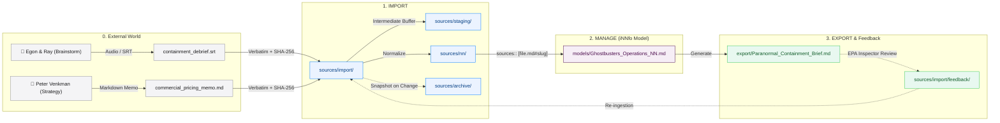

# Knowledge Lifecycle Walkthrough (Ghostbusters Inc. Case Study)

This guide walks through the end-to-end **cogNNitive Knowledge Lifecycle** (`IMPORT` ➔ `MANAGE` ➔ `EXPORT` + Feedback Loop) using the canonical **Ghostbusters Inc.** universe.

You can inspect the entire sample workspace directly on disk or in the repository under [`docs/innfo/samples/lifecycle-ghostbusters/`](../samples/lifecycle-ghostbusters/).

---

## 1. Walkthrough Architecture at a Glance



---

## 2. Phase 0: External Knowledge Elicitation

Knowledge originates outside the software in human minds. The team creates digital files without changing their existing workflows:

* [**`containment_debrief.srt`**](../samples/lifecycle-ghostbusters/0_external_world/containment_debrief.srt): Subtitle transcript from an operational voice recording where Dr. Egon Spengler notes that the laser containment grid is running at **94% capacity** and Dr. Ray Stantz requests grid expansion.
* [**`commercial_pricing_memo.md`**](../samples/lifecycle-ghostbusters/0_external_world/commercial_pricing_memo.md): Strategic rate memo written by Dr. Peter Venkman establishing Manhattan commercial rates ($5,000 elimination + $1,000/mo storage) and hazardous slime surcharges ($1,500).

---

## 3. Phase 1: Ingestion & Normalization (`IMPORT`)

The raw files are imported into the workspace:

```text
workspace/
├── sources/
│   ├── import/
│   │   ├── containment_debrief.srt      # Immutable verbatim copy (SHA-256 tracked)
│   │   └── commercial_pricing_memo.md    # Immutable verbatim copy
│   ├── staging/
│   │   └── pke_audio_buffer.tmp         # Ephemeral transcription buffer (never cited)
│   └── nn/
│       ├── import/
│       │   ├── containment_debrief.md   # Normalized markdown with #nn-section--000001
│       │   └── commercial_pricing_memo.md # Normalized markdown with #manhattan-commercial-rates
```

Run the scanner:
```bash
node scripts/index.js --scan --src "docs/innfo/samples/lifecycle-ghostbusters/workspace"
```

Each file under `sources/nn/` carries flat, deterministic traceability frontmatter:
```yaml
---
source_file: "sources/import/commercial_pricing_memo.md"
sha256: "b4c2...f8a1"
size_bytes: 382
normalized_at: "2026-09-12T12:00:00Z"
normalized_by: "traNNsform v1.0.0"
---
```

---

## 4. Phase 2: Semantic Modeling (`MANAGE`)

With normalized sources available, the team structures the knowledge into an **iNNfo Level 3 Semantic Model** ([`models/Ghostbusters_Operations_V_1-0-0_NN.md`](../samples/lifecycle-ghostbusters/workspace/models/Ghostbusters_Operations_V_1-0-0_NN.md)):

```markdown
# NN ServiceTier

## NN ServiceTier: Standard Class IV Elimination
sources:: [commercial_pricing_memo.md#manhattan-commercial-rates]
base_fee:: $5,000
monthly_storage:: $1,000
target_market:: Manhattan Commercial

Full spectral neutralization and physical containment for non-anchored entities.

# NN FacilityCapacity

## NN FacilityCapacity: Basement Containment Grid
sources:: [containment_debrief.md#nn-section--000001]
status:: Critical Load (94%)
expansion_required:: true
laser_lock_frequency:: 14.8 MHz
```

### Citation Invariants
1. **Heading-level anchors**: Citations point directly to `#heading-slug`, guaranteeing precision down to individual paragraphs.
2. **Auditability**: Running `node scripts/index.js --check-impact` validates that all model pointers resolve accurately.

---

## 5. Phase 3: Deliverables & Closed-Loop Feedback (`EXPORT`)

The model produces client- and regulatory-facing deliverables:

1. **Generated Brief**: [**`export/Paranormal_Containment_Brief_V_1-0-0.md`**](../samples/lifecycle-ghostbusters/workspace/export/Paranormal_Containment_Brief_V_1-0-0.md) embeds lineage metadata:
   ```yaml
   ---
   type: deliverable
   derived_from: [Ghostbusters_Operations_V_1-0-0_NN]
   exported_at: "2026-09-12T12:00:00Z"
   ---
   ```
2. **Human Review Loop**: Walter Peck (EPA) reviews the document and submits structured feedback ([`sources/import/feedback/...json`](../samples/lifecycle-ghostbusters/workspace/sources/import/feedback/Ghostbusters_Operations_V_1-0-0_epa-review_feedback_20260912-120000.json)).
3. **Re-ingestion**: The scanner normalizes the feedback into `sources/nn/`, allowing the agent to guide interactive model updates via `apply_feedback`.

---

## 6. Dynamic Sources & Impact Checking (Drift Detection)

When an existing source changes over time:
1. **Source Update**: If Dr. Peter Venkman updates `commercial_pricing_memo.md` (e.g. renaming `## Manhattan Commercial Rates` to `## Downtown Commercial Rates`).
2. **Automatic Snapshot**: `--scan` archives the previous normalized file in `sources/archive/commercial_pricing_memo/V1/commercial_pricing_memo.md`.
3. **Scan Warning**: The terminal immediately alerts:
   ```text
   ⚠️  [IMPACT WARNING] Updated source "import/commercial_pricing_memo.md" affects downstream models:
       - models/Ghostbusters_Operations_V_1-0-0_NN.md (Standard Class IV Elimination): references "commercial_pricing_memo.md#manhattan-commercial-rates" [missing_heading]
   ```
4. **On-Demand Audit**: Running `node scripts/index.js --check-impact` highlights the exact missing citation and suggests the closest matching heading:
   ```text
   ❌ models/Ghostbusters_Operations_V_1-0-0_NN.md (Standard Class IV Elimination): references missing heading "#manhattan-commercial-rates" in "sources/nn/import/commercial_pricing_memo.md" (Did you mean: #downtown-commercial-rates?).
   ```

---

## 7. Key Takeaways

* **Zero Vendor Lock-in**: All files are plain Markdown and standard JSON/SRT stored locally on your filesystem and Git.
* **Radical Provenance**: Every entity in your model is traceable back to the exact meeting or memo heading it derived from.
* **Continuous Integrity**: Automated snapshots and impact checking prevent silent documentation rot.
