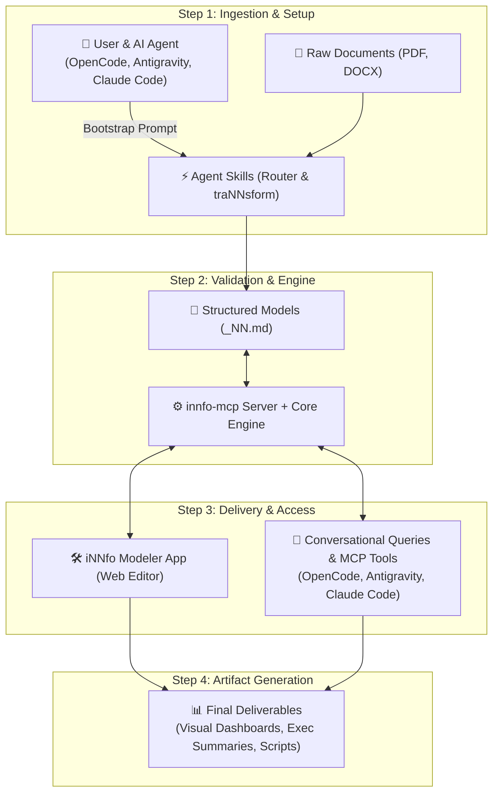

# Transform your documentation into structured, validated knowledge models.

Model, edit, and query knowledge visually in your browser or conversationally with your AI coding agent of choice (OpenCode Desktop, Google Antigravity, Claude Code, Cursor, Codex).

- [Open iNNfo Modeler App](https://cognnitive.com/innfo/app/)
- [Explore Documentation](https://cognnitive.com/innfo/documentation/)

---

## What You Can Do With iNNfo

- **Visual Modeling**: Explore your documentation as interactive graph trees, block sheets, matrices, and visual diagrams.
- **Automatic Validation**: Catch broken links, missing properties, and outdated specs automatically as you edit.
- **AI & Web Editing**: Edit visually in the browser app or ask your AI coding agent (OpenCode Desktop, Claude Code, Antigravity, Cursor) to create and update models for you.

---

## Information & Engine Architecture

---

## Use iNNfo with Your AI Coding Agent

1. **Choose Your AI Agent**: Launch OpenCode Desktop (recommended reference desktop client) or use Google Antigravity, Claude Code, Cursor, or Codex CLI.
2. **Open Your Project**: Open the workspace folder containing your documentation and models.
3. **Prompt Your Agent**: Tell your agent: `I want to use https://cognnitive.com/use`
4. **Create & Edit Models**: Ask your agent to create an iNNfo model, validate documentation, or explore structures.
