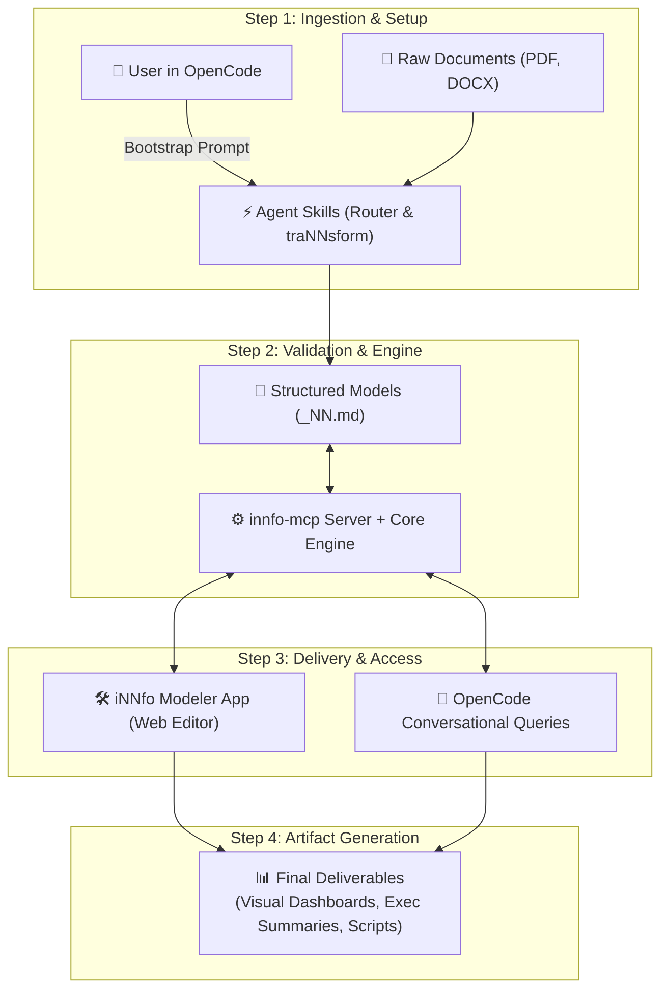

# Modular skills that give your AI agent specialized powers.

Teach your AI agent domain capabilities: iNNfo model authoring, document transformation, site generation, design presets, and skills lifecycle governance.

- [Open iNNfo Modeler App](https://cognnitive.com/innfo/app/)
- [Explore Skills Documentation](https://cognnitive.com/skills/documentation/)

---

## Featured Skills

- **nn-router**: Front controller and system governance. Handles setup, the environment readiness gate (Preflight), and routes requests to the right skill.
- **nn-innfo**: Author, edit, and validate iNNfo models, including the conversational Model Creation Wizard.
- **nn-trannsform**: Multi-modal document ingestion (PDF, DOCX, XLSX), normalization, and multi-step procedure execution.
- **nn-site-generator**: Static website generation, markdown twin hydration, and Docsify documentation suites.
- **nn-design-presets**: Complete design system with the Morado Nazareno palette, systematic typography, and an 8px grid.
- **nn-skills-lifecycle**: Skill ecosystem lifecycle, manifest pinning, and lockfile auditing.

---

## Skills Integration Architecture

---

## How to Install & Use (OpenCode)

1. **Tell Your OpenCode Agent**: Say the single bootstrap phrase in OpenCode Desktop chat: `I want to use https://cognnitive.com/use`
2. **Skills Installed Automatically**: OpenCode fetches the manifest, downloads all skills from GitHub, and presents an interactive workflow menu.
