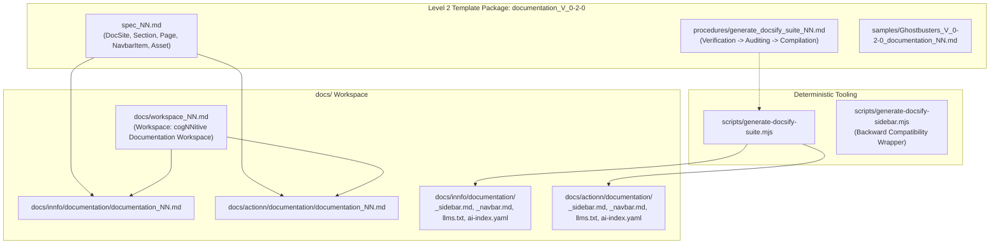

# Design: Documentation V_0-2-0 Template Package and Docsify Suite Generator

## 1. Architecture Overview



## 2. Data Structures & AST Parsing
The generator parses the standard iNNfo Level 3 syntax:
- `# NN <Concept>`
- `## NN <Concept>: <Element>`
- `key:: value`
- Prosa below properties.

Extracted structures:
- `docSite`: `{ title, description, basePath, siteLogo, repoUrl, navEnabled }`
- `sections`: Map of `name -> { order, parent }`
- `pages`: List of `{ title, source, route, order, description, parent, tags }`
- `navbarItems`: List of `{ label, url, order, parent }`
- `assets`: List of `{ path, type }`

## 3. Formatting Logic

### 3.1 `_sidebar.md`
- Standalone pages with `parent == DocSite` render at root level: `* [Title](route)`.
- Sections render sorted by `section_order`: `* Section Title`.
- Nested pages render with 2-space indentation: `  * [Title](route)`.

### 3.2 `_navbar.md`
- Items sorted by `order`.
- Rendered as unordered markdown list:
  ```markdown
  * 🌐 **Ecosistema**: [cognnitive.com](https://cognnitive.com)
  * 📘 **iNNfo Specs & Engine**: [cognnitive.com/innfo](https://cognnitive.com/innfo/documentation/)
  ```

### 3.3 `llms.txt`
Structured markdown summary for AI agents:
```markdown
# <site_title>
> <site_description>

## Documentation Sections
- [<title>](<route>): <description>
```

### 3.4 `ai-index.yaml`
Structured YAML catalog of all available documentation documents.
