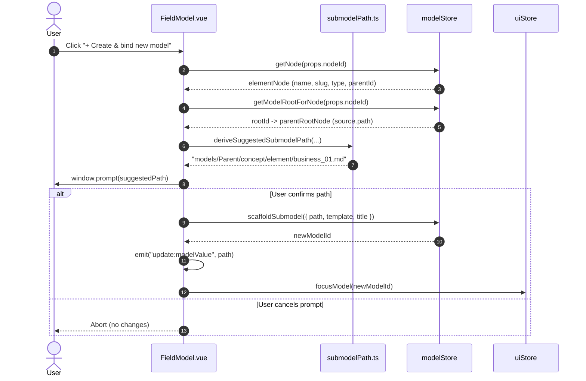

# Technical Design: Hierarchical Submodel Paths

## 1. Context & Objectives

In `innfo-editor`, elements within a model can compose specialized submodels via fields of type `model` (Level 1 specification `iNNfo_V_0-2-1_NN.md` and capability `model-primitive-type`). When a user triggers the `[+ Create & bind new model]` action on a model field in `FieldModel.vue`, the editor scaffolds a new Level 3 markdown document and binds its relative path to the field.

### Problem Statement
Currently, `FieldModel.vue` derives a flat path using only the parent model filename and the target template:
```
models/{parent_stem}_{target_template}_NN.md
```
This naive derivation causes immediate issues:
1. **Filename Collisions Among Sibling Elements**: If two elements under the same concept (e.g., initiatives `Alpha` and `Beta` under concept `Projects`) declare a submodel field with the same target template (e.g., `business`), both suggest the identical path `models/{parent_stem}_business_NN.md`.
2. **Loss of Domain Hierarchy**: Flat storage divorces submodels from their conceptual owner (Concept $\rightarrow$ Element), cluttering the `models/` directory.
3. **Ambiguous Asset/Model Separation**: Without clear architectural rules, submodels risk being conflated with static media assets.

### Objectives
1. **Hierarchical Directory Convention**: Establish the standard directory structure:
   `models/{parent_stem}/{concept_slug}/{element_slug}/{field_or_template}_01.md`
2. **Context-Aware Path Derivation**: Extract concept and element context from `modelStore` via `nodeId` in `FieldModel.vue`.
3. **Robust Slugification & Normalization**: Normalize accents, trim whitespace, and sanitize filenames into URL- and filesystem-safe slugs.
4. **Resilient Parent Stem Resolution**: Accurately strip `_NN.md` suffixes and handle versioned template stems (e.g., `Ghostbusters_V_0-2-0_innovation_NN.md` $\rightarrow$ `Ghostbusters_V_0-2-0`).
5. **Deterministic Fallback**: Gracefully fall back to flat derivation when fields are defined at the model root or lack concept/element ancestry.
6. **Strict Separation of Concerns**: Enforce clean boundaries between `models/` (structured models) and `assets/` (static binary media).

---

## 2. Architecture Decisions (ADR)

### ADR-01: Hierarchical Model Directory Convention vs. Flat Storage

* **Status**: Accepted
* **Context**: Submodels represent specialized Level 3 domain models owned by specific elements. As models scale, having multiple elements instantiate submodels with common templates (`business`, `architecture`, `specification`) creates collisions if stored in a flat directory.
* **Options Considered**:
  - *Option 1: Flat storage with composite file prefixes*:
    `models/{parent_stem}_{concept_slug}_{element_slug}_{template}_01.md`
    *Trade-off*: Clutters `models/` root with excessively long filenames; difficult to inspect or manage per element in standard file explorers.
  - *Option 2: Hash- or UUID-based submodel paths*:
    `models/submodels/{uuid}.md`
    *Trade-off*: Destroys semantic readability in file trees and Git diffs; disconnects files from domain terminology.
  - *Option 3: Hierarchical directory convention (Chosen)*:
    `models/{parent_stem}/{concept_slug}/{element_slug}/{field_or_template}_01.md`
* **Rationale**:
  - Directly reflects the conceptual hierarchy: `Model` $\rightarrow$ `Concept` $\rightarrow$ `Element` $\rightarrow$ `Submodel`.
  - Naturally isolates namespaces: sibling elements have isolated directories, eliminating collision risks.
  - Fully compatible with `innfo-core` recursive parsing, which indexes nested markdown files recursively.
  - Keeps directories modular and readable in IDEs and file explorers.

### ADR-02: Clean Separation Between `models/` Structured Models and `assets/` Static Media

* **Status**: Accepted
* **Context**: Elements frequently own static media assets (diagrams, images, attachments) stored in `assets/{element_slug}/` or `assets/`. A question arises whether submodel documents should also reside under `assets/`.
* **Decision**:
  - Submodels MUST reside strictly within the `models/` directory hierarchy (e.g., `models/{parent_stem}/{concept_slug}/{element_slug}/...`).
  - Submodels MUST NOT be placed inside `assets/`.
  - `assets/` is reserved exclusively for static binary media (images, PDFs, videos, audio) managed by `FieldAsset.vue` and referenced as static file handles or blob URLs.
* **Rationale**:
  - **Structural vs. Static**: Submodels are parseable, schema-validated Level 3 markdown documents with YAML frontmatter, concepts, elements, and markers. Static assets are opaque binaries.
  - **Tooling Contracts**: The parser (`recursiveParse`), workspace indexer (`buildWorkspaceIndex`), and template validation services expect models to reside in designated model paths. Mixing `.md` model files into `assets/` would violate discovery conventions and pollute asset listings.

---

## 3. Path Derivation Specification

### 3.1 Modular Utility: `src/utils/submodelPath.ts`

To ensure maintainability and enable isolated unit testing, the path derivation and slugification logic is extracted into a dedicated utility module:
`iNNfo/apps/innfo-editor/src/utils/submodelPath.ts`.

#### Interface & Signature
```typescript
export interface SuggestedSubmodelPathOptions {
  /** Relative or absolute source path of the parent model root (e.g., "models/Company_V_0-1-0_NN.md") */
  parentPath: string
  /** Concept slug or raw name (e.g., "projects" or "Projects") */
  conceptSlug?: string
  /** Element slug or raw name (e.g., "alpha" or "Alpha") */
  elementSlug?: string
  /** Field name/key declaring the submodel (e.g., "business_model") */
  fieldName?: string
  /** Target template constraint from field definition (e.g., "business") */
  targetTemplate?: string
}

/**
 * Derives a normalized, collision-resistant suggested path for an inline submodel.
 */
export function deriveSuggestedSubmodelPath(options: SuggestedSubmodelPathOptions): string

/**
 * Normalizes an arbitrary string into a URL- and filesystem-safe slug.
 */
export function slugify(text: string): string
```

### 3.2 Slug Generation Rules (`slugify`)

The `slugify` function converts arbitrary names into filesystem-safe directory and filename segments:
1. **Unicode Accent Normalization**: Normalize via NFD (`text.normalize('NFD')`) and strip diacritical marks using regex `replace(/[\u0300-\u036f]/g, '')`.
   - *Example*: `"Iniciativas Estratégicas"` $\rightarrow$ `"Iniciativas Estrategicas"`
   - *Example*: `"José Luis Olmo Mora"` $\rightarrow$ `"Jose Luis Olmo Mora"`
2. **Lowercasing**: Convert to lowercase (`.toLowerCase()`).
3. **Delimiter Replacement**: Replace spaces and underscores with hyphens (`.replace(/[\s_]+/g, '-')`).
4. **Character Sanitization**: Remove all characters except lowercase alphanumerics and hyphens (`.replace(/[^a-z0-9-]/g, '')`).
5. **Deduplication**: Collapse consecutive hyphens into a single hyphen (`.replace(/-+/g, '-')`).
6. **Boundary Trimming**: Strip leading and trailing hyphens (`.replace(/^-+|-+$/g, '')`).

#### Slug Verification Matrix

| Input | Output Slug | Notes |
| :--- | :--- | :--- |
| `"Projects"` | `"projects"` | Basic title case |
| `"Municipal Franchise Expansion"` | `"municipal-franchise-expansion"` | Multi-word with spaces |
| `"Área de I+D & Innovación"` | `"area-de-id-innovacion"` | Accents, symbols `+`, `&` |
| `"  __initiative_01__  "` | `"initiative-01"` | Underscores and padding |
| `""` / `null` / `undefined` | `""` | Empty fallback |

### 3.3 Parent Stem Resolution

Parent stem extraction parses the source path of the root model:
1. **Directory Extraction**:
   ```typescript
   const dir = parentPath.includes('/')
     ? parentPath.substring(0, parentPath.lastIndexOf('/') + 1)
     : ''
   ```
2. **Filename Isolation**: Extract the filename (e.g., `Ghostbusters_V_0-2-0_innovation_NN.md` or `Company_V_0-1-0_NN.md`).
3. **Version & Template Parsing**:
   - Check if the filename contains a version segment followed by an existing template suffix:
     `^(.*_V[_-][0-9.-]+)_[a-zA-Z0-9-]+(_NN)?\.md$`
     If matched, capture the base versioned stem (e.g., `Ghostbusters_V_0-2-0`).
   - If not matched, strip `_NN.md` and `.md`:
     `filename.replace(/_NN\.md$/i, '').replace(/\.md$/i, '')`.
     - *Example*: `models/Company_V_0-1-0_NN.md` $\rightarrow$ `Company_V_0-1-0`
     - *Example*: `models/Company_NN.md` $\rightarrow$ `Company_NN` (or `Company` if stripped)
     - *Example*: `models/Ghostbusters_V_0-2-0_innovation_NN.md` $\rightarrow$ `Ghostbusters_V_0-2-0`

### 3.4 Leaf Filename Resolution

The leaf filename represents the submodel document inside the element's directory:
1. **Leaf Stem**:
   - Prioritize `targetTemplate` if specified and not `'base'`: e.g., `"business"`.
   - If `targetTemplate` is unspecified or `'base'`, use `fieldName`: e.g., `"submodel"` or `"business_model"` $\rightarrow$ `"business-model"`.
   - Default fallback: `"submodel"`.
2. **Collision Index**:
   - Append `_01.md` as the initial sequential index for the leaf file.
   - *Example*: `business_01.md`.

### 3.5 Hierarchical Construction vs. Fallback

```typescript
export function deriveSuggestedSubmodelPath(options: SuggestedSubmodelPathOptions): string {
  const { parentPath, conceptSlug, elementSlug, fieldName, targetTemplate } = options

  const dir = parentPath.includes('/')
    ? parentPath.substring(0, parentPath.lastIndexOf('/') + 1)
    : ''
  const filename = parentPath.split('/').pop() || 'model_NN.md'

  // Versioned stem resolution
  let parentStem = filename.replace(/\.md$/i, '')
  const versionedTemplateMatch = parentStem.match(/^(.*_V[_-][0-9.-]+)_[a-zA-Z0-9-]+(_NN)?$/i)
  if (versionedTemplateMatch) {
    parentStem = versionedTemplateMatch[1]
  } else {
    parentStem = parentStem.replace(/_NN$/i, '')
  }

  // Determine leaf stem
  const effectiveTemplate = targetTemplate && targetTemplate !== 'base' ? targetTemplate : undefined
  const leafStem = slugify(effectiveTemplate || fieldName || 'submodel') || 'submodel'

  // Clean concept & element slugs
  const cSlug = conceptSlug ? slugify(conceptSlug) : ''
  const eSlug = elementSlug ? slugify(elementSlug) : ''

  // Hierarchical case: concept and element context present
  if (cSlug && eSlug) {
    return `${dir}${parentStem}/${cSlug}/${eSlug}/${leafStem}_01.md`
  }

  // Partial hierarchy: element context only
  if (eSlug) {
    return `${dir}${parentStem}/${eSlug}/${leafStem}_01.md`
  }

  // Fallback case: top-level or concept-less field
  return `${dir}${parentStem}_${leafStem}_01.md`
}
```

---

## 4. Component Modifications: `FieldModel.vue`

### 4.1 Context Extraction from `modelStore`

When `handleCreateSubmodel` is called:
1. **Element Node**: Fetch via `props.nodeId`:
   ```typescript
   const elementNode = props.nodeId ? modelStore.getNode(props.nodeId) : undefined
   ```
2. **Element Name & Slug**:
   ```typescript
   const elementSlug = elementNode?.slug || (elementNode?.name ? slugify(elementNode.name) : undefined)
   ```
3. **Concept Name & Slug**:
   Inspect candidate locations in order:
   - `elementNode?.conceptBinding?.name`
   - `elementNode?.type` (for element nodes, `node.type` stores the resolved concept name)
   - Parent concept node: if `elementNode?.parentId`, inspect `modelStore.getNode(elementNode.parentId)` for `conceptBinding?.name` or `name` if `kind === 'concept'`.
   ```typescript
   let conceptName = elementNode?.conceptBinding?.name || (elementNode?.kind === 'element' ? elementNode.type : undefined)
   if (!conceptName && elementNode?.parentId) {
     const parentNode = modelStore.getNode(elementNode.parentId)
     if (parentNode?.kind === 'concept') {
       conceptName = parentNode.conceptBinding?.name || parentNode.name
     }
   }
   const conceptSlug = conceptName ? slugify(conceptName) : undefined
   ```
4. **Parent Root Node & Path**:
   ```typescript
   const parentRootId = props.nodeId ? modelStore.getModelRootForNode(props.nodeId) : undefined
   const parentRootNode = parentRootId ? modelStore.getNode(parentRootId) : undefined
   const parentPath = parentRootNode?.source?.path || 'models/model_NN.md'
   ```
5. **Path Suggestion**:
   ```typescript
   const suggestedPath = deriveSuggestedSubmodelPath({
     parentPath,
     conceptSlug,
     elementSlug,
     fieldName: props.fieldKey,
     targetTemplate,
   })
   ```

### 4.2 Updated `handleCreateSubmodel` Workflow



---

## 5. Testing & Verification Strategy

### 5.1 Unit Tests: `tests/unit/submodelPath.test.ts`

Create comprehensive unit tests covering:
1. **Slugification (`slugify`)**:
   - Stripping diacritics: `"José Luis"` $\rightarrow$ `"jose-luis"`, `"Iniciativas"` $\rightarrow$ `"iniciativas"`.
   - Handling special characters and whitespace: `"C++ & Python / AI"` $\rightarrow$ `"c-python-ai"`.
   - Handling empty strings, undefined, and multiple hyphens.
2. **Hierarchical Path Derivation**:
   - Concept element with target template:
     `deriveSuggestedSubmodelPath({ parentPath: 'models/Company_V_0-1-0_NN.md', conceptSlug: 'Projects', elementSlug: 'Alpha', targetTemplate: 'business' })`
     $\rightarrow$ `'models/Company_V_0-1-0/projects/alpha/business_01.md'`.
   - Distinct paths for sibling elements:
     Sibling `Beta` under `Projects` $\rightarrow$ `'models/Company_V_0-1-0/projects/beta/business_01.md'`.
   - Versioned template stem stripping:
     Parent `models/Ghostbusters_V_0-2-0_innovation_NN.md` with element `Initiative 01` $\rightarrow$ `'models/Ghostbusters_V_0-2-0/initiatives/initiative-01/business_01.md'`.
3. **Fallback Path Derivation**:
   - Concept-less top-level field:
     `deriveSuggestedSubmodelPath({ parentPath: 'models/System_NN.md', targetTemplate: 'architecture' })`
     $\rightarrow$ `'models/System_NN_architecture_01.md'`.
   - Missing parent directory prefix:
     `deriveSuggestedSubmodelPath({ parentPath: 'model_NN.md', targetTemplate: 'base' })`
     $\rightarrow$ `'model_submodel_01.md'`.

### 5.2 Component Tests: `tests/component/FieldModel.test.ts`

Update and augment existing tests:
1. **Pre-filled Prompt Test**:
   - Setup a graph with root node `models/Company_V_0-1-0_NN.md`, concept `Projects`, and element `Alpha`.
   - Render `FieldModel` with `nodeId: element.id`, `target_template: 'business'`.
   - Click `[+ Create & bind new model]`.
   - Assert `window.prompt` was called with `'models/Company_V_0-1-0/projects/alpha/business_01.md'`.
2. **Sibling Element Independence**:
   - Render `FieldModel` for element `Beta` under `Projects`.
   - Assert `window.prompt` suggests `'models/Company_V_0-1-0/projects/beta/business_01.md'`.
3. **Fallback Rendering**:
   - Render `FieldModel` without `nodeId` (or pointing to root).
   - Assert `window.prompt` falls back to flat path `'models/Company_V_0-1-0_business_01.md'`.
4. **Scaffold, Bind & Focus**:
   - Confirm prompt and assert `modelStore.scaffoldSubmodel` creates the hierarchical node, emits `update:modelValue`, and invokes `uiStore.focusModel`.

---

## 6. Migration & Compatibility

- **Zero Breaking Changes**: Existing models referencing flat submodel paths (e.g., `models/Ghostbusters_V_0-2-0_business_NN.md`) remain 100% valid. iNNfo resolves relative paths transparently regardless of nesting depth.
- **No Required File Relocations**: Existing workspaces do not require file renames or directory migrations.
- **Forward-Only Convention**: The hierarchical convention applies to newly created submodels via `FieldModel.vue`.

---

## 7. Interfaces & Exports

```typescript
// iNNfo/apps/innfo-editor/src/utils/submodelPath.ts
export interface SuggestedSubmodelPathOptions {
  parentPath: string
  conceptSlug?: string
  elementSlug?: string
  fieldName?: string
  targetTemplate?: string
}

export function slugify(text: string): string
export function deriveSuggestedSubmodelPath(options: SuggestedSubmodelPathOptions): string
```
