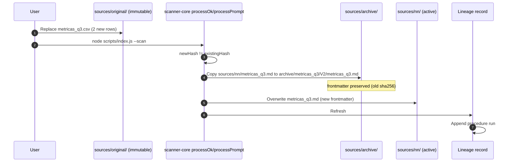
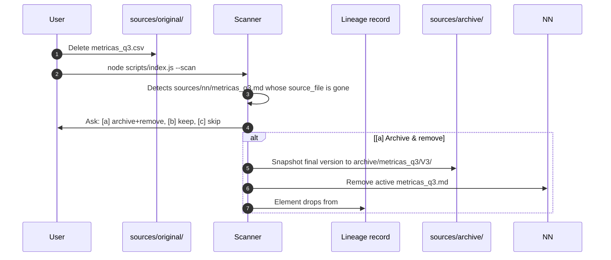

# Technical Design: Source Versioning & Archive (2026-09-06)

This document establishes the technical design for change
`2026-09-06-source-versioning-archive`. It formalizes the `sources/archive/`
version store, snapshot-on-change/deletion semantics in the scanner, the
version metadata emitted into the lineage record, the `--check` archive-chain
validation, and the explicit decision **not** to touch the write-once Level-2
template `cogNNitive_V_0-2-0`.

---

## 1. System Architecture & Context

The cogNNitive pipeline treats a **Source** as a normalised Markdown file under
`sources/nn/` carrying origin metadata (`source_file`, `sha256`, `size_bytes`,
`normalized_at`, `normalized_by`) in its frontmatter. Change detection uses the
sha256 of the **original** file's bytes; git is the current history mechanism —
"there is no snapshot folder".

That single-snapshot decision is the gap this change closes. When a source
changes, the pipeline silently rewrites the normalised file and the previous
state is only recoverable through git. For incremental sources (a CSV of URLs
re-exported with more rows, an edited report, a drifted web page), the lineage
record keeps **no record of what a model saw at a given time** unless a commit
was made.

```
sources/original/   ──►   sources/nn/            ──►   models/*_NN.md
  (immutable               (active Source,       (model Citations:
   dropbox)                 changed in place)      sources:: [a.md#x])
        │  change detected                          │
        └──────────────────────────────────────────►  sources/archive/
        snapshot of previous normalized version        (version store, NEW)
```

The archive is **history for the workspace itself**, independent of whether the
user committed anything.

---

## 2. Architecture Decision Records (ADRs)

### ADR-1: `sources/archive/` is the version store

- **Context**: Versioned snapshots need a stable home that does not collide
  with the active collection or the immutable user dropbox.
- **Decision**:
  1. New sibling directory `sources/archive/`, alongside `sources/original/`,
     `sources/nn/`, `sources/staging/`.
  2. Layout: `sources/archive/<basename>/V<N>/<basename>.md`, where `<basename>`
     is the original filename without extension and `V<N>` a monotonically
     increasing per-source version.
  3. Excluded from every scanner walk (`walkOriginal`, `detectFormats`,
     `walkMarkdown`, and any future `walkSourceTrees`) by name, exactly like
     `sources/staging/`.
  4. **Not a citation target by default**: unqualified `sources::` paths
     resolve under `sources/nn/` only; `sources/archive/` requires an explicit
     qualified path, mirroring the staging-buffer rule.
  5. Created lazily on the first snapshot; no bootstrap change required
     (avoids colliding with the in-flight directory-rename change).

### ADR-2: Snapshot-on-change is hash-idempotent

- **Context**: `processOkFile` / `processPromptFile` (scanner-core.js) currently
  overwrite the normalised file as soon as `existingHash !== newHash`.
- **Decision**:
  1. Before overwriting, if `existingHash` exists and differs from `newHash`,
     copy the current `sources/nn/<rel>.md` (frontmatter intact) to
     `sources/archive/<basename>/V<N>/<basename>.md`.
  2. `V<N>` = max existing version in `sources/archive/<basename>/` + 1
     (first snapshot is `V1`).
  3. **Hash-idempotent**: if a snapshot with the same `sha256` already exists
     under `sources/archive/<basename>/`, the snapshot is skipped but the
     active file is still overwritten (the content already has a preserved copy).
  4. The scan registry entry reports the snapshot action
     (`"Archived V<N> then converted"`) so the manifest stays truthful.

### ADR-3: Deletion archives with explicit consent

- **Context**: When an original disappears from `sources/original/`, the
  normalised file stays in `sources/nn/` and the lineage entry becomes dangling
  (the `--check`/preflight `dangling` state). Nothing preserves the final
  version.
- **Decision**:
  1. After normalization, the scanner detects `sources/nn/<rel>.md` whose
     `source_file` no longer exists on disk.
  2. For each orphaned source, the agent MUST ask the user before acting:
     `[a] (Recommended)` archive and remove from the active set, `[b]` keep as
     active (unchanged behaviour), `[c]` skip for this run.
  3. Archiving a deletion = snapshot to `sources/archive/<basename>/V<N>/` and
     remove from `sources/nn/` (files under `sources/nn/` are tool-generated;
     the Zero Unilateral Mutation rule protects `sources/original/`, not
     `sources/nn/`).
  4. No `superseded_by::` is written for the final version (nothing supersedes
     it).

### ADR-4: Lineage version metadata without touching the write-once template

- **Context**: The change requires `# NN Sources` to carry `status::`,
  `version::`, `archive_path::`, `superseded_by::`. `cogNNitive_V_0-2-0` is
  declared write-once and immutable by the in-flight
  `2026-09-06-sources-conversations-lifecycle` change.
- **Decision**:
  1. The Level-2 template `iNNfo/specs/templates/cogNNitive/cogNNitive_V_0-2-0_NN.md`
     is **not modified**.
  2. Version fields are emitted only into the Level-3 lineage record. Verified:
     `innfo-core` model validation ignores undeclared element properties
     (`checkSchemaConformance` passes `unknownProperty: 'ignore'`,
     `validator/model-checks.ts:168`), so the editor/MCP validator accepts them.
  3. `# NN Sources` lists the **active** version (name = raw basename) and one
     element per archived version (`name = "<basename> V<N>"`), collected from
     `sources/archive/` frontmatter.
  4. The lineage record's `model_version` is bumped to `V_0-2-0` for new
     records, and the hardcoded `TEMPLATE_URL`/`INNFO_URL` in
     `provenance-model.js` are aligned to the current template/spec files
     (`cogNNitive_V_0-2-0_NN.md`, `iNNfo_V_0-2-1_NN.md`) — today they point at
     stale `V_0-1-0` URLs.

### ADR-5: `--check` validates the archive chain

- **Context**: The archive store must not silently rot (orphan dirs, snapshots
  whose recorded hash no longer matches, elements whose `archive_path` resolves
  nowhere).
- **Decision**: `lineage-check.js` adds archive checks:
  1. Every archived snapshot under `sources/archive/` has a matching
     `status:: archived` element in the lineage record.
  2. Every `archive_path::` / `superseded_by::` value resolves.
  3. The `raw_hash` recorded on each archived element equals the `sha256` in
     that snapshot's own frontmatter (reproducibility).
  4. An archived snapshot chain exists for every active source that reports
     `archive_path::`; orphaned chain dirs (no active source, no archived
     element) are reported as warnings.

---

## 3. Data Flows

### 3.1 Source update lifecycle (the primary case)



### 3.2 Source deletion lifecycle



---

## 4. Technical Specifications & Schemas

### 4.1 Archive store layout

```
sources/archive/
└── metricas_q3/
    ├── V1/
    │   └── metricas_q3.md      # snapshot of the first normalized state
    └── V2/
        └── metricas_q3.md      # snapshot of the state before the latest change
```

Each snapshot is a verbatim copy of the active normalized file **including its
frontmatter**, so its `sha256`/`size_bytes`/`normalized_at` describe the state
at that moment.

### 4.2 Lineage record version fields

Active source element (unchanged fields plus version metadata):

```markdown
## NN Sources: metricas_q3.csv
raw_filename:: sources/original/metricas_q3.csv
raw_hash:: d9a1dd85db9753a706dda824fb8d3117e4b8ed7cfb0682625f598b980febd24d
size:: 225
source_format:: csv
normalized_at:: 2026-09-06T10:54:10.140Z
normalized_by:: traNNsform v1.0.0
normalized_content:: sources/nn/metricas_q3.md
version:: V2
archive_path:: sources/archive/metricas_q3/V1/metricas_q3.md
```

Archived source element:

```markdown
## NN Sources: metricas_q3.csv V1
raw_filename:: sources/original/metricas_q3.csv
raw_hash:: 3a9f2c1d5b7e8a0f4c6d9e2b1a7f3c5d8e0a6b4c2d9f1e7a3b5c8d0e6f2a4b1c
size:: 195
source_format:: csv
normalized_at:: 2026-09-05T10:54:10.140Z
normalized_by:: traNNsform v1.0.0
normalized_content:: sources/archive/metricas_q3/V1/metricas_q3.md
status:: archived
version:: V1
superseded_by:: metricas_q3.csv V2
```

Name disambiguation: the existing `collectSources` disambiguation (prepend
parent dir on duplicate names) is extended to versioned names — the archived
name is unique by construction (`<basename> V<N>`).

### 4.3 Frontmatter

No new frontmatter keys are introduced. Snapshots reuse the standard scanner
frontmatter, which keeps `provenance-model.js` parsing unchanged
(`parseSourceFrontmatter` already reads `sha256`, `size_bytes`, `normalized_at`,
`normalized_by`, `source_file`).

### 4.4 `--check` archive diagnostics

| Check | Severity | Condition |
| :--- | :--- | :--- |
| Unlisted snapshot | `error` | `sources/archive/**` file with no `status:: archived` lineage element |
| Dangling archive_path | `error` | `archive_path::`/`superseded_by::` value resolving nowhere |
| Hash mismatch | `error` | Archived element `raw_hash` ≠ snapshot frontmatter `sha256` |
| Orphan chain | `warning` | Chain dir with neither an active source nor an archived element |

---

## 5. Concrete Impacted Files Across the Repository

| File Path | Component / Layer | Nature of Change |
| :--- | :--- | :--- |
| `actioNN/skills/nn-trannsform/scripts/lib/scanner-core.js` | `nn-trannsform` | `archiveSourceSnapshot` helper (idempotent by hash); snapshot call in `processOkFile`/`processPromptFile` before overwrite; `archive` exclusion in `walkOriginal`/`detectFormats` |
| `actioNN/skills/nn-trannsform/scripts/lib/scanner-converters.js` | `nn-trannsform` | None (frontmatter generation unchanged) |
| `actioNN/skills/nn-trannsform/scripts/scanner.js` | `nn-trannsform` | Orphan detection pass; scan report strings mention archived versions |
| `actioNN/skills/nn-trannsform/scripts/lib/provenance-model.js` | `nn-trannsform` | `collectArchivedSources`; version fields in `renderSourcesSection`; align `TEMPLATE_URL`/`INNFO_URL`; bump record `model_version` |
| `actioNN/skills/nn-trannsform/scripts/lib/lineage-check.js` | `nn-trannsform` | Archive-chain checks (4.4) |
| `actioNN/skills/nn-trannsform/scripts/index.js` | `nn-trannsform` | Orphan-consent prompt when `--scan` detects deletion |
| `actioNN/skills/nn-trannsform/test/unit/test-scanner.js` | tests | Snapshot-on-change, hash-idempotency, walk exclusion |
| `actioNN/skills/nn-trannsform/test/unit/test-lineage-sync.js` | tests | Version fields, archived elements, `--check` diagnostics |
| `actioNN/skills/nn-trannsform/test/test.ps1` | tests | Integration scenario: change → archive → lineage refresh |
| `actioNN/skills/nn-trannsform/SKILL.md` | `nn-trannsform` | Document `sources/archive/`, snapshot-on-change, deletion consent |
| `docs/innfo/documentation/citations-provenance.md` | docs | Archive semantics; `sources/archive/` not a default citation target |

---

## 6. Testing Strategy (Strict TDD)

Following `strict_tdd: true`, unit tests are written first
(`test/unit/test-scanner.js`, `test/unit/test-lineage-sync.js`) before any
implementation.

### 6.1 Scanner tests (`test-scanner.js`)

1. **Snapshot-on-change**: create `sources/original/doc.txt`, scan, mutate the
   file, scan again. Assert `sources/archive/doc/V1/doc.md` exists with the old
   `sha256` in its frontmatter and the active file reflects the new content.
2. **Hash-idempotent snapshot**: run the second scan again with no change.
   Assert no `V2` snapshot is created and the active file is unchanged.
3. **Walk exclusion**: create `sources/archive/...` and assert
   `detectFormats` / `walkOriginal` ignore it entirely.
4. **Version counter**: after N snapshots, the next archived version is `V(N+1)`.

### 6.2 Lineage tests (`test-lineage-sync.js`)

1. **Active + archived elements**: after a change+scan, `# NN Sources` contains
   the active element (with `version::`, `archive_path::`) and the archived
   element (with `status:: archived`, `superseded_by::`).
2. **Idempotent refresh**: a second lineage build with no change is byte-identical.
3. **`--check` diagnostics**: unlisted snapshot → error; dangling archive_path →
   error; hash mismatch → error; orphan chain → warning.

### 6.3 Integration (`test.ps1`)

- Bootstrap a project, scan, mutate a CSV, scan again, assert the archive tree
  and refreshed lineage; run `--check` green; run `npm run verify`.