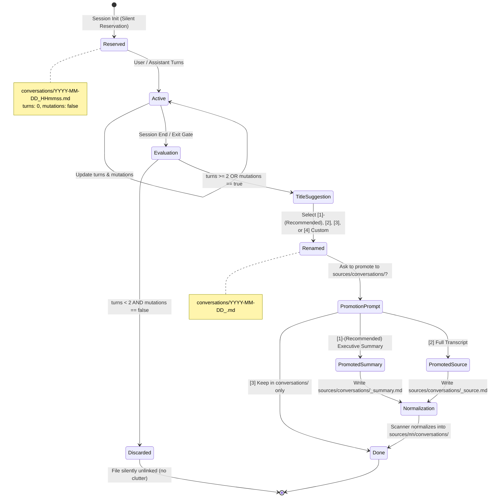
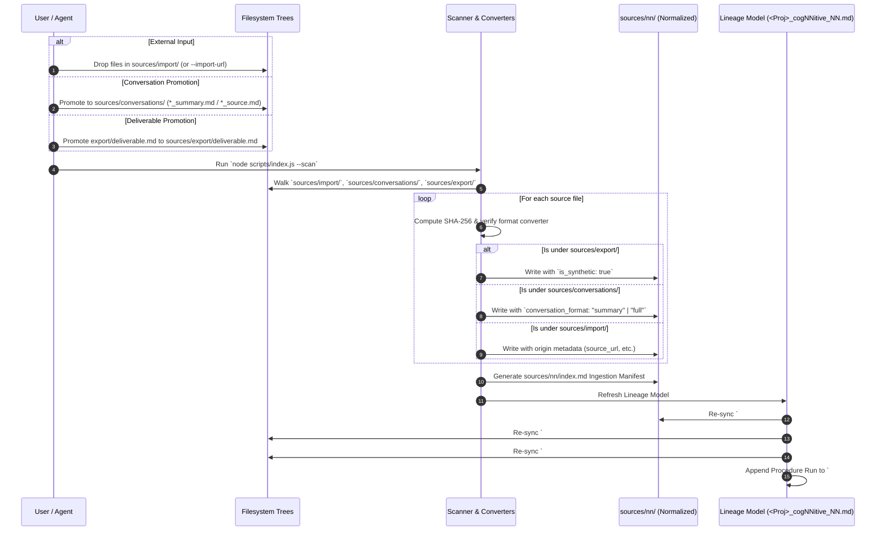
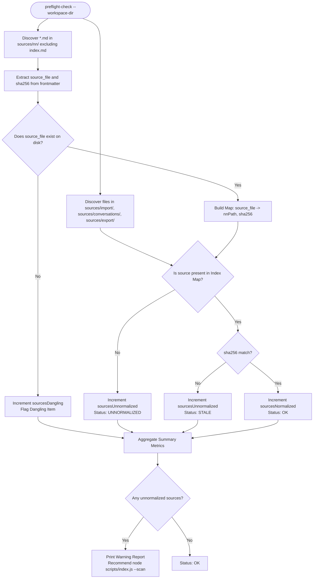

# Technical Design: Sources & Conversations Lifecycle (2026-09-06)

This document establishes the technical design for change `2026-09-06-sources-conversations-lifecycle`. It formalizes the restructuring of workspace directories, the full lifecycle of agent conversation transcripts, the symmetrical promotion of deliverables as synthetic sources, the universal preflight source integrity audit, the removal of legacy Slack/Teams heuristics, and the inviolability of the write-once Level-2 template `cogNNitive_V_0-2-0`.

---

## 1. System Architecture & Context

The cogNNitive workspace architecture treats **Sources** as first-class, immutable or versioned evidentiary inputs that ground Level 3 semantic models (`models/*_NN.md`) and downstream generated deliverables (`export/`).

Historically, sources were restricted to raw external files placed in `sources/original/`. However, knowledge in an AI-native workspace originates from three distinct streams:
1. **External Raw Ingestion (`sources/import/`)**: User-provided documents, datasets, and web imports.
2. **Interaction Dialogues (`sources/conversations/`)**: Curated session transcripts and executive summaries capturing user decisions, domain rationale, and architectural debates.
3. **Synthetic Derivatives (`sources/export/`)**: Internal deliverables produced by procedures that are re-ingested as foundational sources for higher-order synthesis (`is_synthetic: true`).

```
┌──────────────────────────────────────────────────────────────────────────────────┐
│                               WORKSPACE ROOT                                     │
├───────────────────────────────┬──────────────────────────────────────────────────┤
│ Working / Ephemeral Layer     │ Evidentiary / Source Layer                       │
│                               │                                                  │
│ conversations/                │ sources/                                         │
│   └── 2026-09-06_refactor.md  │   ├── import/           (raw external inputs)    │
│           │ [promote]         │   │     └── market.pdf                           │
│           └───────────────────┼─► ├── conversations/    (promoted transcripts)   │
│                               │   │     └── 2026-09-06_refactor_summary.md       │
│ export/                       │   ├── export/           (promoted deliverables)  │
│   └── architecture_deck.md    │   │     └── arch_v1.md   [is_synthetic: true]    │
│           │ [promote]         │   │                                              │
│           └───────────────────┼─► └── nn/               (canonical normalized)   │
│                               │         ├── import/market.md                     │
│ models/                       │         ├── conversations/refactor_summary.md    │
│   └── system_NN.md            │         └── export/arch_v1.md                    │
│                               │                                                  │
│ procedures/                   │ Lineage Record: <Project>_V_x-y-z_cogNNitive_NN.md│
│   └── build_report_NN.md      │   # NN Sources     (synced from sources/nn/)     │
│                               │   # NN Models      (synced from models/)         │
│ index.md                      │   # NN Artifacts   (synced from export/)         │
│                               │   # NN Procedures  (append-only log)             │
└───────────────────────────────┴──────────────────────────────────────────────────┘
```

---

## 2. Architecture Decision Records (ADRs)

### ADR-1: Directory Renaming (`sources/original/` → `sources/import/`, `artifacts/` → `export/`)

- **Context**: The directory name `sources/original/` incorrectly implied that all sources were external original files, ignoring promoted transcripts and synthetic deliverables. The folder name `artifacts/` was ambiguous between Level-2/3 model concepts, build caches, and user deliverables.
- **Decision**:
  1. Rename `sources/original/` → `sources/import/`.
  2. Rename `artifacts/` → `export/`.
  3. Provide non-breaking fallback alias resolution:
     - If `sources/import/` does not exist but `sources/original/` is present, tools read from `sources/original/` with a deprecation warning: `[DEPRECATION] 'sources/original/' is deprecated; migrate folder to 'sources/import/'`.
     - If `export/` does not exist but `artifacts/` is present, tools target `artifacts/` with a deprecation warning: `[DEPRECATION] 'artifacts/' is deprecated; migrate folder to 'export/'`.
  4. Project initialization (`bootstrapProject`) creates `sources/import/` and `export/`.

### ADR-2: Root `conversations/` with Promote-on-Demand to `sources/conversations/`

- **Context**: Every conversational session with an agent produces an interaction log. Storing all raw chat sessions directly into `sources/` clutters the knowledge graph with ephemeral discussions, failed prompts, and trivial queries.
- **Decision**:
  1. Workspace root `conversations/` is the standard repository for all raw interaction transcripts.
  2. A conversation transcript is promoted to `sources/conversations/` only on explicit user request or confirmation.
  3. Promoted transcripts become eligible for scanner normalization into `sources/nn/conversations/` and can then be cited by Level 3 models (`sources:: [conversations/<name>.md#<slug>]`).

### ADR-3: Symmetrical Deliverable Promotion (`export/` → `sources/export/` with `is_synthetic: true`)

- **Context**: Deliverables in `export/` (e.g. market analyses, technical briefs) often need to serve as inputs for subsequent modeling phases. However, treating generated documents as primary external sources corrupts epistemic grounding.
- **Decision**:
  1. An export deliverable is promoted to `sources/export/<relPath>`.
  2. Scanner normalization into `sources/nn/export/<relPath>.md` enforces `is_synthetic: true` in its YAML frontmatter.
  3. Models citing synthetic sources inherit explicit lineage indicating that their claims rest upon derived rather than empirical inputs.

### ADR-4: Silent Session Reservation, Trivial Discard Filter, and Post-Session Title Suggestions

- **Context**: Creating transcript files at session completion leads to lost conversations when an IDE or process terminates unexpectedly. Conversely, creating transcripts unconditionally at startup litters the workspace with blank or trivial 1-turn interactions.
- **Decision**:
  1. **Silent Reservation**: At session initialization, the agent silently reserves `conversations/YYYY-MM-DD_HHmmss.md` with header frontmatter (`session_id`, `created_at`, `turns: 0`, `mutations: false`).
  2. **Trivial Discard Filter**: Upon session exit or completion, if `turns < 2` AND `mutations === false` (no files created/modified), the reserved file is silently deleted.
  3. **Post-Session Title Suggestions**: For non-trivial sessions, the agent inspects the transcript and suggests 3 concise slug/title options (e.g., `[1] (Recommended) Api Gateway Refactor`, `[2] Database Migration Strategy`, `[3] Authentication Debugging`) plus option `[4] Custom Slug`. Upon user selection, the file is renamed to `conversations/YYYY-MM-DD_<chosen_slug>.md`.

### ADR-5: Normalization Altitudes: Full (`_source.md`) vs Executive Summary (`_summary.md`)

- **Context**: Full conversation transcripts are verbose, containing tool calls, repeated instructions, and minor corrections. Downstream models often require only high-level architecture decisions, trade-offs, and accepted constraints.
- **Decision**:
  1. When promoting a conversation to `sources/conversations/`, the user is offered two altitude options:
     - `[1] (Recommended) Executive Summary`: Normalizes to `sources/conversations/<session-slug>_summary.md` containing decisions, rationale, open questions, and agreed actions.
     - `[2] Full Transcript`: Normalizes to `sources/conversations/<session-slug>_source.md` preserving complete user-agent dialogue turns.
  2. The scanner records `conversation_format: "summary" | "full"` in the normalized source frontmatter under `sources/nn/conversations/`.

### ADR-6: Universal Workspace Preflight Source Integrity Audit

- **Context**: `nn-preflight` currently checks Node.js runtime, MCP bundles, skills, templates, and spec staleness under `specs/`. It does not detect unnormalized or stale sources, allowing models to drift from raw inputs.
- **Decision**:
  1. Extend `preflight-check.js` (`--workspace-dir <dir>`) with `scanWorkspaceSources(workspaceDir)`.
  2. Audits all three source branches:
     - `sources/import/` (or legacy `sources/original/`)
     - `sources/conversations/`
     - `sources/export/`
  3. Matches every discovered source against `sources/nn/`:
     - Compares `sha256` content hash against the `sha256` recorded in the normalized frontmatter.
     - Verifies that `source_file` in `sources/nn/` points to a valid physical file.
  4. Flags drift:
     - `unnormalized`: Raw source exists without a matching normalized Markdown file in `sources/nn/`.
     - `stale`: Raw source content has changed since it was normalized (sha256 mismatch).
     - `dangling`: Normalized Markdown in `sources/nn/` points to a `source_file` that no longer exists.
  5. Emits summary metrics (`sourcesTotal`, `sourcesNormalized`, `sourcesUnnormalized`, `sourcesDangling`). Unnormalized sources yield a non-blocking actionable warning recommending `node scripts/index.js --scan`.

### ADR-7: Deprecation & Replacement of Legacy Slack/Teams JSON Parser in `scanner-converters.js`

- **Context**: `convertChatJson` in `scanner-converters.js` used fragile heuristics matching Slack/Teams export structures (`thread_ts`, `user_profile`, `ts`). Conversational source ingestion is now natively supported through Markdown transcripts in `conversations/` and `sources/conversations/`.
- **Decision**:
  1. Deprecate and remove `convertChatJson` and its Slack/Teams specific branches.
  2. Generic `.json` files placed in `sources/import/` are normalized as structured data:
     - Validated JSON array of objects → Data dictionary table + sample records (consistent with CSV conversion).
     - Arbitrary JSON object/payload → Syntactically highlighted JSON block with key statistics.
  3. Chat threads must be supplied as canonical Markdown dialogues in `sources/conversations/`.

### ADR-8: Inviolability of Write-Once Level-2 Template `cogNNitive_V_0-2-0` (Concept Stays `Artifacts`)

- **Context**: The Level-2 template `iNNfo/specs/templates/cogNNitive/cogNNitive_V_0-2-0_NN.md` defines the meta-model for workspace lineage records. It formally defines concept `Artifacts` (`## NN Concept Definition: Artifacts`) with fields `artifact_ref`, `artifact_format`, `derived_from`, `note`.
- **Decision**:
  1. The Level-2 template `cogNNitive_V_0-2-0_NN.md` is strictly **write-once and immutable**. It is NOT renamed or edited.
  2. The concept in Level-3 lineage records (`<Project>_V_x-y-z_cogNNitive_NN.md`) remains `# NN Artifacts` and `## NN Artifacts: ...`.
  3. The `artifact_ref::` field value points to the renamed filesystem directory `export/<filename>` (previously `artifacts/<filename>`).
  4. The code in `provenance-model.js` scans directory `export/` (with fallback to `artifacts/`), while emitting `# NN Artifacts` sections into the lineage document.

---

## 3. Data Flows & Lifecycles

### 3.1 Conversation Session Lifecycle

The following state machine governs transcript persistence from session start to promotion or discard:



### 3.2 Symmetrical Ingestion & Normalization Pipeline

The following sequence details how raw inputs, promoted conversations, and synthetic deliverables are ingested, normalized, and bound into the lineage record:



### 3.3 Universal Preflight Source Integrity Audit

The preflight audit verifies workspace consistency across all three source trees:



---

## 4. Technical Specifications & Schemas

### 4.1 Standard Workspace Directory Layout

```
<project-root>/
├── sources/
│   ├── import/                  # External raw files (PDF, DOCX, CSV, TXT, JSON, HTML)
│   ├── conversations/           # Promoted transcripts (*_summary.md or *_source.md)
│   ├── export/                  # Promoted deliverables re-entering pipeline (is_synthetic: true)
│   └── nn/                      # Canonical normalized Markdown source collection
│       ├── import/              # Mirrored normalized sources from sources/import/
│       ├── conversations/       # Mirrored normalized conversations
│       ├── export/              # Mirrored normalized synthetic deliverables
│       └── index.md             # Ingestion manifest & processing log
├── conversations/               # All raw session interaction transcripts (YYYY-MM-DD_<slug>.md)
├── export/                      # Deliverables, reports, dashboards generated by procedures
├── models/                      # Structured iNNfo Level 3 models (*_NN.md)
├── procedures/                  # Multi-step transformation procedure specs (*_procedures_NN.md)
├── traNNsformations/            # Transformation templates applied to sources
├── assets/                      # Media and attachment assets referenced by models
└── index.md                     # Semantic workspace entry point (# NN index)
```

### 4.2 Frontmatter Metadata Schemas

#### 1. Canonical Source Frontmatter (`sources/nn/**/*.md`)
```yaml
---
source_file: "sources/import/clientA/market_analysis.pdf"
sha256: "3b5d28a4e9b7f..."
size_bytes: 524288
normalized_at: "2026-09-06T10:15:30.000Z"
normalized_by: "traNNsform v1.0.0"
is_synthetic: false
staging_file: "sources/staging/market_analysis.txt" # optional
source_url: "https://example.com/report.pdf"       # optional
downloaded_at: "2026-09-06T10:14:00.000Z"          # optional
canonical:                                         # optional
  title: "Market Analysis 2026"
  author: "Jane Doe"
  year: 2026
cited_works: []                                    # optional
---
```

#### 2. Promoted Synthetic Deliverable Frontmatter (`sources/nn/export/*.md`)
```yaml
---
source_file: "sources/export/q3_strategic_roadmap.md"
sha256: "9f8e7d6c5b4a..."
size_bytes: 16384
normalized_at: "2026-09-06T11:00:00.000Z"
normalized_by: "traNNsform v1.0.0"
is_synthetic: true
---
```

#### 3. Promoted Conversation Frontmatter (`sources/nn/conversations/*.md`)
```yaml
---
source_file: "sources/conversations/2026-09-06_api-gateway-review_summary.md"
sha256: "1a2b3c4d5e6f..."
size_bytes: 4096
normalized_at: "2026-09-06T11:30:00.000Z"
normalized_by: "traNNsform v1.0.0"
conversation_format: "summary"    # or "full"
is_synthetic: false
---
```

### 4.3 Preflight Audit Report & JSON Output Schema

`scripts/preflight-check.js` results envelope is extended with source integrity metrics:

```json
{
  "timestamp": "2026-09-06T11:37:14.000Z",
  "status": "OK",
  "exitCode": 0,
  "summary": {
    "skillsTotal": 7,
    "skillsOutdated": 0,
    "skillsMissing": 0,
    "mcpTotal": 1,
    "mcpOutdated": 0,
    "mcpMissing": 0,
    "templatesTotal": 2,
    "templatesOutdated": 0,
    "templatesMissing": 0,
    "specsStale": 0,
    "specsFresh": 2,
    "specsOffline": 0,
    "sourcesTotal": 8,
    "sourcesNormalized": 8,
    "sourcesUnnormalized": 0,
    "sourcesDangling": 0
  },
  "items": [
    {
      "type": "source-integrity",
      "name": "sources/import/brief.pdf",
      "status": "unnormalized",
      "detail": "Source has not been normalized into sources/nn/. Run `node scripts/index.js --scan`."
    }
  ]
}
```

### 4.4 Ingestion & Scanner Converters Specification

1. **Tree Walking (`scanner-core.js:walkSourceTrees`)**:
   - Replaces single `walkOriginal` with multi-tree walk covering:
     - `sources/import/` (or legacy `sources/original/`)
     - `sources/conversations/`
     - `sources/export/`
   - Ignores `.git/`, `.staging-*`, `desktop.ini`, `~$*`, and `sources/staging/`.
2. **Path Mirroring**:
   - `sources/import/<rel>` → `sources/nn/import/<rel>.md` (with legacy fallback `sources/original/<rel>` → `sources/nn/<rel>.md`).
   - `sources/conversations/<rel>` → `sources/nn/conversations/<rel>.md`.
   - `sources/export/<rel>` → `sources/nn/export/<rel>.md`.
3. **JSON Processing (`scanner-converters.js`)**:
   - Remove `convertChatJson`.
   - Handle `.json`:
     - Array of uniform objects → Render Markdown table profile (headers, row count, sample preview) equivalent to CSV.
     - General JSON object → Render fenced ```json code block with basic metadata header.
4. **Markdown Passthrough**:
   - Promoted conversation Markdown files (`.md`) have existing outer frontmatter stripped and are re-wrapped with scanner traceability frontmatter, preserving the dialogue or summary body verbatim.

### 4.5 Lineage Record & Level 2 Template Immutability Guard

In `provenance-model.js`:
- `collectArtifacts(projectDir)`:
  - Scans `export/` directory (with fallback to `artifacts/`).
  - Emits section `# NN Artifacts` with `artifact_ref:: export/<filename>`.
- `cogNNitive_V_0-2-0_NN.md`:
  - Remains untouched. The template concept name is `Artifacts`, which matches the lineage section `# NN Artifacts`.

---

## 5. Concrete Impacted Files Across the Repository

| File Path | Component / Layer | Nature of Change |
| :--- | :--- | :--- |
| `actioNN/skills/nn-trannsform/scripts/lib/bootstrap.js` | `nn-trannsform` | Update `WORKSPACE_DIRS` to `sources/import`, `sources/conversations`, `sources/export`, `conversations`, `export`. Update `bootstrapProject` to copy to `sources/import/`. |
| `actioNN/skills/nn-trannsform/scripts/lib/scanner-core.js` | `nn-trannsform` | Add multi-source tree discovery (`walkSourceTrees`), support `sources/import/`, `sources/conversations/`, `sources/export/`, set `is_synthetic` and `conversation_format`. |
| `actioNN/skills/nn-trannsform/scripts/lib/scanner-converters.js` | `nn-trannsform` | Remove legacy Slack/Teams `convertChatJson`. Add canonical structured JSON dataset / code block converter. |
| `actioNN/skills/nn-trannsform/scripts/scanner.js` | `nn-trannsform` | Update `scanAndProcess` to iterate over all active source trees, mapping to mirrored paths in `sources/nn/`. |
| `actioNN/skills/nn-trannsform/scripts/lib/provenance-model.js` | `nn-trannsform` | Point `collectArtifacts` to `export/` (fallback to `artifacts/`), preserving `# NN Artifacts` section header. |
| `actioNN/skills/nn-trannsform/scripts/lib/lineage-check.js` | `nn-trannsform` | Update artifact check to read from `export/` (fallback `artifacts/`). |
| `actioNN/skills/nn-trannsform/scripts/transformer.js` | `nn-trannsform` | Output generated deliverables to `export/` instead of `artifacts/`. |
| `actioNN/skills/nn-trannsform/scripts/webImport.js` | `nn-trannsform` | Download URLs into `sources/import/` (with fallback to `sources/original/`). |
| `actioNN/skills/nn-trannsform/scripts/index.js` | `nn-trannsform` | Update CLI strings, paths, and interactive menus to reflect `sources/import/` and `export/`. Add promotion prompts. |
| `actioNN/skills/nn-preflight/scripts/preflight-check.js` | `nn-preflight` | Add `scanWorkspaceSources` to verify `sources/import/`, `sources/conversations/`, `sources/export/` against `sources/nn/`. Update summary and human report. |
| `actioNN/skills/nn-preflight/SKILL.md` | `nn-preflight` | Document source integrity checks in Tier 1/2 and updated layout conventions. |
| `actioNN/skills/nn-router/SKILL.md` | `nn-router` | Update Rule 5: Conversation Logging Protocol (silent reservation, trivial discard, title suggestions, promotion to `sources/conversations/`). Update layout to `sources/import/` and `export/`. |
| `actioNN/skills/nn-trannsform/SKILL.md` | `nn-trannsform` | Update directory layouts, ingestion protocols, promotion workflow, citations, and frontmatter schemas. |
| `actioNN/skills/nn-trannsform/README.md` | `nn-trannsform` | Update documentation of bootstrap, directories, and normalization. |
| `actioNN/skills/nn-trannsform/TESTING.md` | `nn-trannsform` | Update test expectations for `sources/import/`, `export/`, `conversations/`. |
| `actioNN/skills/nn-trannsform/citations.md` | `nn-trannsform` | Update bibliography deliverable path from `artifacts/` to `export/`. |
| `actioNN/skills/nn-preflight/scripts/preflight-check.test.js` | `nn-preflight` tests | Add unit test cases for `scanWorkspaceSources` (OK, unnormalized, stale hash, dangling). |
| `actioNN/skills/nn-trannsform/test/unit/test-scanner.js` | `nn-trannsform` tests | Add tests for `sources/import/`, `sources/conversations/`, `sources/export/`, `is_synthetic`, JSON converter. |
| `actioNN/skills/nn-trannsform/test/unit/test-bootstrap-recursive.js`| `nn-trannsform` tests | Update assertions to verify `sources/import/` and `export/`. |
| `actioNN/skills/nn-trannsform/test/unit/test-lineage-sync.js` | `nn-trannsform` tests | Verify `export/` syncing to `# NN Artifacts`. |
| `actioNN/skills/nn-trannsform/test/test.ps1` | `nn-trannsform` tests | Update integration assertions for new directory structure. |

---

## 6. Testing Strategy (Strict TDD)

Following repository guidelines (`strict_tdd: true`), unit tests must be written first to capture requirements before code refactoring.

### 6.1 Preflight Source Integrity Tests (`actioNN/skills/nn-preflight/scripts/preflight-check.test.js`)

1. **Clean Workspace Baseline**:
   - Workspace containing `sources/import/doc1.txt` normalized at `sources/nn/import/doc1.md` with valid `sha256`.
   - Assert `summary.sourcesUnnormalized === 0`, `summary.sourcesDangling === 0`, exit code 0.
2. **Unnormalized Source Detection**:
   - Add `sources/conversations/meeting_summary.md` without corresponding normalized file in `sources/nn/`.
   - Assert `summary.sourcesUnnormalized === 1`, item reported with status `unnormalized`.
3. **Stale Source Hash Drift**:
   - Mutate content of `sources/import/doc1.txt` without re-running scanner.
   - Assert `summary.sourcesUnnormalized === 1`, item reported with status `stale` (hash mismatch).
4. **Dangling Source Detection**:
   - Create `sources/nn/import/orphan.md` pointing to `sources/import/missing.pdf`.
   - Assert `summary.sourcesDangling === 1`, item reported with status `dangling`.
5. **Legacy Directory Fallback**:
   - Workspace with legacy `sources/original/legacy.txt` normalized in `sources/nn/legacy.md`.
   - Assert recognized cleanly without false-positive unnormalized errors.

### 6.2 Scanner & Converters Unit Tests (`actioNN/skills/nn-trannsform/test/unit/test-scanner.js`)

1. **Multi-Source Tree Ingestion**:
   - Populate `sources/import/doc.txt`, `sources/conversations/session_summary.md`, `sources/export/sheet.csv`.
   - Run `scanner.scanAndProcess(projectDir)`.
   - Verify outputs:
     - `sources/nn/import/doc.md` (`is_synthetic: false`)
     - `sources/nn/conversations/session_summary.md` (`conversation_format: "summary"`)
     - `sources/nn/export/sheet.md` (`is_synthetic: true`)
2. **JSON Conversion without Slack Heuristics**:
   - Ingest `data.json` containing an array of customer records.
   - Assert conversion produces a Markdown data dictionary / table preview, not Slack thread headings (`## NN Thread`).
3. **Legacy Directory Backward Compatibility**:
   - Ingest `sources/original/doc.txt` when `sources/import/` does not exist.
   - Assert successful normalization to `sources/nn/doc.md` with `source_file: "sources/original/doc.txt"`.

### 6.3 Lineage & Bootstrap Tests (`test-bootstrap-recursive.js`, `test-lineage-sync.js`)

1. **Bootstrap Structure**:
   - Execute `bootstrapProject(srcDir, destDir, 'test-project')`.
   - Assert existence of `sources/import/`, `sources/conversations/`, `sources/export/`, `conversations/`, `export/`, `sources/nn/`, `models/`, `procedures/`.
   - Assert no `sources/original/` or `artifacts/` created.
2. **Lineage Record Artifact Sync**:
   - Create deliverable in `export/deck.html` with export metadata.
   - Run `provenance.buildProvenanceModel(projectDir)`.
   - Assert lineage record contains `# NN Artifacts` and `artifact_ref:: export/deck.html`.
   - Assert Level 2 spec `cogNNitive_V_0-2-0_NN.md` remains identical.

### 6.4 CLI Integration Test (`test.ps1`)

- Run PowerShell integration suite ensuring full lifecycle execution:
  - Bootstrap project.
  - Scan documents.
  - Check lineage sync.
  - Verify zero regressions across the verification gate (`npm run verify`).
