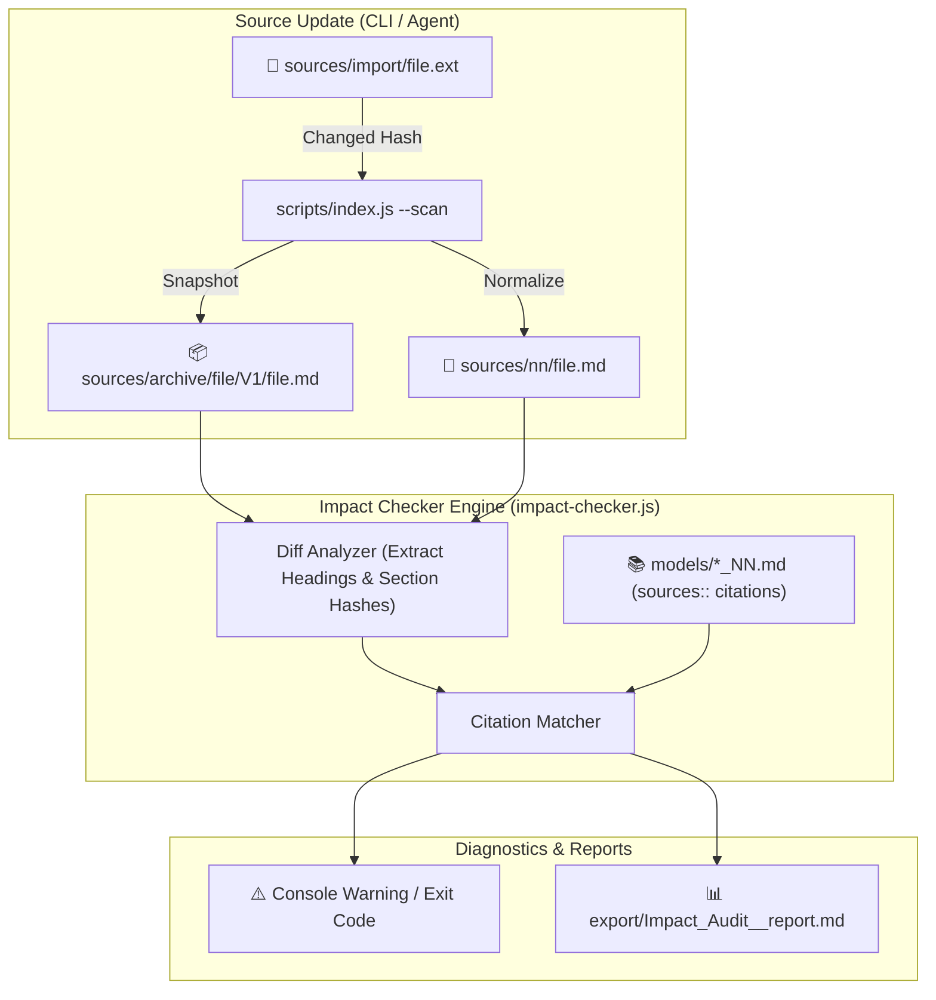

# Design: Lifecycle Narrative and Dynamic Sources Impact Checking

## Context

The cogNNitive framework is built around three core promises:
1. Knowledge evolution from scattered brains and files without vendor lock-in.
2. Uncompromising traceability from business models down to specific source sections.
3. Multi-modal interfaces: plain text, visual web UI (`iNNfo Modeler`), and AI pair-programming agents (`OpenCode`, `Antigravity`, `Claude Code`).

This design establishes the technical architecture for the **Dynamic Sources Impact Checker** and the updated **Public Narrative Architecture**.

---

## 1. Dynamic Sources Impact Checker Architecture

### Module Design: `scripts/lib/impact-checker.js`

1. **`auditModelCitations(workspaceDir, options)`**:
   - Parses all models in `models/*_NN.md` and extracts `sources::` pointers.
   - For each pointer `<source_path>.md#<slug>`:
     - Verifies if `<workspaceDir>/sources/nn/<source_path>.md` exists.
     - Verifies if `#<slug>` exists as an active heading in the normalized source.
     - If the heading is missing or if an archived snapshot exists with a significant textual diff in that section, flags the citation as `stale` or `missing`.
2. **`checkScanImpact(changedSources, workspaceDir)`**:
   - Lightweight trigger invoked inside `--scan` only for files that generated a snapshot in `sources/archive/`.
   - Compares the heading structure of the archived version vs the new normalized version.
   - Filters models citing the changed source and prints targeted warnings.

---

## 2. Documentation Architecture & Narrative Flow

### Information Architecture in `docs/index.md` & `README.md`

1. **Hero Section**: Transform scattered knowledge from brains and files into living, validated models without vendor lock-in.
2. **The 3-Phase Lifecycle Diagram**:
   - External World: Brains -> Elicitation -> Raw Files / URLs.
   - `IMPORT`: Verbatim copy, staging buffer, normalization, hash archive.
   - `MANAGE`: iNNfo semantic models (Concept / Element / Field / Matrix), `sources::` section citations, triple access (Notepad, Web App, AI).
   - `EXPORT`: Dynamic deliverables & structured feedback re-ingestion.
3. **Pillars**:
   - Zero Vendor Lock-in (Local Markdown files).
   - Radical Fine-Grained Traceability (Section slugs, SHA-256).
   - Tool Freedom (OpenCode, Antigravity, Claude Code, Obsidian, Web App).
