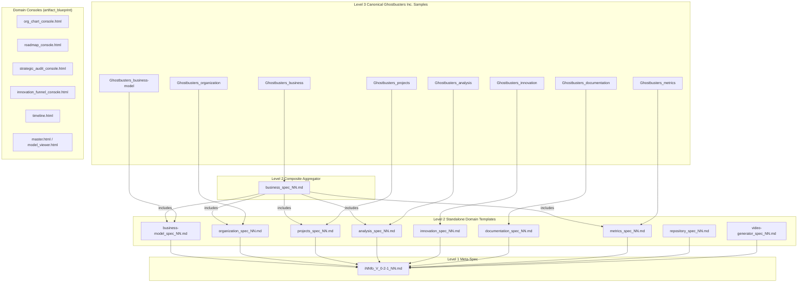

# Design: Templates, Consoles, and Procedures Ecosystem

## Architecture & System Overview

The iNNfo architecture separates the conceptual model into three strict levels:
1. **Level 1 (Meta-spec)**: Core grammar and definition primitives (`iNNfo_V_0-2-1_NN.md`).
2. **Level 2 (Templates)**: Domain schemas defining Concepts, Fields, Markers, Matrices, Procedures, and Asset Consoles.
3. **Level 3 (Models & Samples)**: Concrete instances populated with domain data (e.g. Ghostbusters Inc.).

## Architectural Decisions (ADR)

### ADR 1: `business-model` Standalone Boundary vs `business` Composite Umbrella
- **Context:** Previously `business-model` declared `includes: [organization, projects]`, while `business` also declared `includes: [business-model, analysis, organization, projects, metrics]`. This created transitive inclusion overlap.
- **Decision:** Strip `includes` entirely from `business-model`. `business-model` is strictly the descriptive core (Value Proposition, Segments, Channels, Revenue, Costs, Narrative). `business` is the top-level aggregator.
- **Consequences:** Eliminates schema collision risks, simplifies standalone usage of `business-model`, and clarifies template ownership.

### ADR 2: Modeler Sidebar Documentation Standard
- **Context:** Modeler UI displays a right-hand contextual inspection sidebar whenever a user clicks on a Concept in the navigation tree or editor.
- **Decision:** Enforce two mandatory markdown subsections under every `# NN Concept Definition: <Concept>`:
  - `### Summary` (1-2 sentences for tooltips and quick summaries).
  - `### Description` (In-depth prose detailing semantics, fields, and authoring guidelines).
- **Consequences:** Zero blank or uninformative concept sidebars in iNNfo Modeler.

### ADR 3: Domain Console Layouts via Shared Bundle & `needs[]`
- **Context:** Each domain benefits from specialized interactive dashboards (Organigram/RACI for Org, Gantt/Roadmap for Projects, Risk Heatmap for Analysis).
- **Decision:** Implement all domain consoles using the `artifact_blueprint.html` pattern with pure JSON slots (`<script id="innfo-model" type="application/json">`). The console imports `console/innfo-console.bundle.js` and declares its required modules in `needs: ["concept-rail", "matrix-grids", "fulltext-search"]`.
- **Consequences:** Zero build step needed per model export, immediate standalone offline support via `file://`, and unified UI styling across all cogNNitive visual artifacts.

## Domain Procedures & Consoles Matrix

| Template | Procedures (`procedures/`) | Console Layout (`assets/`) | Declarative Needs |
|---|---|---|---|
| **Organization** | `audit_skill_gaps_NN.md` `export_team_directory_NN.md` | `org_chart_console.html` | `concept-rail`, `fulltext-search`, `matrix-grids` |
| **Projects** | `calculate_critical_path_NN.md` `generate_status_report_NN.md` | `roadmap_console.html` | `concept-rail`, `fulltext-search`, `matrix-grids` |
| **Analysis** | `run_coherence_audit_NN.md` `prioritize_experiments_NN.md` | `strategic_audit_console.html` | `concept-rail`, `matrix-grids`, `fulltext-search` |
| **Innovation** | `score_innovation_pipeline_NN.md` | `innovation_funnel_console.html` | `concept-rail`, `fulltext-search`, `matrix-grids` |
| **Documentation** | `generate_docsify_suite_NN.md` | `docs_portal_console.html` | `concept-rail`, `fulltext-search` |
| **Metrics** | `create_timeline_NN.md` `apply_feedback_NN.md` | `timeline.html` | `concept-rail`, `charts`, `matrix-grids` |
| **Business** | `compile_strategic_master_NN.md` `compile_model_viewer_NN.md` | `master.html` `model_viewer.html` | `concept-rail`, `fulltext-search`, `matrix-grids` |
