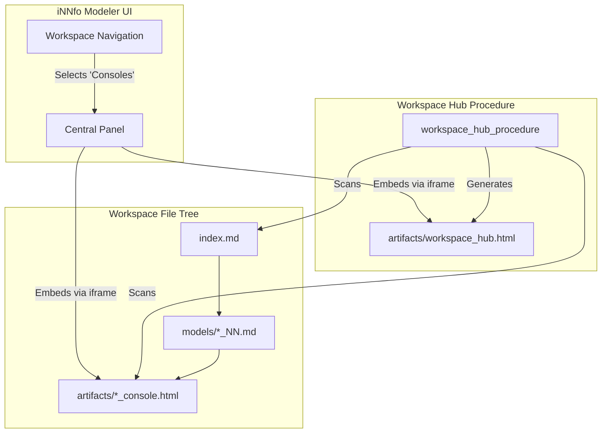

# Design: Workspace Console Hub & Canonical Console Consolidation

## 1. Architectural Decisions

### ADR-1: Fusion of `master.html` into Canonical Template Console Artifacts
- **Context**: `master.html` was created as an early prototype/showroom. Later, iNNfo formalized the concept of interactive "Consoles" per template (e.g. Business Console, Procedures Console, Organization Console). Having both confuses users and fragments the generator procedures.
- **Decision**:
  - Reconcile `master.html` references across skills, documentation, and procedures to target the canonical template console (`<template>_console.html` or `<ModelName>_<template>_console.html`).
  - Canonical templates (Business, Procedures, Organization) define a standard console procedure that outputs the unified console.
- **Consequences**: Standardized terminology, single artifact deliverable per model, zero legacy confusion.

### ADR-2: Standalone Declarative Workspace Hub Procedure
- **Context**: In multi-model workspaces, users need a unified dashboard that links to and showcases all generated consoles without requiring server-side runtime infrastructure.
- **Decision**:
  - Implement a workspace-level procedure (`workspace_hub_procedures_V_0-1-0_NN.md`) in `procedures/`.
  - The procedure reads `index.md`, lists all active models, inspects available artifacts in `artifacts/`, and generates `artifacts/workspace_hub.html`.
  - The generated Hub is pure HTML5/CSS3/ES modules (zero external runtime dependencies, standalone portable file), following cogNNitive Design Presets (palette, typography, spacing).
- **Consequences**: Portable deliverable suitable for distribution, static hosting, or local inspection.

### ADR-3: Sandboxed Central Panel Embed in iNNfo Modeler
- **Context**: Users working inside `iNNfo Modeler` (`WorkspaceView.vue`) should be able to view and interact with the Workspace Hub and individual consoles directly.
- **Decision**:
  - Introduce an `activeView: 'consoles'` state in `uiStore`.
  - In `WorkspaceView.vue`, render an embedded viewer container with a secure `<iframe>` pointing to the selected console artifact (or `workspace_hub.html` by default).
  - Provide a top toolbar within the console view to switch between available consoles or open in a new browser tab.
- **Consequences**: Complete UI/CSS isolation between the Vue application and the console artifact; instant access without navigating away from the workspace.

---

## 2. Component Architecture & Data Flow

