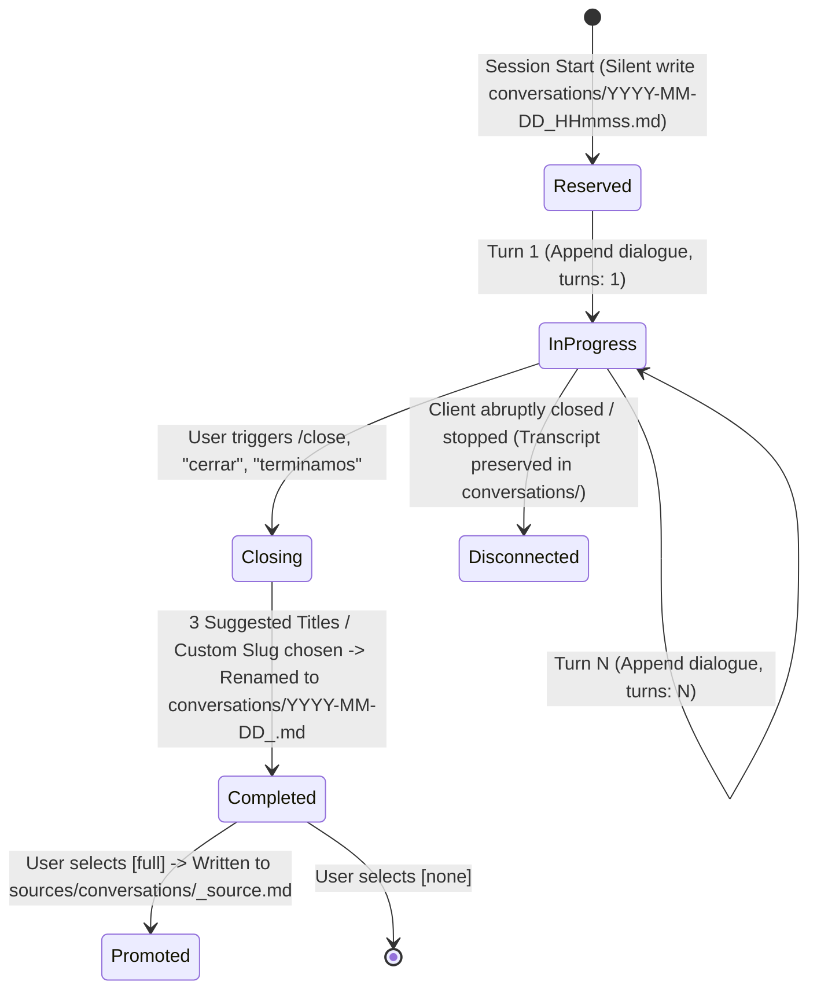

# Design: All-Sessions Retention and Intuitive Closing Protocol

## Architecture Overview

The previous conversation lifecycle model attempted to keep `conversations/` clean by evaluating an exit heuristic (`turns < 2 && mutations === false`) and unlinking the reserved file upon discard. In real-world agent interactions, this led to frequent data loss because users frequently have valuable exploratory or informational conversations without triggering file mutations, or close their client before reaching 2 formal turns. Furthermore, stateless LLM sessions lacked a structured turn persistence loop and an intuitive trigger for session conclusion.

This design introduces three foundational shifts:
1. **Zero-Loss Retention**: Every initialized session transcript is permanent in `conversations/`. The discard evaluation function is retained for API compatibility but modified to never unlink or discard files (`discard: false`).
2. **Incremental Turn Persistence**: Every conversation turn is appended to the active transcript file (`conversations/YYYY-MM-DD_HHmmss.md`), updating the frontmatter `turns` count and maintaining `status: in_progress`.
3. **Intuitive Session Conclusion & Footers**:
   - Natural closing intent matching (`/close`, `cerrar`, `terminar sesión`, `listo por hoy`, `done`).
   - Non-intrusive status footer displayed on key milestones to give the user immediate visual awareness of the active session file and how to close it.
   - Standardized 3-title suggestion step, status update to `completed`, and optional promotion to `sources/conversations/` as `_source.md`.

## Data Model & Lifecycle Flow

## Component Changes

### 1. `actioNN/skills/nn-trannsform/scripts/lib/conversations.js`
- `evaluateSessionDiscard`: Always return `{ discard: false, turns, mutations, reason: "All sessions are retained by policy" }` and remove `fs.unlinkSync`.
- Ensure helpers for turn padding and heading resolution remain intact.

### 2. `openspec/specs/conversations-lifecycle/spec.md`
- Replace `Requirement: Trivial Session Discard Filtering` with `Requirement: Guaranteed All-Session Retention`.
- Detail `Requirement: Continuous Incremental Turn Logging`.
- Detail `Requirement: Intuitive Session Conclusion & Closing UX`.

### 3. `actioNN/skills/nn-router/SKILL.md` & `actioNN/AGENTS.md`
- Update UX governance section 2.5:
  - State zero-discard policy.
  - Mandate turn-by-turn persistence.
  - Define closing footer and intent triggers (`/close`, `cerrar`).
