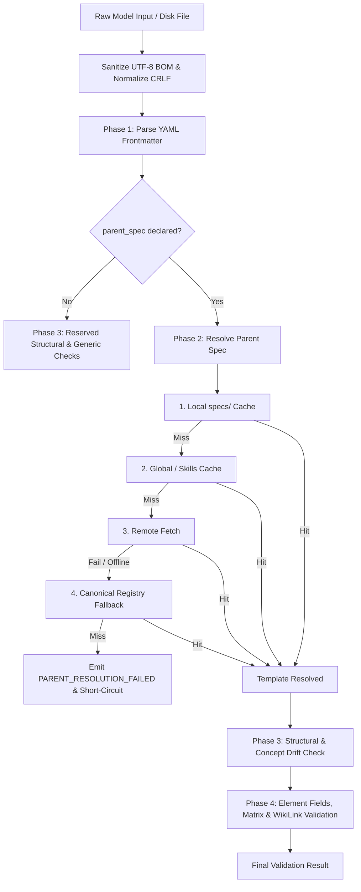

# Design: iNNfo Validation Resilience and Schema Integrity

## Technical Approach

This design establishes a resilient ingestion and validation pipeline across `@cognnitive/innfo-core` and `innfo-mcp`, paired with agent protocol enforcement in `actioNN/skills/nn-innfo/SKILL.md`. It resolves cascading validation errors, offline resolution failures, UTF-8 BOM encoding issues, and concept drift via five coordinated mechanisms:
1. **Pervasive BOM Sanitization**: UTF-8 BOM (`\uFEFF`) auto-stripping at the foundation of all Markdown and YAML frontmatter ingestion.
2. **Phase 2 Validation Hard-Gate & Error Suppression**: A 4-phase validation lifecycle that halts immediately upon unresolvable `parent_spec`, suppressing downstream child syntax and reference noise.
3. **Local Canonical Fallback Registry**: Embedded offline fallback and alias resolution table for standard templates (`workspace`, `business`, `procedures`, `organization`, `metrics`, `cogNNitive`).
4. **Concept Drift Heuristics**: Phase 3 semantic diagnostic analysis flagging undefined concepts in Level 3 models with Levenshtein typo matching and cross-template composition suggestions.
5. **Agent Step 0 Integrity Gate**: Mandatory verification of schema resolution in `nn-innfo` before downstream model repair.

---

## Architecture Decisions

### AD-01: Phase 2 Short-Circuit vs Best-Effort Structural Validation
- **Choice**: If `parent_spec` is specified but cannot be resolved, emit `PARENT_RESOLUTION_FAILED` (with searched paths and hints) and immediately short-circuit validation without executing Phase 3 or Phase 4.
- **Alternatives**: Continue best-effort validation with structural rules only.
- **Rationale**: Best-effort validation without a resolved Level 2 template generates confusing false positives (e.g., flagging valid template fields as unknown or reporting phantom dangling references), sending developers and LLM agents into futile repair loops.

### AD-02: Built-in Canonical Fallback Registry vs Strict Remote Dependency
- **Choice**: Bundle a canonical registry of standard Level 2 templates in `@cognnitive/innfo-core`/`innfo-mcp` as Tier 4 resolution fallback when network requests fail or offline mode is active.
- **Alternatives**: Require active network connection or explicit workspace file pre-caching.
- **Rationale**: Protects CLI tools, MCP operations, and test suites from transient GitHub outages or offline network environments while maintaining write-once cache immutability.

### AD-03: Concept Drift Diagnostics as Non-Fatal Warnings
- **Choice**: Flag unrecognized Level 3 concepts as `CONCEPT_DRIFT_WARNING` with `severity: 'warning'`, supplying suggestions for typos, cross-template inclusion, or Level 2 specialization.
- **Alternatives**: Treat unrecognized concepts as fatal validation errors (`valid: false`).
- **Rationale**: Preserves rapid prototyping and exploratory model drafting while offering proactive architectural guidance.

### AD-04: Agent Step 0 Integrity Protocol
- **Choice**: Enforce a Step 0 schema integrity gate in `actioNN/skills/nn-innfo/SKILL.md` before performing child element remediation.
- **Alternatives**: Rely on generic error triage.
- **Rationale**: Ensures AI agents never hallucinate child field mutations when the underlying issue is an unreachable or misconfigured template schema.

---

## Data Flow



---

## File Changes

| File | Change Type | Summary of Changes |
|------|-------------|--------------------|
| `iNNfo/packages/innfo-core/src/parser/markdown.ts` | Modified | Ensure `normalizeSource` and `stripFrontmatter` cleanly strip leading `\uFEFF`. |
| `iNNfo/packages/innfo-core/src/parser/yaml.ts` | Modified | Ensure `parseYaml` and `parseFrontmatter` sanitize BOM before YAML AST parsing. |
| `iNNfo/packages/innfo-core/src/schema/canonical-registry.ts` | Added | Built-in standard Level 2 template registry and alias mapping table. |
| `iNNfo/packages/innfo-mcp/src/tools/resolver-node.ts` | Modified | Integrate canonical registry as Tier 4 fallback on network/local misses. |
| `iNNfo/packages/innfo-mcp/src/tools/validate.ts` | Modified | Implement Phase 2 short-circuit gate and Phase 3 concept drift analyzer. |
| `actioNN/skills/nn-innfo/SKILL.md` | Modified | Add Step 0 Schema Integrity Gate and mechanical upgrade playbook. |

---

## Interfaces / Contracts

```typescript
export interface ConceptDriftDiagnostic extends ValidationError {
  code: 'CONCEPT_DRIFT_WARNING'
  concept: string
  suggestionType: 'typo' | 'cross_template' | 'specialization'
  suggestedAction: string
}

export interface CanonicalTemplate {
  name: string
  aliases: string[]
  specContent: string
}
```

---

## Testing Strategy

1. **BOM Ingestion**: Test `parseFrontmatter`, `parseModel`, and MCP `validate_model` with `\uFEFF`-prefixed payloads.
2. **Parent Resolution Hard-Gate**: Verify validation immediately aborts on unresolvable `parent_spec.url`, asserting `valid: false` and zero downstream child errors.
3. **Canonical Offline Fallback**: Test resolution of standard templates (`business`, `procedures`, etc.) with mocked network failures and missing local cache.
4. **Concept Drift**: Validate typo detection (e.g. `Stakeholder` -> `Stakeholders`) and cross-template hints (e.g. `Procedures` declared in `business` model).

---

## Migration / Rollout

- Fully backward-compatible; existing valid models and templates continue functioning without changes.
- Rollout directly through `innfo-core` and `innfo-mcp` package builds and updated `SKILL.md`.

---

## Open Questions

- None. All architectural boundaries and resolution tiers are defined.
