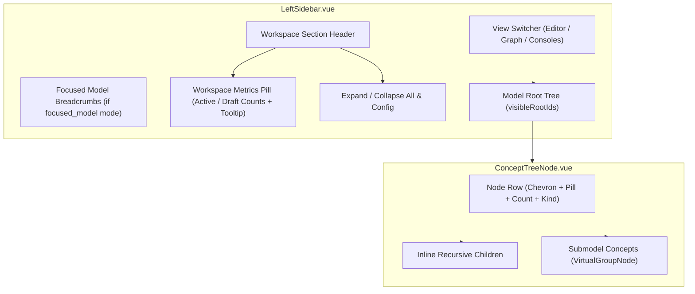

# Design: Compact Workspace Metrics and Pure Tree Navigation

## 1. Architecture Overview

This change refines the sidebar navigation experience in `innfo-editor` across two core dimensions:
1. **Compact Workspace Header**: Replaces the vertical "Workspace Mode" summary card with an inline status pill adjacent to the "WORKSPACE" section title in `LeftSidebar.vue`. This frees up vertical real estate and declutters the sidebar.
2. **Pure Tree Navigation**: Removes isolated root jump actions (`ArrowUpRight` / `tree-node-open-model`) from `ConceptTreeNode.vue`. Submodels and referenced model hierarchies are explored exclusively via recursive inline tree expansion (`VirtualGroupNode` / `ConceptTreeNode`), preserving context, hierarchy, and workspace topology.



---

## 2. Component Modifications

### 2.1 `LeftSidebar.vue`

#### A. Template Changes
- **Remove**: The standalone card panel `<div v-if="uiStore.sidebarMode === 'workspace'" class="..." data-testid="workspace-overview-panel">...</div>`.
- **Add**: An inline metrics pill within the Workspace section header row:
  ```html
  <div class="flex items-center justify-between px-2">
    <div class="flex items-center gap-2 min-w-0">
      <div class="flex items-center gap-1.5 shrink-0">
        <Database class="w-3.5 h-3.5 text-slate-400 dark:text-slate-500 shrink-0" />
        <h2 class="text-xs font-bold uppercase tracking-wider text-slate-500 dark:text-slate-400">
          Workspace
        </h2>
      </div>

      <!-- Compact status pill with tooltip -->
      <div
        v-if="totalModelCount > 0"
        class="flex items-center gap-1.5 px-1.5 py-0.5 rounded-full bg-slate-100 dark:bg-slate-800 text-[10px] font-medium text-slate-600 dark:text-slate-300 border border-slate-200 dark:border-slate-700 select-none cursor-help"
        :title="workspaceMetricsTooltip"
        data-testid="workspace-metrics-pill"
      >
        <span class="flex items-center gap-1">
          <span class="w-1.5 h-1.5 rounded-full bg-emerald-500"></span>
          <span data-testid="metric-active-count">{{ activeSubmodelCount }}</span>
        </span>
        <span v-if="draftSubmodelCount > 0" class="text-slate-300 dark:text-slate-600">/</span>
        <span v-if="draftSubmodelCount > 0" class="flex items-center gap-1">
          <span class="w-1.5 h-1.5 rounded-full bg-amber-500"></span>
          <span data-testid="metric-draft-count">{{ draftSubmodelCount }}</span>
        </span>
      </div>
    </div>

    <!-- Tree action buttons (Expand all, Collapse all, Metamatrix config) -->
    <div class="flex items-center gap-2">
      ...
    </div>
  </div>
  ```

#### B. Script & Computed Properties
- Retain `totalModelCount`, `activeSubmodelCount`, and `draftSubmodelCount` computeds based on `modelStore.nodes`.
- Introduce `workspaceMetricsTooltip` computed property:
  ```typescript
  const workspaceMetricsTooltip = computed(() => {
    return `Workspace Models: ${totalModelCount.value} total (${activeSubmodelCount.value} active, ${draftSubmodelCount.value} draft)`
  })
  ```

---

### 2.2 `ConceptTreeNode.vue`

#### A. Template Changes
- **Remove**: Quick open action button on the node row:
  ```html
  <!-- REMOVED -->
  <button
    v-if="directModelTarget"
    type="button"
    class="..."
    data-testid="tree-node-open-model"
    @click.stop="handleOpenModel(directModelTarget)"
  >
    <ArrowUpRight class="w-3.5 h-3.5" />
  </button>
  ```
- Keep the disclosure chevron logic: when `hasChildren` is true (including when `submodelConcepts.length > 0` or `children.length > 0`), the row provides a collapse/expand toggle that reveals submodel branches inline.
- Fallback unloaded submodel node items (`elementSubmodels`) remain informative, but submodel hierarchy unfolds seamlessly via `submodelConcepts` once the target model is loaded in store.

#### B. Script Cleanup
- Remove unused imports: `ArrowUpRight`, `Loader2` (if loading state is no longer managed directly per-node).
- Remove `loadingModelId` reactive ref and `handleOpenModel` handler function.
- Retain `directModelTarget` and `submodelConcepts` to drive `hasChildren` and recursive inline rendering via `VirtualGroupNode`.

---

## 3. Data Flow & State Lifecycle

```
[modelStore.nodes] (loaded workspace & submodel files)
        │
        ├──> LeftSidebar.vue
        │      ├──> totalModelCount: filter(isModelRoot).length
        │      ├──> activeSubmodelCount: frontmatter.status !== 'draft'
        │      ├──> draftSubmodelCount: frontmatter.status === 'draft'
        │      └──> workspaceMetricsTooltip: "Workspace Models: N total (X active, Y draft)"
        │
        └──> ConceptTreeNode.vue
               ├──> directModelTarget: detects model reference in element fields
               ├──> submodelConcepts: getActiveConceptsForModel(match.id)
               ├──> hasChildren: children.length > 0 || submodelConcepts.length > 0
               └──> Inline Tree Expansion: renders VirtualGroupNode for submodel concepts
```

1. **Workspace Model Count Aggregation**:
   - `LeftSidebar` reads `modelStore.nodes`.
   - Active and draft counts are recalculated automatically whenever nodes are added, updated, or loaded.
   - Header badge renders counts with color indicators (emerald dot for active, amber dot for draft).

2. **Inline Submodel Exploration**:
   - When an element references a submodel file (e.g. `business_model: "[[models/sub_NN.md]]"`), `directModelTarget` identifies the target root model ID.
   - `submodelConcepts` queries `useModelConcepts().getActiveConceptsForModel(targetId)` to get the concept tree for the target model.
   - Clicking the chevron toggle (`isCollapsed`) unfolds the submodel's virtual concept groups (`VirtualGroupNode`) directly underneath the parent element, keeping the user in the context of the root model.

---

## 4. Tooltip & Visual Design Details

- **Metric Pill Styling**:
  - `rounded-full`, compact padding (`px-1.5 py-0.5`), small text (`text-[10px]`).
  - Subtle background (`bg-slate-100 dark:bg-slate-800`), light border (`border-slate-200 dark:border-slate-700`).
  - Green indicator (`bg-emerald-500`) for active models.
  - Amber indicator (`bg-amber-500`) for draft models (hidden if 0 drafts to keep minimal width).
- **Tooltip Content**:
  - Native standard `title` attribute for immediate accessibility and consistency without requiring third-party floating tooltip overhead:
    `"Workspace Models: {total} total ({active} active, {draft} draft)"`.

---

## 5. Test Strategy & Test File Updates

### 5.1 Component Tests

1. **`LeftSidebar-dual-mode.test.ts`**:
   - Update `Workspace Mode` default test to expect `[data-testid="workspace-metrics-pill"]` with active/draft counts instead of `[data-testid="workspace-overview-panel"]`.
   - Verify hover tooltip contains model breakdown string.

2. **`ConceptTreeNode.test.ts`**:
   - Remove tests targeting `[data-testid="tree-node-open-model"]` and `handleOpenModel` clicks.
   - Keep and reinforce tests verifying:
     - Chevron visibility on elements referencing submodels.
     - Inline unfolding of submodel concept groups (`submodelConcepts`) under parent elements.
     - Collapsing parent hiding nested submodels.

3. **E2E Tests (`15-workspace-taxonomy-submodels.spec.ts`)**:
   - Update any selectors looking for `workspace-overview-panel` to use `workspace-metrics-pill` or the updated header structure.

---

## 6. Migration & Backward Compatibility

- **No Schema / Metamodel Changes**: Purely UI and presentation layer modifications.
- **Navigation Compatibility**: Full model isolation is still possible via the existing model header clicks in `LeftSidebar.vue` (`focusModelHeader`), which transitions to `focused_model` mode with breadcrumbs. Concept tree nodes now follow a consistent hierarchical expansion model.
