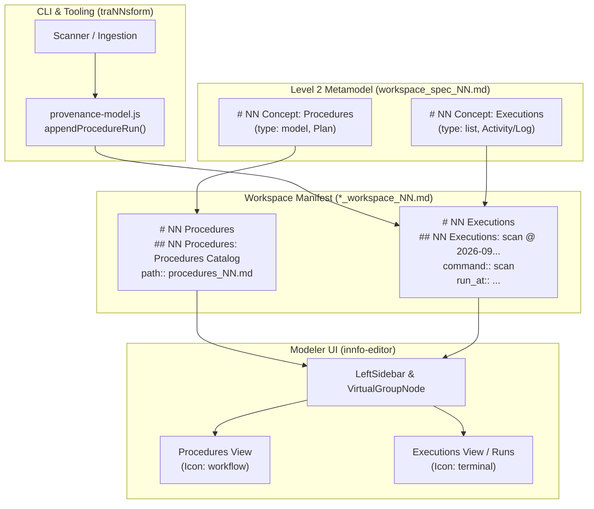

# Design: Separate Procedure Definitions vs. Execution Runs in iNNfo Workspaces

## Context

The workspace manifest (`*_workspace_NN.md`) serves two complementary purposes:
1. **Workspace Manifest**: Central topological hub declaring directory conventions, models, templates, formal specs, catalogs (sources, procedures, artifacts), skills, and taxonomy tags.
2. **Provenance Record**: Tracking the lineage and derivation history of models and pipeline runs.

Prior to this change, `traNNsform` overloaded `# NN Procedures` for both declarative procedure blueprints (e.g. `path:: procedures_NN.md`) and timestamped CLI runs (`## NN Procedures: scan @ <timestamp>`). This caused UI clutter in the Modeler sidebar and validator schema violations when users attempted manual renames.

## Proposed Architecture



## Detailed Changes

### 1. Template Specification (`workspace_spec_NN.md`)

Add `Executions` to `# NN index`, `# NN Concept Definition`, and `# NN Field Definition`:
```markdown
# NN index
...
* [[Procedures]]
* [[Executions]]
...

## NN Concept Definition: Executions
icon:: terminal
type:: list
color:: grey
weight:: 74

## NN Field Definition: command
concept:: Executions
type:: string
description:: CLI command or transformation executed.

## NN Field Definition: flags
concept:: Executions
type:: string
description:: Command-line flags and arguments supplied.

## NN Field Definition: run_at
concept:: Executions
type:: string
description:: ISO 8601 timestamp of when the execution finished.

## NN Field Definition: inputs
concept:: Executions
type:: string
description:: Input source files or references consumed by this run.

## NN Field Definition: outputs
concept:: Executions
type:: string
description:: Output models, files, or deliverables produced by this run.
```

### 2. `nn-trannsform` Provenance Model Generator

In `skills/nn-trannsform/scripts/lib/provenance-model.js`:
1. Update `EXECUTIONS_GUIDANCE`:
   `const EXECUTIONS_GUIDANCE = 'Append-only. One entry per pipeline run (--scan, --import-url, --apply). Never regenerated.';`
2. In `buildFreshModel`:
   Index block includes `* [[Executions]]`.
   Body appends `emptySection('Executions', EXECUTIONS_GUIDANCE)`.
3. In `appendProcedureRun`:
   - Write `## NN Executions: ${run.command} @ ${runAt}`.
   - Target heading `# NN Executions`.
   - Backward compatibility: If `# NN Executions` does not exist but `# NN Procedures` has runs, append to `# NN Executions` by creating the section.

### 3. Modeler UI Presentation (`iNNfo/apps/innfo-editor`)

1. In `VirtualGroupNode` / `useConceptVisuals`: Ensure `Executions` maps naturally to `terminal` icon and grey/slate styling.
2. In `ConceptTreeNode`: Render execution traces with timestamp formatting and badge styling if needed.
3. Keep `Procedures` strictly displaying procedural workflows and models.

### 4. Backward Compatibility

Workspaces created with previous versions of `cogNNitive` may have:
- `## NN Procedures: <cmd> @ <ISO>`
- `innfo-core` parser already parses any concept header dynamically.
- `traNNsform` will not delete old `# NN Procedures` entries; new runs will simply be written to `# NN Executions`.

## Verification & Testing Plan

1. **Unit Tests**:
   - `skills/nn-trannsform/test/unit/test-lineage-sync.js`: Update test assertions to expect `# NN Executions` for runs.
   - `skills/nn-trannsform/test/unit/test-provenance.js`: Verify provenance output structure.
2. **Template Validation**:
   - Run `npm run check:versions` or `node scripts/verify.js` to ensure template catalog and hash parity.
3. **Core Parser & Editor**:
   - Run `npm run test` in `iNNfo/packages/innfo-core` and `iNNfo/apps/innfo-editor`.
