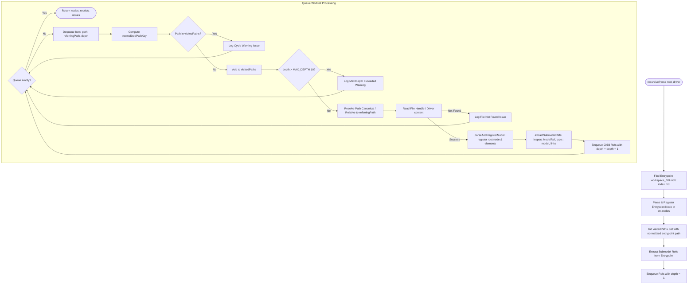
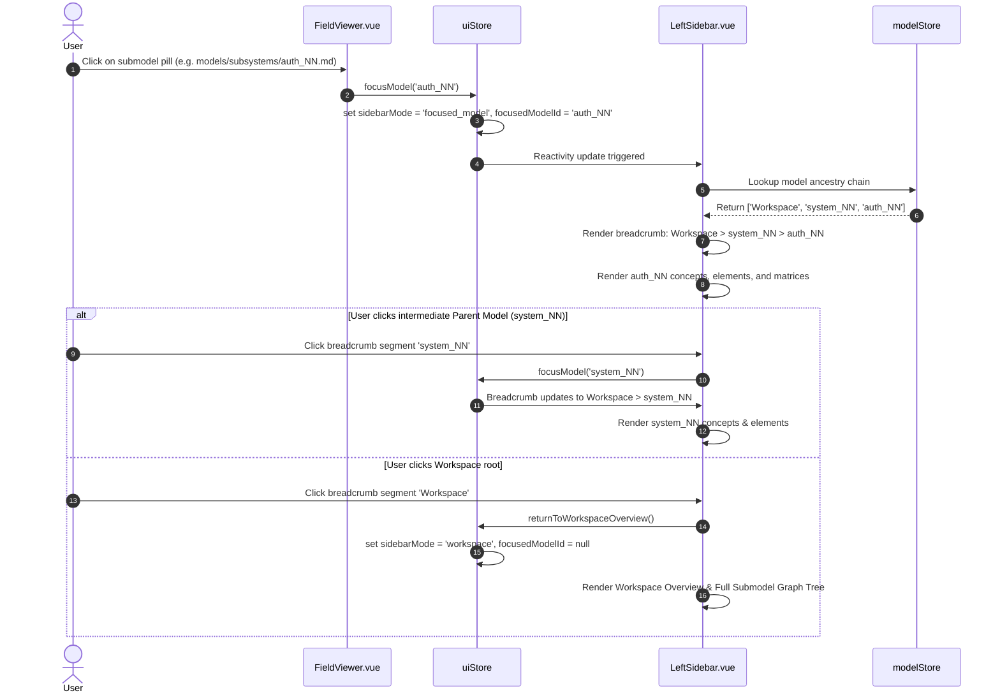

# Technical Design: Submodels Recursive Traversal & Formal Spec Alignment

## 1. Context & Motivation

The iNNfo architecture enables multi-model system modeling where a master workspace model or composite domain model delegates to specialized submodels (e.g. subsystems, procedures, domain verticals). While the prior iteration (`workspace-taxonomy-and-submodels`) laid the initial foundation by introducing `type:: model` into core types and basic UI rendering, substantial gaps exist:

1. **Normative Specification Drift**: `iNNfo/specs/iNNfo_V_0-1-0_NN.md` does not document `model` in its primitive field types table, omits `target_template` from `Field Definition`, and does not include `model` in the self-describing Metaschema options.
2. **Shallow Submodel Traversal**: `recursiveParse` in `innfo-core` only inspects immediate submodels directly referenced in the workspace entrypoint. It does not recurse into nested submodels, lacks cycle prevention and recursion depth bounding, and only extracts `path::` from `ModelRef` concepts rather than generalized `type:: model` fields across domain concepts.
3. **Submodel Validation Bypass**: `validator/references.ts` bypasses all `type === 'model'` fields pointing to `.md` files without verifying file existence or verifying that referenced submodels conform to a declared `target_template`.
4. **Metamodel Types & Schema Extraction Gaps**: `ConceptField` lacks `target_template?: string`, and `extractTemplateSchema` does not parse `target_template` from `Field Definition` elements.
5. **Editor & MCP Blind Spots**: `findModelFile` in `innfo-mcp` only searches at depth 1 in `rootDir` and `models/`, failing to resolve nested submodels in arbitrary subdirectories. In `innfo-editor`, `model` is missing from `UNIFIED_WIDGET_REGISTRY`, forcing editable `model` fields into `FallbackWidget`, and the sidebar breadcrumbs lack multi-level ancestry tracking (`Workspace > Parent Model > Submodel`).

This design document establishes the concrete technical blueprint to formalize the specification, upgrade `innfo-core` to an iterative worklist traversal engine with cycle detection and non-breaking validation, upgrade `innfo-mcp` recursive discovery, and enhance `innfo-editor` with unified editing and multi-level breadcrumbs.

---

## 2. Architecture Decisions

### AD-01: Queue-Based Iterative Worklist Traversal vs Call-Stack Recursion

* **Context**: Submodel hierarchies can form arbitrary Directed Acyclic Graphs (DAGs) or cyclic graphs of arbitrary depth. Using direct asynchronous recursion (`async function recurse(...)`) risks call-stack overflow on cyclic graphs, complicates concurrency and cancellation, and makes deterministic breadth-first or depth-first scheduling difficult to trace.
* **Decision**: Refactor `recursiveParse` in `packages/innfo-core/src/recursiveParser/workspace.ts` to use an iterative worklist queue (`Array<WorklistItem>`):
  ```typescript
  interface WorklistItem {
    path: string
    name: string
    referringPath: string
    depth: number
    author?: string
  }
  ```
* **Rationale**:
  - An explicit queue allows fine-grained traversal control, predictable memory footprint, and straightforward depth tracking (`item.depth + 1`).
  - Simplifies testing and debugging by inspecting worklist state at any point in time.
  - Aligns with standard compiler and AST visitor pipeline patterns.

### AD-02: Cycle Detection, Visited Set Normalization, and Depth Capping

* **Context**: Models can refer to each other cyclically (Model A $\leftrightarrow$ Model B), or multiple parent models can reference the same shared utility submodel (diamond dependency). Furthermore, path representations differ across platforms (Windows backslashes vs POSIX forward slashes, case-sensitivity differences on macOS/Windows vs Linux).
* **Decision**:
  1. Maintain a `visitedPaths = new Set<string>()` across the workspace traversal.
  2. Normalize all path keys prior to insertion or lookup: convert backslashes `\` to forward slashes `/`, collapse redundant slashes, and lowercase the string:
     ```typescript
     export function normalizePathKey(filePath: string): string {
       return filePath.replace(/\\/g, '/').replace(/\/+/g, '/').trim().toLowerCase()
     }
     ```
  3. Cycle Handling: If an enqueued path already exists in `visitedPaths`, log a non-fatal warning issue into `ctx.issues` (`Cycle detected: "${ref.path}" referenced from "${referringPath}" is already loaded`) and skip re-parsing.
  4. Depth Cap: Enforce `MAX_DEPTH = 10` where the root entrypoint is at `depth = 0`. If an outgoing reference is found at `depth >= MAX_DEPTH`, do not enqueue the file and emit a warning issue (`Traversal depth limit exceeded (MAX_DEPTH = 10) while resolving submodel "${ref.path}"`).
* **Rationale**:
  - Prevents infinite loops and heap exhaustion while preserving non-breaking parsing of diamond dependencies (DAGs).
  - Cross-platform path normalization prevents false cache misses on Windows environments.

### AD-03: Canonical Workspace-Relative Resolution with Relative Fallback

* **Context**: In nested submodels (e.g. `models/subsystems/auth_01_NN.md`), submodel references can be written as:
  1. Canonical workspace-relative paths: `models/common_NN.md`
  2. Relative paths: `./tokens_NN.md` or `../shared/utils_NN.md`
  3. WikiLinks: `[[models/common_NN.md]]` or `[[./tokens_NN.md]]`
* **Decision**: Implement a canonical path resolution utility in `paths.ts`:
  - Strip surrounding WikiLink syntax: `[[...]]` $\rightarrow$ `...`.
  - If the path starts with `./` or `../`, resolve it relative to `dirname(referringPath)`.
  - If the path does not start with `./` or `../`, treat it as workspace-relative.
  - Clean redundant `./` and normalise `/` separators.
  - In `resolveFileHandle` (for File System Access API), resolve nested directory handles segment by segment.
* **Rationale**: Maintains consistency across root-level models and deeply nested subsystems while respecting the canonical rule that workspace paths default to workspace-relative.

### AD-04: SubmodelResolver Synchronous Contract & Non-Breaking WARNING Diagnostics

* **Context**: `innfo-core`'s document and model validation (`validateDocument`, `validateModel`) is strictly synchronous, matching the pure functional design of the validator. In the previous implementation, references with `.md` or path separators were completely bypassed. However, hard validation errors on missing submodels or uninstantiated drafts would disrupt user workflows during iterative top-down design.
* **Decision**:
  1. Define a pluggable synchronous callback contract:
     ```typescript
     export type SubmodelResolver = (
       refPath: string,
       referringPath?: string,
     ) => { exists: boolean; templateName?: string; templateUrl?: string } | null
     ```
  2. Pass `resolveSubmodel?: SubmodelResolver` through `validateDocument` $\rightarrow$ `validateModel` $\rightarrow$ `validateElementFieldReferences`.
  3. If `resolveSubmodel` is provided and the target file does not exist (`exists === false`), emit a diagnostic with severity `'warning'` (not `'error'`).
  4. If the field definition declares `target_template` and the submodel exists, verify that the submodel's template identity (`templateName` or `templateUrl`) matches `target_template` (case-insensitive equality or suffix match). If mismatched, emit a diagnostic with severity `'warning'`.
  5. If `resolveSubmodel` is omitted (headless mode / unit tests without FS), skip filesystem checks cleanly without throwing errors.
* **Rationale**:
  - Keeps the core validator synchronous and decoupled from Node.js `fs` or browser APIs.
  - Emitting warnings rather than errors ensures models in progress or draft scaffolds remain valid (`valid: true`), enabling incremental authoring.

### AD-05: Level 1 Normative Specification and Metaschema Alignment

* **Context**: `iNNfo/specs/iNNfo_V_0-1-0_NN.md` is the Level 1 canonical specification and self-describing Metaschema for the entire ecosystem. Any divergence between the TypeScript implementation and the specification compromises ecosystem compatibility.
* **Decision**:
  1. Update Section Root Primitives: Add `model` to the Field Definition primitive types table (10th primitive type).
  2. Document `target_template` property on `Field Definition`: optional string pointing to required template name or URL.
  3. Update Concept Definition type table to include `model` as a recognized concept type (for submodel inventories).
  4. Add normative rules for model fields: paths must be workspace-relative or relative with `./`, clean WikiLinks, and obey `target_template` constraints.
  5. Update the self-describing Metaschema elements:
     - `## NN Field Definition: type` options: add `model`.
     - `## NN Concept Definition: type` options: add `model`.
     - Declare `## NN Field Definition: target_template`.
* **Rationale**: Restores 100% normative alignment and allows bootstrap metaschema validation to pass cleanly.

### AD-06: Dual-Mode Sidebar Ancestry Lineage & Breadcrumbs

* **Context**: When navigating deep submodel hierarchies, the user needs to know their current location in the model hierarchy and easily navigate back to any intermediate ancestor or the workspace overview.
* **Decision**:
  1. In `uiStore.ts`, maintain `sidebarMode` (`'workspace' | 'focused_model'`), `focusedModelId`, and computed lineage tracking:
     `modelAncestry = computed(() => resolveModelAncestry(focusedModelId, modelStore.nodes))`
  2. In `LeftSidebar.vue` (and header navigation), render a hierarchical breadcrumb trail when in Focused Model Mode:
     `Workspace > [Parent Model] > ... > [Active Submodel]`
  3. Clicking `Workspace` invokes `uiStore.returnToWorkspaceOverview()`, restoring Workspace Mode and the overall submodel graph.
  4. Clicking an intermediate `Parent Model` invokes `uiStore.focusModel(parentId)`.
* **Rationale**: Eliminates the "lost in navigation" anti-pattern in complex multi-model systems while keeping sidebar mode transitions deterministic.

---

## 3. Data Flow & Interaction Diagrams

### 3.1 Recursive Workspace Traversal Flow



### 3.2 Reference Validation Flow with SubmodelResolver

```mermaid
flowchart TD
    StartVal([validateDocument / validateModel]) --> LoopElements[Iterate Model Elements]
    LoopElements --> LoopFields[Iterate Element Fields]
    LoopFields --> CheckType{fieldDef.type === 'model'?}
    CheckType -->|No| NormalVal[Standard Reference / Scalar Validation]
    CheckType -->|Yes| StripWiki[Strip WikiLink [[...]] -> cleanPath]
    
    StripWiki --> CheckResolver{resolveSubmodel provided?}
    CheckResolver -->|No| BypassHeadless[Bypass FS Check headless mode] --> NextField[Next Field]
    CheckResolver -->|Yes| CallResolver[Invoke resolveSubmodel cleanPath, referringPath]
    
    CallResolver --> CheckExists{res.exists === true?}
    CheckExists -->|No| EmitMissingWarn[Emit WARNING: Dangling submodel reference] --> NextField
    CheckExists -->|Yes| CheckTargetTpl{fieldDef.target_template declared?}
    
    CheckTargetTpl -->|No| ValSuccess[Validation Success] --> NextField
    CheckTargetTpl -->|Yes| MatchTpl{res.templateName or res.templateUrl matches target_template?}
    MatchTpl -->|Yes| ValSuccess
    MatchTpl -->|No| EmitMismatchWarn[Emit WARNING: Submodel template mismatch] --> NextField
    
    NextField --> LoopFields
```

### 3.3 Editor Breadcrumb Ancestry Navigation Flow



---

## 4. Concrete File Changes Table

| Component / Package | File Path | Nature of Change | Summary of Modifications |
|---|---|---|---|
| **Normative Spec** | `iNNfo/specs/iNNfo_V_0-1-0_NN.md` | Specification & Metaschema | Add `model` to Field Definition table; add `target_template` property; update Metaschema options for Concept & Field Definition; declare `target_template` element. |
| **innfo-core** | `src/types.ts` | Type Definitions | Add `target_template?: string` to `ConceptField`. Ensure `ConceptType` and `VALID_FIELD_TYPES` include `'model'`. |
| **innfo-core** | `src/schema.ts` | Schema Extraction & Aliasing | In `extractTemplateSchema`: parse `target_template: asString(el.fields['target_template'])`. Ensure `applyAliasToSchema` and `canonicalValue` preserve it. |
| **innfo-core** | `src/recursiveParser/paths.ts` | Path Resolution & Normalization | Add `normalizePathKey(path)`, `resolveSubmodelPath(refPath, referringPath)`. Enhance segment resolution. |
| **innfo-core** | `src/recursiveParser/workspace.ts` | Iterative Traversal Engine | Implement queue worklist (`Array<WorklistItem>`), `visitedPaths` Set with normalized keys, `MAX_DEPTH = 10` boundary, generalized `extractSubmodelRefs`. |
| **innfo-core** | `src/validator/references.ts` | Reference & Submodel Validation | Export `SubmodelResolver` type. In `validateElementFieldReferences`: check file existence and `target_template` conformance, emitting non-breaking `WARNING` diagnostics. |
| **innfo-core** | `src/validator/model.ts` | Model Validation Pipeline | Accept `resolveSubmodel?: SubmodelResolver` in `validateModel` and forward to `validateElementFieldReferences`. |
| **innfo-core** | `src/validator/document.ts` | Document Validation Pipeline | Accept `resolveSubmodel?: SubmodelResolver` in `validateDocument` options and forward to `validateModel`. |
| **innfo-core** | `src/index.ts` | Public API Exports | Export `SubmodelResolver`, `normalizePathKey`, `resolveSubmodelPath`. |
| **innfo-mcp** | `src/tools/spec.ts` | MCP Path Discovery | Upgrade `findModelFile` to invoke recursive `listModels(rootDir)` when initial direct folder lookups fail. |
| **innfo-mcp** | `src/tools/list-read.ts` | MCP Reading & Normalization | Ensure `readModel` can locate submodels in nested directories via updated `findModelFile`. |
| **innfo-mcp** | `src/tools/mutate.ts` | MCP Validation Tool | Wire synchronous `resolveSubmodel` into `validateDocument` call in `validateModel` tool using `statSync`, `readFileSync`, and `parseFrontmatter`. |
| **innfo-editor** | `src/shared/widgets/registry.ts` | Widget Registry | Add `'model'` to `WidgetType`. Register `model: FieldString` in `UNIFIED_WIDGET_REGISTRY`. |
| **innfo-editor** | `src/components/editor/FieldViewer.vue` | UI Field Renderer | In read mode, display `target_template` badge/tooltip on the submodel navigation pill. In edit mode, allow string path editing via `WidgetField`. |
| **innfo-editor** | `src/stores/uiStore.ts` | UI State Management | Enhance ancestry chain computation or tracking for nested focused models. |
| **innfo-editor** | `src/components/layout/LeftSidebar.vue` | Sidebar Navigation | Render multi-level interactive breadcrumbs (`Workspace > Parent Model > Submodel`) in Focused Model Mode. |
| **innfo-core tests** | `tests/recursive-submodels.test.ts` | Unit & Integration Tests | Comprehensive test coverage for multi-level queue traversal, cycle detection, depth limits, path normalization, and SubmodelResolver warnings. |
| **innfo-mcp tests** | `tests/submodel-discovery.test.ts` | Integration Tests | Verify `findModelFile` resolves nested submodels, and `validate_model` outputs submodel warnings. |

---

## 5. Interfaces & Contracts

### 5.1 SubmodelResolver Callback

```typescript
/**
 * Synchronous callback supplied by host environments (Node MCP or Browser Editor)
 * to resolve submodel files and inspect their template identities.
 */
export type SubmodelResolver = (
  refPath: string,
  referringPath?: string,
) => {
  exists: boolean
  templateName?: string
  templateUrl?: string
} | null
```

### 5.2 ConceptField with Target Template

```typescript
export interface ConceptField {
  name: string
  type:
    | 'string'
    | 'select'
    | 'reference'
    | 'image'
    | 'file'
    | 'video'
    | 'audio'
    | 'markdown_inline'
    | 'markdown_file'
    | 'model'
  options?: string[]
  target_concepts?: string[]
  target_template?: string
}
```

### 5.3 Generalized Submodel Reference Extraction

```typescript
export interface ExtractedSubmodelRef {
  name: string
  path: string
  referringPath: string
  author?: string
}

/**
 * Extracts submodel references from a model file across:
 * 1. ModelRef concept path:: / file_ref:: fields
 * 2. Any concept element field typed as 'model' by its template schema
 * 3. WikiLinks [[...]] targeting *.md files (excluding specs/, backups/, archive/)
 * 4. Markdown links [...] (...) targeting *.md files
 */
export function extractSubmodelRefs(
  content: string,
  referringPath: string,
  templateSchema?: TemplateSchema,
): ExtractedSubmodelRef[]
```

### 5.4 Worklist Traversal Item and Parse Context

```typescript
export interface WorklistItem {
  path: string
  name: string
  referringPath: string
  depth: number
  author?: string
}

export interface ParseContext {
  nodes: Record<string, ModelNode>
  identity: IdentityRegistry
  issues: ParseIssue[]
  visitedPaths: Set<string>
}
```

### 5.5 Editor Widget Registry & UI Store Types

```typescript
// apps/innfo-editor/src/shared/widgets/registry.ts
export type WidgetType =
  | 'text'
  | 'weight'
  | 'category'
  | 'string'
  | 'boolean'
  | 'number'
  | 'select'
  | 'reference'
  | 'image'
  | 'file'
  | 'video'
  | 'audio'
  | 'date'
  | 'url'
  | 'color'
  | 'multiselect'
  | 'tags'
  | 'rating'
  | 'scale'
  | 'togglegroup'
  | 'cycle'
  | 'code'
  | 'mermaid'
  | 'diagram'
  | 'timestamp'
  | 'markdown'
  | 'markdown_inline'
  | 'markdown_file'
  | 'model' // Registered to FieldString

// apps/innfo-editor/src/stores/uiStore.ts
export interface BreadcrumbSegment {
  id: string | null
  label: string
  isRoot: boolean
  isCurrent: boolean
}
```

---

## 6. Testing Strategy

### 6.1 `innfo-core` Test Suite (`tests/recursive-submodels.test.ts`)

1. **Multi-Level Traversal**:
   - Create a 3-level fake directory structure: `workspace_NN.md` $\rightarrow$ `models/system_NN.md` $\rightarrow$ `models/subsystems/auth_NN.md`.
   - Verify `recursiveParse` parses and registers all 3 models in `ctx.nodes`.
   - Verify parent relationships are correctly registered in node graphs.
2. **Cycle Prevention**:
   - Create cyclic references: `models/service_a_NN.md` $\leftrightarrow$ `models/service_b_NN.md`.
   - Execute `recursiveParse`.
   - Assert traversal terminates cleanly without infinite loops; assert both models are parsed once; assert a warning diagnostic is logged in `ctx.issues`.
3. **Diamond Dependency (DAG)**:
   - Create root referencing `billing.md` and `shipping.md`, both referencing `common.md`.
   - Verify `common.md` is parsed once and registered without duplicate error.
4. **Depth Capping (`MAX_DEPTH = 10`)**:
   - Construct a linear chain of 12 nested models.
   - Assert models 0 through 10 are parsed; assert model 11 is rejected with a depth-exceeded warning in `ctx.issues`.
5. **Path Normalization**:
   - Reference submodels using Windows backslashes (`models\subsystems\auth_NN.md`) and mixed case.
   - Assert paths resolve to normalized canonical keys.
6. **Submodel Existence Validation (Warning)**:
   - Provide a `SubmodelResolver` reporting `exists: false` for a referenced submodel.
   - Run `validateDocument`.
   - Assert `valid: true` (non-breaking) and `warnings` contains `Dangling submodel reference: field "..." references file "..." which does not exist`.
7. **Target Template Conformance (Match & Mismatch)**:
   - When referenced submodel's template matches `target_template`: 0 warnings emitted.
   - When referenced submodel's template mismatches: assert warning diagnostic is emitted with expected vs actual template names.
8. **Level 1 Metaschema Self-Conformance**:
   - Validate `iNNfo_V_0-1-0_NN.md` against itself; assert 0 validation errors for `type:: model` and `target_template`.

### 6.2 `innfo-mcp` Test Suite (`tests/submodel-discovery.test.ts`)

1. **Recursive `findModelFile` Discovery**:
   - Place a model deep inside `models/subsystems/security/tokens_NN.md`.
   - Query `findModelFile(rootDir, 'tokens_NN')` and `findModelFile(rootDir, 'tokens')`.
   - Assert path resolves to the nested file.
2. **Synchronous Submodel Resolver in `validate_model`**:
   - Run MCP `validateModel` on a file referencing a non-existent submodel.
   - Assert result has `valid: true` and `warnings` lists the missing submodel.

### 6.3 `innfo-editor` Component & E2E Tests

1. **Widget Registry Registration**:
   - Assert `UNIFIED_WIDGET_REGISTRY['model'] === FieldString`.
2. **FieldViewer Rendering**:
   - Verify navigation pill displays submodel path.
   - Verify `target_template` is rendered in badge/tooltip when present.
3. **Multi-Level Breadcrumbs in LeftSidebar**:
   - Set `sidebarMode = 'focused_model'` with nested submodel.
   - Verify breadcrumb segments render `Workspace > Parent > Submodel`.
   - Simulate clicks on intermediate parent and `Workspace` root to verify navigation transitions.
