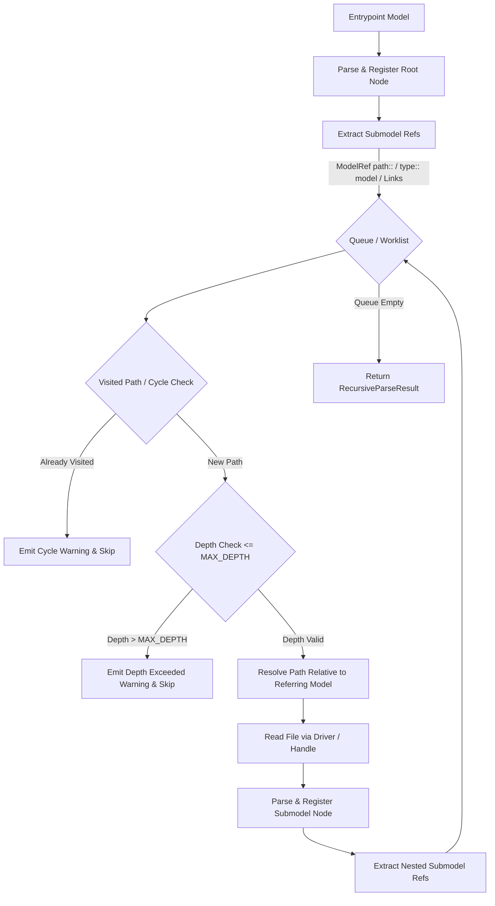

# Exploration: Submodels Recursive Traversal and Formal Spec Alignment

## Executive Summary

This exploration examines the architectural, formal specification, parser, validator, and editor integration requirements for the change **`submodels-recursive-and-spec-alignment`**.

In the prior iteration (`workspace-taxonomy-and-submodels`), the primitive `type:: model` was partially introduced into core TypeScript definitions (`ConceptType`, `ConceptField.type`) and basic UI rendering (`model-field-pill` in `FieldViewer.vue`). However, five critical capability and alignment gaps remain:
1. **Formal Specification Drift**: `iNNfo/specs/iNNfo_V_0-1-0_NN.md` (Metaplantilla Nivel 1) does not document `model` in its primitive field types table or Metaschema, and does not define the optional `target_template` field configuration property.
2. **Shallow Submodel Traversal**: `recursiveParse` in `recursiveParser/workspace.ts` only resolves immediate submodels directly declared in the workspace manifest / entrypoint. It does not recurse into nested submodels, lacks depth limits and cycle detection, and only extracts `path::` from `ModelRef` concepts rather than generalized `type:: model` fields across domain concepts.
3. **Submodel Validation Bypass**: `validator/references.ts` currently treats any `type === 'model'` reference with `.md` or path separators as cross-model and completely bypasses validation. It does not check file existence or verify that referenced submodels conform to an optional `target_template`.
4. **Metamodel Types & Extraction Gaps**: `ConceptField` in `types.ts` does not include `target_template?: string`, and `extractTemplateSchema` in `schema.ts` does not extract `target_template` from `Field Definition` elements.
5. **Editor & MCP Discovery Blind Spots**: `findModelFile` and `readModel` in `innfo-mcp` only search at depth 1 in `rootDir` and `models/`, failing to locate nested submodels (e.g. `models/subsystems/auth_01.md`). In `innfo-editor`, `model` is absent from `UNIFIED_WIDGET_REGISTRY`, forcing editable `model` fields into `FallbackWidget`.

---

## 1. Formal Specification Alignment (`iNNfo_V_0-1-0_NN.md`)

### Current State
In `iNNfo/specs/iNNfo_V_0-1-0_NN.md`:
- **Line 114 (Field Definition property table)**:
  `| type | string | select | reference | markdown_inline | markdown_file | image | file | video | audio | Field type (required) |`
  Lists only 9 primitive field types. `model` is missing.
- **Field Definition Properties Table**:
  Does not include `target_template`.
- **Lines 128–130**:
  Only documents `reference` fields (`type:: reference` with WikiLink syntax `[[...]]`). There is no normative text defining `model` fields, their expected file path syntax, or the semantics of `target_template`.
- **Lines 334–340 (Fields & Assets)**:
  Divides fields strictly into *inline* (`string`, `select`, `reference`, `markdown_inline`) and *file-backed* (`markdown_file`, `image`, `file`, `video`, `audio`). `model` is omitted.
- **Lines 764 & 790 (Metaschema - Self-Description)**:
  - Line 764: Concept Definition `type` options list only `[text, category, weight, list, steps, sequence]`, omitting `model`.
  - Line 790: Field Definition `type` options list only `[string, select, reference, markdown_inline, markdown_file, image, file, video, audio]`.
  - Field Definition Metaschema does not define `target_template`.

### Required Spec Changes
1. **Field Definition Table (§Root Primitives)**:
   Add `model` as the 10th primitive field type:
   `string | select | reference | markdown_inline | markdown_file | image | file | video | audio | model`.
   Add property:
   `| target_template | string | Target template name or URL for model fields |`.
2. **Normative Section on Model Fields (`type:: model`)**:
   - Values for fields declared with `type:: model` specify a relative workspace or parent-relative path to a target iNNfo model file (e.g. `submodel:: ./subsystems/auth_V_0-1-0_NN.md` or WikiLink `[[./subsystems/auth_V_0-1-0_NN.md]]`).
   - When `target_template` is declared on the field definition, the referenced model MUST conform to that template (its `parent_spec.name`, `parent_spec.url`, or `title` must match `target_template`).
3. **Concept Definition Table & Options**:
   Ensure `model` is documented as a representation type for concepts that represent submodel inventories (such as `ModelRef` in workspace manifests).
4. **Metaschema Updates (§Metaschema)**:
   - Update `## NN Field Definition: type` options:
     `options:: [string, select, reference, markdown_inline, markdown_file, image, file, video, audio, model]`
   - Update `## NN Concept Definition: type` options:
     `options:: [text, category, weight, list, steps, sequence, model]`
   - Add Field Definition element for `target_template`:
     ```markdown
     ## NN Field Definition: target_template
     concept:: Field Definition
     type:: string
     description:: Target template name or URL for model fields.
     ```

---

## 2. Recursive Parsing Engine (`innfo-core/src/recursiveParser/workspace.ts`)

### Current State
`recursiveParse` in `iNNfo/packages/innfo-core/src/recursiveParser/workspace.ts`:
1. Locates entrypoint (`workspace_NN.md`, `index.md`, or root scan).
2. Parses and registers entrypoint with `parseAndRegisterModel`.
3. Calls `extractSubmodelRefs(entrypointContent, entrypointPath)`.
4. Loops over the returned `modelRefs`, fetches and parses each file once, and returns.
5. **Limitations**:
   - **Zero recursion**: Referenced models are never inspected for nested submodels.
   - **No cycle detection**: If Model A references Model B which references Model A, a recursive loop would crash without a visited set.
   - **No depth limits**: Arbitrary deep references or circular references can cause stack or heap overflow.
   - **Limited reference extraction**: `extractSubmodelRefs` only checks `el.fields['path']` (primarily targeting `ModelRef`), plus regex on Wikilinks/Markdown links in body text. It does not inspect arbitrary element fields of `type:: model` (e.g. `subsystem_model:: ./subsystems/auth.md`).
   - **Path resolution**: Paths are currently looked up strictly from the workspace root (`resolveFileHandle(root, ref.path)`). A relative path in a nested model (e.g. `./tokens/jwt.md` inside `models/subsystems/auth.md`) would fail to resolve if not resolved relative to the parent model's directory.

### Proposed Architecture & Flow



### Key Technical Decisions for Recursive Parsing
1. **Worklist Queue**: Use an iterative queue `Array<{ path: string; name: string; author?: string; referringPath: string; depth: number }>` rather than unbounded recursion.
2. **Canonical Path Normalization & Cycle Detection**:
   Normalize paths using forward slashes and lowercasing: `ref.path.replace(/\\/g, '/').toLowerCase()`. Store in `visitedPaths = new Set<string>()`. If already in `visitedPaths`, log issue: `Cycle detected: "${ref.path}" referenced from "${referringPath}" is already loaded`.
3. **Configurable Depth Limit**:
   Default `MAX_DEPTH = 10`. If `depth > MAX_DEPTH`, log issue: `Max recursion depth (${MAX_DEPTH}) exceeded while resolving submodel "${ref.path}"`.
4. **Context-Aware Path Resolution**:
   If a reference path starts with `./` or `../`, or is relative, resolve it against `dirname(referringPath)`:
   ```ts
   function resolveSubmodelPath(refPath: string, referringPath: string): string {
     const cleanRef = refPath.trim().replace(/^\[\[\s*/, '').replace(/\s*\]\]$/, '')
     if (cleanRef.startsWith('/') || cleanRef.startsWith('\\')) {
       return cleanRef.slice(1).replace(/\\/g, '/')
     }
     const parentDir = referringPath.includes('/') ? referringPath.slice(0, referringPath.lastIndexOf('/')) : ''
     return parentDir ? `${parentDir}/${cleanRef}`.replace(/\/\.\//g, '/') : cleanRef
   }
   ```
5. **Generalized Submodel Reference Extraction**:
   In any parsed model:
   - Check `el.fields['path']` on `ModelRef` concepts.
   - Check any element field whose key or value indicates a submodel, or whose declared template field definition has `type === 'model'`.
   - Check WikiLinks and Markdown links matching `*_NN.md` or `.md`.

---

## 3. Reference and Submodel Validation (`references.ts` & `document.ts`)

### Current State
In `packages/innfo-core/src/validator/references.ts`:
```ts
} else if (fieldDef?.type === 'model' && (value.endsWith('.md') || value.includes('/') || value.includes('\\'))) {
  isCrossModel = true
}

if (isCrossModel) {
  // Bypass validation for cross-model / external submodel file references as they reside outside the current model
  continue
}
```
Any `type:: model` field value pointing to a file is bypassed with zero checks.

### Required Validation Logic
1. **File Existence Validation**:
   When a field has `fieldDef?.type === 'model'`:
   - Strip WikiLink syntax: `[[path/to/model.md]]` -> `path/to/model.md`.
   - If an optional `resolveSubmodel` resolver callback or `knownSubmodels` set is provided:
     - Check if the submodel exists.
     - If not found: report an error:
       `Dangling submodel reference: field "${fieldName}" value "${rawValue}" references file "${value}" which does not exist`.
2. **Target Template Conformance Validation**:
   When `fieldDef?.target_template` is declared on the field definition:
   - If the submodel file is resolved, inspect its frontmatter:
     - Check `fm.parent_spec.name`, `fm.parent_spec.url`, or `fm.title`.
     - If the submodel's template does not match `fieldDef.target_template` (case-insensitive substring or exact match):
       Report an error:
       `Submodel "${value}" conforms to template "${submodelTemplate}", but field "${fieldName}" requires target_template "${fieldDef.target_template}"`.
3. **Pluggable Synchronous Submodel Resolver Contract**:
   `validateDocument` and `validateModel` in `innfo-core` are synchronous. Mirroring `resolveInclude: IncludeResolver`, provide:
   ```ts
   export type SubmodelResolver = (refPath: string) => {
     exists: boolean
     content?: string
     frontmatter?: SpecFrontmatter
   } | null
   ```
   - In `innfo-mcp`: `validateModel` in `mutate.ts` implements `resolveSubmodel` synchronously or pre-loads referenced submodels using `statSync` / `readFileSync` relative to `rootDir` and the model's directory.
   - In `innfo-editor`: `modelStore` can pass a resolver backed by `state.nodes` (where nodes are indexed by source path).

---

## 4. Types & Schema Definitions (`types.ts`, `schema.ts`, `constants.ts`)

### `packages/innfo-core/src/types.ts`
Add `target_template?: string` to `ConceptField`:
```ts
export interface ConceptField {
  name: string
  type:
    | 'string'
    | 'select'
    | 'reference'
    | 'image'
    | 'file'
    | 'video'
    | 'audio'
    | 'markdown_inline'
    | 'markdown_file'
    | 'model'
  options?: string[]
  target_concepts?: string[]
  target_template?: string
}
```

### `packages/innfo-core/src/schema.ts`
1. **`extractTemplateSchema`**:
   Extract `target_template` from `el.fields['target_template']`:
   ```ts
   const field: ConceptField = {
     name: el.name,
     type: (asString(el.fields['type']) as ConceptField['type']) ?? 'string',
     options: asStringArray(el.fields['options']),
     target_concepts: asStringArray(el.fields['target_concepts']),
     target_template: asString(el.fields['target_template']),
   }
   ```
2. **`applyAliasToSchema`**:
   Preserve `target_template` when mapping aliased concept fields.
3. **`canonicalValue`**:
   Include `target_template` in canonical representations so composed templates match properly.

### `packages/innfo-core/src/validator/constants.ts`
- `VALID_FIELD_TYPES` already contains `'model'`.
- `VALID_CONCEPT_TYPES` already contains `'model'`.
- Keep in sync with Metaschema definitions.

---

## 5. Editor & MCP Tooling Integration

### `innfo-editor`
1. **Widget Registry (`apps/innfo-editor/src/shared/widgets/registry.ts`)**:
   Currently, `WidgetType` in `registry.ts` does not register `'model'`.
   - Add `'model'` to `WidgetType`.
   - Register `model: FieldString` (or `FieldReference`) in `UNIFIED_WIDGET_REGISTRY`. This ensures that when an element is in edit mode (`readonly = false`), the field renders an interactive text input rather than falling back to `FallbackWidget`.
2. **`FieldViewer.vue`**:
   - Read mode: The existing `model-field-pill` button triggers `uiStore.focusModel(...)`.
   - Enhance the button with a title attribute indicating `target_template` if present (e.g. `title="Submodel (requires template: Business Model)"`).
3. **LeftSidebar & Navigation**:
   - Because `recursiveParse` will now populate all nested models into `modelStore.rootIds` and `modelStore.nodes`, `LeftSidebar.vue` automatically computes and displays all active and draft submodels in the workspace overview.
   - Clicking on any submodel pill immediately focuses that model, and the breadcrumb back button returns to the workspace overview.

### `innfo-mcp`
1. **`findModelFile` and `readModel` (`packages/innfo-mcp/src/tools/spec.ts` & `list-read.ts`)**:
   - Currently, `findModelFile` only inspects `rootDir` and `join(rootDir, 'models')`. Nested submodels (e.g. `models/subsystems/auth_01.md`) fail to resolve if the caller passes `auth_01`.
   - Update `findModelFile` to use `listModels(rootDir)` (which scans recursively) to locate submodels in arbitrary subdirectories when candidate direct paths fail.
2. **`validateModel` in `packages/innfo-mcp/src/tools/mutate.ts`**:
   - Construct a `resolveSubmodel` callback for `validateDocument`:
     - Resolves paths relative to `rootDir` and the source model's directory.
     - Reads frontmatter to support `target_template` checks.

---

## 6. Implementation Plan & Work Breakdown

| Phase | Package / Component | Files to Modify | Key Deliverables |
|---|---|---|---|
| **Phase 1** | Formal Specification | `iNNfo/specs/iNNfo_V_0-1-0_NN.md` | Document `model` primitive, `target_template` property, update Metaschema. |
| **Phase 2** | Core Metamodel & Schemas | `packages/innfo-core/src/types.ts`, `src/schema.ts` | Add `target_template` to `ConceptField`, extract in `extractTemplateSchema`. |
| **Phase 3** | Recursive Workspace Parser | `packages/innfo-core/src/recursiveParser/workspace.ts`, `paths.ts` | Recursive traversal with queue, cycle detection, depth limit, relative path resolution. |
| **Phase 4** | Submodel & Reference Validation | `packages/innfo-core/src/validator/references.ts`, `document.ts`, `model.ts` | Validate submodel file existence, validate `target_template` match, remove blind bypass. |
| **Phase 5** | MCP Tools Enhancement | `packages/innfo-mcp/src/tools/spec.ts`, `list-read.ts`, `mutate.ts` | Recursive submodel lookup in `findModelFile`, wire `resolveSubmodel` in `validateModel`. |
| **Phase 6** | Editor UI & Widget Alignment | `apps/innfo-editor/src/shared/widgets/registry.ts`, `FieldViewer.vue` | Register `model` in widget registry, support editing and target_template badges. |
| **Phase 7** | Verification & Test Suite | `innfo-core/tests`, `innfo-mcp/tests`, `innfo-editor/tests` | Unit and integration tests for recursive parsing, cycles, depth limits, and validation. |

---

## 7. Potential Risks & Mitigations

1. **Circular Submodel References**:
   - *Risk*: Model A references Model B, which references Model A, leading to infinite parsing loops or memory exhaustion.
   - *Mitigation*: Normalize canonical paths in a `visitedPaths` set and enforce a hard `MAX_DEPTH = 10`. Emit diagnostic issues for cycles without crashing.
2. **Path Resolution Across OS Environments**:
   - *Risk*: Windows backslashes (`\`) vs POSIX slashes (`/`) causing path comparison failures in `visitedPaths` and file handle lookups.
   - *Mitigation*: Always normalize all internal path keys to forward slashes with lowercase matching before directory traversal and set lookups.
3. **Synchronous Validation vs Asynchronous File I/O**:
   - *Risk*: `validateDocument` in `innfo-core` is synchronous, but file checking in Node or Browser can be asynchronous.
   - *Mitigation*: Use a pluggable synchronous `SubmodelResolver` callback pattern (matching `IncludeResolver`), where the host environment (MCP or Editor) pre-loads or synchronously resolves files using `readFileSync` / `statSync` in Node, or in-memory `modelStore.nodes` in the editor.
4. **Metaschema Self-Conformance**:
   - *Risk*: Updating `iNNfo_V_0-1-0_NN.md`'s Metaschema block must strictly preserve valid syntax and valid options so that bootstrap self-validation continues to pass.
   - *Mitigation*: Verify with `validateTemplateAgainstMetaschema` tests on Level 2 templates after updating the spec.
