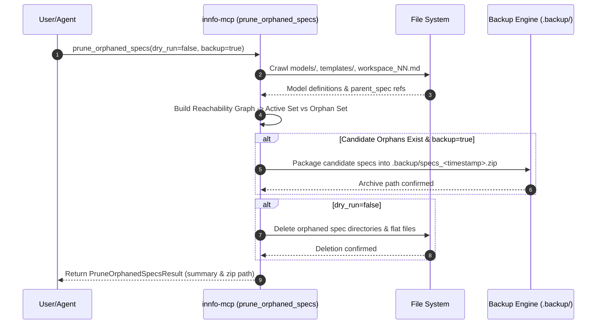

# Design Specification: Template Package Structure & Composition

## Executive Overview

This design document establishes the technical architecture, interface contracts, data flows, migration strategies, and architectural trade-offs for the **Template Package Structure & Composition** change (`template-package-and-composition`) across the `cogNNitive` ecosystem (`iNNfo`, `actioNN`, `eNNvironment`).

The design standardizes template packaging into structured versioned directories (`specs/templates/<name>/<version>/`), implements multi-tier resolution with immutable atomic local hydration, provides explicit frontmatter concept/field aliasing during `includes` composition to resolve collisions deterministically, enables transitive discovery of SOP procedures and agent skills, and introduces safety backups alongside orphaned spec reachability analysis and pruning.

---

## 1. Technical Architecture & Component Structure

### Architecture Overview

```mermaid
graph TD
    subgraph Client Layer
        SKILL["actioNN / nn-innfo Skill"]
        BOOTSTRAP["eNNvironment / agent-bootstrap"]
    end

    subgraph MCP Server Layer ("innfo-mcp")
        SPEC_TOOLS["spec.ts Tools\n(list_templates, hydrate_template)"]
        DISCOVERY_TOOLS["discovery.ts / spec.ts\n(list_template_procedures, list_template_skills)"]
        MUTATE_TOOLS["mutate.ts Tools\n(prune_orphaned_specs, bump_version)"]
        RESOLVER_NODE["resolver-node.ts\n(Multi-Tier Resolver & Atomic Hydrator)"]
    end

    subgraph Core Metamodeling Layer ("innfo-core")
        TAXONOMY["taxonomy.ts / resolver.ts\n(Composite Schema Resolver)"]
        VALIDATOR["validator/\n(Composition Collision & Alias Engine)"]
    end

    subgraph Storage & Cache Tier
        WS_PKG["1. Workspace Package\n./specs/templates/<name>/<version>/"]
        WS_FLAT["2. Workspace Flat Fallback\n./templates/<name>_V_<version>_NN.md"]
        GLOBAL_CACHE["3. Global User Cache\n~/.agents/templates/<name>/<version>/"]
        SKILL_PKG["4. Installed Skill Templates\n~/.agents/skills/*/templates/"]
        BACKUP_ZIP["Backup Store\n.backup/specs_<timestamp>.zip"]
    end

    SKILL -->|Invokes MCP Tools| DISCOVERY_TOOLS
    BOOTSTRAP -->|Validates Manifest| RESOLVER_NODE
    SPEC_TOOLS --> RESOLVER_NODE
    MUTATE_TOOLS --> RESOLVER_NODE
    MUTATE_TOOLS -->|Creates Backup| BACKUP_ZIP
    RESOLVER_NODE --> WS_PKG
    RESOLVER_NODE --> WS_FLAT
    RESOLVER_NODE --> GLOBAL_CACHE
    RESOLVER_NODE --> SKILL_PKG
    TAXONOMY --> VALIDATOR
    RESOLVER_NODE --> TAXONOMY
```

### Component Roles & Responsibilities

1. **`innfo-core` (Validation & Composition Engine)**:
   - **`taxonomy.ts` / `resolver.ts`**: Parses YAML frontmatter `includes`, `alias`, `procedures`, and `skills`. Resolves template inheritance trees up to a maximum depth of 10 with cycle detection using a `seen` set.
   - **`validator/`**: Applies explicit `alias` maps to concept definitions, field scopes, matrix row/column concepts, and constraints. Rejects un-aliased concept/field collisions with `[COMPOSITION_COLLISION]` errors.

2. **`innfo-mcp` (Package Resolver & Server)**:
   - **`resolver-node.ts`**: Executes 4-tier local resolution order and manages immutable atomic remote downloads (staging directory $\rightarrow$ atomic rename).
   - **`mutate.ts`**: Implements `prune_orphaned_specs` with workspace reference reachability graph generation, git working tree check, user backup consent prompts, and zip archive generation.
   - **`spec.ts`**: Exposes MCP tools: `list_template_procedures`, `list_template_skills`, `hydrate_template`, and `prune_orphaned_specs`.

3. **`nn-innfo` Skill (`actioNN`)**:
   - Queries `list_template_procedures` and `list_template_skills` to dynamically present SOP procedures and agent skills based on the composite template hierarchy of active models.

4. **Package Directory Layout**:
   - Standardized target structure under `specs/templates/<name>/<version>/`:
     ```
     specs/templates/<template-name>/<version>/
     ├── spec_NN.md                # Main L2 spec template
     ├── samples/                  # Sample L3 model files
     ├── procedures/               # Bundled SOP spec files
     └── skills/                   # Attached agent skill manifests
     ```

---

## 2. Data Flow & Interface Contracts

### 2.1 Frontmatter Schema & Data Flow

#### Composition `alias` Map & Asset Declarations

```yaml
---
level: 2
title: "Composite Business & Project Spec"
parent_spec:
  name: "iNNfo_V_0-2-0"
  url: "https://cognnitive.com/innfo/specs/iNNfo_V_0-2-0_NN.md"
includes:
  - name: "business"
    url: "https://cognnitive.com/innfo/specs/templates/business/V_0-2-0/spec_NN.md"
    alias:
      concepts:
        "Task": "BusinessTask"
      fields:
        "Item.status": "Item.business_status"
  - name: "projects"
    url: "https://cognnitive.com/innfo/specs/templates/projects/V_0-2-0/spec_NN.md"
    alias:
      concepts:
        "Task": "ProjectTask"
procedures:
  - id: "relevar-vivienda"
    name: "Relevamiento de Vivienda"
    path: "procedures/relevamiento_vivienda_NN.md"
skills:
  - name: "nn-reforma-casa"
    repo: "cogNNitive/actioNN"
    path: "skills/nn-reforma-casa"
---
```

### 2.2 Interface Contracts (`TypeScript`)

```typescript
// innfo-core/src/types.ts

export interface AliasMap {
  concepts?: Record<string, string>; // originalConcept -> renamedConcept
  fields?: Record<string, string>;   // "Concept.field" -> "Concept.renamed_field"
}

export interface IncludedTemplateRef {
  name: string;
  url: string;
  alias?: AliasMap;
}

export interface TemplateProcedure {
  id: string;
  name: string;
  path: string;
  source_template?: string;
}

export interface TemplateSkill {
  name: string;
  repo: string;
  path: string;
  source_template?: string;
}

export interface ResolvedTemplatePackage {
  name: string;
  version: string;
  packagePath: string; // File system path to directory or file
  specFilePath: string;
  isPackageDir: boolean; // true if specs/templates/<name>/<version>/, false if flat
  tier: 'workspace-package' | 'workspace-flat' | 'global-cache' | 'installed-skill';
}

export interface ReachabilityGraph {
  activeSpecs: Set<string>; // e.g. {"business@V_0-2-0", "projects@V_0-2-0"}
  referencedBy: Map<string, string[]>; // specId -> [model/spec paths]
  orphanedCandidates: string[]; // paths to package dirs or flat files
}
```

### 2.3 MCP Tool Endpoints Contract

```typescript
// innfo-mcp/src/tools/spec.ts & mutate.ts

// 1. prune_orphaned_specs
export interface PruneOrphanedSpecsInput {
  dry_run?: boolean; // default: true
  backup?: boolean;  // default: true
}

export interface PruneOrphanedSpecsResult {
  dry_run: boolean;
  backup_created?: string; // Path to .backup/specs_<timestamp>.zip
  orphans_found: string[];
  orphans_removed: string[];
  preserved_specs: string[];
}

// 2. list_template_procedures
export interface ListTemplateProceduresInput {
  model_path?: string;
  template_name?: string;
  version?: string;
}

export interface ListTemplateProceduresResult {
  procedures: TemplateProcedure[];
}

// 3. list_template_skills
export interface ListTemplateSkillsInput {
  model_path?: string;
  template_name?: string;
  version?: string;
}

export interface ListTemplateSkillsResult {
  skills: TemplateSkill[];
}
```

---

## 3. Migration & Garbage Collection Strategy

### Reachability Graph Analysis Algorithm

To prevent accidental deletion during spec pruning, `innfo-mcp` constructs a complete reference reachability graph $\mathcal{G} = (\mathcal{V}, \mathcal{E})$ over the workspace:

1. **Root Set Identification**:
   - Crawl all L3 models in `./models/`
   - Crawl root entrypoint files (`workspace_NN.md`, `index.md`)
   - Crawl active workspace L2 templates in `./templates/`

2. **Graph Traversal & Closure**:
   - For each root document, parse `parent_spec` and recursive `includes`.
   - Add normalized spec identifiers (`<name>@<version>`) to $\mathcal{S}_{\text{active}}$.
   - Recursively visit included template dependencies (capping depth at 10 to prevent infinite loops).

3. **Orphan Candidate Identification**:
   - Scan `./specs/templates/*/*` and legacy flat `./specs/*.md` files.
   - Any template package directory or file whose key is not in $\mathcal{S}_{\text{active}}$ is marked as an orphan candidate.



### Safety & Backup Guardrails

- **Mandatory Dry-Run Default**: `dry_run` defaults to `true`. Execution without explicit `dry_run: false` strictly reports candidates without disk modification.
- **Automatic Backup Zip Creation**: When `backup: true` (default), candidate specs are zipped into `.backup/specs_<timestamp>.zip` prior to deletion.
- **Git Working Tree Verification**: Before executing non-dry-run deletion or `bump_version`, the server checks for uncommitted changes in `specs/`. If uncommitted changes exist, backup zip creation is strictly enforced.

---

## 4. Architectural Trade-offs & Decisions

| Decision Area | Selected Approach | Considered Alternatives | Justification & Rationale |
|---|---|---|---|
| **Collision Resolution** | **Explicit Frontmatter `alias` Mapping** | Automatic prefixed auto-renaming (e.g. `business_Task`) | Explicit aliasing keeps domain model naming predictable and fully controlled by template authors, avoiding surprising implicit identifier mutations. |
| **Package Layout** | **Structured Directory (`specs/templates/<name>/<version>/`)** | Flat file structure (`specs/business_V_0-2-0_NN.md`) | Single flat files cannot cleanly package associated samples, SOP procedure specs, or agent skill manifests alongside the main spec. |
| **Hydration Semantics** | **Immutable Atomic Write-Once Cache** | In-place overwriting on fetch | Prevents partial directory reads and corrupt cache states during network timeouts or interrupted downloads. Staging directory + atomic rename ensures clean writes. |
| **Garbage Collection** | **Reachability Graph + Backup Zip Archive** | Instant hard deletion / Trash bin | Zip snapshots in `.backup/specs_<timestamp>.zip` guarantee instantaneous recovery if a spec version was orphaned by mistake or referenced in an un-scanned file. |
| **Transitive Traversal** | **Depth-Capped (10) Traversal with `seen` Set** | Unbounded recursive inclusion | Prevents infinite loops and stack overflow exceptions caused by accidental circular `includes` dependencies. |

---

## 5. Verification & Testing Strategy

1. **Unit Tests (`innfo-core`)**:
   - `alias` map application on concepts, fields, matrix row/cols, and constraints.
   - `[COMPOSITION_COLLISION]` blocking error generation when un-aliased collisions occur.
   - Cycle detection and depth-capping in `resolveTemplateSchema()`.

2. **Integration Tests (`innfo-mcp`)**:
   - 4-tier resolution precedence checking (`workspace package` $\rightarrow$ `workspace flat` $\rightarrow$ `global user cache` $\rightarrow$ `installed skills`).
   - Atomic remote package hydration test (verifying temporary staging + rename).
   - Reachability analysis and `prune_orphaned_specs` dry-run vs deletion with backup zip creation.

3. **Skill & SOP Discovery Verification (`actioNN`)**:
   - End-to-end test querying `list_template_procedures` and `list_template_skills` on a composite template tree.
