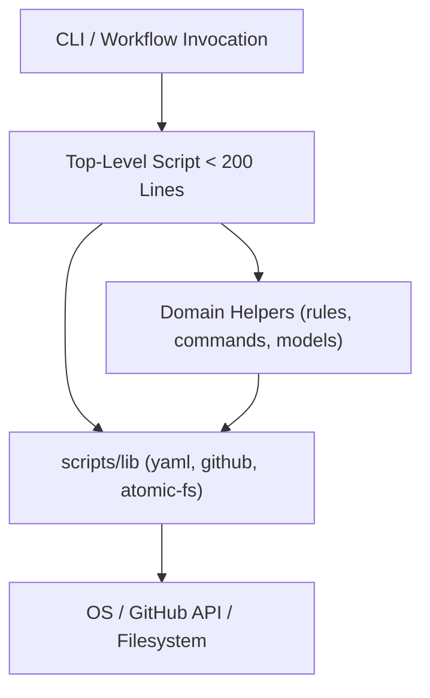

# Design: Scripts Modular Refactor

## Technical Approach

Decompose monolithic scripts into modular, single-responsibility CommonJS libraries while maintaining zero runtime npm dependencies, native Node.js execution, and 100% backward compatibility.

Generic infrastructure logic is extracted to `scripts/lib/` (`yaml-parser.js`, `github-client.js`, `atomic-fs.js`). Domain-specific business logic is split into dedicated helpers. Top-level scripts (`validate-manifest.js`, `skills-manager.js`, `scanner.js`, `provenance.js`) become lean orchestrators under 200 lines responsible for CLI argument parsing, workflow coordination, and re-exporting public symbols to preserve existing unit test contracts.

## Architecture Decisions

- **Decision 1: Centralized `scripts/lib/` vs. Isolated Skill Modules**: Cross-cutting utilities (YAML parsing, GitHub HTTP, atomic fs) reside in `scripts/lib/`. For distributed skills (`nn-trannsform`), domain helpers reside locally under `actioNN/skills/nn-trannsform/scripts/lib/` to preserve standalone skill portability.
- **Decision 2: Facade & Re-export Pattern**: Top-level scripts delegate execution to modular libraries but re-export public functions and constants via `module.exports = { ... }`. This guarantees existing tests requiring top-level files pass without modification.
- **Decision 3: Zero-Dependency Pure Node.js Built-ins**: Shared modules strictly use `fs`, `path`, `https`, `crypto`, and `child_process`. No external npm packages or compilation tools are introduced.

## Data Flow

1. **Manifest Validation**: `validate-manifest.js` invokes `yaml-parser.js` to parse frontmatter, `github-client.js` for API/commit/release queries, and `manifest-rules.js` for policy checks, exiting 0 or 1.
2. **Skills Manager**: `skills-manager.js` parses CLI flags, calls `skills-commands.js` to evaluate state via `atomic-fs.js`, downloads tarballs via `github-client.js`, and stages directories atomically.
3. **Scanner**: `scanner.js` coordinates `scanner-core.js` (discovery, frontmatter hashing) and `scanner-converters.js` (text, markdown, pdf, docx), generating `sources/nn/index.md`.
4. **Provenance**: `provenance.js` coordinates `provenance-model.js` (source ingestion, versioned model synthesis) and `workspace-index.js` (semantic Markdown links).

## File Changes

| Path | Status | Responsibility |
| :--- | :--- | :--- |
| `scripts/lib/yaml-parser.js` | New | Scalar, mapping, sequence, block parsing, and frontmatter parsing. |
| `scripts/lib/github-client.js` | New | HTTP requests, GITHUB_TOKEN auth, rate limit checks, ref/release resolution, downloads. |
| `scripts/lib/atomic-fs.js` | New | Safe atomic file writes, atomic dir replace/backup, tarball extraction. |
| `scripts/manifest/validate-manifest.js` | Modified | Lean CLI entry (< 200 lines); re-exports all validator functions. |
| `scripts/manifest/lib/manifest-rules.js` | New | Structural validation, version parity, commit existence, channel policies. |
| `actioNN/scripts/skills-manager.js` | Modified | Lean CLI entry (< 200 lines); flag parsing, usage manual, command dispatch. |
| `actioNN/scripts/lib/skills-commands.js` | New | Implementations of `status`, `install`, `update`, `sync`, and consent gates. |
| `actioNN/skills/nn-trannsform/scripts/scanner.js` | Modified | Lean orchestrator (< 200 lines); CLI runner and public re-exports. |
| `actioNN/skills/nn-trannsform/scripts/lib/scanner-core.js` | New | File walk, format detection, hash calculation, frontmatter generator. |
| `actioNN/skills/nn-trannsform/scripts/lib/scanner-converters.js` | New | Format conversion implementations (`convertPdf`, `convertDocx`, etc.). |
| `actioNN/skills/nn-trannsform/scripts/provenance.js` | Modified | Lean orchestrator (< 200 lines); CLI runner and public re-exports. |
| `actioNN/skills/nn-trannsform/scripts/lib/provenance-model.js` | New | Source collection, model synthesis, diffing, version parsing. |
| `actioNN/skills/nn-trannsform/scripts/lib/workspace-index.js` | New | Workspace index generation, link pruning, model listing. |

## Interfaces & Contracts

- `scripts/lib/yaml-parser.js`: Exports `{ parseScalar, parseFocusedYaml, parseFrontmatter, parseManifest }`.
- `scripts/lib/github-client.js`: Exports `{ apiRequest, fetchString, fetchJson, downloadFile, resolveRef, authHeaders, rateLimited }`.
- `scripts/lib/atomic-fs.js`: Exports `{ saveJsonAtomic, copyDirAtomic, replaceDirAtomic, extractTarball, copyDirRecursive }`.
- Preserved CLI Contracts:
  - `validate-manifest.js [repo-root] [--channel <stable|preview>]` (exit 0/1).
  - `skills-manager.js <status|install|update|sync> [flags]` (exit 0/1/2).
  - `scanner.js` and `provenance.js` CLI options and export signatures intact.

## Testing Strategy

- **Regression Pass**: Execute all existing unit suites without modification:
  - `node scripts/manifest/validate-manifest.test.js`
  - `node actioNN/scripts/skills-manager.test.js`
  - `node actioNN/skills/nn-trannsform/test/unit/test-scanner.js`
  - `node actioNN/skills/nn-trannsform/test/unit/test-provenance.js`
- **Unit Testing for Shared Libs**: Add tests in `scripts/lib/` for YAML parsing edge cases, atomic filesystem rollback, and GitHub client auth handling.
- **Line Count Verification**: Add an automated check in `scripts/verify.js` ensuring each target script remains strictly under 200 physical lines.

## Migration & Rollout

- Changes are fully backward compatible; no database, state file, or schema migrations required.
- Rollback: revert via `git checkout HEAD -- scripts/ actioNN/`.

## Open Questions

- None.
