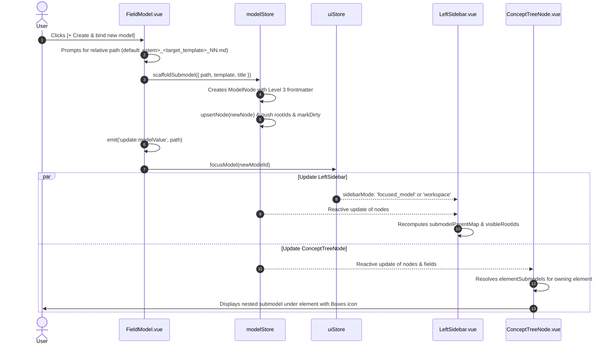

# Technical Design: Submodel Element Tree Hierarchy & Inline Creation

## 1. Context & Objectives

The iNNfo specification establishes that models can compose specialized submodels via `type:: model` fields (Level 1 specification `iNNfo_V_0-2-1_NN.md`). A domain concept (such as an `Initiative` in an Innovation model) can own and instantiate a dedicated submodel (such as a `Business Model` conforming to the `business` template).

While the underlying parsing engine in `@cognnitive/innfo-core` traverses submodel references during workspace indexing, the user experience in `innfo-editor` still presents three friction points:
1. **Unattached Root Pollution**: All loaded submodels appear at the top level of the left sidebar in Workspace Mode (`visibleRootIds`), creating clutter and obscuring domain ownership.
2. **Missing Hierarchy under Declaring Elements**: In the element navigation tree (`ConceptTreeNode.vue`), elements that declare `type:: model` fields do not render their referenced submodels as nested children, leaving the domain connection invisible in the sidebar hierarchy.
3. **Manual Submodel Scaffolding**: `FieldModel.vue` only provides autocomplete for existing models. If the user wants to instantiate a new submodel (e.g. for a newly created `Initiative`), they must manually create the file outside the editor or type an unverified path, without automated Level 3 frontmatter scaffolding or template binding.
4. **Documentation Gap**: The canonical relationship documentation (`docs/innfo/documentation/relationships.md`) details 4 relationship levels (Jerárquica, Estructural, Atributo, Contextual) but does not document "5. Composición de Submodelos (`type:: model`)", nor does it illustrate the canonical `Ghostbusters_V_0-2-0_innovation_NN.md` $\rightarrow$ `Ghostbusters_V_0-2-0_business_NN.md` composition pattern.

### Primary Objectives
- **Inline Submodel Creation & Scaffolding**: Add `[+ Create & bind new model]` in `FieldModel.vue` that inspects `target_template`, generates starter Level 3 document content (valid frontmatter with `model_version: "0.1.0"`, `parent_spec`, and initial concept sections), registers the node in `modelStore`, binds the path to the field, and auto-focuses the new model via `uiStore.focusModel(...)`.
- **Clean Root Sidebar Tree**: In `LeftSidebar.vue`, compute `submodelParentMap` to detect submodels owned by domain elements, excluding them from top-level `visibleRootIds` in Workspace Mode.
- **Hierarchical Element-Level Nesting**: In `ConceptTreeNode.vue`, resolve submodel references declared on element nodes and render them nested beneath the declaring element with dedicated submodel visual indicators (icon, name, template badge), focusing the submodel on click.
- **Canonical Architecture Documentation**: Expand `relationships.md` with "5. Composición de Submodelos (`type:: model`)", documenting architecture, metadata, UI interactions, and the Ghostbusters sample.

---

## 2. Architecture Decisions (ADR)

### ADR-01: UI-Layer Submodel Ownership Resolution vs. AST Parent Mutation

* **Context**: In `modelStore`, each file is parsed into a root document node (`kind: 'root'`, `parentId: null`). An element in `Model A` has a `type:: model` field pointing to `Model B`. If we mutate `Model B.parentId = elementA.id` in the normalized graph, we would break file-level AST semantics where file roots have `parentId: null`, corrupting `recursiveSerialize` and file-level diffing.
* **Options Considered**:
  - *Option 1*: Mutate `submodelNode.parentId = elementNode.id` in `modelStore`.
  - *Option 2*: Generate synthetic virtual nodes (`virtual:submodel:...`) inside `elementNode.childIds`.
  - *Option 3 (Chosen)*: Keep the normalized AST intact in `modelStore`. Resolve element-submodel ownership reactively in the UI layer (`submodelParentMap` in `LeftSidebar.vue` and `elementSubmodels` in `ConceptTreeNode.vue`).
* **Rationale**:
  - Option 3 preserves storage and serialization invariance: file roots remain root nodes in the store AST.
  - Tree nesting and root filtering remain clean, reactive projections of the underlying fields.
  - Multi-parent submodels (diamonds) or unreferenced submodels can be handled gracefully without graph corruption.

### ADR-02: Element-Owned Submodel Filtering in `visibleRootIds`

* **Context**: `visibleRootIds` in `LeftSidebar.vue` determines which models render at the top level of the sidebar. In Workspace Mode, having element-owned submodels render at both the top level and nested under elements causes redundancy and visual clutter.
* **Options Considered**:
  - *Option 1*: Filter any submodel that has an incoming edge in the workspace index.
    - *Drawback*: Would filter root models referenced by workspace entrypoints (`workspace_NN.md`) even when workspace entrypoints are not elements.
  - *Option 2 (Chosen)*: Compute `submodelParentMap` exclusively for domain elements (`kind === 'element'`) declaring fields with `type === 'model'`. In `visibleRootIds`, exclude any model whose `id` or normalized file path is registered in `submodelParentMap`. When `sidebarMode === 'focused_model'`, retain standard focused model resolution.
* **Rationale**:
  - Matches the requirement in `specs/dual-mode-sidebar/spec.md`: only element-owned submodels are filtered from top-level roots; standalone or workspace-level models remain visible.
  - Preserves immediate direct access to submodels when explicitly focused in `sidebarMode === 'focused_model'`.

### ADR-03: Submodel Scaffolding via `modelStore` Helper vs. Raw Vue Component Logic

* **Context**: Creating a submodel requires building valid Level 3 markdown with YAML frontmatter (`level: 3`, `parent_spec`, `model_version: "0.1.0"`), registering the node in `modelStore.nodes`, adding it to `modelStore.rootIds`, marking it dirty, and binding the path to the field.
* **Options Considered**:
  - *Option 1*: Implement all node creation and string generation directly inside `FieldModel.vue`.
  - *Option 2 (Chosen)*: Provide an explicit helper method `scaffoldSubmodel(...)` in `modelStore.ts` (or an exported helper utility), invoked by `FieldModel.vue`.
* **Rationale**:
  - Centralizes document construction and store registration rules in `modelStore`.
  - Enables comprehensive unit testing of the scaffolding and frontmatter generation logic without mounting Vue components.
  - Keeps `FieldModel.vue` lean, focused purely on UI interaction, dialog/prompt management, and event emitting.

### ADR-04: Submodel File Path Resolution and Prompt UX

* **Context**: When a user clicks `[+ Create & bind new model]`, a target file path must be determined. In browser sessions with File System Access API or sample memory sessions, the file path must follow workspace conventions.
* **Decision**:
  - Automatically derive a convention-compliant default path based on the parent model's path and `target_template`:
    - If parent model is `models/Ghostbusters_V_0-2-0_innovation_NN.md` and `target_template` is `business`, default path is `models/Ghostbusters_V_0-2-0_business_NN.md`.
    - If parent model is `initiative_NN.md`, default path is `initiative_business_NN.md`.
  - Prompt the user (via standard prompt or inline modal) pre-filled with the calculated default path, allowing customization.
  - Normalize path separators (POSIX `/`) and ensure `_NN.md` extension.

---

## 3. Component Design

### 3.1 `FieldModel.vue`

#### Props Expansion
Extend `defineProps` to receive `fieldDefinition`, `nodeId`, and `fieldKey`:
```typescript
interface FieldDefinitionLike {
  name: string
  type: string
  options?: string[]
  target_concepts?: string[]
  target_template?: string
  [key: string]: unknown
}

const props = withDefaults(
  defineProps<{
    modelValue: string
    readonly?: boolean
    nodeId?: string
    fieldKey?: string
    fieldDefinition?: FieldDefinitionLike
  }>(),
  { readonly: false },
)
```

#### Template & UI Action
In edit mode (`!readonly`), display the existing autocomplete input, and alongside/below it, render the creation action trigger:
```html
<div class="flex items-center gap-2 mt-1">
  <button
    type="button"
    class="text-xs text-primary hover:text-primary-700 dark:text-primary-400 font-medium inline-flex items-center gap-1 hover:underline cursor-pointer"
    data-testid="create-submodel-button"
    @click="handleCreateSubmodel"
  >
    <Plus class="w-3.5 h-3.5 shrink-0" />
    <span>Create & bind new model</span>
    <span
      v-if="fieldDefinition?.target_template"
      class="text-3xs px-1 py-0.2 rounded bg-primary/10 text-primary font-mono ml-0.5"
    >
      {{ fieldDefinition.target_template }}
    </span>
  </button>
</div>
```

#### Creation & Binding Handler
```typescript
function deriveSuggestedPath(parentPath: string, template: string): string {
  const dir = parentPath.includes('/') ? parentPath.substring(0, parentPath.lastIndexOf('/') + 1) : ''
  const filename = parentPath.split('/').pop() || 'model_NN.md'
  const stem = filename.replace(/_NN\.md$/i, '').replace(/\.md$/i, '')
  return `${dir}${stem}_${template}_NN.md`
}

async function handleCreateSubmodel(): Promise<void> {
  const targetTemplate = props.fieldDefinition?.target_template || 'base'
  const parentNode = props.nodeId ? modelStore.getNode(props.nodeId) : undefined
  const parentRootId = props.nodeId ? modelStore.getModelRootForNode(props.nodeId) : undefined
  const parentRootNode = parentRootId ? modelStore.getNode(parentRootId) : undefined
  const parentPath = parentRootNode?.source?.path || 'models/model_NN.md'

  const suggestedPath = deriveSuggestedPath(parentPath, targetTemplate)
  const userPath = window.prompt(`Enter path for new submodel (${targetTemplate}):`, suggestedPath)
  if (!userPath || !userPath.trim()) return

  const cleanPath = userPath.trim().replace(/\\/g, '/')
  const title = `${parentNode?.name || 'Submodel'} - ${targetTemplate}`

  const newModelId = modelStore.scaffoldSubmodel({
    path: cleanPath,
    template: targetTemplate,
    title,
  })

  // Bind path to field
  emit('update:modelValue', cleanPath)
  query.value = cleanPath

  // Navigate to newly created submodel
  uiStore.focusModel(newModelId)
}
```

---

### 3.2 `modelStore.ts`

#### Scaffolding Method `scaffoldSubmodel`
Add `scaffoldSubmodel` to `actions` in `useModelStore`:
```typescript
scaffoldSubmodel(options: {
  path: string
  template: string
  title?: string
  modelVersion?: string
}): string {
  const normalizedPath = options.path.replace(/\\/g, '/').trim()
  const id = normalizedPath
  const title = options.title || normalizedPath.split('/').pop()?.replace(/\.md$/i, '') || 'New Submodel'
  const version = options.modelVersion || '0.1.0'

  // Generate starter Level 3 markdown content
  const content = [
    '---',
    'level: 3',
    'parent_spec:',
    `  name: "${options.template}"`,
    `model_version: "${version}"`,
    `title: "${title}"`,
    '---',
    '',
    `# NN ${options.template.charAt(0).toUpperCase() + options.template.slice(1)} Model`,
    '',
  ].join('\n')

  const newNode: ModelNode = {
    id,
    name: title,
    kind: 'root',
    parentId: null,
    childIds: [],
    fields: {},
    markers: {},
    tags: [],
    relationships: [],
    source: { path: normalizedPath },
    rawContent: content,
    rawSections: {},
  }

  this.upsertNode(newNode)
  if (!this.rootIds.includes(id)) {
    this.rootIds.push(id)
  }
  this.markDirty(id)
  return id
}
```

---

### 3.3 `LeftSidebar.vue`

#### Computing `submodelParentMap`
Build a computed reactive map from submodel identifiers (`node.id`, `source.path`, normalized lowercase) to owning element node IDs:
```typescript
const submodelParentMap = computed<Map<string, string>>(() => {
  const map = new Map<string, string>()

  for (const node of Object.values(modelStore.nodes)) {
    if (node.kind !== 'element' || !node.fields) continue

    // Resolve concept definition to identify type:: model fields
    const rootId = modelStore.getModelRootForNode(node.id)
    const rootNode = rootId ? modelStore.getNode(rootId) : null
    const conceptDef = rootNode?.localMetamodel?.concepts?.find(
      (c) => c.name.toLowerCase() === (node.type || '').toLowerCase(),
    )

    for (const [key, field] of Object.entries(node.fields)) {
      if (!field?.value || typeof field.value !== 'string') continue
      const fieldDef = conceptDef?.fields?.find((f: any) => f.name === key)
      const isModelType = fieldDef?.type === 'model' || (field as any)?.type === 'model'
      if (!isModelType) continue

      const clean = field.value.replace(/^\[\[\s*/, '').replace(/\s*\]\]$/, '').trim()
      if (!clean) continue

      // Match target node in modelStore
      const targetNode = Object.values(modelStore.nodes).find((n) => {
        const p = n.source?.path || ''
        return (
          n.id.toLowerCase() === clean.toLowerCase() ||
          p.toLowerCase() === clean.toLowerCase() ||
          p.replace(/\.md$/i, '').toLowerCase().endsWith(clean.toLowerCase())
        )
      })

      if (targetNode) {
        map.set(targetNode.id, node.id)
        if (targetNode.source?.path) {
          map.set(targetNode.source.path, node.id)
        }
      } else {
        map.set(clean, node.id)
      }
    }
  }

  return map
})
```

#### Filtering `visibleRootIds`
Update `visibleRootIds`:
```typescript
const visibleRootIds = computed(() => {
  // ... candidate nodes, deduplication by baseName and highest SemVer ...

  if (uiStore.sidebarMode === 'focused_model') {
    // Retain focused model logic
    const focused = uiStore.focusedModelId || uiStore.activeModelId
    // ...
    return deduplicatedRoots.slice(0, 1)
  }

  // In Workspace Mode: exclude any root that is owned by an element
  return deduplicatedRoots.filter((rootId) => {
    const node = modelStore.getNode(rootId)
    const path = node?.source?.path || ''
    const isOwned =
      submodelParentMap.value.has(rootId) ||
      (path && submodelParentMap.value.has(path))
    return !isOwned
  })
})
```

---

### 3.4 `ConceptTreeNode.vue`

#### Element-Level Submodel Child Resolution
In `ConceptTreeNode.vue`, inspect element nodes for `type:: model` fields:
```typescript
interface ElementSubmodel {
  fieldKey: string
  submodelId: string
  submodelName: string
  targetTemplate?: string
  path: string
}

const elementSubmodels = computed<ElementSubmodel[]>(() => {
  const n = node.value
  if (!n || n.kind !== 'element' || !n.fields) return []

  const rootId = modelStore.getModelRootForNode(props.nodeId)
  const rootNode = rootId ? modelStore.getNode(rootId) : null
  const conceptDef = rootNode?.localMetamodel?.concepts?.find(
    (c) => c.name.toLowerCase() === (n.type || '').toLowerCase(),
  )

  const result: ElementSubmodel[] = []

  for (const [key, field] of Object.entries(n.fields)) {
    if (!field?.value || typeof field.value !== 'string') continue
    const fieldDef = conceptDef?.fields?.find((f: any) => f.name === key)
    const isModelType = fieldDef?.type === 'model' || (field as any)?.type === 'model'
    if (!isModelType) continue

    const clean = field.value.replace(/^\[\[\s*/, '').replace(/\s*\]\]$/, '').trim()
    if (!clean) continue

    const matchingNode = Object.values(modelStore.nodes).find((cand) => {
      const p = cand.source?.path || ''
      return (
        cand.id.toLowerCase() === clean.toLowerCase() ||
        cand.name.toLowerCase() === clean.toLowerCase() ||
        p.toLowerCase() === clean.toLowerCase() ||
        p.replace(/\.md$/i, '').toLowerCase().endsWith(clean.toLowerCase())
      )
    })

    if (matchingNode) {
      result.push({
        fieldKey: key,
        submodelId: matchingNode.id,
        submodelName: matchingNode.name || clean.split('/').pop() || clean,
        targetTemplate: fieldDef?.target_template,
        path: matchingNode.source?.path || clean,
      })
    }
  }

  return result
})

const hasChildren = computed(() => children.value.length > 0 || elementSubmodels.value.length > 0)
```

#### Template Rendering for Submodels
Render nested submodel rows alongside standard child nodes:
```html
<div
  v-if="hasChildren && !isCollapsed"
  class="ml-4 pl-1 border-l border-slate-200 dark:border-slate-700 space-y-0.5"
>
  <!-- Standard child elements/concepts -->
  <!-- ... -->

  <!-- Nested Submodel Items -->
  <div
    v-for="sub in elementSubmodels"
    :key="sub.submodelId"
    class="flex items-center gap-1.5 px-2 py-1 rounded-md text-xs hover:bg-slate-100 dark:hover:bg-slate-800/60 cursor-pointer transition-colors group"
    data-testid="nested-submodel-node"
    @click.stop="uiStore.focusModel(sub.submodelId)"
  >
    <Boxes class="w-3.5 h-3.5 text-blue-600 dark:text-blue-400 shrink-0" />
    <span class="font-medium text-slate-700 dark:text-slate-200 truncate flex-1">
      {{ sub.submodelName }}
    </span>
    <span
      v-if="sub.targetTemplate"
      class="text-3xs px-1.5 py-0.5 rounded bg-blue-50 dark:bg-blue-900/30 text-blue-600 dark:text-blue-300 font-mono"
      data-testid="nested-submodel-badge"
    >
      {{ sub.targetTemplate }}
    </span>
  </div>
</div>
```

---

### 3.5 Documentation Structure: `docs/innfo/documentation/relationships.md`

Add **"5. Composición de Submodelos (`type:: model`)"** following the existing document tone and schema:

```markdown
## 5. Composición de Submodelos (`type:: model`)

La composición de submodelos permite desacoplar arquitecturas complejas subdividiendo el dominio en múltiples documentos físicos Nivel 3 (`*_NN.md`), manteniendo una relación formal de pertenencia y navegación entre un elemento padre y un modelo hijo especializado.

### Características y Sintaxis
* **Origen**: Definición formal en el metamodelo con `type:: model` y restricción opcional `target_template:: <template>`.
* **Sintaxis de Campo**: `campo:: [[ruta/al/submodelo_NN.md]]` o `campo:: ruta/al/submodelo_NN.md`.
* **Icono Visual**: 📦 `Boxes` / Píldora interactiva de submodelo.
* **Comportamiento en Árbol**: El submodelo no flota como raíz independiente en el espacio de trabajo; se anida bajo el elemento que lo declara y se excluye de las raíces globales.

### Ejemplo Canónico: Ghostbusters Innovation → Business Model
Un modelo de cartera de innovación (`Ghostbusters_V_0-2-0_innovation_NN.md`) contiene la iniciativa de expansión municipal, la cual instancia su propio modelo de negocio dedicado (`Ghostbusters_V_0-2-0_business_NN.md`):

#### 1. Definición en Metamodelo (`innovation_V_0-2-0_NN.md`)
```markdown
## NN Field Definition: business_model
concept:: Initiative
type:: model
target_template:: business
```

#### 2. Instanciación en el Modelo Padre (`Ghostbusters_V_0-2-0_innovation_NN.md`)
```markdown
# NN Initiative
## NN Initiative: Ghostbusters Municipal Franchise Expansion
initiativeName:: "Ghostbusters Municipal Franchise Expansion"
initiativeType:: "Commercial Service Expansion"
business_model:: [[models/Ghostbusters_V_0-2-0_business_NN.md]]
tags:: [initiative, franchise, commercial, expansion]
```

#### 3. Submodelo Hijo Generado (`Ghostbusters_V_0-2-0_business_NN.md`)
```markdown
---
level: 3
parent_spec:
  name: "business_V_0-2-0"
  url: "https://raw.githubusercontent.com/cogNNitive/iNNfo/main/specs/templates/business/business_V_0-2-0_NN.md"
model_version: "V_0-2-1"
title: "Ghostbusters Inc. Municipal Franchise Business Model"
---
```

### Experiencia Visual e Interactiva
1. **Creación en un Clic**: Desde el editor del campo en `FieldModel.vue`, el botón `[+ Create & bind new model]` crea automáticamente el documento hijo con cabeceras estándar Nivel 3 y la plantilla esperada.
2. **Navegación Fluida**: Al hacer clic en el submodelo hijo (ya sea en la píldora del campo o en el árbol lateral), `uiStore.focusModel` activa el modo enfocado y despliega la ruta de migas de pan (`Workspace > Ghostbusters Innovation > Ghostbusters Business`).
```

---

## 4. Data Flow & State Management



---

## 5. File Modification Plan

| File | Primary Changes |
| :--- | :--- |
| `iNNfo/apps/innfo-editor/src/shared/widgets/FieldModel.vue` | Expand props (`fieldDefinition`, `nodeId`), add `[+ Create & bind new model]` action, path derivation, template scaffold invocation, and focus trigger. |
| `iNNfo/apps/innfo-editor/src/shared/widgets/WidgetField.vue` | Update `fieldDefinition` type to include `target_template?: string`. |
| `iNNfo/apps/innfo-editor/src/stores/modelStore.ts` | Implement `scaffoldSubmodel(options)` action with starter frontmatter, node upsert, and dirty marking. |
| `iNNfo/apps/innfo-editor/src/components/layout/LeftSidebar.vue` | Compute `submodelParentMap` to detect element-owned submodels and filter them out of `visibleRootIds` in Workspace Mode. |
| `iNNfo/apps/innfo-editor/src/components/layout/ConceptTreeNode.vue` | Compute `elementSubmodels`, update `hasChildren`, render nested submodel items with template badge and click focus. |
| `iNNfo/apps/innfo-editor/src/stores/uiStore.ts` | Support ancestry resolution through element-owned submodel links when `parentId` is null. |
| `docs/innfo/documentation/relationships.md` | Add section "5. Composición de Submodelos (`type:: model`)" with diagram, schema, and Ghostbusters canonical sample. |
| `iNNfo/apps/innfo-editor/tests/unit/modelStore.test.ts` | Test `scaffoldSubmodel` action frontmatter generation, node creation, and dirty marking. |
| `iNNfo/apps/innfo-editor/tests/component/LeftSidebar-submodel-tree.test.ts` | Component tests verifying element-owned submodels are filtered from top-level roots and nested in `ConceptTreeNode`. |

---

## 6. Risk Analysis & Mitigations

| Risk | Impact | Likelihood | Mitigation |
| :--- | :--- | :--- | :--- |
| **Diamond Dependencies** (A submodel referenced by multiple elements) | Submodel could appear under multiple parent nodes or cause ambiguous parent mapping | Low | In `submodelParentMap`, the first declaring element is mapped for exclusion from root; in `ConceptTreeNode`, each declaring element resolves its own reference independently so both display their connection cleanly. |
| **Path Mismatch between Field Value and Node ID** (e.g. `./models/sub_NN.md` vs `models/sub_NN.md`) | Submodel not resolved in `elementSubmodels` or `submodelParentMap` | Medium | Use robust path normalization (stripping leading `./`, `[[`, `]]`, lowercasing, and matching file basename / suffix). |
| **Unsaved Scaffolded Files Lost on Reload** | User navigates away before saving scaffolded submodel to disk | Low | `scaffoldSubmodel` marks the new node and parent dirty (`markDirty`), prompting the standard unsaved changes / backup flow. |
| **Empty or Unresolved Submodel Field** | Phantom empty nodes in sidebar tree | Low | `ConceptTreeNode` enforces strict resolution: only non-empty values matching an existing node in `modelStore.nodes` produce child submodel nodes. |
