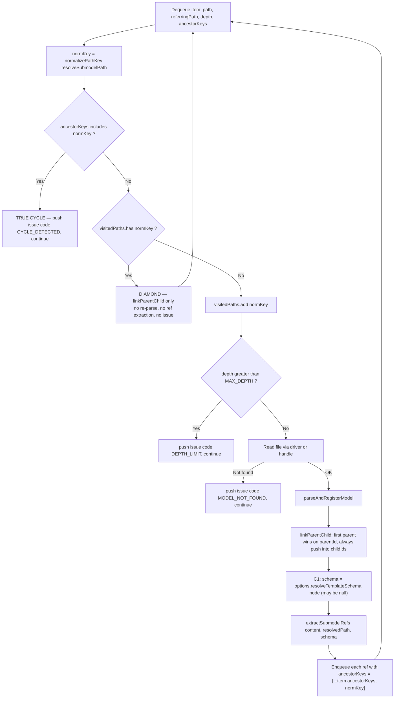
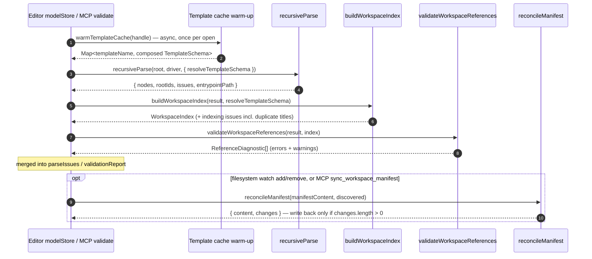

# Technical Design: Workspace Entity Evolution

## 1. Context & Motivation

The workspace in iNNfo is today a flat inventory (`workspace_NN.md`) plus a recursive parser that produces a single-parent tree. Three concrete defects block promoting it to a navigable, validated entity graph:

1. **A diamond is mislabelled a cycle.** `recursiveParse`'s worklist has one `visitedPaths.has(normKey)` branch (`recursiveParser/workspace.ts:362-368`) that emits `Cycle detected` and `continue`s. The parent/child edge code lives *after* a successful fresh parse (`:420-425`), so the second incoming edge is not merely mis-reported — it is **dropped**.
2. **`recursiveParse` never feeds a template schema to `extractSubmodelRefs`.** The schema-`model`-field detection exists and works (`workspace.ts:186-206`, seeded `['path','file_ref']` at `:189`, `f.type === 'model'` at `:193`), but both call sites pass two arguments (`:346`, `:433`). `type:: model` fields on domain concepts are invisible to traversal.
3. **Zero cross-model reference validation.** Any field value containing `::` or wrapped in `[...]` is flagged `isCrossModel` and bypassed outright (`validator/references.ts:213-222`).

Layered on top, three structural gaps: no `WorkspaceIndex` derivation (`RecursiveParseResult` is `{nodes, rootIds, issues}`, `recursiveParser/types.ts:10-14`), no stable workspace identity, no composite overview root, and no manifest ⇄ filesystem reconciliation.

This document is the file-level implementation blueprint. The architectural analysis (approach options, tradeoffs, chosen directions) already happened in `exploration.md`; the product-level decisions were taken in `proposal.md` §"Decisions Taken on the User's Behalf". Neither is re-litigated here. What follows is **how**, per slice, in dependency order, at the granularity `sdd-tasks` needs to cut PR-sized chunks.

**Two corrections to inherited assumptions** surfaced while verifying anchors for this design — both are recorded as ADRs below because they change implementation shape:

- `innfo-core` already exports a function named `resolveTemplateSchema` (`schema.ts:464`). The C1 injected callback cannot reuse that name at module scope (AD-03).
- `ParsedModel.rawSections` **only holds sections that produced no elements** (`parser/core.ts:119-121`: `if (parsed.elements.length === 0 && bodyContent.trim())`). The `# NN ModelRef` section is element-bearing, so `rawSections` will never contain it. The autorregistro round-trip guarantee cannot rest on `rawSections` (AD-08).

---

## 2. Architecture Decisions

### AD-01: Per-branch ancestry on the worklist item, not a second global set

* **Context**: The worklist is FIFO/BFS (`workspace.ts:357-443`). BFS loses the notion of "the path I took to get here", which is exactly what distinguishes `A → B → A` (cycle) from `W → X` + `W → P → X` (diamond). A second global `Set` cannot express per-branch ancestry.
* **Decision**: Add `ancestorKeys: string[]` to `WorklistItem` — the chain of `normalizePathKey`s from the entrypoint through `referringPath`, inclusive. Seed initial refs with `[normalizePathKey(entrypointPath)]`; enqueue nested refs with `[...item.ancestorKeys, normKey]`. `visitedPaths` is re-documented as "already parsed" (a black set), not "already seen".
* **Rejected**: an edge-set + graph-reachability check per dequeue. Heavier (O(V+E) per item) and depends on the graph-so-far being complete, which BFS does not guarantee.
* **Rationale**: The memory cost is bounded by `MAX_DEPTH = 10` string keys per queued item. It mirrors the `includes` composition engine's `_seen` chain (`schema.ts:467, 502, 522`) and the spec's own statement that "a diamond is not a cycle" (`iNNfo_V_0-2-0_NN.md:600`).

### AD-02: `extraParents` is **derived**, not stored

* **Context**: `WorkspaceIndex.extraParents` (slice 4) needs the non-primary edges recorded by slice 1. Slices 1 and 4 are separate PRs, so slice 1 would otherwise have to add a field to `ModelNode` that nothing reads for two PRs.
* **Decision**: Slice 1 records the diamond edge **only** by pushing into `parentNode.childIds`, and by *not* overwriting `childNode.parentId` (DP1: first parent wins). Slice 4 derives:
  ```
  extraParents[childId] = [ p.id | p.childIds.includes(childId) && nodes[childId].parentId !== p.id ]
  ```
* **Rationale**: No new `ModelNode` field, no dead code in slice 1, and the invariant "`parentId` is one of the parents in `childIds`-space" is checkable in tests. DP2 (`parentIds?: string[]`) remains the clean follow-up if the editor needs multi-valued "up".

### AD-03: The C1 callback type is `TemplateSchemaResolver`, passed in an options object

* **Context**: The proposal names the injected callback `resolveTemplateSchema`. `innfo-core` **already exports** a function `resolveTemplateSchema(templateContent, resolveInclude?, _seen?, _depth?)` from `schema.ts:464`, re-exported through `src/index.ts` and consumed by the editor (`SpecResolverService.ts:3, 329`). A same-named exported *type* would be confusing at best.
* **Decision**:
  - Type name: `TemplateSchemaResolver` (exported from `recursiveParser/types.ts`).
  - `recursiveParse` gains a **third, optional, options-object** parameter whose field *is* named `resolveTemplateSchema`, satisfying the proposal's wording without a module-scope collision:
    ```ts
    recursiveParse(root, driver?, options?: { resolveTemplateSchema?: TemplateSchemaResolver })
    ```
* **Rationale**: Every existing caller passes two positional args (`modelStore.ts:190`, all core tests) and is untouched. An options bag absorbs future parse-time injections without a fourth positional parameter.

### AD-04: The callback is synchronous and MUST return the **composed** schema

* **Context**: Decision 3 in the proposal. The editor resolves templates *after* the parse today (`modelStore.ts:190-191`: `recursiveParse(...)` then `await resolveParentSpecs(...)`), so a sync callback at parse time is a genuine chicken/egg.
* **Decision**: The callback signature is synchronous. Hosts pre-resolve into a synchronously-servable cache keyed by `parent_spec.name`:
  - **Editor**: extract the template-fetch half of `resolveParentSpecs` (`SpecResolverService.ts:183-...`) into an async `warmTemplateCache(handle)` pre-pass that populates `Map<lowercased parent_spec.name, TemplateSchema>` using `resolveTemplateSchema(text, resolveInclude).schema` (`SpecResolverService.ts:326-330`, i.e. the **composed** form). `parseFromHandle` awaits the warm-up, then passes a sync lookup closure into `recursiveParse`.
  - **MCP**: `resolveTemplateWithCache` (`tools/validate.ts:137`) already caches; the sync closure reads that cache.
  - **Absent callback ⇒ byte-identical to today's behavior.** This is the backward-compatibility contract and is asserted in tests.
* **Rationale**: Keeps `innfo-core` I/O-free and the parse loop free of `await` on host resolution. The warm-up is a cache miss cost paid once per workspace open, not per node.

### AD-05: `WorkspaceIndex` is a standalone builder, and splits title vs filename indexes

* **Context**: Decision 4 fixes WI2 (standalone `buildWorkspaceIndex`, not a field on `RecursiveParseResult`). Decision 5 requires that both frontmatter `title` and the filename-derived name are indexed with `title` preferred, and that duplicate titles are an **error**.
* **Decision**: The exploration's single `titleToNodeIds` map is split into two:
  ```ts
  titleToNodeIds:    Record<string, string[]>  // lowercased frontmatter `title`
  fileNameToNodeIds: Record<string, string[]>  // lowercased stripMdSuffix(basename)
  ```
  Duplicate-title errors are raised **only** from `titleToNodeIds`. Lookup precedence in Piece B: exact title → exact filename → normalized title (warn) → normalized filename (warn).
* **Rationale**: A single merged map produces spurious collisions when model A's `title` happens to equal model B's filename, which would turn a benign coincidence into a hard error. Filenames legitimately repeat across directories (`startups/acme_business_NN.md`, `archive-ish/acme_business_NN.md`) and must degrade to "ambiguous at lookup", not "invalid workspace". This *implements* decision 5 more precisely; it does not contradict it.

### AD-06: `references.ts` behavior is unchanged — comment-only edit

* **Context**: Decision 5 says the per-file validator **fully ignores** qualified refs and the workspace pass **re-scans**.
* **Decision**: `references.ts:213-222` keeps the `isCrossModel` bypass exactly as written. The slice-5 edit is a comment pointing at `validateWorkspaceReferences` plus the note that the bypass is now *deliberate delegation*, not an omission. No regex tightening, no new diagnostics from the per-file pass.
* **Rejected**: narrowing `isCrossModel` to a precise qualified-ref regex. Every value containing `::` that is *not* the qualified form and *not* path-like would start producing `Dangling reference` errors in existing workspaces — an unbounded, unmeasured regression outside this change's scope.

### AD-07: The workspace pass re-scans **element `ModelNode.fields`**, not re-parsed text

* **Context**: "Re-scan raw field values" could mean re-running `parseModel` per node (expensive, O(models) parses on every save).
* **Decision**: `validateWorkspaceReferences` iterates `result.nodes` where `kind === 'element'` and reads `node.fields[k].value` — the values `normalizeElementsIntoGraph` already materialized during the parse. The owning concept comes from the element's parent concept node / `index.nodeElementConcepts`; the field definition comes from `index.nodeSchema[rootId]`.
* **Rationale**: Zero additional parses. Whole-workspace revalidation stays O(elements × fields), which is the "acceptable for v1" cost the proposal's risk table already accepted.

### AD-08: The manifest round-trip guarantee rests on `rawContent` + surgical splicing, not `rawSections`

* **Context**: The proposal and exploration both say "round-trip through the existing `rawSections`/`rawContent` serializer path". Verification shows `rawSections` is populated **only for sections that produced no elements** (`parser/core.ts:119-121`), and the serializer skips any `rawSections` key that has elements (`parser/serializer.ts:177`). The `# NN ModelRef` section is element-bearing, so it is **never** in `rawSections`.
* **Decision**: `reconcileManifest` never calls `serializeModel`. It uses `parseModel` **read-only** (to locate entries and read fields) and produces output by splicing the original `manifestContent` string:
  - archive: replace the `status::` line inside an owned block in place (or insert one directly after the block header if absent);
  - add: append a new block at the end of the `# NN ModelRef` section (or append the whole section at EOF when absent);
  - everything else: untouched original bytes.
  - **Hard invariant**: `changes.length === 0 ⇒ content === manifestContent` (byte-for-byte), asserted in tests.
* **Rationale**: `serializeModel` performs canonical reformatting with no byte-stability guarantee — the same reason `ModelNode.rawContent` exists at all (`types.ts:456-464`). Splicing is the only way to honour "leaves every hand-authored entry, ordering, and grouping byte-identical".

### AD-09: The actioNN caller is an MCP tool, not a new binary

* **Context**: The proposal says "actioNN — new CLI command (e.g. `nn workspace sync`)". There is **no `nn` binary** in `actioNN/`: it is a skills repo whose executables are plain CommonJS scripts under `skills/nn-trannsform/scripts/` with no TypeScript build and no dependency on `@cognnitive/innfo-core` (`skills/nn-trannsform/package.json`).
* **Decision**: Expose reconciliation as an `innfo-mcp` tool `sync_workspace_manifest` (`dry_run` defaults to `true`), registered in `server.ts` next to `prune_orphaned_specs` (`server.ts:283`). The actioNN surface is a documented command in `skills/nn-innfo/SKILL.md` that invokes that tool through the existing MCP bridge (`actioNN/openspec/specs/mcp-bridge/spec.md`).
* **Rejected**: a standalone `scripts/workspace-sync.js` in `nn-trannsform`. It would require re-implementing `reconcileManifest` in untyped JS, defeating R1's whole point ("one tested implementation").
* **Rationale**: Same pure function, both callers, no duplicated logic, no new build toolchain in `actioNN`. Preserves the proposal's intent (headless reconciliation available to `nn-trannsform` and CI) with the delivery mechanism the repo actually has.

---

## 3. Cross-Cutting Data Flow

### 3.1 Traversal branch logic after slice 1 + slice 3



**Ordering invariant (non-obvious, must be preserved).** `visitedPaths.add` stays **before** the depth check, exactly as today (`workspace.ts:370` before `:372`). Consequence: a node skipped for depth is marked "parsed" although it was not parsed, so a later arrival takes the diamond branch and `linkParentChild` finds no child node — a silent no-op instead of today's spurious `Cycle detected`. This is safe because the worklist is FIFO and every enqueue is `depth + 1`, so depths are monotonically non-decreasing across the queue: **the first arrival at a path is always its minimum depth**. Keeping this order also preserves the existing linear-chain `MAX_DEPTH` test's issue count (exactly one depth issue), which moving the check would double for a diamond.

### 3.2 Host pipeline after all seven slices



---

## 4. Slice-by-Slice Implementation Design

Each subsection is independently reviewable and shippable, merged to `main` in order (`stacked-to-main`, no tracker branch). Line numbers are current-tree insertion points.

---

### Slice 1 — Diamond-vs-cycle fix (`ancestorKeys`)

**Depends on**: nothing. **Estimated size**: ~120 changed lines (well under the 400 budget).

#### Files touched

| File | Nature | Anchor |
|---|---|---|
| `iNNfo/packages/innfo-core/src/recursiveParser/types.ts` | modify | `WorklistItem` at `:16-22`; `ParseIssue` at `:4-8` |
| `iNNfo/packages/innfo-core/src/recursiveParser/workspace.ts` | modify | new helper before `recursiveParse` (`:239`); loop rewrite `:357-443`; initial enqueue `:345-355` |
| `iNNfo/packages/innfo-core/tests/recursive-parser.test.ts` | modify | new `describe('diamond vs cycle')` block |
| `iNNfo/packages/innfo-core/tests/workspace-taxonomy-submodels.test.ts` | modify | graph-shape regression cases |

#### Interface changes

```ts
// recursiveParser/types.ts
export interface ParseIssue {
  path: string
  message: string
  severity?: 'info' | 'warning' | 'error'
  /** Stable machine-readable discriminator. Additive; existing issues keep it undefined. */
  code?: 'CYCLE_DETECTED' | 'DEPTH_LIMIT' | 'MODEL_NOT_FOUND'
}

export interface WorklistItem {
  path: string
  name: string
  referringPath: string
  depth: number
  author?: string
  /**
   * normalizePathKey chain from the entrypoint through `referringPath`, inclusive.
   * Membership => true cycle. Non-membership + already parsed => diamond.
   */
  ancestorKeys: string[]
}
```

`ancestorKeys` is **required**, not optional: making it optional would let a future enqueue site silently disable cycle detection. All three enqueue sites are in one file.

#### Extracted helper (replaces the inline block at `:407-430`)

```ts
/**
 * Links the referring model to the just-resolved child in the node graph.
 * DP1: the FIRST parent wins `parentId`; every parent gets the child in `childIds`,
 * so non-primary (diamond) edges are recoverable without a new ModelNode field (AD-02).
 */
function linkParentChild(
  ctx: ParseContext,
  referringPath: string,
  childNormKey: string,
): { parentNode?: ModelNode; childNode?: ModelNode } {
  const referringNorm = normalizePathKey(resolveSubmodelPath(referringPath))
  const byPath = (key: string) =>
    Object.values(ctx.nodes).find(
      (n) => n.kind === 'root' && (n.source?.path ? normalizePathKey(n.source.path) : '') === key,
    )
  const parentNode = byPath(referringNorm)
  const childNode = byPath(childNormKey)
  if (parentNode && childNode && childNode.id !== parentNode.id) {
    if (childNode.parentId === null) childNode.parentId = parentNode.id   // first parent wins
    if (!parentNode.childIds.includes(childNode.id)) parentNode.childIds.push(childNode.id)
  }
  return { parentNode, childNode }
}
```

The `childNode.parentId === null` guard is the single most important line in the slice. Today (`:421`) the assignment is unconditional; it only ever ran on a freshly-created node (always `null`), so behavior is unchanged on the fresh path — but on the new diamond path an unconditional assignment would reparent the node under whichever parent happened to be dequeued last, silently changing the sidebar tree.

#### Loop rewrite

Replace `:362-368` with:

```ts
if (item.ancestorKeys.includes(normKey)) {
  ctx.issues.push({
    path: item.path,
    message: `Cycle detected: "${item.path}" referenced from "${item.referringPath}" is an ancestor on this branch`,
    code: 'CYCLE_DETECTED',
  })
  continue
}
if (visitedPaths.has(normKey)) {
  linkParentChild(ctx, item.referringPath, normKey)   // diamond: second edge, no issue
  continue
}
```

`severity` is deliberately **not** set on the cycle issue: hosts render `severity: undefined` parse issues with their existing defaults, and changing it would move counts in the editor's issue panel for reasons unrelated to this fix. Only `code` is added.

Initial enqueue at `:347-355` gains `ancestorKeys: [normalizePathKey(entrypointPath)]`. Nested enqueue at `:434-442` gains `ancestorKeys: [...item.ancestorKeys, normKey]`. Issues at `:373-376` and `:392-395` gain `code: 'DEPTH_LIMIT'` / `code: 'MODEL_NOT_FOUND'` (needed by slice 4's `missing`).

Diamond re-encounters emit **no** issue at all (proposal decision 1 — silent, `extraParents` carries the information).

#### Test plan

New in `tests/recursive-parser.test.ts`, `describe('diamond vs cycle')`:

| Case | Fixture | Assertion |
|---|---|---|
| `diamond-no-issue-both-edges` | `W → x`, `W → p`, `p → x` | `x` node count === 1; `issues` contains no `CYCLE_DETECTED`; `nodes[p].childIds` includes `x.id`; `nodes[W].childIds` includes `x.id`; `nodes[x].parentId === W.id` |
| `true-cycle-still-errors` | `W → a`, `a → b`, `b → a` | exactly one issue with `code === 'CYCLE_DETECTED'`, naming `a` |
| `cycle-back-to-entrypoint` | `W → a`, `a → W` | one `CYCLE_DETECTED` (proves the entrypoint key seeds `ancestorKeys`) |
| `self-ref-is-filtered-at-extraction` | `a_NN.md` containing `[[./a_NN.md]]` | no issue, no hang — `extractSubmodelRefs` already drops self-refs at `workspace.ts:170`; this pins that behavior so the ancestry change cannot regress it |
| `max-depth-boundary-with-diamond` | linear chain of 12 + a second parent at depth 3 pointing at the depth-11 node | exactly one `DEPTH_LIMIT` issue (not two); no `CYCLE_DETECTED`; documents "first arrival sets depth" |
| `diamond-does-not-reparent` | `W → x` then `p → x` | `nodes[x].parentId` is still `W.id` after the diamond edge is added |

Extend `tests/workspace-taxonomy-submodels.test.ts` with `sidebar-graph-shape-stable`: a diamond workspace still yields exactly one `rootIds` entry and every node reachable from it (the editor/sidebar regression guard named in the proposal's risk table).

---

### Slice 2 — `workspace_id` (C2)

**Depends on**: nothing (parallel with slice 1). **Estimated size**: ~60 changed lines.

#### Files touched

| File | Nature | Anchor |
|---|---|---|
| `iNNfo/packages/innfo-core/src/recursiveParser/types.ts` | modify | `RecursiveParseResult` at `:10-14` |
| `iNNfo/packages/innfo-core/src/recursiveParser/workspace.ts` | modify | four `return { nodes, rootIds, issues }` sites: `:288-292`, `:341`, `:449` |
| `iNNfo/packages/innfo-core/src/recursiveParser/workspaceId.ts` | **new** | — |
| `iNNfo/packages/innfo-core/src/recursiveParser/index.ts` | modify | export at `:13-16` |
| `actioNN/skills/nn-innfo/SKILL.md` | modify | workspace-creation guidance |
| `iNNfo/packages/innfo-core/tests/recursive-parser.test.ts` | modify | two cases |

#### Interface changes

```ts
// recursiveParser/types.ts
export interface RecursiveParseResult {
  nodes: Record<string, ModelNode>
  rootIds: string[]
  issues: ParseIssue[]
  /** Workspace-relative path of the resolved entrypoint. Undefined on the root-scan fallback. */
  entrypointPath?: string
}

// recursiveParser/workspaceId.ts (new, ~25 lines)
export function readWorkspaceId(result: RecursiveParseResult): string | undefined
```

No new parse work: `normalizeSingleModel` already materializes the entrypoint's whole frontmatter onto the root node's `fields` via `toFieldValues(parsed.frontmatter)` (`recursiveParser/model.ts:78`). `readWorkspaceId` finds the root node whose `source.path` normalizes to `result.entrypointPath`, reads `fields['workspace_id'].value`, and returns it when it is a non-empty string. Presence is optional and **not validated** in v1 (proposal decision 2: exactly one per workspace, no uniqueness enforcement, no retroactive migration).

`entrypointPath` is set at `:262-272` (primary) and `:284` (legacy `index.md`), left `undefined` on the root-scan fallback (`:298-341`) where there is no entrypoint by definition.

#### Write side

No code path in the repo creates `workspace_NN.md` today (verified: only spec templates and docs mention the filename). The write side is therefore documentation, not code:

- `actioNN/skills/nn-innfo/SKILL.md` — when scaffolding a workspace, emit `workspace_id: "<folder-slug>"` in the entrypoint frontmatter (C2a: slug, stable after rename).
- Normative documentation of the field lands in slice 6's `base_V_0-1-0_spec_NN.md`, **not** in the write-once `workspace_V_0-2-0_spec_NN.md`.

#### Test plan

`tests/recursive-parser.test.ts`: `workspace-id-read-from-entrypoint` (entrypoint frontmatter carries `workspace_id: "acme"` → `readWorkspaceId(result) === 'acme'`); `workspace-id-absent-is-undefined` (no field → `undefined`, zero issues).

---

### Slice 3 — `type:: model` fields (C1)

**Depends on**: slice 1 (C1 makes diamonds common; without slice 1 every `type:: model` field pointing at a manifest-listed model produces a false `Cycle detected`). **Estimated size**: ~200 changed lines across core + two hosts.

#### Files touched

| Component | File | Nature | Anchor |
|---|---|---|---|
| innfo-core | `src/recursiveParser/types.ts` | modify | add `TemplateSchemaResolver`, `RecursiveParseOptions` |
| innfo-core | `src/types.ts` | modify | `ModelNode` — new optional field after `schemaValidation` (`:453`) |
| innfo-core | `src/recursiveParser/workspace.ts` | modify | `recursiveParse` signature `:243-246`; entrypoint schema + `:346`; per-node schema + `:433` |
| innfo-core | `src/recursiveParser/index.ts` | modify | export the new type |
| innfo-editor | `src/services/SpecResolverService.ts` | modify | extract `warmTemplateCache` from `resolveParentSpecs` (`:183`) |
| innfo-editor | `src/stores/modelStore.ts` | modify | `parseFromHandle` at `:189-194` |
| innfo-mcp | `src/tools/validate.ts` | modify | sync closure over `resolveTemplateWithCache` (`:137`) |
| innfo-core tests | `tests/recursive-submodels.test.ts` | modify | C1 traversal cases |
| Specs (new) | `iNNfo/specs/iNNfo_V_0-2-1_NN.md` | **new** | see §5 — unblocked, task G |

#### Interface changes

```ts
// recursiveParser/types.ts
import type { TemplateSchema } from '../schema'

/**
 * Host-supplied, SYNCHRONOUS resolver returning a node's level-2 template schema.
 * MUST return the COMPOSED schema (schema.ts `resolveTemplateSchema(...).schema`,
 * i.e. `includes`-merged), so `type:: model` fields inherited through `includes`
 * are followed during traversal. Return `null` when the template is unknown.
 * Named `TemplateSchemaResolver` to avoid colliding with the exported function
 * `resolveTemplateSchema` in schema.ts (AD-03).
 */
export type TemplateSchemaResolver = (node: {
  path: string
  name: string
  content: string
  frontmatter: Record<string, unknown>
}) => TemplateSchema | null

export interface RecursiveParseOptions {
  resolveTemplateSchema?: TemplateSchemaResolver
}
```

```ts
// types.ts — ModelNode, inserted after `schemaValidation` (:453)
  /**
   * Composed (includes-merged) level-2 template schema for this model, stashed by
   * `recursiveParse` when a `resolveTemplateSchema` option was supplied, so
   * `buildWorkspaceIndex` and the workspace validation pass never re-resolve.
   * Present only on document roots. Undefined when no resolver was supplied.
   */
  templateSchema?: TemplateSchema
```

```ts
// workspace.ts :243
export async function recursiveParse(
  root: DirectoryHandleLike,
  driver?: ModelDriver,
  options?: RecursiveParseOptions,
): Promise<RecursiveParseResult>
```

#### Threading

Both `extractSubmodelRefs` call sites gain a third argument produced by one shared private helper:

```ts
const schemaFor = (path: string, name: string, content: string): TemplateSchema | undefined => {
  if (!options?.resolveTemplateSchema) return undefined
  try {
    const fm = (parseFrontmatter(content) ?? {}) as Record<string, unknown>
    return options.resolveTemplateSchema({ path, name, content, frontmatter: fm }) ?? undefined
  } catch { return undefined }   // a host resolver must never break the parse
}
```

- **Entrypoint** (`:346`): `extractSubmodelRefs(entrypointContent, entrypointPath, schemaFor(entrypointPath, primary.name, entrypointContent))`.
- **Per node** (`:433`): `extractSubmodelRefs(content, resolvedPath, schema)` where `schema` is computed once immediately after `parseAndRegisterModel` (`:405`) and stashed: `if (childNode && schema) childNode.templateSchema = schema` — reusing the `childNode` already returned by `linkParentChild` (slice 1), so there is no extra node lookup.

The try/catch is deliberate: a throwing host resolver degrades that node to today's behavior rather than aborting the workspace parse.

#### Host wiring

**Editor.** `resolveParentSpecs` (`SpecResolverService.ts:183`) currently does fetch-template + compose + `schemaValidation` + matrix propagation in one async pass **after** the parse. Split the fetch+compose half into:

```ts
export async function warmTemplateCache(
  handle?: DirectoryHandleLike,
  seed?: Array<{ name: string; url?: string }>,
): Promise<Map<string, TemplateSchema>>
```

Seeded from the entrypoint's own `parent_spec` plus any `parent_spec` discovered on a first shallow pass; misses fall through to today's lazy `resolveParentSpecs` path (which still runs after the parse and remains authoritative for `schemaValidation`). `modelStore.parseFromHandle` becomes:

```ts
const cache = await warmTemplateCache(handle)
const result = await recursiveParse(handle, driver, {
  resolveTemplateSchema: ({ frontmatter }) => {
    const n = (frontmatter?.parent_spec as { name?: string } | undefined)?.name
    return n ? (cache.get(n.toLowerCase()) ?? null) : null
  },
})
await resolveParentSpecs(result.nodes, result.rootIds, handle, result.issues)
```

A cold cache is not an error — it is exactly the "absent callback" path, so the editor degrades to today's traversal on the first open and is complete on subsequent parses. This is the concrete mitigation for the proposal's "editor cannot serve a synchronous resolver" risk.

**MCP.** `tools/validate.ts` already resolves and caches templates (`:137`). The workspace-mode entry point (slice 5) passes a closure reading that cache; nothing in the single-file `validateModel` path changes in slice 3.

#### Test plan

`tests/recursive-submodels.test.ts`:

| Case | Assertion |
|---|---|
| `c1-model-field-followed` | L2 schema declares `Startup.business_model` `type:: model`; L3 master references `startups/acme_business_NN.md` via that field only (no wikilink) → the target is parsed and linked as a child |
| `c1-included-model-field-followed` | the `model` field is declared on an *included* template; the resolver returns the **composed** schema → still followed (pins AD-04's composed-schema requirement) |
| `c1-no-callback-is-today` | same fixture, no `options` → node set, edge set and issue list are deep-equal to the pre-change baseline |
| `c1-schema-stashed-on-node` | with a resolver → `nodes[x].templateSchema` is defined and contains the composed concepts; without → `undefined` |
| `c1-resolver-throws-degrades` | resolver throws → parse completes, no issue escalation, bare `path`/`file_ref`/links still followed |
| `c1-diamond-from-model-field` | the Startup case: manifest lists `acme_business` **and** the domain master points at it via `business_model` → one node, two parent edges, zero `CYCLE_DETECTED` (the end-to-end proof that slices 1+3 compose) |

---

### Slice 4 — `WorkspaceIndex` + `buildWorkspaceIndex`

**Depends on**: slices 1 and 3. **Estimated size**: ~230 changed lines (module + tests). Pure derivation; no host behavior change.

#### Files touched

| File | Nature |
|---|---|
| `iNNfo/packages/innfo-core/src/recursiveParser/workspaceIndex.ts` | **new** |
| `iNNfo/packages/innfo-core/src/recursiveParser/index.ts` | modify — export `buildWorkspaceIndex`, `WorkspaceIndex` |
| `iNNfo/packages/innfo-core/src/index.ts` | modify — public re-export |
| `iNNfo/packages/innfo-core/tests/workspace-taxonomy-submodels.test.ts` | modify — `describe('buildWorkspaceIndex')` |

#### Interface

```ts
// recursiveParser/workspaceIndex.ts
import type { TemplateSchema } from '../schema'
import type { ParseIssue, RecursiveParseResult, TemplateSchemaResolver } from './types'

export interface WorkspaceIndex {
  /** normalizePathKey(path) -> root node id */
  pathToNodeId: Record<string, string>
  /** lowercased frontmatter `title` -> node id(s). >1 id === title collision (error). */
  titleToNodeIds: Record<string, string[]>
  /** lowercased stripMdSuffix(basename) -> node id(s). Repeats are ambiguity, not error (AD-05). */
  fileNameToNodeIds: Record<string, string[]>
  /** root node id -> resolved template identity from `parent_spec` */
  nodeTemplate: Record<string, { name: string; url?: string }>
  /** root node id -> (lowercased element name -> owning concept name[]) */
  nodeElementConcepts: Record<string, Record<string, string[]>>
  /** root node id -> composed TemplateSchema (from ModelNode.templateSchema, or the fallback resolver) */
  nodeSchema: Record<string, TemplateSchema>
  /** diamond: child node id -> parent ids other than ModelNode.parentId */
  extraParents: Record<string, string[]>
  /** paths referenced but never parsed (ParseIssue code MODEL_NOT_FOUND) — lets Piece B
   *  distinguish "title unknown" from "file absent from the workspace" (decision 4) */
  missing: string[]
  /** entrypoint frontmatter workspace_id (slice 2), when present */
  workspaceId?: string
  /** collisions/ambiguities found while indexing; fed to the validator */
  issues: ParseIssue[]
}

export function buildWorkspaceIndex(
  result: RecursiveParseResult,
  resolveTemplateSchema?: TemplateSchemaResolver,
): WorkspaceIndex
```

#### Derivation rules

- **Roots only.** Iterate `Object.values(result.nodes).filter(n => n.kind === 'root')`.
- `pathToNodeId`: `normalizePathKey(n.source.path) -> n.id`.
- `titleToNodeIds`: key = `String(n.fields['title']?.value ?? '').trim().toLowerCase()`, skipped when empty. Every key with `length > 1` emits an indexing issue: `severity: 'error'`, message `Duplicate model title "<t>" in models: <paths>` — the enforcement of the "titles unique per workspace" rule (proposal decision 5).
- `fileNameToNodeIds`: key = `stripMdSuffix(basename(n.source.path)).toLowerCase()`. Repeats emit **no** issue.
- `nodeTemplate`: from `n.fields['parent_spec']?.value` (`{name, url}`); absent ⇒ key omitted.
- `nodeSchema`: `n.templateSchema` when slice 3 stashed it; otherwise the optional `resolveTemplateSchema` fallback (so a host that only wants an index, without re-parsing, can still get one); otherwise key omitted.
- `nodeElementConcepts`: for each element node under the root, `elementName.toLowerCase() -> [owning concept names]`, using the **same conventions as `references.ts`**: lowercase primary key, and a second entry keyed by `normalizeSeparators(lowercased)` when it differs, so Piece B's normalized fallback is a map lookup and not a scan. `normalizeSeparators` is imported from `../parser/slug` — the same import `references.ts:2` uses.
- `extraParents`: derived per AD-02 — for each root `p`, for each `c` in `p.childIds` where `nodes[c].parentId !== p.id`, push `p.id` into `extraParents[c]`.
- `missing`: `result.issues.filter(i => i.code === 'MODEL_NOT_FOUND').map(i => normalizePathKey(i.path))`, de-duplicated.
- `workspaceId`: `readWorkspaceId(result)` (slice 2).

The builder is pure and synchronous, performs no I/O, and never mutates `result`.

#### Test plan

New `describe('buildWorkspaceIndex')` in `tests/workspace-taxonomy-submodels.test.ts`:

| Case | Assertion |
|---|---|
| `index-basic-maps` | 3-model workspace → `pathToNodeId`, `titleToNodeIds`, `fileNameToNodeIds`, `nodeTemplate` all populated correctly |
| `index-duplicate-title-error` | two models with `title: "Acme Org"` → one issue, `severity: 'error'`, both paths named; `titleToNodeIds['acme org'].length === 2` |
| `index-filename-repeat-is-not-an-error` | `a/x_NN.md` + `b/x_NN.md`, distinct titles → `fileNameToNodeIds['x_nn'].length === 2`, zero issues |
| `index-extra-parents-from-diamond` | slice-1 diamond fixture → `extraParents[x] === [p.id]`, `nodes[x].parentId === W.id` |
| `index-missing-from-parse-issues` | manifest points at a nonexistent file → that path appears in `missing` |
| `index-node-schema-from-stash` | parse with a resolver → `nodeSchema[id]` present without passing a fallback resolver to the builder |
| `index-element-concepts-normalized` | element named `Salón-Comedor` → both the lowercase and `normalizeSeparators` keys resolve |
| `index-workspace-id` | entrypoint carries `workspace_id` → surfaced on `index.workspaceId` |

---

### Slice 5 — Cross-model reference validation (Piece B)

**Depends on**: slices 3 and 4. **Estimated size**: ~380 changed lines — the one slice at real budget risk. **Split contract**: if the PR exceeds 400 changed lines, cut at the seam below into `5a` (module skeleton + qualified-syntax parsing + index wiring + host call sites, all four checks stubbed to return `[]`) and `5b` (the four checks + title-uniqueness surfacing + their tests). The seam is the body of `checkOne` — nothing else moves between the two PRs.

#### Files touched

| Component | File | Nature |
|---|---|---|
| innfo-core | `src/validator/workspaceReferences.ts` | **new** |
| innfo-core | `src/validator/references.ts` | modify — comment only at `:213-222` (AD-06) |
| innfo-core | `src/validator/index.ts`, `src/index.ts` | modify — exports |
| innfo-core tests | `tests/workspaceReferences.test.ts` | **new** |
| innfo-editor | `src/stores/modelStore.ts` | modify — run the pass after `buildWorkspaceIndex` in `parseFromHandle` |
| innfo-mcp | `src/tools/validate.ts` | modify — optional workspace mode on `validateModel` |
| Specs (new) | `iNNfo/specs/iNNfo_V_0-2-1_NN.md` | **new** — see §5, unblocked, task G (same file as slice 3's addition; a single publish carries both) |

#### Interface

```ts
// validator/workspaceReferences.ts
import type { ReferenceDiagnostic } from './references'
import type { RecursiveParseResult } from '../recursiveParser/types'
import type { WorkspaceIndex } from '../recursiveParser/workspaceIndex'

/** `[[Model Title :: Element Name]]` — the ONLY cross-model reference form (no path#slug). */
export const QUALIFIED_REF_RE = /^\[\[\s*([^\]]+?)\s*::\s*([^\]]+?)\s*\]\]$/

export interface QualifiedRef {
  modelTitle: string
  elementName: string
  raw: string
}

export function parseQualifiedRef(value: string): QualifiedRef | null

export function validateWorkspaceReferences(
  result: RecursiveParseResult,
  index: WorkspaceIndex,
): ReferenceDiagnostic[]
```

`ReferenceDiagnostic` (`references.ts:4-8`) is reused unchanged: `{ path, message, severity: 'error' | 'warning' }`, with `path` in the existing `elements.<Concept>.<Element>.fields.<field>` shape prefixed by the owning model's file path so a workspace-scope diagnostic is attributable to a file.

#### Algorithm

```
for each element node E in result.nodes (kind === 'element'):
    R      = root ancestor of E (walk parentId until kind === 'root')
    schema = index.nodeSchema[R.id]                    ; no schema => skip E entirely
    concept = owning concept name of E
    for each (fieldName, fieldValue) in E.fields:
        fieldDef = schema.concepts[concept].fields[fieldName]
        if fieldDef?.type not in { 'reference', 'model' }: continue   ; TYPED FIELDS ONLY (v1)
        for each scalar v in (Array.isArray(value) ? value : [value]):
            q = parseQualifiedRef(String(v)); if !q: continue          ; unqualified => per-file validator's job
            checkOne(R, E, concept, fieldDef, q)
```

`checkOne` runs the four checks in this exact order, short-circuiting after check 1 or 2 fails:

1. **Target model exists.**
   Resolution ladder (AD-05): `titleToNodeIds[t]` exact → `fileNameToNodeIds[t]` exact → `titleToNodeIds[normalizeSeparators(t)]` → `fileNameToNodeIds[normalizeSeparators(t)]`.
   - 0 hits → **error** `Dangling cross-model reference: model "<t>" is not present in this workspace`. When `index.missing` contains a path whose basename matches `t`, the message appends `(a reference to that file exists but the file was not found)` — this is what `missing` is for.
   - >1 hit → **error** `Ambiguous cross-model reference: model title "<t>" matches N models (<paths>)`.
   - exactly 1 hit **via a normalized fallback** → continue, plus a **warning** `Cross-model reference "<raw>" matched model "<actual>" only after separator normalization`.
2. **Target element exists.** `index.nodeElementConcepts[targetId][elementName.toLowerCase()]`, with the same `normalizeSeparators` fallback (warning on inexact). Miss → **error** `Dangling cross-model reference: element "<e>" does not exist in model "<t>"`.
3. **Concept membership.** When `fieldDef.target_concepts` is declared and non-empty and the resolved element's owning concepts intersect it emptily → **warning**, message mirroring `references.ts:239-243` with the target model named.
4. **Template membership.** When `fieldDef.target_template` is declared, compare against `index.nodeTemplate[targetId]` using the **same matcher already used at `references.ts:189-198`** (exact name, exact url, `/<expected>` / `/<expected>.md` / `/<expected>_NN.md` url suffixes, name suffix). Mismatch → **warning**.

Severities are fixed by proposal decision 5: **error** for dangling model, dangling element, ambiguity/duplicate title; **warning** for concept mismatch, template mismatch, and normalized-fallback matches.

Duplicate-title errors themselves are produced by `buildWorkspaceIndex` (slice 4) and surfaced by hosts from `index.issues`; `validateWorkspaceReferences` does not re-emit them, it only reports the *ambiguity at the use site*.

#### `references.ts` change

Comment-only, at `:220-223` (AD-06):

```ts
if (isCrossModel) {
  // Deliberate delegation, not an omission: the qualified form
  // `[[Model Title :: Element Name]]` is validated workspace-wide by
  // validator/workspaceReferences.ts, which is the only pass that can see
  // sibling models. This per-file validator stays graph-free by design.
  continue
}
```

#### Host wiring

- **Editor** (`modelStore.parseFromHandle`): after `recursiveParse` + `resolveParentSpecs`, call `buildWorkspaceIndex(result)` then `validateWorkspaceReferences(result, index)`; merge `index.issues` into `this.parseIssues` and the diagnostics into the existing validation report. v1 re-runs the whole pass on every save (incremental invalidation is explicitly out of scope).
- **MCP** (`tools/validate.ts:90`): `validateModel` gains an optional `workspace?: boolean` argument. When true, it runs a Node-driver `recursiveParse` over `rootDir` with the sync template closure, builds the index, runs the pass, and merges only the diagnostics whose owning model is the requested `id`. Default `false` ⇒ today's single-file behavior byte-for-byte. Registered in `server.ts:137`'s `validate_model` input schema as an additive optional boolean.

Unwiring either call site disables the whole feature without touching the parser — the rollback path named in the proposal.

#### Test plan — new `tests/workspaceReferences.test.ts`

| Case | Assertion |
|---|---|
| `qualified-ref-parsing` | table-driven over `[[A :: B]]`, `[[ A::B ]]`, `[[A]]`, `A :: B`, `[[A :: B :: C]]` → only the qualified forms parse; `[[A]]` and bare text return `null` |
| `resolves-valid-cross-model-ref` | `fundadores:: [[Acme Org :: Jane Doe]]` with Jane an element of the Acme Org model → zero diagnostics |
| `dangling-model-errors` | title not in the workspace → one `error`, message names the model |
| `dangling-element-errors` | model resolves, element absent → one `error`, message names both |
| `dangling-model-mentions-missing-file` | manifest referenced a file that was not found → the `MODEL_NOT_FOUND` hint appears in the message |
| `duplicate-title-error` | two models titled `Acme Org`, one qualified ref at them → index emits the duplicate-title `error` **and** the pass emits the ambiguity `error` |
| `filename-fallback-resolves` | title absent, `[[acme_org_V_0-2-0_organization_NN :: Jane Doe]]` → resolves via `fileNameToNodeIds`, zero errors |
| `normalized-title-fallback-warns` | `[[Acme–Org :: Jane Doe]]` (en dash) vs `Acme-Org` → resolves, one `warning` |
| `concept-mismatch-warns` | `target_concepts:: [Person]`, target element owned by `Organization` → one `warning` |
| `template-mismatch-warns` | `target_template:: organization_V_0-2-0`, target model uses `business_V_0-2-0` → one `warning` |
| `untyped-field-ignored` | a plain `string` field holding `[[A :: B]]` → zero diagnostics (typed fields only, v1) |
| `prose-not-scanned` | the same qualified form in body prose → zero diagnostics |
| `intra-model-refs-untouched` | `[[Jane Doe]]` (unqualified) → zero diagnostics from this pass; `references.ts` still owns it |
| `no-schema-node-skipped` | a model whose template could not be resolved → skipped silently, zero diagnostics |

Extend `tests/recursive-parser.test.ts` with `per-file-validator-still-bypasses-qualified`: a per-file `validateDocument` over a model containing `[[A :: B]]` emits **no** dangling-reference diagnostic (pins AD-06 against regression).

---

### Slice 6 — `base` composite template + overview-root entrypoint (A2)

**Depends on**: slice 3. **Estimated size**: ~300 changed lines (mostly new spec markdown, which does count against the budget). No dependency on slices 4 or 5.

#### New file tree

```
iNNfo/specs/templates/base/
├── base_V_0-1-0_spec_NN.md          # the L2 composite template
└── samples/
    ├── Ghostbusters_V_0-1-0_base_NN.md      # the overview root (matches *_base_NN.md)
    ├── workspace_NN.md                      # the inventory manifest it points at
    └── Ghostbusters_cogNNitive_NN.md        # the provenance model it points at
```

Directory layout follows the existing convention (`analysis/`, `business/`, `organization/` = one spec file + `samples/`); the `_spec_NN` infix follows `workspace_V_0-2-0_spec_NN.md`, its closest sibling in purpose.

#### `base_V_0-1-0_spec_NN.md` shape

```yaml
---
spec_version: "V_0-2-1"
spec_url: "https://raw.githubusercontent.com/cogNNitive/iNNfo/main/specs/templates/base/base_V_0-1-0_spec_NN.md"
level: 2
parent_spec:
  name: "iNNfo_V_0-2-1"
  url: "https://raw.githubusercontent.com/cogNNitive/iNNfo/main/specs/iNNfo_V_0-2-1_NN.md"
title: "Base Workspace Overview Template"
template_version: "V_0-1-0"
includes:
  - name: "workspace_V_0-2-0"
    url: ".../specs/templates/workspace_V_0-2-0_spec_NN.md"
  - name: "cogNNitive_V_0-2-0"
    url: ".../specs/templates/cogNNitive/cogNNitive_V_0-2-0_NN.md"
relationship_types:
  hierarchy: { enabled: true, via: "index block" }
  evaluable_matrix: { enabled: false }
  graph_edge: { enabled: false }
  sequence: { enabled: false }
---
```

`parent_spec` points at `iNNfo_V_0-2-1` rather than `V_0-2-0`: `base` is a brand-new template with no existing `V_0-2-0` deployments to preserve compatibility with, so it points at the current L1 spec (which, per §5, is `V_0-2-1` once task G lands) and gets the `type:: model`/`target_template` normative text natively. This is the only `parent_spec` change in the whole plan — `workspace_V_0-2-0_spec_NN.md` and `cogNNitive_V_0-2-0_NN.md` keep declaring `iNNfo_V_0-2-0` and are not migrated.

Body, in the same order as `workspace_V_0-2-0_spec_NN.md` (`# NN index`, `# NN Concept Definition`, `# NN Field Definition`, prose):

```markdown
## NN Concept Definition: Overview
icon:: compass
type:: text
color:: blue
weight:: 110

## NN Field Definition: manifest
concept:: Overview
type:: model
target_template:: workspace_V_0-2-0
description:: The workspace inventory manifest (workspace_NN.md).

## NN Field Definition: provenance
concept:: Overview
type:: model
target_template:: cogNNitive_V_0-2-0
description:: The cogNNitive provenance model for this workspace.
```

`includes` is declared per proposal decision 6, so an overview root may inline `ModelRef`/`Sources`/`Models` content instead of only pointing outward. The collision audit is clean today (disjoint concepts ⇒ disjoint `concept.field` keys, no marker or matrix overlap), so `includes` order is cosmetic.

Required prose sections, each carrying one non-negotiable statement:

- **Philosophy** — `base` is **the one sanctioned composer of `workspace`**, resolving the tension with `workspace_V_0-2-0_spec_NN.md:87` ("no domain template `includes` it"): `base` is *structural*, not a domain vocabulary. Manifest and provenance stay separate lanes (A1 hard merge remains rejected).
- **`workspace_id`** — normative documentation of the slice-2 frontmatter field on the entrypoint: slug, exactly one per workspace, optional in v1, not uniqueness-enforced. This is where C2 is documented, since `workspace_V_0-2-0_spec_NN.md` is write-once.
- **Model title uniqueness** — "model titles MUST be unique within a workspace"; the rule qualified cross-model references depend on and that `buildWorkspaceIndex` enforces as an error.
- **Overview-root pattern** — filename `<name>_base_NN.md` at the workspace root, `level: 3`, `parent_spec` → `base_V_0-1-0`; takes entrypoint precedence over `workspace*.md` **only when present**.
- **Adoption** — "to get an overview root, add `<name>_base_NN.md` at your workspace root referencing your existing `workspace_NN.md` and `<name>_cogNNitive_NN.md`". Existing workspaces need no change.

#### Entrypoint precedence change

`findPrimaryWorkspaceFile` (`workspace.ts:90-139`) has two independent code paths and both need the same two-pass shape. Today each early-returns on the first `workspace*`-prefixed match, which cannot express precedence — a full enumeration must complete before the choice is made.

```ts
const OVERVIEW_ROOT_RE = /_base_NN\.md$/i

function isOverviewRoot(name: string): boolean {
  return OVERVIEW_ROOT_RE.test(name) && !isIgnoredPath(name)
}
function isWorkspaceManifest(name: string): boolean {
  return name.toLowerCase().startsWith('workspace')
    && name.endsWith(INNFO_FILE_SUFFIX)
    && !isIgnoredPath(name)
}
/** Overview root wins when one exists; otherwise today's workspace* behavior, unchanged. */
function pickEntrypointName(names: string[]): string | null {
  return names.find(isOverviewRoot) ?? names.find(isWorkspaceManifest) ?? null
}
```

- **Driver branch** (`:96-107`): `children` is already a full array; replace the single `.find(...)` with `pickEntrypointName(children.map(c => c.name))` and look the entry back up. The `catch` fallback list at `:109-116` is unchanged (an overview root has no guessable fixed filename).
- **Handle branch** (`:121-137`): collect root-level `.md` entry names into an array inside the existing `for await`, then apply `pickEntrypointName`, then read the chosen file. The read-failure `continue` becomes "drop this candidate and try the next".

Nothing else in entrypoint resolution moves: `index.md` legacy fallback (`:276-285`) and the root-scan fallback (`:298-341`) are untouched, so a workspace with only `workspace_NN.md` resolves byte-for-byte identically.

#### Test plan

New `describe('overview root entrypoint')` in `tests/recursive-parser.test.ts`:

| Case | Assertion |
|---|---|
| `base-root-takes-precedence` | root has both `gb_base_NN.md` and `workspace_NN.md` → entrypoint is the `_base_NN.md` file; the manifest is reached as its **child** |
| `no-base-root-unchanged` | only `workspace_NN.md` → entrypoint unchanged, node graph deep-equal to the pre-change baseline |
| `base-root-driver-path` | same precedence via the `ModelDriver` branch |
| `base-root-in-ignored-dir-ignored` | `archive/x_base_NN.md` → not selected |
| `overview-root-children` | overview root with `manifest::` and `provenance::` model fields (with slice 3's resolver) → both are children of the overview root in one parse |

New composition test in `tests/includes-composition.test.ts`: `base-composes-workspace-and-cognnitive` — resolving `base_V_0-1-0` with both peers yields the union of concepts (`Workspace, ModelRef, Folder, Asset, Sources, Models, Artifacts, Procedures, Overview`) with **zero** `[COMPOSITION_COLLISION]` errors. This is the standing guard for the proposal's "future edits introduce a collision" risk.

`iNNfo/packages/innfo-core/tests/metaplantilla-specs.test.ts` already validates shipped templates against the L1 spec; the new `base` spec is picked up by that suite automatically — verify it passes before opening the PR.

---

### Slice 7 — Autorregistro (`reconcileManifest`)

**Depends on**: slices 1, 3, 4 (benefits from 5 and 6). Last, because it is the only mutating slice. **Estimated size**: ~350 changed lines.

#### Files touched

| Component | File | Nature |
|---|---|---|
| innfo-core | `src/workspace/reconcileManifest.ts` | **new** (creates the `src/workspace/` directory) |
| innfo-core | `src/workspace/discoverModels.ts` | **new** — the host-agnostic discovery predicate |
| innfo-core | `src/index.ts` | modify — exports |
| innfo-core tests | `tests/reconcile-manifest.test.ts` | **new** |
| innfo-editor | `src/stores/modelStore.ts` + filesystem watcher | modify — call on add/remove |
| innfo-mcp | `src/tools/workspace-sync.ts` | **new** — `sync_workspace_manifest` |
| innfo-mcp | `src/server.ts` | modify — tool registration next to `:283` |
| actioNN | `skills/nn-innfo/SKILL.md` | modify — document the command |

#### Interface

```ts
// workspace/reconcileManifest.ts

/** Marks an entry as tool-owned. Ownership is EXPLICIT, never inferred (decision 7). */
export const OWNERSHIP_MARKER = '<!-- nn:auto -->'

export interface DiscoveredModel {
  /** Workspace-relative path, exactly as it should be written into `path::`. */
  path: string
  /** Element name for `## NN ModelRef: <name>` — derived from frontmatter `title`, else the filename. */
  name: string
  /** Resolved `parent_spec.name`, written as `template:: [[<template>]]`. */
  template?: string
}

export interface ManifestChange {
  kind: 'added' | 'archived' | 'reactivated' | 'skipped-not-owned'
  path: string
  name: string
  reason?: string
}

/**
 * Pure, additive reconciliation of `## NN ModelRef` entries against discovered
 * Level-3 model files. Never reorders, never regroups, never deletes.
 *
 * ROUND-TRIP GUARANTEE: `changes.length === 0` implies `content === manifestContent`
 * byte-for-byte. Achieved by surgical splicing of the original string, NOT by
 * re-serializing (AD-08) — `rawSections` never contains element-bearing sections.
 */
export function reconcileManifest(
  manifestContent: string,
  discovered: DiscoveredModel[],
): { content: string; changes: ManifestChange[] }
```

```ts
// workspace/discoverModels.ts
export interface CandidateFile {
  path: string
  frontmatter: Record<string, unknown>
}
/** frontmatter level === 3 && parent_spec present && *_NN.md && not ignored
 *  && not the manifest itself && parent_spec.name is not a cogNNitive template. */
export function isReconcilableModel(file: CandidateFile, manifestPath: string): boolean
```

Discovery lives in a separate module so both callers share the predicate while each supplies its own file enumeration (editor: `DirectoryHandleLike` walk; MCP: `fs`). `IGNORED_DIRECTORIES` (`workspace.ts:16`) is reused, not redefined.

#### Algorithm

```
parsed  = parseModel(manifestContent)                    ; READ-ONLY
existing = parsed.elements.get('ModelRef') ?? []
byKey    = Map(normalizePathKey(el.fields.path) -> el)   ; matching key, both sides normalized

ADD:      for d in discovered where !byKey.has(normalizePathKey(d.path))
              append a new owned block at the END of the `# NN ModelRef` section
ARCHIVE:  for el in existing where el is OWNED and its path is not in discovered
              set `status:: archived` in place (kind: 'archived')
REACTIVATE: for el in existing where el is OWNED, status is `archived`, and its path IS discovered
              set `status:: active` (kind: 'reactivated')   ; tool-set archives only
SKIP:     any non-owned entry, in every branch, emits kind 'skipped-not-owned' and is never touched
```

- **Ownership** is the literal `<!-- nn:auto -->` marker on the line immediately following the block header. Absent ⇒ hand-authored ⇒ untouchable. Reactivation of a hand-set `archived` never happens, which is exactly decision 7's "only for tool-set archives".
- **New entry shape** (appended, never reordered):
  ```markdown

  ## NN ModelRef: <name>
  <!-- nn:auto -->
  path:: <path>
  template:: [[<template>]]
  status:: active
  ```
  `author::` is deliberately omitted — it is hand-authored, workspace-scoped metadata (`workspace_V_0-2-0_spec_NN.md:89`).
- **Deletes never remove an entry**, only flip `status`. Nothing is destructive.
- **No `# NN ModelRef` section** ⇒ append the whole section (header + entries) at EOF, preceded by exactly one blank line.
- The `# NN index` block is **not** touched: it lists concepts, not model refs.

#### Splicing mechanics (the round-trip guarantee)

Operate on `manifestContent` as a line array:

1. Locate the `# NN ModelRef` section by scanning for `/^#\s+NN\s+ModelRef\s*$/` and its terminating next `^#\s` (or EOF).
2. Locate each entry inside it by `/^##\s+NN\s+ModelRef:\s*(.+)$/`; ownership = the next non-blank line equals `OWNERSHIP_MARKER`.
3. Status edits rewrite exactly one existing `status::` line, preserving its leading whitespace; when the entry has no `status::` line, insert one directly after the last existing `key:: value` line of that block.
4. Additions are appended after the last line of the section (before its terminating header), preserving whatever trailing blank-line convention the file already uses.
5. When no change was applied, return the **original string object** unmodified — never a rebuilt one.

#### Call sites

**Editor.** The filesystem watcher's add/remove handler:

```ts
// on watch add/remove of a *_NN.md file
const discovered = await enumerateReconcilableModels(handle, manifestPath)
const { content, changes } = reconcileManifest(manifestRaw, discovered)
if (changes.some(c => c.kind !== 'skipped-not-owned')) await writeFile(manifestPath, content)
```

Guarded by `changes`, so a no-op watch event never triggers a disk write (and never dirties git). Concurrency (editor watch + a CLI run at the same time) is explicitly out of scope: "run one at a time."

**MCP.** `sync_workspace_manifest` in `tools/workspace-sync.ts`:

```ts
export interface SyncWorkspaceManifestInput { root?: string; dry_run?: boolean }  // dry_run defaults to TRUE
export interface SyncWorkspaceManifestResult {
  dry_run: boolean
  manifest_path: string
  changes: ManifestChange[]
  diff?: string        // unified diff, always returned on dry runs
  written: boolean
}
```

Registered in `server.ts` alongside `prune_orphaned_specs` (`:283`), which is the existing precedent for a mutating, dry-run-by-default tool.

**actioNN.** `skills/nn-innfo/SKILL.md` documents "sync the workspace manifest" as invoking `sync_workspace_manifest` via the MCP bridge, with `dry_run: true` first and `dry_run: false` only after the user reviews the diff (AD-09).

#### Test plan — new `tests/reconcile-manifest.test.ts`

| Case | Assertion |
|---|---|
| `no-op-is-byte-identical` | manifest already in sync → `changes` has no mutating entries and `content === manifestContent` **character-for-character** (the headline guarantee) |
| `hand-authored-preserved-byte-identical` | manifest with hand-ordered entries, `Folder` grouping, comments, mixed spacing, CRLF; add one new model → every pre-existing byte is unchanged and only the appended block is new |
| `adds-new-model-at-end` | new discovered model → one `added` change; the block is appended, carries the marker, and existing entry order is unchanged |
| `archives-deleted-owned-entry` | owned entry whose file is gone → `status:: archived`, entry **retained** |
| `never-touches-unowned-entry` | hand-authored entry (no marker) whose file is gone → `skipped-not-owned`, zero content change |
| `reactivates-only-tool-archives` | owned+archived and file returns → `active`; hand-authored+archived and file returns → untouched |
| `path-matching-is-normalized` | manifest `path:: ./Startups/Acme_Business_NN.md` vs discovered `startups/acme_business_NN.md` → matched, no duplicate entry |
| `creates-section-when-absent` | manifest with no `# NN ModelRef` section → section appended once at EOF, frontmatter and body above untouched |
| `excludes-cognnitive-and-manifest` | discovery over a workspace containing `X_cogNNitive_NN.md`, `workspace_NN.md`, `archive/old_NN.md`, an L2 template → none become `ModelRef` entries |
| `idempotent` | running `reconcileManifest` twice → the second run returns zero mutating changes and identical content |
| `round-trip-through-parser` | the reconciled output re-parses with the same element count + fields as a hand-written equivalent (guards against emitting syntactically invalid blocks) |

---

## 5. L1 Spec Version Bump — `iNNfo_V_0-2-1_NN.md` — **RESOLVED, UNBLOCKED**

> **Resolved.** The write-once concern this section originally gated on is resolved: instead of editing the live `iNNfo_V_0-2-0_NN.md` in place, this slice **publishes a new version-bumped file `iNNfo_V_0-2-0_NN.md` → `iNNfo_V_0-2-1_NN.md`**, following the exact pattern already used for every L2 template version bump in this repo (`cogNNitive_V_0-1-0_NN.md` → `cogNNitive_V_0-2-0_NN.md`, `workspace_V_0-1-0_spec_NN.md` → `workspace_V_0-2-0_spec_NN.md`), applied at the L1 level for the first time. **User sign-off given explicitly**: "if publishing `iNNfo_V_0-2-1_NN.md` is all it takes, go ahead" (recorded in proposal.md's decisions table, row 8). `iNNfo_V_0-2-0_NN.md` itself is never touched — this is not a workaround, it is the established convention correctly applied. Task G in tasks.md is unblocked; slices 3 and 5 no longer wait on it, though it should land alongside slice 3 (see tasks.md's sequencing note).

Target: `iNNfo/specs/iNNfo_V_0-2-1_NN.md` (**new file**). Base content: a verbatim copy of `iNNfo_V_0-2-0_NN.md`, frontmatter version fields bumped to `V_0-2-1`. The additive text below is layered on top of that copy — it is additive *relative to `V_0-2-0`'s content*, not an in-place edit of any existing file.

A verified gap worth carrying into the new file: `target_template` appears **nowhere** in `iNNfo_V_0-2-0_NN.md` (zero matches), although `model` *is* already in the Field Definition type table (`:114`) and `ConceptField.target_template` is implemented (`types.ts:92`) and extracted (`schema.ts:119`). `V_0-2-0`'s content is therefore already out of alignment with the shipped implementation; `V_0-2-1`'s addition closes that regression, it does not introduce a new concept.

Insertion points, re-verified against the current tree during this planning pass (line numbers are for `iNNfo_V_0-2-0_NN.md`'s content as copied into `V_0-2-1`; re-check for drift again at implementation time):

**Slice 3 addition** — three insertions:

1. After the existing Field Definition property table rows (`:111-117`) — one row appended, before the `Field Definition` code sample at `:119`:
   `| target_template | string | Required template name or URL for model fields |`
2. After `:128` (immediately after the existing "Reference Fields" paragraph) — a new paragraph:
   > **Model Fields (`type:: model`).** A Field of any Concept MAY be declared `type:: model`. Its value is a workspace-relative path, a `./`-relative path, or a WikiLink wrapping either (`[[models/acme_business_NN.md]]`). When the Field declares `target_template`, the referenced model's `parent_spec` MUST identify that template. Model fields are followed during workspace traversal, so a model referenced by two parents appears once in the graph with both incoming edges — a diamond is not a cycle.
3. Metaschema section, alongside the existing `## NN Field Definition: target_concepts` element (re-verified: `:819-822`) — declare the element:
   ```markdown
   ## NN Field Definition: target_template
   concept:: Field Definition
   type:: string
   description:: Required template name or URL for fields of type model.
   ```
   No other Metaschema listing needs the same additive treatment: the `type` field's `options::` enum (`:811`) already includes `model`.

**Slice 5 addition** — one insertion after the slice-3 "Model Fields" paragraph:

> **Qualified Cross-Model References.** A `reference` or `model` Field MAY target an Element in another model in the same workspace using the qualified form `[[Model Title :: Element Name]]`. `Model Title` is the target model's frontmatter `title` (its filename without `.md` is accepted as a fallback) and MUST be unique within the workspace. `Element Name` is an Element name in that model. Positional or anchor forms (`path#slug`) are not defined. Cross-workspace references are not defined.

`metaschema-selfdescribe.test.ts` and `metaplantilla-specs.test.ts` must both stay green against the new `V_0-2-1` file; the Metaschema declaration in item 3 is what keeps self-conformance valid. Confirm both tests discover spec files rather than hardcoding a version string — if either hardcodes `V_0-2-0`, it needs an additive update to also cover `V_0-2-1`, tracked under task G.6.

**No existing L2 template's `parent_spec` changes.** The parser and validator implement `type:: model`/`target_template` handling and the `[[Model Title :: Element Name]]` syntax regardless of which L1 version a template's frontmatter declares — this version bump gives the syntax a canonical normative home, it does not gate the code and does not force any migration. New templates authored in this change SHOULD point at the current spec: `base_V_0-1-0_spec_NN.md` (slice 6) sets `parent_spec.name: "iNNfo_V_0-2-1"` since it is new and has no reason to point at a stale version.

---

## 6. Consolidated File-Change Table

| Slice | Component | File | Nature |
|---|---|---|---|
| 1 | innfo-core | `src/recursiveParser/types.ts` | modify — `WorklistItem.ancestorKeys`, `ParseIssue.code` |
| 1 | innfo-core | `src/recursiveParser/workspace.ts` | modify — `linkParentChild` helper, loop branch rewrite, ancestry seeding, issue codes |
| 1 | innfo-core tests | `tests/recursive-parser.test.ts`, `tests/workspace-taxonomy-submodels.test.ts` | modify |
| 2 | innfo-core | `src/recursiveParser/types.ts` | modify — `RecursiveParseResult.entrypointPath` |
| 2 | innfo-core | `src/recursiveParser/workspaceId.ts` | **new** |
| 2 | innfo-core | `src/recursiveParser/workspace.ts`, `index.ts` | modify — set `entrypointPath`, export |
| 2 | actioNN | `skills/nn-innfo/SKILL.md` | modify — scaffold writes `workspace_id` |
| 3 | innfo-core | `src/recursiveParser/types.ts` | modify — `TemplateSchemaResolver`, `RecursiveParseOptions` |
| 3 | innfo-core | `src/types.ts` | modify — `ModelNode.templateSchema` |
| 3 | innfo-core | `src/recursiveParser/workspace.ts` | modify — options param, `schemaFor`, both `extractSubmodelRefs` call sites, schema stash |
| 3 | innfo-editor | `src/services/SpecResolverService.ts` | modify — extract `warmTemplateCache` |
| 3 | innfo-editor | `src/stores/modelStore.ts` | modify — warm cache + pass resolver |
| 3 | innfo-mcp | `src/tools/validate.ts` | modify — sync closure over the template cache |
| 3 | innfo-core tests | `tests/recursive-submodels.test.ts` | modify |
| G | Specs (new) | `iNNfo/specs/iNNfo_V_0-2-1_NN.md` | **new** — §5, unblocked; carries both slice 3's and slice 5's additive text |
| 4 | innfo-core | `src/recursiveParser/workspaceIndex.ts` | **new** |
| 4 | innfo-core | `src/recursiveParser/index.ts`, `src/index.ts` | modify — exports |
| 4 | innfo-core tests | `tests/workspace-taxonomy-submodels.test.ts` | modify |
| 5 | innfo-core | `src/validator/workspaceReferences.ts` | **new** |
| 5 | innfo-core | `src/validator/references.ts` | modify — comment only (`:220-223`) |
| 5 | innfo-core | `src/validator/index.ts`, `src/index.ts` | modify — exports |
| 5 | innfo-core tests | `tests/workspaceReferences.test.ts` | **new** |
| 5 | innfo-editor | `src/stores/modelStore.ts` | modify — run the pass |
| 5 | innfo-mcp | `src/tools/validate.ts`, `src/server.ts` | modify — workspace mode |
| 6 | Specs | `iNNfo/specs/templates/base/base_V_0-1-0_spec_NN.md` + `samples/` (3 files) | **new** |
| 6 | innfo-core | `src/recursiveParser/workspace.ts` | modify — `pickEntrypointName` in both branches of `findPrimaryWorkspaceFile` |
| 6 | innfo-core tests | `tests/recursive-parser.test.ts`, `tests/includes-composition.test.ts` | modify |
| 7 | innfo-core | `src/workspace/reconcileManifest.ts`, `src/workspace/discoverModels.ts` | **new** |
| 7 | innfo-core | `src/index.ts` | modify — exports |
| 7 | innfo-core tests | `tests/reconcile-manifest.test.ts` | **new** |
| 7 | innfo-editor | `src/stores/modelStore.ts` + watcher | modify — call on add/remove |
| 7 | innfo-mcp | `src/tools/workspace-sync.ts` | **new** |
| 7 | innfo-mcp | `src/server.ts` | modify — register `sync_workspace_manifest` |
| 7 | actioNN | `skills/nn-innfo/SKILL.md` | modify — document the command |
| — | Specs (untouched) | `iNNfo_V_0-2-0_NN.md`, `workspace_V_0-2-0_spec_NN.md`, `cogNNitive_V_0-2-0_NN.md` | **write-once — not edited anywhere in this change** |

---

## 7. Backward-Compatibility Contract

Each slice must prove it is additive before merging:

| Slice | Contract | How it is proven |
|---|---|---|
| 1 | Only the diamond case changes behavior; true cycles, depth limits and single-parent graphs are identical | `true-cycle-still-errors`, `max-depth-boundary-with-diamond`, existing suite green |
| 2 | `entrypointPath` is optional; nothing reads it yet | existing suite green |
| 3 | With no `resolveTemplateSchema` option, output is deep-equal to the baseline | `c1-no-callback-is-today` |
| 4 | Pure derivation; nothing else depends on it | no host wiring in this PR |
| 5 | The pass is host-invoked; per-file validation is unchanged | `per-file-validator-still-bypasses-qualified`, MCP `workspace` defaults to `false` |
| 6 | Workspaces without `*_base_NN.md` resolve identically | `no-base-root-unchanged` |
| 7 | Only `<!-- nn:auto -->` entries are ever modified; nothing is deleted | `no-op-is-byte-identical`, `never-touches-unowned-entry` |

Rollback is per-slice `git revert` in reverse dependency order (7 → 6 → 5 → 4 → 3 → 2 → 1). No published `V_0-2-0` template is modified, so no spec rollback is required; `iNNfo_V_0-2-1_NN.md` is a new file — its revert is a plain file deletion.

---

## 8. Open Risks & Assumptions Requiring Validation

| # | Item | Why it matters | Resolution point |
|---|---|---|---|
| R1 | ~~L1 spec sign-off~~ **RESOLVED** — `iNNfo_V_0-2-1_NN.md` publish approved | §5 is designed and **approved** (user sign-off, proposal.md decisions table row 8). Slices 3 and 5 ship code regardless; task G (the `V_0-2-1` publish) is unblocked and should land alongside slice 3. | Closed — no further action needed before slice 3 |
| R2 | **Editor sync-resolver warm-up** (AD-04) | `warmTemplateCache` requires enumerating `parent_spec` names before the traversal that discovers most of them. First open may be partially cold. | Slice 3 implementation; acceptable because a cold cache === today's behavior |
| R3 | **`rawSections` cannot back the round-trip** (AD-08) | Contradicts the proposal's stated mechanism. The design substitutes string splicing; if a reviewer prefers a serializer-based approach, the byte-stability success criterion cannot be met. | Slice 7 design review |
| R4 | **actioNN delivery is an MCP tool, not `nn workspace sync`** (AD-09) | Deviates from the proposal's example command because no `nn` binary exists. Same capability, different surface. | Confirm with the user before slice 7 |
| R5 | **Slice 5 budget** | ~380 estimated changed lines against a 400 budget. | The 5a/5b split seam is pre-defined; `sdd-tasks` should plan both shapes |
| R6 | **`ParseIssue.code` on the cycle issue** | Hosts matching on the cycle *message* string will see reworded text (`is already loaded` → `is an ancestor on this branch`). | Grep hosts for the literal during slice 1 |
| R7 | **Two-map title index** (AD-05) | A refinement of decision 5, not a reversal. If the user wants literally one merged map, duplicate-title errors become noisier. | Slice 4 review |
| R8 | **Editor sidebar with multi-parent children** | A diamond child now appears under two parents in `childIds`. DP1 keeps `parentId` stable, but a component assuming `childIds` is a partition will render the node twice. | `sidebar-graph-shape-stable` test in slice 1; visual check before slice 3 makes diamonds common |
