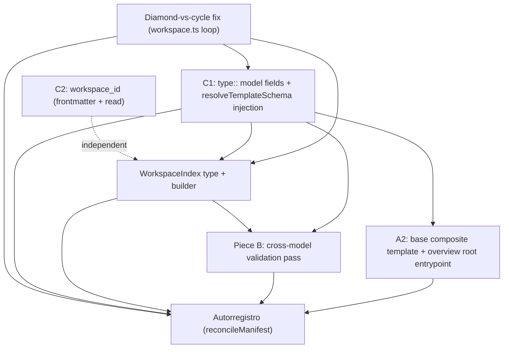

# Exploration: Workspace Entity Evolution

> Anchors in this document were re-verified against `HEAD` `5c7f253` (branch
> `feat/documentation-template-and-dogfooding`) on 2026-09-04. The only drift from
> the first draft was `ModelNode` in core `types.ts` moving from ~`:414` to `:431`;
> line numbers below reflect the current tree.

## Executive Summary

The workspace entity in iNNfo today is a flat inventory (`workspace_NN.md` / `workspace_V_0-2-0_spec_NN.md`) plus a recursive parser (`recursiveParser/workspace.ts`) that builds a parent/child graph but **mislabels a diamond as a cycle**, **never threads a resolved template schema into reference extraction**, and has **zero cross-model reference validation** (`validator/references.ts` bypasses any `::`- or `[...]`-shaped value).

This exploration verifies the code anchors, maps the real gaps, and records the six settled pieces as the chosen direction with their remaining "how" questions:

1. **A2** — new L2 composite template `base` (`includes: [workspace_V_0-2-0, cogNNitive_V_0-2-0]`) for a thin overview-root document; manifest stays inventory-only.
2. **B** — a new workspace-scope cross-model reference validation pass, run after `recursiveParse`, consuming its graph.
3. **C1** — make `type:: model` a first-class option for **fields** on domain templates (not only `workspace.ModelRef` as a concept).
4. **C2** — add a stable `workspace_id` to the workspace root frontmatter.
5. **Autorregistro** — the app keeps `## NN ModelRef` entries in `workspace_NN.md` in additive sync with Level-3 model files.
6. **Diamond-vs-cycle fix** — distinguish "two parents → one child" (fine) from "A→B→A" (error) in `recursiveParse`.

Cross-cutting deliverable: a new `WorkspaceIndex` type that pieces B, autorregistro, and the editor all consume.

`next_recommended`: **sdd-propose** (or `sdd-ff`) for change `workspace-entity-evolution`.

---

## Verified Code Anchors

| Claim | Location (verified against `5c7f253`) | Status |
|---|---|---|
| Entrypoint resolution: `workspace*.md` → legacy `index.md` → root scan | `iNNfo/packages/innfo-core/src/recursiveParser/workspace.ts:90-139` (`findPrimaryWorkspaceFile`), fallbacks `:273-342`, `recursiveParse` at `:243` | Confirmed |
| `MAX_DEPTH = 10` | `workspace.ts:13`; depth check `:372-378` | Confirmed |
| `IGNORED_DIRECTORIES = {backups, archive, specs}` | `workspace.ts:16` | Confirmed |
| `extractSubmodelRefs` picks up schema-`model` fields + bare `path::`/`file_ref::` + wikilinks + md links | `workspace.ts:148-237`; `templateSchema?` param at `:151`; model-typed field detection `:186-206` (`modelFieldNames` seeded `['path','file_ref']` at `:189`, `f.type === 'model'` at `:193`); wikilinks `:224-228`; md links `:231-234` | Confirmed — **but** the `templateSchema` arg is **never passed** by `recursiveParse` (calls at `:346` and `:433` take two args only), so today only bare `path`/`file_ref` + links work during traversal |
| A path already in `visitedPaths` is pushed as `Cycle detected` and skipped — mislabels a diamond | `workspace.ts` — `Cycle detected` message at `:365`, inside worklist loop `:357-443` | Confirmed — the diamond bug is exactly here; the second incoming edge is also **dropped** because the edge-linking code (`childNode.parentId = parentNode.id` at `:421`, `parentNode.childIds.push` at `:423`) only runs after a fresh parse |
| Parent/child graph via `childNode.parentId` / `parentNode.childIds` | `workspace.ts:407-425` | Confirmed; `ModelNode.parentId: string | null` at `types.ts:434` (single parent), `childIds: string[]` at `:435` |
| `type:: model` fields resolved via `SubmodelResolver` (dangling-file + `target_template` match, both severity `warning`) | `validator/references.ts:177-211` (`fieldDef?.type === 'model'` at `:177`, `Dangling submodel reference` at `:185`, `Submodel template mismatch` at `:203`) | Confirmed |
| `reference` fields validated model-wide against element names + `target_concepts` check | `references.ts` — `isRef` test at `:159-160`, dangling message at `:228`, `target_concepts` block `:234-241` | Confirmed |
| A value containing `::` or wrapped `[...]` is flagged `isCrossModel` and BYPASSED — zero cross-model validation | `references.ts:213-221` (`isCrossModel` at `:213-217`, `// Bypass validation for cross-model …` at `:221`) | Confirmed |
| `IMPLICIT_REF_FIELDS = {location, room, component, parent_component}` | `references.ts:144` | Confirmed |
| `normalizeSeparators` used for element-name matching | `references.ts:2` (import), `:39`, `:59` | Confirmed |
| `includes`: optional additive L2∪L2, depth-first left-to-right, purely additive, dup-name check by canonical form, cycle check (diamond ≠ cycle), valid only on level-2, level-3 composes through its template's `includes` | `iNNfo/specs/iNNfo_V_0-2-0_NN.md` — `includes:` frontmatter `:533`, "OPTIONAL array" `:552`, "a diamond is not a cycle" `:600`; impl `packages/innfo-core/src/schema.ts` (`extractTemplateSchema` `:93`, `canonicalizeDefinition` `:262`, divergent-def error `:381`, `mergeSchemaInto` `:404`, `resolveTemplateSchema` `:464`) | Confirmed |
| Level-3 models MUST NOT declare `concepts`/`markers`/`matrices` | `iNNfo_V_0-2-0_NN.md:316` | Confirmed |
| `specializes` is reserved / inert | `iNNfo_V_0-2-0_NN.md:532, 546` | Confirmed |
| Workspace L2: concepts Workspace (`:34`), ModelRef (`:40`, `type:: model` at `:42`), Folder (`:46`), Asset (`:52`); ModelRef fields `path` (`:60`), `template` (`:65`), `status` (`:70`), `author` (`:76`, workspace-scoped, not written into referenced model) | `iNNfo/specs/templates/workspace_V_0-2-0_spec_NN.md` | Confirmed |
| "no domain template `includes` it; it stands alone" — inventory, not a domain vocabulary | `workspace_V_0-2-0_spec_NN.md:87` | Confirmed |
| cogNNitive L2: concepts Sources (`:34`), Models (`:40`), Artifacts (`:46`), Procedures (`:52`); `model_ref`/`model_template` fields are `type:: string` (`:105`, `:110`); PROV-style `reference` edges live intra-model | `iNNfo/specs/templates/cogNNitive/cogNNitive_V_0-2-0_NN.md` | Confirmed |
| Persisted cross-model reference validation NOT implemented in innfo-core; keep `model_ref` as link/path for now; no cross-model matrices | `cogNNitive_V_0-2-0_NN.md:245` (not implemented), `:239` (no cross-model matrices), `:247-249` (claim-level provenance out of scope) | Confirmed |
| `ParseIssue.severity` supports `'info' | 'warning' | 'error'`; `RecursiveParseResult = {nodes, rootIds, issues}`; `WorklistItem = {path, name, referringPath, depth, author?}` (no ancestry field) | `iNNfo/packages/innfo-core/src/recursiveParser/types.ts:4-8`, `:10-14`, `:16-22` | Confirmed |
| `ConceptField.target_template?: string`; extracted from `Field Definition` | `types.ts:92`; `schema.ts:119` | Confirmed |
| `ModelNode` shape (round-trip via `rawSections` / `rawContent`) for a new `WorkspaceIndex` to fit alongside | `recursiveParser/types.ts:24-29` (`ParseContext`); `schema.ts:49` (`TemplateSchema`); core `types.ts:431-500` (`ModelNode`; `rawSections` at `:455`, `rawContent?` at `:464`) | Confirmed |

Everything holds. The one correction worth surfacing: **C1's traversal half is not "add support", it is "wire up support that already exists but is never invoked"** — `extractSubmodelRefs` already understands schema-`model` fields (`workspace.ts:186-206`); `recursiveParse` just never gives it a schema.

---

## Current-State Map: what works vs the real gaps

### Works today

- **Entrypoint resolution** — `findPrimaryWorkspaceFile` matches `workspace*.md` (case-insensitive, `.md`), falls back to `index.md`, then a root `.md` scan (`workspace.ts:90-139, 273-342`). `IGNORED_DIRECTORIES = {backups, archive, specs}` (`:16`).
- **Bounded recursive traversal** — iterative worklist (`WorklistItem[]`), `MAX_DEPTH = 10`, `visitedPaths` set keyed by `normalizePathKey` (lower-cased, forward-slash, collapsed) — `workspace.ts:344-443`, `paths.ts`.
- **Relative path resolution** — `resolveSubmodelPath` handles `./`, `../`, wikilink stripping, `\`→`/` (`paths.ts`).
- **Parent/child graph** — one primary parent per node, `childIds` list on the parent (`workspace.ts:407-425`).
- **Workspace-scoped author propagation** — `ModelRef.author` is attached to the child root node, never persisted into the child file (`workspace.ts:427-430`; spec `:87-89`).
- **Per-file `type:: model` validation** — dangling-file check + `target_template` identity match via injected `SubmodelResolver` (`references.ts:177-211`).
- **Intra-model `reference` validation** — dangling element-name check + `target_concepts` membership (`references.ts:159-241`).
- **`includes` composition engine** — full additive L2∪L2 merge with canonical-form dedupe, collision errors naming both sources, cycle guard, depth guard (`schema.ts:404-535`).
- **`target_template` metamodel plumbing** — `ConceptField.target_template` is defined (`types.ts:92`) and extracted (`schema.ts:119`).

### Real gaps (this change)

| Gap | Evidence | Piece |
|---|---|---|
| Diamond (two parents → one child) is reported as `Cycle detected` and the second parent edge is silently dropped | `workspace.ts:365` vs edge code only at `:421-423` (post-parse only) | Diamond fix |
| `recursiveParse` never passes a resolved `templateSchema` to `extractSubmodelRefs`, so `type:: model` fields on domain concepts are not followed during traversal (only `path`/`file_ref`/links are) | `workspace.ts:346, 433` take two args; detection logic idle at `:186-206` | C1 |
| No mechanism to resolve a node's L2 template schema inside `innfo-core` recursive parsing (no resolver injected; `driver` has no template method) | `recursiveParse(root, driver?)`, `workspace.ts:243` | C1 / WorkspaceIndex |
| Any cross-model reference (`[[A :: B]]`, or any `::`/`[...]` value) is bypassed with **zero** checks | `references.ts:213-221` | B |
| No workspace-scope validation pass at all — `validateDocument`/`validateModel` are single-file and synchronous | `references.ts` is per-`ParsedModel`; no consumer of `RecursiveParseResult` for validation | B |
| No stable workspace identity — `workspace_NN.md` has no id; rename/move loses correlation | `workspace_V_0-2-0_spec_NN.md` frontmatter has no id field | C2 |
| No `WorkspaceIndex` structure — nothing exposes title→node, node→template, node→element/concept maps | `recursiveParser/types.ts:10-14` `RecursiveParseResult` = `{nodes, rootIds, issues}` only | WorkspaceIndex |
| Manifest and provenance drift by hand — nothing keeps `## NN ModelRef` entries in sync with model files present | no reconciliation code anywhere | Autorregistro |
| No composite overview root — provenance (`<Name>_cogNNitive_NN.md`) and inventory (`workspace_NN.md`) are unrelated documents with no shared parent | A2 not built | A2 |

---

## Piece A2 — Composite `base` template + overview root

### What it changes

Introduce a new **level-2 template package** (working name `base`) that declares `includes: [workspace_V_0-2-0, cogNNitive_V_0-2-0]` and defines its own thin concept (working name `Overview`) with **two `type:: model` fields**:

- `manifest` — `type:: model`, `target_template:: workspace_V_0-2-0`, points at the pure-inventory `workspace_NN.md`.
- `provenance` — `type:: model`, `target_template:: cogNNitive_V_0-2-0`, points at `<Name>_cogNNitive_NN.md`.

The overview-root document (a level-3 model with `parent_spec` → `base`) becomes a document that has both the manifest and the provenance model as **children** in the parsed graph. Manifest stays inventory-only; ingest still owns the provenance file; the two lanes never merge (A1 rejected — no hard merge of provenance fields into `ModelRef`).

### Affected files / specs

- **New**: `iNNfo/specs/templates/base/` package — `base_V_0-1-0_spec_NN.md`, `samples/`.
- `iNNfo/specs/templates/workspace_V_0-2-0_spec_NN.md` — **not edited** (spec files write-once). Any note about `base` composing it lives in the `base` spec.
- `iNNfo/packages/innfo-core/src/recursiveParser/workspace.ts` — entrypoint resolution may need to learn the overview-root filename pattern (see open questions).
- `iNNfo/apps/innfo-editor` — overview-root rendering / breadcrumbs (mostly automatic once nodes are in the graph).

### Approach options

| Option | Pros | Cons | Effort |
|---|---|---|---|
| **A2a — new `base` L2 package; overview root is a new entrypoint pattern** (e.g. `*_base_NN.md`, resolved before `workspace*.md`) | Clean separation; workspace spec untouched; opt-in; existing workspaces unaffected | `findPrimaryWorkspaceFile` grows a branch; two "root-ish" filenames to document | Medium |
| **A2b — `base` L2 package, but overview root keeps the name `workspace_NN.md`**, inventory moves to a child | Entrypoint resolution unchanged | Breaks every existing `workspace_NN.md`; invasive migration | High |
| **A2c — no overview root; editor just shows the provenance model beside the manifest** | Zero spec/parser change | No single composed parent; nothing to validate `target_template` against; doesn't satisfy decision 1 | Low |

### Chosen direction

**A2a.** New standalone `base` L2 template package. Overview root is opt-in and, when present, discovered as a new entrypoint pattern ahead of `workspace*.md`. Workspaces that never adopt `base` keep working byte-for-byte. `base` `includes` both peers additively; the name-collision audit is clean today (below), so `includes` order is cosmetic.

### `includes` collision audit (`workspace_V_0-2-0` ∪ `cogNNitive_V_0-2-0`)

| Kind | `workspace` | `cogNNitive` | Collision? |
|---|---|---|---|
| Concepts | Workspace, ModelRef, Folder, Asset | Sources, Models, Artifacts, Procedures | **None** |
| Fields (concept-scoped) | ModelRef.{path, template, status, author} | Sources.{raw_filename, raw_hash, size, source_format, normalized_at, normalized_by, normalized_content, raw_file}; Models.{model_ref, model_template, model_version, derived_from, generated_by}; Artifacts.{artifact_format, artifact_version, location, artifact_hash, derived_from_inputs, produced_by}; Procedures.{procedure_ref, agent, run_at} | **None** (disjoint concepts ⇒ disjoint `concept.field` keys) |
| Markers | (none) | verified (`>`) | **None** |
| Matrices | (none) | Artifact-Source Lineage | **None** |

Note: `location` appears in `references.ts:144` `IMPLICIT_REF_FIELDS` — not a name collision, but flag it so the cross-model pass treats cogNNitive's `Artifacts.location` consistently.

### Open "how" questions

- **Does `base` actually need `includes` at all?** Each child keeps its own `parent_spec`, so each is already validated against its own L2 template. `includes` on `base` only matters if the overview-root document itself carries workspace/cogNNitive **concepts inline**. Decide: (a) `Overview` concept only, no `includes` (simplest); (b) `includes` both so the overview root can inline manifest/provenance content.
- **Entrypoint precedence** — exact filename pattern for the overview root (`*_base_NN.md`? `overview_NN.md`?) and where it slots into `findPrimaryWorkspaceFile` (`workspace.ts:90-139`): before `workspace*.md`, or only when `workspace*.md` is absent?
- **New spec file vs extend workspace spec** — resolved: **new file** `base_V_0-1-0_spec_NN.md`. Extending `workspace_V_0-2-0_spec_NN.md` is disallowed (write-once) and clashes with its "stands alone / inventory not vocabulary" philosophy (`:85-91`).
- **Philosophical tension** — `workspace` spec line 87 says "no domain template `includes` it". `base` is structural, not a domain vocabulary, so arguably fine, but the `base` spec must explicitly state `base` is the *one* sanctioned composer of `workspace`.
- **Migration** — existing `workspace_NN.md` files need no change. Adoption doc: "to get an overview root, add `<name>_base_NN.md` referencing your existing `workspace_NN.md` and `<name>_cogNNitive_NN.md`".

---

## Piece B — Cross-model reference validation pass

### What it changes

Add a **new workspace-scope validation pass** that runs **after** `recursiveParse`, consuming the graph (and the new `WorkspaceIndex`). It replaces the blind bypass at `references.ts:213-221` for the **qualified** form only; unqualified `::`/`[...]` values that are not the qualified form keep today's behavior.

Cross-model reference syntax is **qualified name only**: `[[Model Title :: Element Name]]`. `path#slug` is explicitly **not** designed or implemented. Assumption (user-accepted): **model titles are unique within a workspace** — the pass MUST emit an error when two loaded models share a title.

### Checks performed (per qualified reference in a `reference` or `model` field)

1. **Target model exists** — `Model Title` resolves to exactly one node in `WorkspaceIndex.titleToNodeIds`. Miss / ambiguous → error.
2. **Target element exists** — `Element Name` is a known element in that node (`WorkspaceIndex.nodeElementConcepts`). Miss → error.
3. **Concept membership** — target element's owning concept ∈ `field.target_concepts` (when declared). Miss → warning (mirrors `references.ts:234-241`, cross-model).
4. **Template membership** — target model's resolved template ∈ `field.target_template` (when declared). Miss → warning (mirrors `references.ts:188-206`).

Severity proposal: **dangling target model / element = error**; **concept/template mismatch = warning** (confirm at propose).

### Where it runs

- **v1**: re-run the whole workspace pass on every save. Incremental invalidation later.
- **Host wiring**: `innfo-editor` model store calls it after its `recursiveParse`; `innfo-mcp` `validateModel` gains an optional "workspace mode" that builds the index and runs the pass.
- **Not** doable inside single-file `validateDocument`/`validateModel` — those never see sibling models.

### Affected files / specs

- **New**: `iNNfo/packages/innfo-core/src/validator/workspaceReferences.ts` — `validateWorkspaceReferences(index: WorkspaceIndex): ReferenceDiagnostic[]`.
- `iNNfo/packages/innfo-core/src/validator/references.ts:213-221` — stop silently swallowing the qualified form (either parse-and-defer a marker, or leave per-file pass silent and let the workspace pass own it).
- `iNNfo/packages/innfo-core/src/recursiveParser/` — produce `WorkspaceIndex`.
- `iNNfo/specs/iNNfo_V_0-2-0_NN.md` — normative text for `[[Model Title :: Element Name]]` (currently only `[[Element]]` intra-model syntax is specified). **Edits the live L1 spec — this brushes the write-once rule; needs explicit user sign-off at propose.** A prior change edited `iNNfo_V_0-1-0_NN.md`, so the current-version L1 spec is treated as living — but confirm.
- `iNNfo/specs/templates/cogNNitive/cogNNitive_V_0-2-0_NN.md:245` — the "not implemented" caveat can soften *after* B lands, but as a `V_0-3-0` follow-on, not an in-place edit.

### Approach options

| Option | Pros | Cons | Effort |
|---|---|---|---|
| **B1 — dedicated post-parse pass over `WorkspaceIndex`** | Sees the whole graph; single place for title-uniqueness + all four checks | New module + host wiring; needs template schema per node | Medium |
| **B2 — extend `validateElementFieldReferences` with an injected "cross-model resolver"** (like `SubmodelResolver`) | Reuses existing call site | Still single-file mental model; awkward title-uniqueness; every host builds the resolver | Medium |
| **B3 — keep bypass; only lint syntax** | Trivial | Doesn't catch dangling targets — barely better than today | Low |

### Chosen direction

**B1.** Dedicated `validateWorkspaceReferences` over `WorkspaceIndex`; error on dangling model/element, warning on concept/template mismatch, error on duplicate model titles. Qualified-only syntax.

### Open "how" questions

- Does `references.ts` **defer** qualified refs to the workspace pass or **fully ignore** them (workspace pass re-scans raw field values)? Lean **re-scan** to keep the per-file validator graph-free.
- Title matching: exact, or normalized (`normalizeSeparators`, `references.ts:2,39,59`)? Recommend exact for models, normalized fallback → warning.
- What counts as a model's "title" — frontmatter `title` or filename-derived name (`stripMdSuffix`)? `WorkspaceIndex` should index **both**, prefer `title`.
- Severity confirmation.
- Validate refs in **prose/body** or only typed fields? Recommend typed fields only for v1.

---

## Piece C1 — `type:: model` as a first-class field option on domain templates

### What it changes

Today `type:: model` is used as a **concept** type once (`workspace.ModelRef`, `workspace_V_0-2-0_spec_NN.md:40-42`). C1 makes `type:: model` a fully supported **field** type on any level-2 template's concept (e.g. `Startup.business_model`), reusing the existing `SubmodelResolver` machinery. **Concepts remain definable only in L2 templates** (unchanged; `iNNfo_V_0-2-0_NN.md:316`).

### Two halves

1. **Traversal** (the actual gap): `recursiveParse` must resolve each parsed node's L2 template schema and pass it as `extractSubmodelRefs(content, path, schema)`. Detection code already exists (`workspace.ts:186-206`); it is just never fed a schema (`:346, :433`). This requires a **template-schema resolver injected into `recursiveParse`** — `innfo-core` recursive parsing currently has no way to fetch/resolve an L2 template (only a `driver` for models).
2. **Validation** (mostly done): per-file `type:: model` validation already runs in `references.ts:177-211`. C1 adds nothing here beyond ensuring hosts pass a `SubmodelResolver`. Element-level cross-model checks are Piece B, not C1.

### Affected files / specs

- `iNNfo/packages/innfo-core/src/recursiveParser/workspace.ts` — `recursiveParse` signature gains `resolveTemplateSchema?: (node) => TemplateSchema | null`; thread schema into both `extractSubmodelRefs` calls (`:346, :433`).
- `iNNfo/packages/innfo-core/src/recursiveParser/types.ts` — extend `ParseContext` / add resolver type.
- `iNNfo/packages/innfo-core/src/recursiveParser/model.ts` (`parseAndRegisterModel`) — likely where per-node template resolution is cached onto the node.
- `iNNfo/apps/innfo-editor` + `iNNfo/packages/innfo-mcp` — provide the template-schema resolver (editor: from its resolved-template cache; MCP: from its spec resolver).
- `iNNfo/specs/iNNfo_V_0-2-0_NN.md` — clarify `type:: model` is valid on any concept's field, with `file_ref::` / `path::` / wikilink value forms and optional `target_template` (write-once sign-off noted).

### Approach options

| Option | Pros | Cons | Effort |
|---|---|---|---|
| **C1a — inject `resolveTemplateSchema` callback into `recursiveParse`** (mirrors the existing resolver-injection pattern) | Keeps `innfo-core` I/O-free; consistent with existing patterns | One more resolver each host wires | Medium |
| **C1b — add `readTemplate`/`resolveSchema` to `ModelDriver`** | Single injection point | Widens driver contract; browser driver must implement template fetch | Medium |
| **C1c — resolve templates eagerly in a pre-pass, pass a `Map<path, TemplateSchema>`** | Simple inside the loop | Chicken/egg with traversal; double parse | Medium |

### Chosen direction

**C1a.** Inject an optional `resolveTemplateSchema` callback. When absent, `recursiveParse` behaves exactly as today (bare `path`/`file_ref`/links only) — fully backward compatible.

### Open "how" questions

- Signature: `(node: { frontmatter; path }) => TemplateSchema | null` sync (like the other resolvers) — hosts pre-resolve/cache. Confirm sync is acceptable in the editor path.
- Stash the resolved per-node `TemplateSchema` on `ModelNode` (new optional field) so Piece B and the editor don't re-resolve? Recommend yes → feeds `WorkspaceIndex.nodeSchema`.
- Interaction with `includes`: the resolver must return the **composed** schema (`resolveTemplateSchema` from `schema.ts:464`, not raw `extractTemplateSchema`) so `type:: model` fields from an included template are followed.
- Diamond multiplication: C1 makes diamonds common (a model referenced by both the manifest and a domain field), so the **diamond fix must land before or with C1**.

---

## Piece C2 — Stable `workspace_id`

### What it changes

Add a `workspace_id` key (slug or UUID) to the workspace root frontmatter. **No behavior change now.** Anchor for future cross-workspace refs, rename-survival, sync.

### Affected files / specs

- `iNNfo/specs/templates/workspace_V_0-2-0_spec_NN.md` frontmatter block — write-once; document the field in the **`base` spec** or a workspace spec bump, not in-place.
- `iNNfo/packages/innfo-core/src/recursiveParser/workspace.ts` — read `workspace_id` from the entrypoint frontmatter into `WorkspaceIndex.workspaceId` (and optionally the root `ModelNode`).
- No validator changes (v1: presence optional, not enforced).

### Approach options

| Option | Pros | Cons | Effort |
|---|---|---|---|
| **C2a — slug, derived from folder name at creation, stable thereafter** | Human-readable; grep-able; obvious in diffs | Collisions across separately-created workspaces; slug ≠ folder after rename (intended) | Low |
| **C2b — UUIDv4** | Globally unique; rename-proof | Opaque; needs a generator in every creation path | Low |
| **C2c — both: `workspace_id` (uuid) + `workspace_slug` (human)** | Best of both | Two fields to keep coherent | Low |

### Chosen direction

**C2a for v1** (slug), field name `workspace_id` so a later switch to UUID or C2c is non-breaking. Generated by whatever scaffolds a workspace (editor "new workspace", `nn-trannsform` bootstrap).

### Open "how" questions

- Which document carries it once A2 lands — `workspace_NN.md` or the `base` overview root? Answer: **the entrypoint** (whichever `findPrimaryWorkspaceFile` returns). Keep exactly one.
- Uniqueness scope — none enforced in v1; note for future cross-workspace work.
- Retroactive write into existing workspaces by `nn-trannsform`? Out of scope; provide a one-liner CLI later.

---

## Piece — Autorregistro (manifest ⇄ model-file reconciliation)

### What it changes

The app keeps `## NN ModelRef` entries in `workspace_NN.md` in sync when a **Level-3 model file** appears/disappears in the workspace. **Additive reconciliation**:

- Only touches entries it owns (auto-added ones); only fills what's missing.
- Hand edits preserved: reorder, `Folder` grouping, `author`, any hand-set `status` other than the auto lifecycle.
- On file delete → set `status:: archived` (never remove the entry).
- Does **not** trigger on an ingested source: a source is a `## NN Sources:` element in the provenance model, never a `ModelRef`.
- Excludes the cogNNitive provenance model itself (`<Name>_cogNNitive_NN.md`) — ingest owns it; it's a child of the `base` overview root, not a `ModelRef` (decision 1: separate lanes).

### "Level-3 model file" detection

Frontmatter `level: 3` + `parent_spec` present, filename `*_NN.md`, not under `backups/ archive/ specs/` (`workspace.ts:16`), not the workspace manifest, not a `cogNNitive`-templated model. `template` for the new `ModelRef` comes from the resolved `parent_spec.name`.

### Affected files / specs

- **New**: `iNNfo/packages/innfo-core/src/workspace/reconcileManifest.ts` — pure `reconcileManifest(manifestContent, discovered): { content, changes }`.
- `iNNfo/apps/innfo-editor` — call it on filesystem-watch add/remove; write back with the existing serializer (round-trip via `ModelNode.rawSections` at `types.ts:455` / `rawContent` at `:464`).
- `actioNN` — a CLI command (e.g. `nn workspace sync`) calling the same pure function, for the `nn-trannsform` pipeline and CI.
- `iNNfo/specs/templates/workspace_V_0-2-0_spec_NN.md` — behavior is app-level, not schema; document in `base` spec or a workflow doc, not the write-once template.

### Approach options

| Option | Pros | Cons | Effort |
|---|---|---|---|
| **R1 — pure `innfo-core` fn + two thin callers (editor watch, actioNN CLI)** | One tested implementation; works in editor and headless pipelines | Slightly more plumbing than editor-only | Medium |
| **R2 — editor-only, on FS watch** | Least surface | `nn-trannsform` / CI can't self-heal manifests; logic trapped in the app | Low–Med |
| **R3 — validation-only: report drift as a warning, never auto-write** | Zero mutation risk | User fixes by hand every time; defeats the point | Low |

### Chosen direction

**R1.** Core pure function; editor calls it on watch; actioNN exposes it as a command. Serializer must guarantee untouched entries round-trip byte-stable (reuse `rawSections`/`rawContent`).

### Open "how" questions

- **Editor-only vs CLI/actioNN**: recommend **both**, via the shared pure function. Confirm actioNN is in scope for this change or a fast-follow.
- Matching key between a file and an existing `ModelRef`: normalized `path` (`normalizePathKey`). Normalize both sides (casing, `./` prefix) before matching.
- "Owned" entry marker: implicit (path matches a discovered file and fields look auto-shaped) or explicit (`<!-- nn:auto -->`)? Lean explicit, minimal — safer for "only touch entries it owns".
- Re-appear after archive: flip `status:: archived` → `active` only if the tool set it to `archived`; otherwise leave as the user left it.
- Ordering of new entries: append at end of `# NN ModelRef` (never reorder existing). Confirm.
- Concurrency: editor watch + running `nn-trannsform` both writing. Out of scope; document "run one at a time".

---

## Piece — Diamond-vs-cycle fix in `recursiveParse`

### What it changes

Distinguish two situations currently collapsed at `workspace.ts:362-368` (the `visitedPaths.has(normKey)` branch, `Cycle detected` message at `:365`):

- **Diamond** — a node reached again via a *different* parent that is **not** an ancestor on the current branch. Correct: record the second incoming edge (`parentNode.childIds.push(childId)`), do **not** re-parse, **not** re-extract refs, **not** emit an issue.
- **True cycle** — a node reached again that **is** an ancestor on the current branch (`A → B → A`). Correct: emit `Cycle detected`, skip.

### Design

The worklist is BFS, so ancestry must be carried explicitly per item. Add `ancestorKeys: string[]` to `WorklistItem` (`recursiveParser/types.ts:16-22`) — the chain of `normalizePathKey`s from the entrypoint to `referringPath` inclusive.

In the loop (`workspace.ts:357-443`), replace the single `visitedPaths.has(normKey)` branch with:

1. `if (item.ancestorKeys.includes(normKey))` → **true cycle** → push `Cycle detected` issue, `continue`.
2. `else if (visitedPaths.has(normKey))` → **diamond** → link `parentNode`→`childNode` (extract the linking block at `:421-423` into a helper and call it here too), then `continue` (no re-parse, no ref extraction).
3. `else` → fresh: `visitedPaths.add(normKey)`, parse, link, enqueue nested refs with `ancestorKeys: [...item.ancestorKeys, normKey]`.

`visitedPaths` semantics become explicitly **"already parsed"** (black set); the per-branch ancestor set is `item.ancestorKeys`. This matches the existing `includes` engine ("a diamond is not a cycle", `iNNfo_V_0-2-0_NN.md:600`).

### Multi-parent representation

`ModelNode.parentId` is single-valued (`types.ts:434`). For a diamond child:

| Option | Pros | Cons | Effort |
|---|---|---|---|
| **DP1 — keep `parentId` = first parent; push child into the second parent's `childIds` too** | Minimal; "one node, second incoming edge recorded"; tree view shows child under both | Breadcrumb "up" only reaches the first parent | Low |
| **DP2 — add `parentIds?: string[]`** (all incoming edges) alongside `parentId` (primary) | Full DAG info for editor / cross-model pass | New field; consumers must learn it | Low–Med |
| **DP3 — model workspace as an explicit DAG** (`edges: Array<{from,to}>`) | Correct data model | Large ripple through editor/store/sidebar | High |

**Chosen: DP1 for v1**, with `WorkspaceIndex.extraParents` (`childId → parentId[]`) capturing the non-primary edges so nothing is lost for B / the editor. DP2 is the clean follow-up if the editor needs multi-valued "up".

### Affected files

- `iNNfo/packages/innfo-core/src/recursiveParser/types.ts` — `WorklistItem.ancestorKeys`.
- `iNNfo/packages/innfo-core/src/recursiveParser/workspace.ts:344-443` — loop rewrite; extract the parent/child linking helper (`:421-423`); seed `ancestorKeys: [entrypointKey]` for initial refs (`:346-355`).
- `iNNfo/packages/innfo-core/tests/recursive-parser.test.ts` and `workspace-taxonomy-submodels.test.ts` — new cases: diamond (no issue, both edges), true cycle (issue), self-ref, deep chain at `MAX_DEPTH`.

### Open "how" questions

- **Where the fix lives**: inside the `recursiveParse` worklist loop, via `WorklistItem.ancestorKeys` — **not** a second global set. `visitedPaths` stays the "already parsed" set; per-branch ancestry is threaded through the queue item. Alternative (edge-set + graph-reachability check) is heavier and depends on graph-so-far completeness — rejected.
- Should a diamond emit an **info**-level note ("also referenced from X") for the editor, or be completely silent? Recommend silent or `severity: 'info'` at most (`ParseIssue.severity` supports `'info'`, `recursiveParser/types.ts:4-8`).
- `MAX_DEPTH` accounting: with `ancestorKeys` the first arrival wins and sets depth; the diamond re-encounter is not re-queued. Document "first arrival sets depth".

---

## Cross-cutting: the `WorkspaceIndex` type

### Why

Piece B, autorregistro, and the editor all need the same derived views that `RecursiveParseResult` (`{nodes, rootIds, issues}`, `recursiveParser/types.ts:10-14`) does not expose: title→node, node→template, node→(element→concept), node→schema, and the non-primary diamond edges.

### Proposed shape

```ts
// iNNfo/packages/innfo-core/src/recursiveParser/workspaceIndex.ts (new)
export interface WorkspaceIndex {
  /** normalizePathKey(path) -> node id */
  pathToNodeId: Record<string, string>
  /** lowercased model title AND filename-name -> node id(s); >1 entry = title collision */
  titleToNodeIds: Record<string, string[]>
  /** node id -> resolved template identity */
  nodeTemplate: Record<string, { name: string; url?: string }>
  /** node id -> (lowercased element name -> owning concept name[]) */
  nodeElementConcepts: Record<string, Record<string, string[]>>
  /** node id -> composed TemplateSchema (via resolveTemplateSchema, incl. includes) */
  nodeSchema: Record<string, import('../schema').TemplateSchema>
  /** diamond: child id -> parent ids beyond ModelNode.parentId */
  extraParents: Record<string, string[]>
  /** entrypoint frontmatter workspace_id (C2), if present */
  workspaceId?: string
  /** collisions/ambiguities found while indexing (feed the validator) */
  issues: import('./types').ParseIssue[]
}
```

### Where it is produced

| Option | Pros | Cons | Effort |
|---|---|---|---|
| **WI1 — `RecursiveParseResult` gains optional `index?: WorkspaceIndex`, populated by `recursiveParse` only when a `resolveTemplateSchema` callback is supplied** | One traversal; index built from data already in hand; no double parse | Return type grows; must stay optional for back-compat | Medium |
| **WI2 — standalone `buildWorkspaceIndex(result, resolveTemplateSchema)` in a new module** | `recursiveParse` untouched; explicit, testable in isolation | Re-walks `result.nodes`; re-resolves templates unless cached on nodes | Low–Med |
| **WI3 — build it lazily in each host** | No core change | Duplicated logic in editor + MCP; drift risk | Low (but bad) |

**Chosen: WI2**, with `nodeSchema`/`nodeTemplate` populated from data C1 already stashes on `ModelNode` (so no re-resolve). `recursiveParse` stays lean; the index is a pure derivation. Fold into WI1 later only if profiling shows the re-walk matters.

### Open "how" questions

- Module location: `recursiveParser/workspaceIndex.ts` (next to `types.ts`) vs `workspace/` (next to `reconcileManifest.ts`). Lean `recursiveParser/` since it derives from the parse result.
- Should `extraParents` also live on `ModelNode` (DP2) instead of only the index? Promote later if the editor needs it.
- `nodeElementConcepts` element-name keying must match `references.ts` conventions (lowercased; `normalizeSeparators` fallback). Reuse those helpers.
- Include nodes that failed to parse / were "not found"? Add a `missing: string[]` if B needs to distinguish "ref points at a file not in the workspace" from "title not found".

---

## Dependency ordering & suggested sequencing



Suggested change/PR slices (each independently shippable, review-sized):

1. **Diamond-vs-cycle fix** — `workspace.ts` loop + `WorklistItem.ancestorKeys` + tests. No spec change. Unblocks everything that creates diamonds. Small.
2. **C2 `workspace_id`** — frontmatter read + `base`/workspace-spec doc note + scaffold writes it. Tiny, independent; do early as an anchor.
3. **C1 `type:: model` fields** — inject `resolveTemplateSchema` into `recursiveParse`, thread schema into `extractSubmodelRefs` (`:346, :433`), stash composed schema on `ModelNode`, host resolvers (editor + MCP). Depends on (1).
4. **`WorkspaceIndex` builder** — `buildWorkspaceIndex` pure module + tests. Depends on (1) + (3).
5. **Piece B — cross-model validation pass** — `validateWorkspaceReferences`, un-bypass the qualified form, title-uniqueness error, L1 spec normative text for `[[Model :: Element]]`. Depends on (4) + (3). Largest slice; may split into "index + syntax" then "checks".
6. **A2 — `base` template package** — new spec package, `Overview` concept, entrypoint precedence, sample, adoption doc. Depends on (3).
7. **Autorregistro** — `reconcileManifest` pure fn + editor watch caller + actioNN CLI. Depends on (1), (3), (4); benefits from (5) and (6). Last.

---

## The Startup reference case, end-to-end through the proposed design

**Setup**

- L2 template `startup_V_0-2-0` defines concept `Startup` with fields `nombre` (`string`), `fundadores` (`reference`), `business_model` (`type:: model`, value via `file_ref::`, `target_template:: business_V_0-2-0`).
- L3 domain master `acme_portfolio_V_0-1-0_startup_NN.md` has `## NN Startup: Acme`, `## NN Startup: Beta`, … each with `business_model:: [[startups/acme_business_NN.md]]` etc.
- Each `startups/<x>_business_NN.md` is an L3 model, `parent_spec` → `business_V_0-2-0`.
- Autorregistro has already added `## NN ModelRef: Acme Business` (`path:: startups/acme_business_NN.md`, `template:: [[business_V_0-2-0]]`, `status:: active`) to `workspace_NN.md`, plus a `ModelRef` for the portfolio master.

**Parse (with C1 + diamond fix + WorkspaceIndex)**

1. Entrypoint `workspace_NN.md` parsed → root node `W`. `workspace_id` (C2) read into `WorkspaceIndex.workspaceId`. `visitedPaths = {w}`.
2. `extractSubmodelRefs(W, workspaceSchema)` — `ModelRef.path` picked up (hard-coded `path` key, `workspace.ts:189,204-206`) → queue: `acme_business` (ancestors `[w]`), `beta_business` (`[w]`), `acme_portfolio` (`[w]`).
3. Dequeue `acme_business` (ancestors `[w]`): not ancestor, not parsed → parse, link `W → acme_business`, `visitedPaths += acme_business`. Its `business` schema yields no further model refs. `WorkspaceIndex`: `titleToNodeIds["acme business"] = [id]`, `nodeTemplate = business_V_0-2-0`.
4. Dequeue `beta_business` — same.
5. Dequeue `acme_portfolio` (ancestors `[w]`): parse, link `W → acme_portfolio`. C1: resolve `startup_V_0-2-0` schema → `extractSubmodelRefs` finds `business_model` fields (`type:: model`) → queue: `startups/acme_business_NN.md` (ancestors `[w, acme_portfolio]`), `startups/beta_business_NN.md` (`[w, acme_portfolio]`).
6. Dequeue `acme_business` **again** (ancestors `[w, acme_portfolio]`):
   - `ancestorKeys.includes("startups/acme_business_nn.md")` → **false**.
   - `visitedPaths.has(...)` → **true** → **DIAMOND**. Link `acme_portfolio → acme_business` (push into `acme_portfolio.childIds`; `acme_business.parentId` stays `W`; `WorkspaceIndex.extraParents["acme_business"] = ["acme_portfolio_id"]`). **No re-parse, no issue.**
   - *Today this emits a false `Cycle detected` at `workspace.ts:365` and drops the `acme_portfolio → acme_business` edge.*
7. Dequeue `beta_business` again → same diamond handling.
8. Queue empty. Graph: `acme_business` appears **once**, child of both `W` (inventory) and `acme_portfolio` (semantic). No spurious cycle issue.

**Validation (Piece B pass over `WorkspaceIndex`)**

- `Startup.business_model` on `Acme` = `[[startups/acme_business_NN.md]]` — a **path/`type:: model`** ref, handled per-file by `references.ts:177-211` (dangling-file + `target_template:: business_V_0-2-0` identity check). Passes.
- `Startup.fundadores` on `Acme`:
  - If founders are `## NN Founder:` elements **in the same** `acme_portfolio` model → intra-model `reference` check (`references.ts:159-241`) resolves them. Unchanged.
  - If founders live in a **separate** `acme_org_V_0-2-0_organization_NN.md` → the value must be the **qualified** form `fundadores:: [[Acme Org :: Jane Doe]]`. Today `references.ts:213-217` sees `::`, sets `isCrossModel`, and **bypasses** — Jane Doe is never validated. With Piece B: the workspace pass looks up `titleToNodeIds["acme org"]`, checks `Jane Doe` is an element there, checks her owning concept ∈ `fundadores.target_concepts` (if declared), checks `acme_org` template ∈ `fundadores.target_template` (if declared). Dangling → error; concept/template mismatch → warning.
- Title-uniqueness: if two loaded models both had `title: "Acme Org"`, the pass emits an error (qualified refs would be ambiguous) — the "titles unique per workspace" assumption is enforced, not just assumed.

**True-cycle contrast**: if `acme_business_NN.md` had `business_model:: [[../acme_portfolio_V_0-1-0_startup_NN.md]]`, dequeuing `acme_portfolio` with ancestors `[w, acme_portfolio, acme_business]` → `ancestorKeys.includes("acme_portfolio...")` → **true** → real `Cycle detected` error. Correct.

---

## Explicitly NOT in scope

- **A1 (hard merge)** — folding provenance fields into `workspace.ModelRef` / the manifest. Rejected; A2 keeps lanes separate.
- **`path#slug` or any positional/anchor cross-model reference syntax.** Qualified name only.
- **Cross-workspace references.** C2 only lays the `workspace_id` anchor; no resolution across workspaces.
- **Incremental / partial re-validation on save.** v1 re-runs the whole workspace pass each time.
- **Multi-valued `parentId` / full DAG node model (DP2/DP3).** v1 uses DP1 + `WorkspaceIndex.extraParents`.
- **Migrating cogNNitive `Models.model_ref` / `model_template` from `type:: string` to `type:: model`** (`cogNNitive_V_0-2-0_NN.md:105-110`). The spec's own caveat (`:245`) says keep as a link for now; revisit as a `cogNNitive_V_0-3-0` follow-on after Piece B proves out.
- **Editing published `V_0-2-0` spec/template files in place.** `workspace_V_0-2-0_spec_NN.md` and `cogNNitive_V_0-2-0_NN.md` are write-once. New docs live in the `base` package or a version bump.
- **Claim-level / element-level provenance** inside domain models (`cogNNitive_V_0-2-0_NN.md:247-249` — already out of scope there).
- **Cross-model matrices.** iNNfo has none by design (`cogNNitive_V_0-2-0_NN.md:239`).
- **`specializes` activation** — stays reserved/inert (`iNNfo_V_0-2-0_NN.md:532, 546`).
- **MCP `findModelFile` recursive-lookup changes** — landed in a prior change; touch only if Piece B surfaces a concrete miss.
- **Editor breadcrumb / navigation redesign** for multi-parent "up". Nodes will appear under both parents; richer up-navigation is a later UI change.

---

## Risks

| Risk | Severity | Mitigation |
| :--- | :--- | :--- |
| Editing the live L1 spec (`iNNfo_V_0-2-0_NN.md`) for `[[Model :: Element]]` syntax may violate write-once | Medium | Get explicit user sign-off at propose; a prior change edited `iNNfo_V_0-1-0_NN.md` so the current-version L1 spec is treated as living — but confirm, and keep the edit additive |
| Diamond fix changes graph shape → downstream editor/sidebar assumptions (single parent) may break | Medium | DP1 keeps `parentId` semantics; add regression tests for sidebar/breadcrumb; `extraParents` is additive metadata only |
| `resolveTemplateSchema` injection (C1) — browser editor may not have a sync template resolver available at parse time | Medium | Callback is optional; `recursiveParse` degrades to today's behavior when absent; editor pre-resolves templates into a synchronously-servable cache |
| Autorregistro auto-writing the manifest corrupts hand edits / round-trip | High | Pure `reconcileManifest` fn with exhaustive tests; explicit `<!-- nn:auto -->` ownership marker; never reorder/regroup; reuse `rawSections`/`rawContent` serializer path; dry-run mode in the CLI |
| Model-title collisions make qualified refs ambiguous | Medium | Piece B emits an error on duplicate titles in `WorkspaceIndex`; document the "titles unique per workspace" rule in the `base` spec |
| Whole-workspace re-validation on every save is O(models × refs) and may lag large workspaces | Low–Medium | Acceptable for v1; `WorkspaceIndex` is cheap to rebuild; incremental invalidation is a planned follow-up |
| `base` `includes` both `workspace` and `cogNNitive` — future edits to either could introduce a name collision | Low | Collision audit is clean today; the `includes` engine already errors on divergent same-name defs (`schema.ts:381`); add a composition test for `base` |
| Entrypoint precedence change (overview root before `workspace*.md`) could hijack existing workspaces | Medium | Use a distinct filename pattern (`*_base_NN.md`); only take precedence when that pattern is actually present; existing `workspace_NN.md`-only workspaces unaffected |
| Depth/`MAX_DEPTH` accounting differs between first-arrival and diamond paths | Low | Document "first arrival sets depth"; add a test at the `MAX_DEPTH` boundary with a diamond |
| Untracked planning docs are fragile — this file was lost once to a mid-session working-tree change and had to be regenerated | Low | Commit it on its own branch before starting implementation |

---

## Ready for Proposal

**Yes.** All six pieces have a verified current-state anchor, a chosen direction, and a bounded set of open "how" questions that are design-phase decisions, not blockers. Recommend `sdd-propose` (or `sdd-ff`) for change `workspace-entity-evolution`, sequencing the work as the seven slices above with the diamond fix first and autorregistro last.
