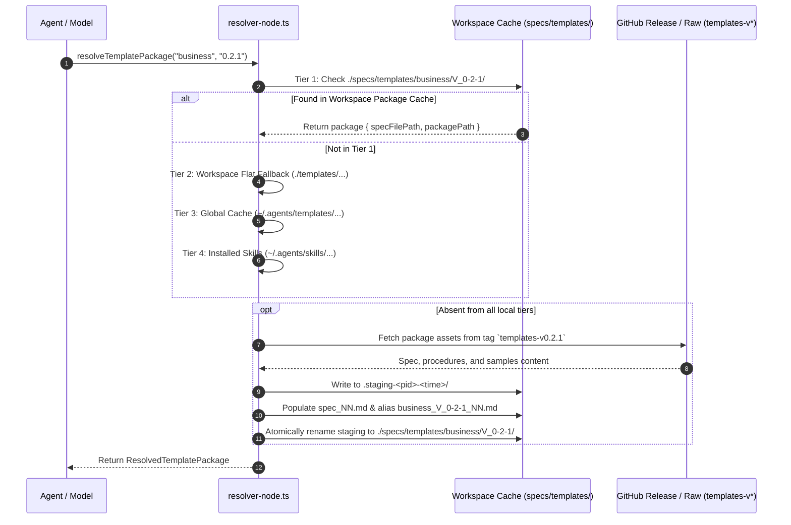

# Design: Canonical Template Package Distribution

**Target Architecture & Implementation Specification**  
**Change ID:** `canonical-template-package-distribution`  
**Related Specs:** `template-release-tagging` (New), `template-package-structure` (Modified), `template-version-pruning` (Deprecated/Retired), `template-immutability-guard` (Deprecated/Retired)

---

## Technical Approach

The core problem addressed by this design is **source repository clutter and brittle immutability mechanisms**. Historically, iNNfo templates on the `main` branch embedded semantic version strings in filenames (e.g., `workspace_V_0-3-0_spec_NN.md`, `projects/projects_V_0-2-0_NN.md`). To enforce immutability, `scripts/guard-template-immutability.js` rejected git status `M` (in-place modification). Consequently, every template modification required copying the entire file to a new versioned filename (file cloning), leaving historical versions (`V_0-1-0`, `V_0-2-0`) permanently stranded in `iNNfo/specs/templates/`. This cluttered development, complicated SOP procedures and sample maintenance, and created confusion over the authoritative state of templates on `main`.

Furthermore, downstream workspace hydration previously operated on single, flat markdown files rather than structured packages containing specifications, Standard Operating Procedures (SOPs), and reference samples.

### Architecture Overview

```
 ┌─────────────────────────────────────────────────────────────────────────┐
 │                      cogNNitive Repository (`main`)                     │
 │                                                                         │
 │  iNNfo/specs/templates/                                                 │
 │    ├── workspace_spec_NN.md            (canonical unversioned filename) │
 │    └── business/                                                        │
 │        ├── spec_NN.md                  (template_version: "0.2.1")      │
 │        ├── procedures/                 (SOP execution procedures)       │
 │        └── samples/                    (sample reference models)        │
 └────────────────────────────────────┬────────────────────────────────────┘
                                      │
                         CI: Version-Bump Verification
                         (guard-template-immutability.js)
                                      │
                                      ▼
 ┌─────────────────────────────────────────────────────────────────────────┐
 │                        Git Release Tagging                              │
 │                                                                         │
 │   Tag: `templates-v0.2.1` (immutable commit snapshot)                   │
 │   Tag: `v0.2.0` (L1 iNNfo / L0 defiNNe release tag)                     │
 └────────────────────────────────────┬────────────────────────────────────┘
                                      │
                         Tag-Pinned Package Hydration
                                      │
                                      ▼
 ┌─────────────────────────────────────────────────────────────────────────┐
 │                      Downstream Workspace Cache                         │
 │                                                                         │
 │  specs/templates/business/V_0-2-1/                                      │
 │    ├── spec_NN.md                      (canonical Level-2 specification)│
 │    ├── business_V_0-2-1_NN.md          (backward-compatible alias)      │
 │    ├── procedures/                     (hydrated SOP procedures)        │
 │    └── samples/                        (hydrated reference samples)     │
 └─────────────────────────────────────────────────────────────────────────┘
```

This design separates the concerns into four distinct layers:

1. **Source Repository (`main`)**: Source files are named canonically without semver tokens (e.g., `workspace_spec_NN.md`, `business/spec_NN.md`). Semantic versioning is maintained authoritatively in the file's YAML frontmatter (`template_version: "0.2.1"`).
2. **Release Immutability (Git Tags)**: Immutability is offloaded to Git release tags (`templates-v<version>`, `v<version>`). Published tags are immutable and protected by repository policy.
3. **Downstream Workspace Hydration (Versioned Packages)**: Workspaces isolate template versions under `specs/templates/<name>/<version>/`. Resolution downloads the full package (spec, procedures, samples) into an atomic staging folder before promoting it to the write-once directory.
4. **CI Immutability Guard**: `scripts/guard-template-immutability.js` shifts from rejecting file edits (`M`) to enforcing frontmatter `template_version` increments on modified templates relative to the base branch (`origin/main`).

---

## Architecture Decisions

### Decision 1: Canonical unversioned filenames in repo source (`main`) vs Versioned hydration in workspace cache

- **Context**: File-cloning on `main` caused duplicate files, orphaned versions, and divergent procedures. Downstream workspaces, however, need coexisting versions when different workspace models pin to different template versions (e.g., Model A uses `projects` `0.1.0` while Model B uses `0.2.0`).
- **Options Considered**:
  - *Option A (Status Quo)*: Versioned filenames in `main` and workspace. Rejected due to file clutter and divergence.
  - *Option B*: Unversioned filenames everywhere. Rejected because downstream workspaces require multi-version isolation to support concurrent models and non-disruptive upgrades.
  - *Option C (Chosen)*: Canonical unversioned filenames in repository source (`main`), versioned hydration directories in workspace caches (`specs/templates/<name>/<version>/`).
- **Rationale**: `main` represents the evolving source of truth. Git itself is the version control system. Workspaces represent runtime environments requiring isolated, deterministic dependencies. Hydration bridges this by copying tag-pinned canonical files into versioned workspace directories.

### Decision 2: Git tag immutability & release packaging for templates, L1, and L0

- **Context**: How to guarantee immutability without storing every historical version as a separate file on `main`.
- **Options Considered**:
  - *Option A*: Commit SHA pinning in manifests. Rejected as opaque, difficult to audit, and decoupled from semantic versioning.
  - *Option B (Chosen)*: Immutable Git release tags (`templates-v<version>` for templates, `v<version>` for L1 `iNNfo` and L0 `defiNNe`).
  - *Option C*: External package registries (npm/OCI). Rejected as out-of-scope for the core monorepo architecture.
- **Rationale**: Git tags provide cryptographic immutability (commit SHAs) combined with human-readable semantic versioning. GitHub repository protection rules prevent tag alteration or deletion. Release provenance checks in `manifest-rules.js` verify tag-to-commit coherence.

### Decision 3: Full-package hydration (spec + procedures + samples + assets) via release archive / assets

- **Context**: Templates are holistic packages comprising specifications, SOP execution procedures (`procedures/*.md`), reference samples (`samples/*.md`), and static reference layouts or media (`assets/*`, such as `assets/master.html`). Fetching only `spec_NN.md` leaves downstream agents without execution procedures or validation fixtures, and breaks procedure steps that load static layouts (e.g. `compile_strategic_master_NN.md` loading `../assets/master.html`).
- **Options Considered**:
  - *Option A*: Single-file fetch of `spec_NN.md`. Rejected because agent procedures, sample models, and static dashboard assets are missing.
  - *Option B (Chosen)*: Full-package hydration of spec, procedures, samples, and assets into `specs/templates/<name>/<version>/` using atomic directory replacement (`.staging-<pid>-<time>/` renamed to target).
- **Rationale**: Full-package hydration ensures autonomous agents have all required context and layout assets offline once resolved. Atomic renaming guarantees write-once immutability: partially hydrated folders are never observed by concurrent processes.

### Decision 4: CI frontmatter version-bump validation replacing in-place file mutation guards

- **Context**: `scripts/guard-template-immutability.js` previously failed if any `*_V_*.md` had git status `M`. Under canonical naming, editing a template produces `M`. Without a guard, authors could modify templates without bumping `template_version`, causing breaking silent mutations.
- **Options Considered**:
  - *Option A*: Rely on manual code review. High operational risk.
  - *Option B (Chosen)*: Modernize `guard-template-immutability.js` to perform frontmatter version-bump validation against the base branch (`origin/main`).
- **Rationale**: If a canonical template under `iNNfo/specs/templates/` is modified (status `M`), the guard inspects git base content (`git show <base>:<path>`) and local content. If content changed, the guard verifies that the new `template_version` is strictly greater than the base `template_version` under semver rules. Deletions, additions with valid versions, and unmodified files pass. Fixture-based execution via `--diff-file` is preserved for isolated testing.

---

## Data Flow & Resolution Mechanics

### Resolution and Hydration Sequence



### Path and Naming Mapping

| Component | Repository Source (`main`) | Release Asset / Tag | Workspace Hydrated Cache |
|-----------|----------------------------|---------------------|--------------------------|
| Root Workspace Spec | `iNNfo/specs/templates/workspace_spec_NN.md` | `templates-v0.3.0` | `specs/templates/workspace/V_0-3-0/spec_NN.md` |
| Business Template Spec | `iNNfo/specs/templates/business/spec_NN.md` | `templates-v0.2.1` | `specs/templates/business/V_0-2-1/spec_NN.md` |
| Business Procedures | `iNNfo/specs/templates/business/procedures/` | `templates-v0.2.1` | `specs/templates/business/V_0-2-1/procedures/` |
| Business Samples | `iNNfo/specs/templates/business/samples/` | `templates-v0.2.1` | `specs/templates/business/V_0-2-1/samples/` |
| Projects Template Spec | `iNNfo/specs/templates/projects/spec_NN.md` | `templates-v0.2.1` | `specs/templates/projects/V_0-2-1/spec_NN.md` |
| Documentation Spec | `iNNfo/specs/templates/documentation/spec_NN.md` | `templates-v0.2.0` | `specs/templates/documentation/V_0-2-0/spec_NN.md` |

---

## File Changes & Refactoring Map

### 1. `iNNfo/specs/templates/`
- **Rename to canonical paths**:
  - `workspace_V_0-3-0_spec_NN.md` $\rightarrow$ `workspace_spec_NN.md`
  - Remove orphaned historical files: `workspace_V_0-1-0_spec_NN.md`, `workspace_V_0-2-0_spec_NN.md`
  - Template subdirectories normalized to canonical `spec_NN.md`:
    - `projects/projects_V_0-2-0_NN.md` $\rightarrow$ `projects/spec_NN.md`
    - `business/business_V_0-2-1_NN.md` $\rightarrow$ `business/spec_NN.md`
    - `procedures/procedures_V_0-2-0_NN.md` $\rightarrow$ `procedures/spec_NN.md`
    - `organization/organization_V_0-2-0_NN.md` $\rightarrow$ `organization/spec_NN.md`
    - `business-model/business-model_V_0-1-0_NN.md` $\rightarrow$ `business-model/spec_NN.md`
    - `analysis/analysis_V_0-1-0_NN.md` $\rightarrow$ `analysis/spec_NN.md`
    - `innovation/innovation_V_0-2-0_NN.md` $\rightarrow$ `innovation/spec_NN.md`
    - `blank/blank_V_0-2-0_NN.md` $\rightarrow$ `blank/spec_NN.md` (remove `blank_V_0-1-0_NN.md`)
    - `documentation/V_0-1-0/spec_NN.md` $\rightarrow$ `documentation/spec_NN.md`
    - `base/base_V_0-1-0_spec_NN.md` $\rightarrow$ `base/spec_NN.md`
    - `cogNNitive/cogNNitive_V_0-2-0_NN.md` $\rightarrow$ `cogNNitive/spec_NN.md` (remove `cogNNitive_V_0-1-0_NN.md`)

### 2. `iNNfo/packages/innfo-mcp/src/tools/resolver-node.ts`
- **`findSpecInPackageDir(dir, base)`**:
  - Prioritize `spec_NN.md` as canonical primary.
  - Retain fallbacks for `<base>_V_<version>_NN.md`, `<base>_NN.md`, `spec.md`, `<base>.md`.
- **`hydrateTemplatePackageAtomically(rootDir, base, version, packagePayload)`**:
  - Accept full package payload: main spec string and asset dictionary (procedures, samples, assets).
  - Write files to staging directory `specs/templates/<base>/.staging-<pid>-<time>/`.
  - Write canonical `spec_NN.md` and backward-compatible alias `${base}_${verSegment}_NN.md`.
  - Replicate subdirectories (`procedures/`, `samples/`, `assets/`) within staging.
  - Perform atomic rename to `specs/templates/<base>/${verSegment}/`.
  - Write-once guarantee: if destination directory exists and contains files, skip write.

### 3. `scripts/guard-template-immutability.js`
- **Modernize guard verification**:
  - Inspect git diff against base branch (`--base <ref>`, default `origin/main` or `HEAD`).
  - Scan modified files under `iNNfo/specs/templates/`.
  - Parse YAML frontmatter `template_version` of current file vs base branch (`git show <base>:<path>`).
  - If content modified and `new_version <= base_version`, report violation:
    ```
    ERROR: Canonical template <path> modified without incrementing frontmatter template_version
           (current: "0.2.1", base: "0.2.1"). Templates must increment semver on content change.
    ```
  - For newly added templates (status `A`), ensure valid semver in `template_version`.
  - Maintain `--diff-file <path>` CLI option to enable zero-dependency unit tests without git.

### 4. `scripts/guard-template-immutability.test.js`
- Update unit tests to validate:
  1. In-place content modification with unchanged `template_version` $\rightarrow$ exit 1.
  2. In-place content modification with bumped `template_version` $\rightarrow$ exit 0.
  3. Newly added template with valid frontmatter $\rightarrow$ exit 0.
  4. Newly added template with missing/invalid frontmatter $\rightarrow$ exit 1.
  5. Deleted templates $\rightarrow$ exit 0.
  6. Non-template edits (samples, assets, documentation) $\rightarrow$ exit 0.

### 5. `manifest/source.yaml` and `scripts/manifest/`
- Update paths under `templates:` to canonical unversioned paths (e.g., `path: iNNfo/specs/templates/workspace_spec_NN.md`).
- Ensure `channels.stable.refs` maps `key: templates` to immutable release tag `templates-v<semver>`.
- Update `scripts/manifest/validate-manifest.js` and `check-parity.js` to validate unversioned paths against the filesystem and manifest declarations.

### 6. OpenSpec Specifications
- Create `openspec/specs/template-release-tagging/spec.md`: formalize immutable git release tagging and tag-pinned remote resolution.
- Modify `openspec/specs/template-package-structure/spec.md`: formalize canonical source paths, full-package hydration, and versioned workspace layout.
- Mark as retired:
  - `openspec/specs/template-version-pruning/spec.md`: workspace cache no longer relies on complex reachability pruning of orphaned spec files.
  - `openspec/specs/template-immutability-guard/spec.md`: retired file-cloning guard in favor of frontmatter version bump CI verification.

---

## Migration & Backward Compatibility Strategy

1. **Active Model References**: Existing workspace models declare references like `parent_spec: "projects_V_0-2-0"` or `parent_spec: "workspace_V_0-3-0_spec_NN"`.
   - `parseSpecName` parses these into `{ base: "projects", version: "0.2.0" }`.
   - `resolveTemplatePackage` checks `specs/templates/projects/V_0-2-0/`.
   - The hydrated package contains both `spec_NN.md` and `projects_V_0-2-0_NN.md`. Both direct path and parsed name lookups resolve seamlessly.
2. **Legacy Flat Fallback**: Tier 2 of the resolver remains active: if an older workspace still contains flat `./templates/projects_V_0-2-0_NN.md` files, the resolver loads them as a fallback.
3. **Historical Git Releases**: Older tags (`templates-v0.2.1`, `templates-v0.2.2`, `templates-v0.2.3`, `templates-v0.2.4`) remain permanently reachable in Git history. Legacy manifests pointing to historical commits or tags resolve without breakage.
4. **Gradual Workspace Upgrade**: Workspaces can adopt newer template versions using `nn-upgrade` when ready, hydrating the new tag-pinned versioned directory without disrupting existing models.

---

## Risks & Mitigations

| Risk | Impact | Likelihood | Mitigation |
|------|--------|------------|------------|
| **Shallow Git Clones in CI** | `git show origin/main:<path>` fails if clone depth is 1 | Medium | In CI workflows, ensure `fetch-depth: 0` or fetch origin base ref (`git fetch origin main --depth=1`). Fall back to `HEAD~1` if remote tracking branch is unavailable. |
| **Network Latency during Package Hydration** | Multi-file downloads for procedures and samples could experience partial failures | Low | Hydration downloads all assets to an isolated staging directory (`.staging-<pid>-<time>/`). If any asset download fails, the staging directory is cleaned up and the operation fails cleanly. The active cache is only updated on complete, successful atomic rename. |
| **Frontmatter vs Git Tag Version Drift** | Human error sets frontmatter to `0.3.0` but tags `templates-v0.2.5` | Low | CI release workflow enforces that the release tag version matches the frontmatter version of changed templates and manifest declarations. |
| **Breaking Existing Custom Resolvers** | External tools expecting `_V_` in repo filenames | Low | Canonical paths are standard in GitHub releases; versioned directories (`/V_0-2-0/`) are strictly preserved in the hydrated workspace cache, where downstream tools execute. |

---

## Verification & Acceptance Plan

- [ ] `node scripts/guard-template-immutability.test.js` passes all unit test fixtures.
- [ ] `node scripts/guard-template-immutability.js` runs cleanly against current repository state.
- [ ] `node scripts/manifest/check-parity.js` verifies canonical template paths match `manifest/source.yaml`.
- [ ] `node scripts/manifest/validate-manifest.js --channel stable` confirms tag-pinned ref resolution and provenance.
- [ ] `node scripts/verify.js` executes all deterministic workspace guards without error.
- [ ] `innfo-mcp` resolver tests verify 4-tier resolution and full package hydration into `specs/templates/<name>/<version>/`.
