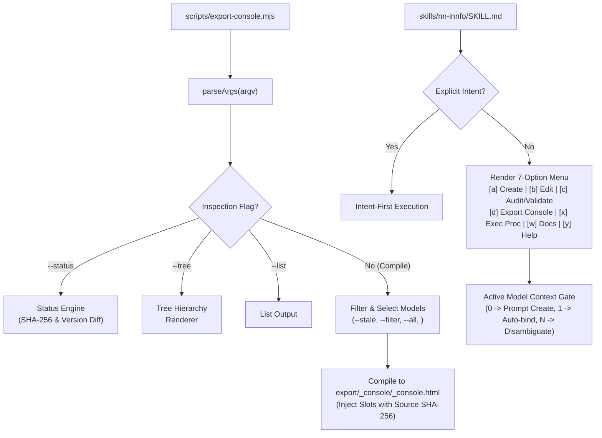

# Design: Console Export Status, Staleness Detection, and Skill Menu Alignment

## Context and Scope

This design unifies console artifact compilation, status inspection, skill menu routing, and manifest integrity across the cogNNitive repository. It addresses three interrelated domains:

1. **Console Export CLI (`scripts/export-console.mjs`)**: Enhancing the exporter with read-only inspection flags (`--status`, `--tree`), content hashing (SHA-256) for robust freshness/staleness detection, and selective compilation options (`--stale`, `--filter <pattern>`, `--all`).
2. **Skill Entry Menu Alignment (`skills/nn-innfo/SKILL.md`)**: Realigning the conversational entry point into a 7-option canonical structure (`[a]`, `[b]`, `[c]`, `[d]`, `[x]`, `[w]`, `[y]`), merging MCP validation with architecture audits under `[c]`, establishing dedicated console compilation under `[d]`, adding documentation browsing under `[w]`, and standardizing the Active Model Selection Gate.
3. **Manifest Governance & Cleanup (`manifest/source.yaml`, `docs/`)**: Removing the legacy unsupported `pdf-to-innfo-dashboard` workflow from source manifests and updating documentation references.

---

## Architectural Decisions



### D1 — SHA-256 Content Hashing for Console Freshness Detection

- **Context**: Relying purely on file modification timestamps (`mtime`) is brittle across git clones, CI checkouts, and cross-platform copy operations. Console artifacts need deterministic freshness validation against source models.
- **Decision**: 
  1. During compilation, compute the SHA-256 digest of the source model content (`utf-8`).
  2. Embed this digest into the `innfo-model` JSON payload within `model.meta.sha256` (alongside `model.meta.modelVersion` and `model.meta.generated`).
  3. When evaluating status (`--status` or `--stale`), inspect `export/<stem>_console/<stem>_console.html`:
     - If the HTML artifact does not exist: classify as `uncompiled`.
     - If the HTML artifact exists, extract the embedded JSON from `<script type="application/json" id="innfo-model">`:
       - If `meta.modelVersion` does not match the source model frontmatter `model_version`: classify as `version_mismatch`.
       - If `meta.sha256` matches the current source model's SHA-256 hash: classify as `fresh`.
       - If `meta.sha256` is missing or does not match: classify as `stale`.
- **Trade-offs**: Minimal parsing overhead during inspection (regex extract of JSON block vs full DOM parser), zero runtime dependencies.

### D2 — Non-Mutating CLI Inspection Modes (`--status`, `--tree`, `--list`)

- **Context**: Users and agent workflows require inspecting compilation readiness and structure without triggering writes to disk or altering export directories.
- **Decision**: CLI flags `--status`, `--tree`, and `--list` operate in read-only mode, bypassing HTML generation and file writes entirely, exiting cleanly with status code `0`.

### D3 — Selective Export Routing (`--stale`, `--filter`, `--all`, `<substring>`)

- **Context**: In workspaces with dozens of models, compiling everything on every change wastes I/O and CPU cycles.
- **Decision**:
  - `--stale`: Evaluates all Level 3 models and selects only those classified as `stale` or `uncompiled`. If all models are fresh, outputs an informational message and exits with 0 without compilation.
  - `--filter <pattern>`: Selects models whose stem name or relative path matches `<pattern>` (case-insensitive).
  - `--all`: Selects all discovered Level 3 models.
  - `<substring>`: Backward-compatible positional argument matching model names or paths.
  - If multiple selection criteria are provided, `--stale` filters the set of candidate models after any `--filter` or positional selection.

### D4 — Skill Entry Menu and Context Selection Gate Reorganization

- **Context**: `nn-innfo` previously separated syntactic MCP validation (`[c]`) from architectural consistency audits (`[d]`), lacked a direct console export entry point, and had no structured documentation browsing option.
- **Decision**:
  1. Reorganize into canonical 7 options:
     - `[a] (Recommended)` Create a new model (Conversational Wizard)
     - `[b]` Edit / extend an existing model (Conversational Wizard)
     - `[c]` Audit & validate model (MCP Syntax + Architecture Coherence)
     - `[d]` Export / update console artifacts (Workspace Consoles & Hub)
     - `[x]` Execute a model procedure — list procedures declared in the model and execute the chosen one
     - `[w]` View & consult documentation — browse iNNfo specs, primitives, and guides
     - `[y]` Cancel / help
  2. Enforce the Active Model Context Selection Gate for `[b]`, `[c]`, `[d]`, and `[x]`:
     - 0 models: Suggest creation (`[a]`).
     - 1 model: Auto-bind with informative grace: *"Vinculando `models/{ModelName}_NN.md` (único modelo detectado en el workspace)..."*
     - Multiple models: Disambiguation prompt with numbered selection.
  3. Option `[w]` routing: Read-only presentation of Level 1/2 specifications, primitives, matrices, markers, and authoring guidelines with zero workspace mutation.

### D5 — Manifest Catalog Governance & Decommissioning

- **Context**: The `pdf-to-innfo-dashboard` workflow is unmaintained and references deprecated PDF conversion pipelines.
- **Decision**:
  1. Remove `pdf-to-innfo-dashboard` from `manifest/source.yaml`.
  2. Remove references from `docs/use/manifest.md` and `docs/use/manifest-next.md`.
  3. Execute `npm run check:versions` to guarantee catalog synchronization and release parity.

---

## Detailed Specifications & Algorithms

### 1. Console Export CLI (`scripts/export-console.mjs`)

#### Argument Parsing Grammar

```text
Usage:
  node scripts/export-console.mjs <workspaceRoot> [options] [<ModelNameSubstring>]

Inspection Options (Read-Only):
  --status            Report compilation status (fresh, stale, uncompiled, mismatch)
  --tree              Display tree hierarchy of models and export artifacts
  --list              List discovered Level-3 models

Compilation Options:
  --all               Export all Level-3 models
  --stale             Export only stale or uncompiled models
  --filter <pattern>  Filter models matching name or relative path substring
  <substring>         Positional filter matching model name or path
```

#### Status Classification Algorithm

```js
import { createHash } from 'node:crypto';

function computeSha256(content) {
  return createHash('sha256').update(content, 'utf8').digest('hex');
}

function extractModelMetaFromHtml(htmlContent) {
  const match = htmlContent.match(
    /<script type="application\/json" id="innfo-model">([\s\S]*?)<\/script>/
  );
  if (!match) return null;
  try {
    const data = JSON.parse(match[1]);
    return data?.meta ?? null;
  } catch {
    return null;
  }
}

async function inspectModelStatus(model, rootDir) {
  const stem = model.name;
  const targetHtmlPath = join(rootDir, 'export', `${stem}_console`, `${stem}_console.html`);
  
  if (!existsSync(targetHtmlPath)) {
    return { status: 'uncompiled', targetHtmlPath };
  }
  
  let htmlContent;
  try {
    htmlContent = await readFile(targetHtmlPath, 'utf-8');
  } catch {
    return { status: 'stale', targetHtmlPath };
  }
  
  const embeddedMeta = extractModelMetaFromHtml(htmlContent);
  if (!embeddedMeta) {
    return { status: 'stale', targetHtmlPath };
  }
  
  const currentVersion = String(model.fm.model_version ?? 'V_0-1-0');
  if (embeddedMeta.modelVersion && embeddedMeta.modelVersion !== currentVersion) {
    return { status: 'version_mismatch', targetHtmlPath, embeddedMeta };
  }
  
  const currentSha256 = computeSha256(model.content);
  if (embeddedMeta.sha256 && embeddedMeta.sha256 === currentSha256) {
    return { status: 'fresh', targetHtmlPath, embeddedMeta };
  }
  
  return { status: 'stale', targetHtmlPath, embeddedMeta };
}
```

#### Tree Rendering Hierarchy Algorithm

The `--tree` command renders models grouped by their workspace relative directory, displaying their export target and status indicator:

```text
Workspace: . (3 Level-3 models)
├── models/
│   ├── business_V_0-2-5_NN.md [fresh]
│   │   └── export/business_V_0-2-5_console/business_V_0-2-5_console.html
│   └── procedures_V_0-1-0_NN.md [stale]
│       └── export/procedures_V_0-1-0_console/procedures_V_0-1-0_console.html
└── subdomains/
    └── metrics_V_0-1-0_NN.md [uncompiled]
```

### 2. `nn-innfo` Skill Menu & Action Routing

| Option | Label | Handler / Workflow | Context Gate |
| :--- | :--- | :--- | :--- |
| **`[a]`** | Create a new model (Conversational Wizard) | Phase A (App selection/customization) → Phase B (Model structure) | Optional (suggested if 0 models) |
| **`[b]`** | Edit / extend an existing model | Interactive element/concept editor, schema changes | Mandatory (`active_model_path`) |
| **`[c]`** | Audit & validate model | Syntactic MCP Validation (`innfo-mcp_validate_model`) + Architecture Assistant 4-layer review (Formal, Logical, Semantic, Solidity) | Mandatory (`active_model_path`) |
| **`[d]`** | Export / update console artifacts | Invokes `scripts/export-console.mjs` for active model or workspace | Mandatory (`active_model_path`) |
| **`[x]`** | Execute a model procedure | Lists and executes declared procedures in active model | Mandatory (`active_model_path`) |
| **`[w]`** | View & consult documentation | Read-only guide: L1/L2 specs, Primitives, Matrices, Markers | None (Read-only) |
| **`[y]`** | Cancel / help | General guidance and command overview | None |

---

## Test Strategy (Strict TDD)

A dedicated test suite [`scripts/export-console.test.mjs`](scripts/export-console.test.mjs) using Node native test runner (`node:test`, `node:assert/strict`) will cover:

1. **CLI Argument Parsing**:
   - Verification of `--status`, `--tree`, `--list`, `--all`, `--stale`, `--filter <pattern>`, and positional filters.
   - Validation of missing root argument exiting with status `2`.
2. **SHA-256 Hash Generation & Metadata Injection**:
   - Verifying that compiled HTML contains `meta.sha256` matching source model hash.
3. **Status Inspection (`--status`)**:
   - Accurate classification of `fresh`, `stale`, `uncompiled`, and `version_mismatch` states across fixtures in temporary test directories.
4. **Tree Rendering (`--tree`)**:
   - Accurate tree hierarchy formatting and clean exit code `0`.
5. **Selective Export (`--stale`, `--filter`)**:
   - Verifying that `--stale` skips fresh models and only compiles stale/uncompiled models.
   - Verifying `--filter` restricts compilation to matching paths/names.
6. **Manifest Validation**:
   - Verification that `manifest/source.yaml` passes `npm run check:versions` without `pdf-to-innfo-dashboard`.
