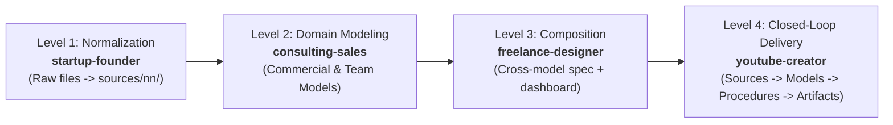

# Design: Canonical Workspace Transformation for Documentation Use Cases

## 1. Overview & Intent

This design formalizes the migration of the 4 documentation use case samples under `docs/samples/use-cases/` (`startup-founder`, `consulting-sales`, `freelance-designer`, `youtube-creator`) into full, self-contained, canonical Level 1–4 iNNfo workspaces.

The objective is to eliminate legacy path conventions (such as `export/`), isolate procedural models under `procedures/`, generate standardized root workspace manifests (`workspace_NN.md`) and catalog indexes (`sources_NN.md`, `procedures_NN.md`, `artifacts_NN.md`), and update all documentation and web application presets to ensure 100% path accuracy, spec compliance, and zero runtime diagnostics.

---

## 2. Architecture Decisions & Rationale

### ADR-1: Canonical Workspace Directory Topology & Manifest Anchoring
- **Context**: The documentation use cases were initially authored as lightweight sample folders with ad-hoc subdirectories, lacking root `workspace_NN.md` manifests.
- **Decision**: Every use case folder will be elevated to a self-contained canonical workspace anchored by `workspace_NN.md` conforming to the Level 2/3 Workspace specification (`workspace_spec_NN.md`).
- **Standard Layout**:
  ```text
  use-case-slug/
  ├── workspace_NN.md        # Root Workspace Manifest (Level 3)
  ├── sources_NN.md          # Primary Sources Catalog (Level 3 conforming to sources spec)
  ├── procedures_NN.md       # Operational Procedures Catalog (Level 3 conforming to procedures spec)
  ├── artifacts_NN.md        # Deliverable Artifacts Catalog (Level 3 conforming to artifacts spec)
  ├── models/                # Level 3 Domain Models (*_NN.md)
  ├── sources/
  │   ├── import/            # Raw multimodal evidence (.pdf, .docx, .xlsx, .pptx, .csv, raw .md)
  │   └── nn/                # Normalized, citation-ready iNNfo Markdown sources
  ├── procedures/            # Procedural workflows and pipelines (*_procedures_NN.md)
  └── artifacts/             # Generated deliverables, executive briefs, and dashboards
  ```
- **Consequences**: Enables the workspace recursive parser (`recursiveParse`), MCP server, and web editor to load and validate each use case as an independent, fully-functional workspace.

---

### ADR-2: Deliverables Standardization (`export/` -> `artifacts/`)
- **Context**: Legacy use cases stored deliverables in `export/`, whereas the unified iNNfo metamodel defines `# NN Artifacts` and `artifacts_spec_NN.md` as the standard output domain.
- **Decision**: Rename all `export/` directories across the 4 use cases to `artifacts/`. Delete legacy `export/` directories completely.
- **Rationale**:
  - `artifacts/` is the canonical terminology across iNNfo Level 1/2/3 specifications and tooling.
  - Eliminates dual-convention confusion across documentation and sample repositories.
- **Consequences**:
  - Internal relative links, documentation links in `docs/use-cases.md`, and interactive modal data in `docs/use-cases.html` must be updated atomically to reference `artifacts/`.

---

### ADR-3: Decoupling Procedural Models (`models/` -> `procedures/`)
- **Context**: In `youtube-creator`, `Episode_42_Production_V_1-0-0_procedures_NN.md` was stored inside `models/`.
- **Decision**: Relocate all procedural workflow definitions into `procedures/`. Specifically, `youtube-creator/models/Episode_42_Production_V_1-0-0_procedures_NN.md` moves to `youtube-creator/procedures/Episode_42_Production_V_1-0-0_procedures_NN.md`.
- **Rationale**:
  - Clear architectural separation of concerns: `models/` contains declarative domain models (entities, relationships, matrices), while `procedures/` contains operational transformation and production workflows.
  - Aligns with the workspace manifest schema where `# NN Models` points to domain representations and `# NN Procedures` points to operational workflows.
- **Consequences**:
  - Workspace manifests register procedures under `# NN Procedures`.
  - App presets (`workspaces.ts`) and modal file lists point to `procedures/`.

---

### ADR-4: Epistemic Maturity Mapping (Levels 1 to 4)
The 4 use cases progressively demonstrate the full spectrum of the cogNNitive Knowledge Evolution Framework:



1. **Level 1 (startup-founder)**: Ingestion of pitch decks (`.pptx`), interview notes (`.docx`), and discovery logs (`.md`) into normalized citation-ready `sources/nn/customer_discovery.md`.
2. **Level 2 (consulting-sales)**: Multi-model commercial governance combining `Fintech_RFP_Response` and `Consulting_Team_Matrix` citing RFP inputs and master rate cards.
3. **Level 3 (freelance-designer)**: Design token and website specification model driving an interactive HTML dashboard artifact for client sign-off.
4. **Level 4 (youtube-creator)**: Complete end-to-end loop: research sources -> script model -> production procedure -> multi-format deliverables (teleprompter cue sheet, B-roll shot list, bibliography).

---

### ADR-5: Catalog Index Declarations (`sources_NN.md`, `procedures_NN.md`, `artifacts_NN.md`)
- **Context**: Canonical workspaces require structured catalog index documents declaring constituent sources, procedures, and artifacts with PROV lineage metadata.
- **Decision**: Place lightweight Level 3 catalog manifests in each use case:
  - `sources_NN.md` conforms to `sources_spec_NN.md` listing all `sources/import/` and `sources/nn/` items with format and status.
  - `procedures_NN.md` conforms to `procedures_spec_NN.md` listing procedural models and transformation pipelines.
  - `artifacts_NN.md` conforms to `artifacts_spec_NN.md` listing deliverable outputs with derivation links.
- **Consequences**: Enables zero-I/O metadata indexing and instant multi-tree navigation.

---

## 3. Data Structures & File Layout

### 3.1 `startup-founder` (Level 1 Focus)
```text
docs/samples/use-cases/startup-founder/
├── workspace_NN.md
├── sources_NN.md
├── procedures_NN.md
├── artifacts_NN.md
├── models/
│   └── SaaS_Founder_V_1-0-0_business_NN.md
├── sources/
│   ├── import/
│   │   ├── customer_discovery.md
│   │   ├── founder_pitch_deck_v1.pptx
│   │   └── user_interviews_notes.docx
│   └── nn/
│       └── customer_discovery.md
└── artifacts/
    └── pitch_deck_summary.md
```

#### Manifest (`startup-founder/workspace_NN.md`)
```yaml
---
level: 3
parent_spec:
  name: "workspace"
  url: "https://raw.githubusercontent.com/cogNNitive/cogNNitive/main/iNNfo/specs/templates/workspace_spec_NN.md"
model_version: "V_1-0-0"
title: "SaaS Startup Founder Workspace"
---

> [!NOTE]
> This is an **iNNfo document** — a plain-text Markdown file. Open it with any text editor or view and edit it with [cogNNitive](https://cognnitive.com/innfo/app/).

# NN index

* [[Workspace]]
* [[Models]]
* [[Sources]]
* [[Procedures]]
* [[Artifacts]]
* [[Tags]]

# NN Workspace
models_dir:: models/
sources_dir:: sources/nn/
Early-stage SaaS startup workspace capturing customer discovery, problem-solution fit hypotheses, pricing tiers, and investor pitch deck materials.

# NN Models

## NN Models: SaaS Founder Business Model
path:: models/SaaS_Founder_V_1-0-0_business_NN.md
template:: business
status:: active
author:: Startup Founder

# NN Sources

## NN Sources: Sources Catalog
path:: sources_NN.md
template:: sources
status:: active

# NN Procedures

## NN Procedures: Procedures Catalog
path:: procedures_NN.md
template:: procedures
status:: active

# NN Artifacts

## NN Artifacts: Artifacts Catalog
path:: artifacts_NN.md
template:: artifacts
status:: active

# NN Tags

## NN Tags: strategy
color:: #3b82f6
icon:: target
description:: Business model, value propositions, and investor pitch.

## NN Tags: discovery
color:: #10b981
icon:: user-check
description:: Customer interviews and market validation notes.
```

---

### 3.2 `consulting-sales` (Level 2 Focus)
```text
docs/samples/use-cases/consulting-sales/
├── workspace_NN.md
├── sources_NN.md
├── procedures_NN.md
├── artifacts_NN.md
├── models/
│   ├── Consulting_Team_Matrix_V_1-0-0_organization_NN.md
│   └── Fintech_RFP_Response_V_1-0-0_commercial_NN.md
├── sources/
│   ├── import/
│   │   ├── enterprise_rfp_fintech.md
│   │   ├── enterprise_rfp_fintech.pdf
│   │   └── master_rate_card_2026.xlsx
│   └── nn/
│       ├── enterprise_rfp_fintech.md
│       ├── fintech_case_study.md
│       └── master_rate_card_2026.md
└── artifacts/
    ├── commercial_proposal_executive.md
    └── pricing_breakdown_sheet.md
```

---

### 3.3 `freelance-designer` (Level 3 Focus)
```text
docs/samples/use-cases/freelance-designer/
├── workspace_NN.md
├── sources_NN.md
├── procedures_NN.md
├── artifacts_NN.md
├── models/
│   └── Client_Website_V_1-0-0_site_spec_NN.md
├── sources/
│   ├── import/
│   │   ├── brand_style_guide.pdf
│   │   ├── client_kickoff_brief.docx
│   │   └── client_kickoff_brief.md
│   └── nn/
│       ├── brand_style_guide.md
│       └── client_kickoff_brief.md
└── artifacts/
    └── interactive_spec_dashboard.html
```

---

### 3.4 `youtube-creator` (Level 4 Focus)
```text
docs/samples/use-cases/youtube-creator/
├── workspace_NN.md
├── sources_NN.md
├── procedures_NN.md
├── artifacts_NN.md
├── models/
│   └── Episode_42_Battery_Tech_V_1-0-0_video_script_NN.md
├── procedures/
│   └── Episode_42_Production_V_1-0-0_procedures_NN.md
├── sources/
│   ├── import/
│   │   ├── audience_feedback_episode_41.md
│   │   ├── battery_thermal_research_2026.md
│   │   ├── battery_thermal_research_2026.pdf
│   │   └── benchmark_metrics_raw.csv
│   └── nn/
│       ├── audience_feedback_episode_41.md
│       ├── audience_survey_data.csv
│       ├── battery_thermal_research_2026.md
│       └── competitor_benchmark_transcript.md
└── artifacts/
    ├── broll_shooting_checklist.md
    ├── production_teleprompter_cue_sheet.md
    └── youtube_description_bibliography.md
```

---

## 4. Documentation & App Integration Design

### 4.1 Documentation Quick Actions (`docs/use-cases.md`)
Update all Quick Action links in `docs/use-cases.md`:
- `startup-founder`: `[📊 View Deliverable](samples/use-cases/startup-founder/artifacts/pitch_deck_summary.md)`
- `consulting-sales`: `[📊 View Deliverable](samples/use-cases/consulting-sales/artifacts/commercial_proposal_executive.md)`
- `freelance-designer`: `[📊 View Deliverable](samples/use-cases/freelance-designer/artifacts/interactive_spec_dashboard.html)`
- `youtube-creator`: `[📊 View Deliverable](samples/use-cases/youtube-creator/artifacts/production_teleprompter_cue_sheet.md)`

### 4.2 Interactive Explorer Modal (`docs/use-cases.html`)
1. **Modal Tabs**: Replace legacy `export` filter tab with `artifacts` and add `procedures`:
   ```html
   <button class="modal-tab" onclick="filterModalTab('sources-import', this)">Sources: Import (.docx, .pptx, .pdf)</button>
   <button class="modal-tab" onclick="filterModalTab('sources-nn', this)">Sources: Normalized (.md)</button>
   <button class="modal-tab" onclick="filterModalTab('models', this)">Models (_NN.md)</button>
   <button class="modal-tab" onclick="filterModalTab('procedures', this)">Procedures (_NN.md)</button>
   <button class="modal-tab" onclick="filterModalTab('artifacts', this)">Deliverables & Artifacts</button>
   ```
2. **`WORKSPACE_DATA` Object**: Update file lists across all 4 use cases:
   - Include `workspace_NN.md`, `sources_NN.md`, `procedures_NN.md`, `artifacts_NN.md`.
   - Update file names from `export/*` to `artifacts/*` with category `'artifacts'`.
   - Update `youtube-creator` procedure to `procedures/Episode_42_Production_V_1-0-0_procedures_NN.md` with category `'procedures'`.
3. **Card Buttons**: Update all "View Deliverable" buttons to point to `artifacts/*`.

### 4.3 Monorepo Use Cases Catalog (`workspace_NN/models/UseCases_Catalog_V_1-0-0_use-cases_NN.md`)
Verify that all `model_ref` entries continue to point accurately to active model files in `models/` without broken paths.

### 4.4 Web Application Presets (`iNNfo/apps/innfo-editor/src/config/workspaces.ts`)
Update the `youtube-creator` preset in `WORKSPACE_PRESETS` to reference the canonical relocated procedure path:
```typescript
'youtube-creator': {
  slug: 'youtube-creator',
  name: 'YouTube Content Creator',
  description: 'Battery tech episode script and studio production procedures.',
  modelUrls: [
    `${RAW_GITHUB_BASE}/docs/samples/use-cases/youtube-creator/models/Episode_42_Battery_Tech_V_1-0-0_video_script_NN.md`,
    `${RAW_GITHUB_BASE}/docs/samples/use-cases/youtube-creator/procedures/Episode_42_Production_V_1-0-0_procedures_NN.md`,
  ],
  templateName: 'procedures',
}
```

---

## 5. Verification & Testing Strategy

### 5.1 Spec Compliance & URL Integrity
- Run `npm run check:specs` to verify all parent spec URLs and raw GitHub URLs resolve cleanly without legacy namespace errors.

### 5.2 Workspace Parser Automated Tests
- Create or update workspace integration tests in `iNNfo/packages/innfo-core/tests/` (or extend `shipped-workspace.test.ts` / add sample use case test suite) to assert that:
  1. Each of the 4 use cases parses successfully via `recursiveParse`.
  2. Zero actionable warnings or errors are raised.
  3. Every citation in `models/` and `procedures/` resolves to existing files under `sources/nn/` or `sources/import/`.
  4. Every declared artifact in `artifacts_NN.md` and `workspace_NN.md` exists on disk under `artifacts/`.
  5. No slug collisions exist within any use case model.

### 5.3 Static Linting & Typecheck
- Execute `npm run lint` and `npm run typecheck` across all workspaces to guarantee zero linting or compilation regressions.

### 5.4 Manual Explorer Verification
- Open `docs/use-cases.html` in a browser, trigger the workspace explorer modal for all 4 archetypes, and verify tab filtering, file counters, icon badges, and deep links.
