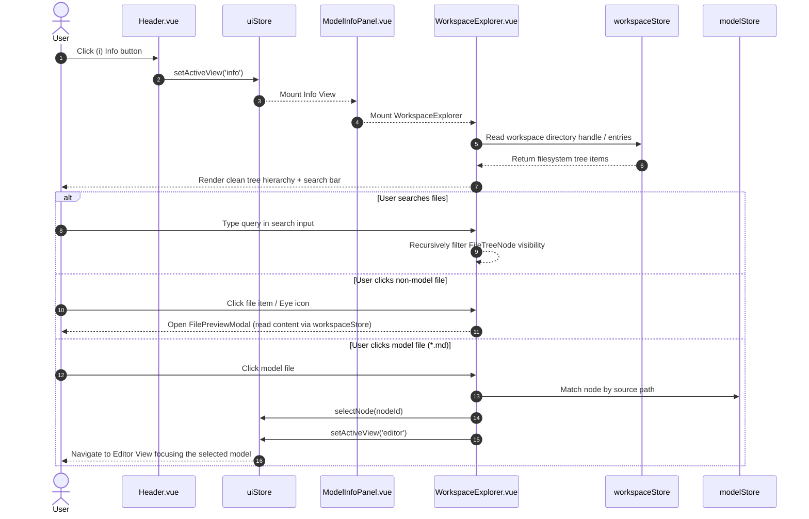

# Technical Design: Relocate Workspace Explorer to Info View

## 1. Executive Summary & Context

The iNNfo editor currently hosts two distinct navigation paradigms in the primary [`LeftSidebar.vue`](iNNfo/apps/innfo-editor/src/components/layout/LeftSidebar.vue):
1. **Semantic Model Navigation**: Concept trees, metamodel groups, model nodes, matrices, and consoles.
2. **Physical Filesystem Tree**: An "Explorer" tab rendering [`WorkspaceExplorer.vue`](iNNfo/apps/innfo-editor/src/components/layout/WorkspaceExplorer.vue), showing raw directory structures alongside a 4-button category filter bar (`All`, `Models`, `Sources`, `Artifacts`).

This dual role overcomplicates the left sidebar, which is optimized for in-model semantic navigation and fast concept browsing. Meanwhile, the Workspace Info view (accessible via the Header `(i)` button, rendered by [`ModelInfoPanel.vue`](iNNfo/apps/innfo-editor/src/components/editor/ModelInfoPanel.vue)) is designed specifically for workspace overview, directory details, metamodel metadata, and version management.

This change executes two core design adjustments:
1. **Dedicating Left Sidebar Exclusively to Semantic Navigation**: Remove the `explorer` switcher button and file tree rendering from `LeftSidebar.vue`. The sidebar switcher presents only semantic view modes: `editor`, `graph`, and `consoles`.
2. **Relocating and Streamlining File Explorer in Info View**: Embed `WorkspaceExplorer.vue` into `ModelInfoPanel.vue` under the "Workspace Directory" section. Strip the category filter chips from `WorkspaceExplorer.vue`, presenting a clean, direct filesystem hierarchy with real-time filename search, directory expand/collapse, file preview modal inspection, and click-to-edit model navigation.

---

## 2. Architectural Decisions

### AD-1: Dedicated Semantic Navigation in LeftSidebar
* **Decision**: Remove the `explorer` switcher button and `<WorkspaceExplorer />` conditional mount from [`LeftSidebar.vue`](iNNfo/apps/innfo-editor/src/components/layout/LeftSidebar.vue).
* **Rationale**: The LeftSidebar is the primary workspace workbench for domain modeling. Mixing filesystem browsing with domain metamodel trees adds visual noise and forces frequent mode-switching. Removing the filesystem tab isolates domain navigation to `editor` (concept tree), `graph` (visual topology), and `consoles` (hub / execution).

### AD-2: Embedding WorkspaceExplorer in Info View (ModelInfoPanel)
* **Decision**: Embed [`WorkspaceExplorer.vue`](iNNfo/apps/innfo-editor/src/components/layout/WorkspaceExplorer.vue) within [`ModelInfoPanel.vue`](iNNfo/apps/innfo-editor/src/components/editor/ModelInfoPanel.vue) in the "Workspace Directory" column.
* **Rationale**: When users click the Header `(i)` Info button, their intent is to inspect workspace context, connected file paths, metamodel definitions, and physical files. Embedding the file tree directly alongside directory status provides a unified workspace management console.

### AD-3: Removal of Category Filter Chips
* **Decision**: Remove the category filter chips bar (`All`, `Models`, `Sources`, `Artifacts`) from `WorkspaceExplorer.vue` and simplify [`FileTreeNode.vue`](iNNfo/apps/innfo-editor/src/components/layout/FileTreeNode.vue).
* **Rationale**: Real-world directory structures are already naturally partitioned into folders (e.g., `specs/`, `models/`, `artifacts/`). Filtering files by artificial category buttons fragmented tree hierarchies and caused confusion when ancestor directories were hidden. Retaining full-hierarchy tree navigation combined with instantaneous filename substring search provides superior ergonomics and zero visual clutter.

### AD-4: uiStore State Streamlining
* **Decision**: Deprecate `explorerFilterMode` and `setExplorerFilterMode` in [`uiStore.ts`](iNNfo/apps/innfo-editor/src/stores/uiStore.ts).
* **Rationale**: Filtering state is no longer global or persisted across category chips. Local component search state inside `WorkspaceExplorer.vue` handles filename filtering directly.

---

## 3. Component Architecture & Layout Changes

### 3.1 Component Hierarchy Before & After

```
BEFORE:
WorkspaceView.vue
├── Header.vue [(i) -> activeView = 'info']
└── LeftSidebar.vue
    ├── Navigation Switcher [Explorer | Editor | Graph | Consoles]
    ├── WorkspaceExplorer.vue (when activeView === 'explorer')
    │   ├── Filter Chips [All | Models | Sources | Artifacts]
    │   ├── Search Input
    │   └── FileTreeNode.vue (filtered by mode + query)
    └── Semantic Tree (when activeView !== 'explorer')

AFTER:
WorkspaceView.vue
├── Header.vue [(i) -> activeView = 'info']
├── LeftSidebar.vue
│   ├── Navigation Switcher [Editor | Graph | Consoles]
│   └── Semantic Tree (always rendered in editor mode)
└── Main Content Area (activeView === 'info')
    └── ModelInfoPanel.vue
        ├── Workspace Directory Card
        │   ├── Directory Handle & Status
        │   └── WorkspaceExplorer.vue
        │       ├── Search Input
        │       ├── Refresh Action
        │       └── FileTreeNode.vue (clean hierarchy + search)
        └── File & Metamodel Details Card
```

---

## 4. Component Modifications Detail

### 4.1 [`LeftSidebar.vue`](iNNfo/apps/innfo-editor/src/components/layout/LeftSidebar.vue)
1. **Navigation Switcher**:
   - Remove the `button[data-testid="view-switcher-explorer"]`.
   - Retain only `editor`, `graph`, and `consoles` switcher buttons.
2. **Template Simplification**:
   - Remove `<WorkspaceExplorer v-if="uiStore.activeView === 'explorer'" />`.
   - Remove `v-if="uiStore.activeView !== 'explorer'"` conditions guarding the workspace overview metrics panel and the model tree section.
3. **Script Cleanup**:
   - Remove `import WorkspaceExplorer from './WorkspaceExplorer.vue'`.
   - Remove `FolderTree` from `lucide-vue-next` imports if unreferenced.

### 4.2 [`ModelInfoPanel.vue`](iNNfo/apps/innfo-editor/src/components/editor/ModelInfoPanel.vue)
1. **Workspace Directory Section Integration**:
   - In the left column ("Workspace Directory"), embed `<WorkspaceExplorer />` in an interactive container beneath the directory status and summary metrics.
   - Constrain explorer height (e.g. `max-h-96` or scrollable flex container) with styled borders and subtle scrollbars matching the Info panel aesthetics.
2. **Script Import**:
   - Import `WorkspaceExplorer from '../layout/WorkspaceExplorer.vue'`.

### 4.3 [`WorkspaceExplorer.vue`](iNNfo/apps/innfo-editor/src/components/layout/WorkspaceExplorer.vue)
1. **Template**:
   - Remove the category filter chips container:
     ```html
     <!-- REMOVED -->
     <div class="flex items-center gap-1 p-1 rounded-lg bg-slate-100 dark:bg-slate-800/80 text-2xs">
       <button v-for="mode in filterOptions" ...>...</button>
     </div>
     ```
   - Keep Header with `FolderTree` icon, "Explorer" title, and `refreshTree` button.
   - Keep Search Input with clear button (`X`).
   - Retain `FileTreeNode` rendering:
     ```html
     <FileTreeNode
       v-for="item in treeItems"
       :key="item.path"
       :item="item"
       :search-query="searchQuery"
       @select-file="handleSelectFile"
       @view-file="handleViewFile"
       @download-file="handleDownloadFile"
     />
     ```
   - Keep `FilePreviewModal` integration for inspecting file contents.
2. **Script**:
   - Remove `filterOptions`, `setFilter`, and references to `uiStore.explorerFilterMode`.
   - Maintain `buildTreeFromHandle`, `buildVirtualTree`, `refreshTree`, `handleViewFile`, `handleDownloadFile`, and `handleSelectFile`.
   - `handleSelectFile(item)`: If the file matches a model node in `modelStore.nodes`, select the node via `uiStore.selectNode(matchingNode.id)` and set `uiStore.setActiveView('editor')` to navigate directly to the editor workbench. Otherwise, open `FilePreviewModal`.

### 4.4 [`FileTreeNode.vue`](iNNfo/apps/innfo-editor/src/components/layout/FileTreeNode.vue)
1. **Props**:
   - Remove `filterMode` prop requirement (or default it to `'all'`).
2. **Filtering Logic**:
   - Simplify `hasMatchingSubtree` to evaluate pure hierarchy search matching against `props.searchQuery`.
   - Preserve rich identity pills for classified files (`model` -> indigo pill with sparkles, `artifact` -> dark pill with file-output, `source` -> slate pill with file-code, plain file -> text icon).
3. **Recursive Children**:
   - Pass `:search-query="searchQuery"` recursively to child nodes without `filterMode`.

### 4.5 [`uiStore.ts`](iNNfo/apps/innfo-editor/src/stores/uiStore.ts)
1. Clean up unused `explorerFilterMode` state, `ExplorerFilterMode` type, and `setExplorerFilterMode` action.
2. Maintain `activeView` type definition compatibility (`'info'`, `'editor'`, `'graph'`, `'consoles'`, etc.).

---

## 5. Data Flow & Interaction



---

## 6. Test Strategy

### 6.1 Unit & Composable Tests
- **`useViewSync.test.ts`**: Verify routing between `editor`, `graph`, `info`, and `consoles` preserves view parameters.
- **`explorerClassify.test.ts`**: Ensure file classification (`classifyExplorerItem`) accurately tags models, artifacts, and sources.

### 6.2 Component Tests
- **`LeftSidebar-navigation.test.ts`** (Update / New):
  - Assert that `LeftSidebar.vue` renders buttons for `editor`, `graph`, and `consoles`.
  - Assert that `[data-testid="view-switcher-explorer"]` is **NOT** present.
  - Assert that LeftSidebar exclusively displays semantic concept and model trees in editor view.
- **`WorkspaceExplorer.test.ts`** (New / Update):
  - Verify filesystem tree renders properly from a mocked directory handle and virtual tree fallback.
  - Verify category filter buttons (models, sources, artifacts) do not exist in the DOM.
  - Verify search query dynamically filters the tree.
  - Verify clicking a model file selects the node and switches `uiStore.activeView` to `'editor'`.
  - Verify clicking a non-model file opens `FilePreviewModal`.
- **`ModelInfoPanel.test.ts`**:
  - Verify `WorkspaceExplorer` renders within the "Workspace Directory" section when viewing model info.

---

## 7. Migration & Rollback Plan

1. **Step-by-step Execution**:
   - Clean up `LeftSidebar.vue` switcher tabs and template structure.
   - Refactor `WorkspaceExplorer.vue` and `FileTreeNode.vue` to remove filter chips.
   - Mount `WorkspaceExplorer.vue` inside `ModelInfoPanel.vue`.
   - Update `uiStore.ts`.
   - Update and add comprehensive Vitest component tests.
2. **Rollback**:
   - Changes are self-contained within frontend UI components. Rollback is a standard git revert of the branch commit.
