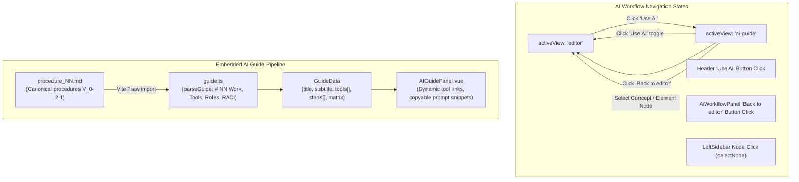
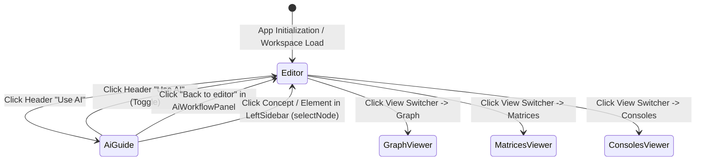

# Design: Multi-Agent Guidance and AI Workflow Navigation

## 1. Technical Approach & Architecture Overview

This change modernizes the AI workflow experience in `innfo-editor` and across the cogNNitive ecosystem along two axes:
1. **Fluid AI Workflow Navigation**: Resolves navigation lock-in when viewing the AI Guide (`activeView === 'ai-guide'`) by introducing multiple natural exit vectors: an explicit "Back to editor" button in the panel header, an active toggle state on the Header "Use AI" button, and automatic view reset to `'editor'` when selecting any concept or element in the `LeftSidebar` tree.
2. **Canonical Multi-Agent Guidance**: Upgrades the embedded guide model (`procedure_NN.md`) to the canonical `procedures` `V_0-2-1` specification, hardens the parser (`guide.ts`) to support modern `# NN` syntax and multi-tool definitions, and updates documentation to embrace universal AI coding agent compatibility (Antigravity, Claude Code, Codex, OpenCode Desktop, Cursor) with OpenCode Desktop featured as the reference desktop client.



---

## 2. Architecture Decisions

### Decision 1: Navigation State Reset on Node Selection vs Explicit Close

- **Choice**: Implement **both** automatic view transition in `uiStore.selectNode()` and explicit dismiss/toggle controls in `AiWorkflowPanel.vue` and `Header.vue`.
- **Alternatives Considered**:
  - *Option A: Purely explicit modal/panel dismissal*: Keep `activeView = 'ai-guide'` until the user explicitly clicks a close button or toggles the header button.
    *Drawback*: Frustrating user experience when clicking items in the left sidebar tree expecting to view them in the editor, resulting in unresponsive-feeling tree clicks.
  - *Option B: Overlay modal instead of main view router*: Render AI Guide as a popup modal (`showAiModal = true`) on top of the editor.
    *Drawback*: Modal overlays constrain vertical and horizontal reading space, disrupt side-by-side reference workflows, and diverge from the existing tabbed view architecture (`activeView`).
- **Rationale**: The sidebar tree represents the primary workspace content navigation. Selecting a node signifies an unambiguous user intent to inspect or edit that node. Resetting `activeView = 'editor'` upon `selectNode(id)` mirrors the behavior of validation error dismissals, ensuring the user immediately lands on their chosen entity while keeping dedicated header/panel back controls available.

---

### Decision 2: Canonical Procedure Template V_0-2-1 Format for AI Guide vs Custom JSON / Hardcoded Text

- **Choice**: Align `procedure_NN.md` directly with the canonical `procedures` template `V_0-2-1` (`# NN index`, `* [[Work]]`, `## NN Work: ...`, `# NN matrices`).
- **Alternatives Considered**:
  - *Option A: Static JSON or TypeScript data structure*: Embed guide steps as hardcoded objects in `guide.ts`.
    *Drawback*: Destroys the self-describing, dogfooding principle of cogNNitive where the system models its own workflows using standard iNNfo markdown files.
  - *Option B: Legacy `_NN` syntax with informal YAML blocks*: Keep `spec_version: "V_0-2-1"` with obsolete `* _NN Work:` syntax.
    *Drawback*: Generates validation warnings, confuses developers inspecting the codebase, and hinders automated template validation.
- **Rationale**: Maintaining the embedded guide as a valid Level 3 canonical procedure model provides zero-cost dogfooding, ensures the embedded guide can be opened and validated in the editor itself, and verifies that the `procedures` template cleanly expresses interactive software workflows.

---

### Decision 3: Universal Agent Support Framing with OpenCode as Recommended Reference Client

- **Choice**: Frame cogNNitive and iNNfo as universally compatible with any modern AI coding agent supporting skills or MCP (e.g. Antigravity, Claude Code, Codex, OpenCode, Cursor), while explicitly positioning OpenCode Desktop as the recommended reference client for turnkey local execution.
- **Alternatives Considered**:
  - *Option A: Exclusive OpenCode single-agent positioning*: Maintain phrasing describing OpenCode as "the supported AI agent".
    *Drawback*: Artificially restricts user adoption, ignores other widely used AI coding environments, and contradicts the open protocol design of MCP and actioNN skills.
  - *Option B: Generic agent-only framing without reference client*: Remove all specific mentions of OpenCode and refer only to abstract agents.
    *Drawback*: Leaves new users without an actionable, opinionated getting-started path or single-click desktop installation guide.
- **Rationale**: Openness is a core architectural value of cogNNitive. Demonstrating interoperability across agents while providing a friction-free reference client (OpenCode Desktop) gives users clarity on both the broad ecosystem vision and immediate setup instructions.

---

## 3. Detailed Component Changes

### 3.1 `AiWorkflowPanel.vue`
[file:///d:/Users/lucas/Documents/GitHub/cogNNitive/iNNfo/apps/innfo-editor/src/components/editor/AiWorkflowPanel.vue](file:///d:/Users/lucas/Documents/GitHub/cogNNitive/iNNfo/apps/innfo-editor/src/components/editor/AiWorkflowPanel.vue)

- **Header Dismiss Action**:
  - Add an action button in the panel header on the right side:
    ```html
    <button
      @click="uiStore.setActiveView('editor')"
      class="inline-flex items-center gap-1.5 px-3 py-1.5 text-xs font-medium text-slate-600 dark:text-slate-300 hover:text-slate-900 dark:hover:text-white bg-slate-100 dark:bg-slate-800 hover:bg-slate-200 dark:hover:bg-slate-700 rounded-lg transition-colors cursor-pointer"
      title="Return to model editor"
      data-testid="ai-workflow-close-button"
    >
      <ArrowLeft class="w-3.5 h-3.5" />
      <span>Back to editor</span>
    </button>
    ```
- **Imports**: Import `ArrowLeft` from `lucide-vue-next` and `useUiStore` from `../../stores/uiStore`.

---

### 3.2 `uiStore.ts`
[file:///d:/Users/lucas/Documents/GitHub/cogNNitive/iNNfo/apps/innfo-editor/src/stores/uiStore.ts](file:///d:/Users/lucas/Documents/GitHub/cogNNitive/iNNfo/apps/innfo-editor/src/stores/uiStore.ts)

- **`selectNode(id: string | null)` Update**:
  - When `selectNode` is invoked and `activeView.value === 'ai-guide'`, transition `activeView.value = 'editor'`.
  - Retain `showValidationReport.value = false`.
  ```typescript
  function selectNode(id: string | null): void {
    selectedNodeId.value = id
    showValidationReport.value = false
    if (activeView.value === 'ai-guide') {
      activeView.value = 'editor'
    }
  }
  ```

---

### 3.3 `Header.vue`
[file:///d:/Users/lucas/Documents/GitHub/cogNNitive/iNNfo/apps/innfo-editor/src/components/layout/Header.vue](file:///d:/Users/lucas/Documents/GitHub/cogNNitive/iNNfo/apps/innfo-editor/src/components/layout/Header.vue)

- **"Use AI" Button Toggle Handler**:
  - Replace direct `@click="uiStore.setActiveView('ai-guide')"` with a toggle handler:
  ```html
  <button
    @click="toggleAiGuideView"
    class="inline-flex items-center gap-1.5 rounded-md px-3 py-1.5 text-xs font-semibold ring-1 ring-inset transition-all cursor-pointer"
    :class="
      uiStore.activeView === 'ai-guide'
        ? 'bg-purple-100 dark:bg-purple-950/60 text-purple-700 dark:text-purple-300 ring-purple-500 shadow-xs'
        : 'bg-white dark:bg-slate-800 text-purple-600 dark:text-purple-400 ring-purple-300 dark:ring-purple-700/50 hover:bg-purple-50 dark:hover:bg-purple-950/30'
    "
    :title="uiStore.activeView === 'ai-guide' ? 'Exit AI Guide and return to Editor' : 'Use AI to edit models'"
    data-testid="header-use-ai-button"
  >
    <Sparkles class="w-3.5 h-3.5" />
    <span>Use AI</span>
  </button>
  ```
  - In `<script setup>`:
  ```typescript
  function toggleAiGuideView(): void {
    if (uiStore.activeView === 'ai-guide') {
      uiStore.setActiveView('editor')
    } else {
      uiStore.setActiveView('ai-guide')
    }
  }
  ```

---

### 3.4 `procedure_NN.md`
[file:///d:/Users/lucas/Documents/GitHub/cogNNitive/iNNfo/apps/innfo-editor/src/ai-guide/procedure_NN.md](file:///d:/Users/lucas/Documents/GitHub/cogNNitive/iNNfo/apps/innfo-editor/src/ai-guide/procedure_NN.md)

- **Frontmatter**:
  ```yaml
  ---
  spec_version: "V_0-2-1"
  spec_url: "https://raw.githubusercontent.com/cogNNitive/cogNNitive/main/iNNfo/specs/iNNfo_V_0-2-1_NN.md"
  level: 3
  parent_spec:
    name: "procedures"
    url: "https://raw.githubusercontent.com/cogNNitive/cogNNitive/main/iNNfo/specs/templates/procedures/spec_NN.md"
  template_version: "V_0-2-1"
  model_version: "V_0-1-0"
  title: "Use iNNfo with AI"
  ---
  ```
- **Index & Concepts**:
  - Replace `# _NN index` with `# NN index` and wikilinks (`* [[Work]]`, `* [[Roles]]`, `* [[Artifact]]`, `* [[Tools]]`).
  - Upgrade concept sections to `# NN Work`, `# NN Roles`, `# NN Artifact`, `# NN Tools`, and `# NN matrices: work-roles matrix`.
  - Use canonical `## NN Work: <Name>` element definitions with field notation (`parent::`, `step_type::`, `tool::`, `input::`, `output::`).
- **Universal Multi-Agent Content**:
  - Highlight compatibility with any modern AI agent (Antigravity, Claude Code, Codex, OpenCode Desktop, Cursor).
  - List OpenCode Desktop as the recommended reference desktop client alongside terminal and IDE agent alternatives.

---

### 3.5 `guide.ts`
[file:///d:/Users/lucas/Documents/GitHub/cogNNitive/iNNfo/apps/innfo-editor/src/ai-guide/guide.ts](file:///d:/Users/lucas/Documents/GitHub/cogNNitive/iNNfo/apps/innfo-editor/src/ai-guide/guide.ts)

- **Heading & Pattern Matching**:
  - Support both modern `# NN` and `# _NN` prefix conventions:
    - Work: `/^(?:##|\*)\s+_?NN\s+Work:\s*(.+)$/i`
    - Tools: `/^(?:##|\*)\s+_?NN\s+Tools:\s*(.+)$/i`
    - Roles: `/^(?:##|\*)\s+_?NN\s+Roles:\s*(.+)$/i`
    - Matrices: `/^#*\s*_?NN\s+matrices:\s*(.+)$/i`
- **Field & Metadata Parsing**:
  - Support both inline `field:: value` blocks and fenced ````yaml```` codeblocks.
  - Dynamically extract `Download: <url>` or URL links for tool entries.
- **Dynamic Title & Subtitle**:
  - Set default subtitle to `"Edit your iNNfo models using your preferred AI coding agent"`.
  - Extract prompt snippets for `innfo:` commands.

---

### 3.6 Documentation Files
- **`docs/innfo/index.md`**: Update descriptions from single-agent phrasing to `"Model, edit, and query knowledge visually in your browser or conversationally with your AI coding agent of choice (OpenCode Desktop, Claude Code, Antigravity, Cursor)"`.
- **`docs/use/index.html`**: Clarify that the bootstrap command `I want to use https://cognnitive.com/use` can be pasted into OpenCode Desktop (recommended reference client) or executed in any compatible agent environment.

---

### 3.7 Test Files
- **`iNNfo/apps/innfo-editor/tests/unit/guide.test.ts`**:
  - Verify that `parseGuide` correctly parses the updated `procedure_NN.md`.
  - Verify that tool entries (including OpenCode Desktop) have valid URLs and initials.
  - Verify all extracted prompt snippets begin with `innfo:` and include proper skill activation syntax (`nn-innfo`).

---

## 4. Data Flow & Navigation State Machine



1. **AI Guide Activation**:
   - User clicks `Header.vue` "Use AI" button.
   - `uiStore.setActiveView('ai-guide')` renders `AiWorkflowPanel.vue` containing `AIGuidePanel.vue`.
   - The button highlights in purple to indicate active guide mode.

2. **AI Guide Deactivation**:
   - **Vector A**: User clicks the "Back to editor" button in `AiWorkflowPanel.vue` header -> `uiStore.setActiveView('editor')`.
   - **Vector B**: User clicks the "Use AI" button in `Header.vue` again -> `uiStore.setActiveView('editor')`.
   - **Vector C**: User clicks any tree node in `LeftSidebar.vue` -> triggers `uiStore.selectNode(nodeId)` -> automatically sets `activeView = 'editor'` and displays the clicked node.

---

## 5. Risk Analysis & Mitigation

| Risk | Impact | Likelihood | Mitigation |
| :--- | :--- | :--- | :--- |
| **Parser Regressions**: Stricter parsing in `guide.ts` fails to extract steps or matrix rows from modified `procedure_NN.md`. | High | Low | Implement flexible regex patterns matching both `## NN <Concept>:` and `* _NN <Concept>:` and validate against unit test suite in `guide.test.ts`. |
| **Unintended View Transitions**: Background node selection events inadvertently kick user out of AI Guide. | Medium | Low | View reset is confined strictly to user-initiated `selectNode()` calls triggered by left sidebar tree node clicks. |
| **Broken Documentation Links**: External links to tools or documentation become outdated. | Low | Low | Point to official canonical URLs (`https://opencode.ai/download`, `https://cognnitive.com/use`) and run link checking in CI. |

---

## 6. Rollback Plan

If regressions occur in navigation or guide parsing:
1. Revert `uiStore.ts`, `Header.vue`, and `AiWorkflowPanel.vue` to their previous commits to restore single-direction navigation.
2. Revert `procedure_NN.md` and `guide.ts` to their previous revisions.
3. Run `npm test` and Vitest suites across workspaces to verify clean state restoration.
