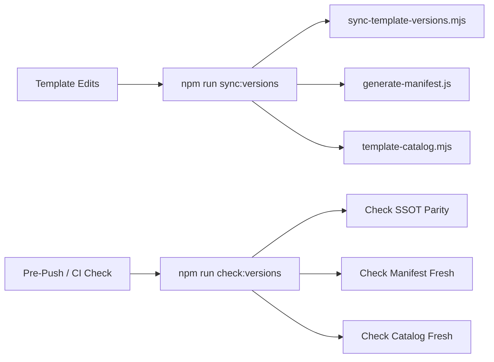

# Technical Design: Dev Process and Tooling Gaps

## 1. Technical Approach

This change resolves developer process and tooling gaps by wiring existing verification and sync mechanisms to their exact invocation points and correcting stale documentation in maintainer skills. Changes are partitioned into:
- **Partition A (Repository Scope)**: In-repo scripts, configs, and skills subject to CI verification.
- **Partition B (Global Agent Scope)**: External user configurations requiring interactive per-slice confirmation and hand application.

---

## 2. Architecture & Design Decisions

### Decision 1 (A1): Complete Artifact Coverage in Version Scripts
- **Choice**: Append `node scripts/template-catalog.mjs` to `sync:versions` and `node scripts/template-catalog.mjs --check` to `check:versions` in root [`package.json`](file:///d:/Users/lucas/Documents/GitHub/cogNNitive/package.json).
- **Alternatives considered**: Add dedicated standalone script (`npm run sync:catalog`).
- **Rationale**: Adding separate commands creates an extra manual step. Chaining into existing scripts ensures all three generated artifacts (`samples.ts`, `manifest/source.yaml`, `catalog.json`) are updated and verified atomically in one call.

### Decision 2 (A2): Pre-Push Hook Boundary
- **Choice**: Retain `.githooks/pre-push` running only `npm run typecheck` (~25s); make no hook changes.
- **Alternatives considered**: Invoke `node scripts/verify.js` or `npm run verify` inside pre-push hook.
- **Rationale**: Full verification suites take >90s. Heavy hooks induce habitual `--no-verify` usage, disarming repository guardrails. A1 eliminates the root cause of stale catalog pushes by making `sync:versions` complete.

### Decision 3 (A3): Version-Agnostic Ignore Rules
- **Choice**: Enforce shape-based, version-agnostic ignore rules in [`.gitignore`](file:///d:/Users/lucas/Documents/GitHub/cogNNitive/.gitignore) via time-boxed, evidence-gated pass.
- **Alternatives considered**: Add automated CI linter for `.gitignore`.
- **Rationale**: Automated linters add maintenance overhead and false positives. An evidence-gated audit preserves legitimate version pins (e.g., immutability guards) while preventing cache drift.

### Decision 4 (A4): Factual Procedure Correction in Maintainer Skills
- **Choice**: Correct [`.agents/skills/nn-dev-development/SKILL.md`](file:///d:/Users/lucas/Documents/GitHub/cogNNitive/.agents/skills/nn-dev-development/SKILL.md) §4e step 1 to cite `node scripts/verify.js` or `npm run check:versions` for catalog staleness, and update §4b to mandate `origin/main..origin/dev` tracking and the template coherence check command.
- **Alternatives considered**: Retain advisory text pointing to `scripts/check-integrity.js`.
- **Rationale**: `scripts/check-integrity.js` contains no direct catalog checking logic; `scripts/verify.js:215` executes the catalog guard. Pointing operators to the wrong script creates false assurance.

### Decision 5: Partition B Execution Strategy & Integration Boundaries
- **Choice**: Deliver Partition B items by hand outside git commits, requiring explicit user approval per slice (`[requires-user-confirmation]`). Track rationale and completion in OpenSpec artifacts without mirroring external files inside the repository.
- **Alternatives considered**: Commit external `.claude/` files into repository root.
- **Rationale**: Global configuration affects all projects on the host. Tracking external config copies inside the repository introduces multi-master source drift.

---

## 3. File Changes

| File | Change | Description |
| :--- | :--- | :--- |
| [`package.json`](file:///d:/Users/lucas/Documents/GitHub/cogNNitive/package.json) | Modify | Append catalog sync and check to `sync:versions` and `check:versions`. |
| [`.agents/skills/nn-dev-development/SKILL.md`](file:///d:/Users/lucas/Documents/GitHub/cogNNitive/.agents/skills/nn-dev-development/SKILL.md) | Modify | Fix catalog guard references in §4e step 1; document remote-ref diffing and pre-merge template check in §4b. |
| [`.gitignore`](file:///d:/Users/lucas/Documents/GitHub/cogNNitive/.gitignore) | Audit/Modify | Ensure ignore rules use version-agnostic patterns. |

---

## 4. Interfaces & Data Flow

- **`npm run sync:versions`**: Executes sequential generation of template version mappings, stable manifest source, and template catalog.
- **`npm run check:versions`**: Executes non-destructive freshness validation for all three artifacts, returning non-zero exit code on drift.

---

## 5. Testing & Verification Strategy

1. **A1 Freshness & Drift**:
   - Run `npm run sync:versions` and verify `iNNfo/specs/templates/catalog.json` updates cleanly.
   - Introduce deliberate catalog drift; assert `npm run check:versions` exits with code 1.
   - Run `npm run sync:versions` and assert `npm run check:versions` exits with code 0.
2. **A2 Boundary Verification**:
   - Verify `.githooks/pre-push` remains lightweight and executes `npm run typecheck` within budget.
3. **A4 Documentation Review**:
   - Verify every script named in `.agents/skills/nn-dev-development/SKILL.md` performs the exact integrity checks claimed.
4. **Full Workspace Suite**:
   - Run `npm run verify` and `node scripts/check-integrity.js` to ensure zero regressions across all repository suites.
