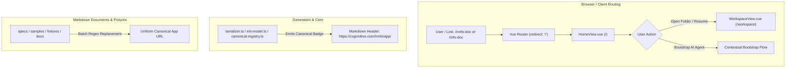
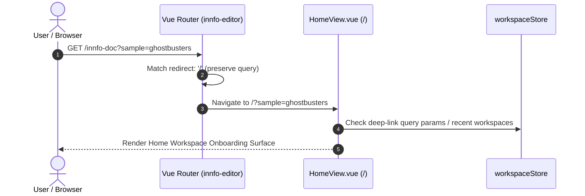

# Design: Deprecate Legacy `/innfo-doc` Route & Align Canonical Badges to Workspace-First

**Change ID:** `2026-09-24-deprecate-legacy-innfodoc-route`  
**Related Proposal:** [proposal.md](openspec/changes/2026-09-24-deprecate-legacy-innfodoc-route/proposal.md)  
**Status:** In Review  

---

## 1. Executive Summary & Context

iNNfo has transitioned entirely to a **Workspace-First architecture**. In this paradigm, models are managed within structured workspace directories, navigated via Directory Handles or parsed workspace states (`/workspace`), and initiated from the unified home workspace view (`/`).

The legacy single-document route `/innfo-doc` (and its alias `/info-doc`), served by `InfoDocView.vue`, was originally created for standalone single-file editing before workspace concepts were introduced. Retaining this view incurs dead bundle weight, component test maintenance overhead, and architectural ambiguity.

Furthermore, generated model header callouts across `innfo-mcp`, `innfo-core`, canonical templates (`iNNfo/specs/templates/`), and fixtures/samples (`_samples_nn/`, `workspace_NN/`, `docs/`, `simulation/fixtures/`) continue to emit the legacy markdown badge:
```markdown
> This is an **iNNfo document** — a plain-text Markdown file. Open it with any text editor or view and edit it with [cogNNitive](https://cognnitive.com/innfo/app/innfo-doc).
```
pointing users to `/innfo-doc` rather than the canonical workspace application root `https://cognnitive.com/innfo/app/`.

This technical design details the retirement of `InfoDocView.vue`, router-level redirection to `/`, generator updates across core/MCP packages, and the batch regex migration of markdown badges across the codebase.

---

## 2. Technical Architecture & Decisions



### Architecture Decisions (ADs)

#### AD-1: Router Redirection with Parameter Preservation (`/innfo-doc` & `/info-doc` $\rightarrow$ `/`)
* **Context:** Existing external links, bookmarks, and older documentation files link to `https://cognnitive.com/innfo/app/innfo-doc` or `/info-doc`.
* **Decision:** Replace the route entry in [iNNfo/apps/innfo-editor/src/router/index.ts](iNNfo/apps/innfo-editor/src/router/index.ts) with a redirect rule targeting `/`. The redirect preserves search query parameters and URL hashes (`to => ({ path: '/', query: to.query, hash: to.hash })` or Vue Router's declarative `redirect: '/'`).
* **Rationale:** Direct redirection ensures zero broken links for legacy incoming traffic while routing users directly into the workspace-first onboarding / directory picker workflow.

#### AD-2: Complete Removal of Standalone Document View (`InfoDocView.vue`)
* **Context:** `InfoDocView.vue` allowed dragging and dropping a single `_NN.md` file into memory without a directory handle. The workspace application now supports opening workspaces and samples directly.
* **Decision:** Delete [iNNfo/apps/innfo-editor/src/views/InfoDocView.vue](iNNfo/apps/innfo-editor/src/views/InfoDocView.vue) and its test file [iNNfo/apps/innfo-editor/tests/component/InfoDocView.test.ts](iNNfo/apps/innfo-editor/tests/component/InfoDocView.test.ts). Update comments in [iNNfo/apps/innfo-editor/tests/setup.ts](iNNfo/apps/innfo-editor/tests/setup.ts) to clean up references to `InfoDocView`.
* **Rationale:** Eliminates orphaned components, dead bundle bytes, and test suite flakiness related to single-document mount state.

#### AD-3: Generator String Literal Alignment
* **Context:** Generators in `innfo-core` and `innfo-mcp` generate the default Markdown preamble note for new models.
* **Decision:** Update the standard callout string literal across all model generation sources:
  - [iNNfo/packages/innfo-core/src/parser/serializer.ts](iNNfo/packages/innfo-core/src/parser/serializer.ts#L274-L278)
  - [iNNfo/packages/innfo-core/src/schema/canonical-registry.ts](iNNfo/packages/innfo-core/src/schema/canonical-registry.ts)
  - [iNNfo/packages/innfo-mcp/src/tools/init-model.ts](iNNfo/packages/innfo-mcp/src/tools/init-model.ts#L30-L34)
  - [skills/nn-trannsform/scripts/lib/provenance-model.js](skills/nn-trannsform/scripts/lib/provenance-model.js#L10-L14)
  - Regenerate `iNNfo/packages/innfo-mcp/bin/innfo-mcp.bundle.js` via package build.
* **Rationale:** Ensures every newly generated model or serialized document points to `https://cognnitive.com/innfo/app/`.

#### AD-4: Batch Markdown Badge Normalization & Target Scoping
* **Context:** Over 100 markdown files in the repository contain the outdated URL in their note badge.
* **Decision:** Perform targeted replacement of legacy badge URLs across markdown files while preserving unrelated DOM identifiers (e.g. CSS `#innfo-doc` elements in standalone console HTML/bundle artifacts).
* **Rationale:** Guarantees uniform documentation and template links without corrupting console bundle styling.

---

## 3. Component Impact & File Modifications

### 3.1 `iNNfo/apps/innfo-editor`
- **[src/router/index.ts](iNNfo/apps/innfo-editor/src/router/index.ts):**
  - Remove `import InfoDocView from '../views/InfoDocView.vue'`.
  - Update route definition:
    ```ts
    export const routes = [
      { path: '/', name: 'home', component: HomeView },
      { path: '/innfo-doc', alias: '/info-doc', redirect: '/' },
      {
        path: '/workspace',
        name: 'workspace',
        component: WorkspaceView,
        meta: { requiresHandle: true },
      },
    ]
    ```
- **[src/views/InfoDocView.vue](iNNfo/apps/innfo-editor/src/views/InfoDocView.vue):**
  - Delete file.
- **[tests/component/InfoDocView.test.ts](iNNfo/apps/innfo-editor/tests/component/InfoDocView.test.ts):**
  - Delete file.
- **[tests/setup.ts](iNNfo/apps/innfo-editor/tests/setup.ts):**
  - Update explanatory comments regarding test isolation to reference general view mounting instead of `InfoDocView`.
- **Router Unit Tests:**
  - Add / update tests in `innfo-editor` to verify that navigating to `/innfo-doc` or `/info-doc` resolves to `/` while preserving query strings and hashes.

### 3.2 `iNNfo/packages/innfo-core`
- **[src/parser/serializer.ts](iNNfo/packages/innfo-core/src/parser/serializer.ts):**
  - Update default preamble badge string:
    ```ts
    lines.push('> [!NOTE]')
    lines.push(
      '> This is an **iNNfo document** — a plain-text Markdown file. Open it with any text editor or view and edit it with [cogNNitive](https://cognnitive.com/innfo/app/).',
    )
    ```
- **[src/schema/canonical-registry.ts](iNNfo/packages/innfo-core/src/schema/canonical-registry.ts):**
  - Replace all occurrences of `https://cognnitive.com/innfo/app/innfo-doc` with `https://cognnitive.com/innfo/app/`.
- **[tests/serializer-fidelity-units.test.ts](iNNfo/packages/innfo-core/tests/serializer-fidelity-units.test.ts):**
  - Update fixture helper `doc()` to emit the updated badge URL.
- **Fixtures in `tests/fixtures/`:**
  - Update markdown fixtures in `iNNfo/packages/innfo-core/tests/fixtures/simulacro-refactorizacion/`.

### 3.3 `iNNfo/packages/innfo-mcp`
- **[src/tools/init-model.ts](iNNfo/packages/innfo-mcp/src/tools/init-model.ts):**
  - Update the preamble notice in `generateScaffold()` and `initModel()` helper.
- **`bin/innfo-mcp.bundle.js`:**
  - Recompile and rebuild bundle via `npm run build` in `innfo-mcp`.

### 3.4 `skills/nn-trannsform`
- **[scripts/lib/provenance-model.js](skills/nn-trannsform/scripts/lib/provenance-model.js):**
  - Update `DOC_NOTICE` constant to point to `https://cognnitive.com/innfo/app/`.

### 3.5 Markdown Files & Specs
Batch update all markdown document badges in:
- `iNNfo/specs/templates/**`
- `_samples_nn/**`
- `workspace_NN/**`
- `docs/**`
- `simulation/fixtures/**`

---

## 4. Batch Regex Migration Strategy

### Replacement Rules

1. **Standard App URL:**
   - **Pattern:** `https://cognnitive\.com/innfo/app/innfo-doc`
   - **Replacement:** `https://cognnitive.com/innfo/app/`

2. **Legacy Hostname Variant:**
   - **Pattern:** `https://innfo\.cognnitive\.com/app/innfo-doc`
   - **Replacement:** `https://cognnitive.com/innfo/app/`

### Preservation & Exclusion Guards
- **CSS / DOM Selector Exclusions:** Do **not** replace `#innfo-doc` or `.getElementById('innfo-doc')` in console generator scripts (`innfo-console.bundle.js`, `*.console.html`), as those identify the host DOM container element in the compiled HTML console viewer.
- **Scope Restriction:** The regex substitution strictly applies to Markdown files (`*.md`) and TypeScript/JavaScript string literals declaring model preamble headers.

---

## 5. Data Flow & Routing Interaction



1. **Initial Navigation:** User navigates to `/innfo-doc` or `/info-doc` directly or via an existing link.
2. **Router Interception:** Vue Router identifies the redirect rule and transfers navigation to `/` with query parameters intact.
3. **Workspace State:** `HomeView.vue` loads, offering workspace selection, sample loading, or agent bootstrap.

---

## 6. Tradeoffs & Alternatives Considered

| Alternative | Evaluation | Decision |
| :--- | :--- | :--- |
| **Keep `InfoDocView.vue` with a Deprecation Notice Banner** | Retains ~134 lines of dead view code, imports, and component test overhead. Provides little value since WorkspaceView already handles models. | **Rejected:** Full removal eliminates dead code and prevents split user experience. |
| **Return 404 / Remove Route Entirely** | Breaks existing documentation links, badges in older documents, and bookmarks. | **Rejected:** Client-side redirect (`redirect: '/'`) provides seamless backwards compatibility. |
| **Redirect `/innfo-doc` to `/workspace`** | Fails route guard `requiresHandle` when no workspace handle or parsed state is active, causing unexpected redirects. | **Rejected:** Redirecting to `/` correctly lands the user on the workspace selection surface. |

---

## 7. Risks & Mitigations

| Risk | Impact | Mitigation |
| :--- | :--- | :--- |
| **Broken Inbound Links / Bookmarks** | Users navigating to old documentation links encounter errors. | **Mitigated:** Router redirects `/innfo-doc` and `/info-doc` to `/` with query string preservation. |
| **Serializer Round-Trip Golden Mismatches** | Unit tests comparing serialized output against hardcoded strings could fail. | **Mitigated:** Update unit test fixtures (`serializer-fidelity-units.test.ts`) in lockstep with serializer changes. |
| **Accidental Over-replacement in CSS/JS** | Changing DOM IDs `#innfo-doc` breaks standalone HTML console viewer styling. | **Mitigated:** Restrict replacement strictly to Markdown badges and generator preamble string literals. |
| **Out-of-sync MCP Bundle** | `innfo-mcp` tools emitting outdated headers if the bundle is not rebuilt. | **Mitigated:** Rebuild `innfo-mcp.bundle.js` and verify with automated tests. |

---

## 8. Verification & Migration Plan

### Step-by-Step Implementation Sequence

1. **Core & MCP Generator Updates:**
   - Update `serializer.ts`, `canonical-registry.ts`, `init-model.ts`, and `provenance-model.js`.
   - Run `innfo-mcp` build script to refresh `bin/innfo-mcp.bundle.js`.
2. **Markdown Batch Alignment:**
   - Apply regex replacements across `iNNfo/specs/templates/`, `_samples_nn/`, `workspace_NN/`, `docs/`, `simulation/fixtures/`, and `innfo-core/tests/fixtures/`.
3. **Editor Router & View Cleanup:**
   - Remove `InfoDocView.vue` and `InfoDocView.test.ts`.
   - Update `router/index.ts` with redirect mapping.
   - Clean up `tests/setup.ts`.
4. **Test Suite Verification:**
   - Run `vitest` across `innfo-core`, `innfo-mcp`, and `innfo-editor`.
   - Verify router redirection unit tests pass.

### Rollback Strategy
All changes are non-destructive and tracked under git version control. In the event of an unforeseen issue:
- Revert the commit to restore `InfoDocView.vue`, its tests, and router configuration.
- Re-run the MCP bundle build to revert the bundled assets.
