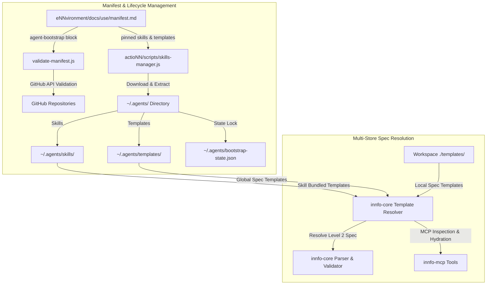

# Design: Bundle Templates and Skills

## Technical Approach

This technical design establishes a unified template and skill bundling mechanism across the `cogNNitive` ecosystem: `eNNvironment` (manifest schema definition & structural validation), `actioNN` (skills and templates lifecycle management & CLI), and `iNNfo` (multi-location template resolution & MCP integration).

The implementation realizes a **Hybrid Decoupled Manifest + Skill-Encapsulated Bundling** model, delivering two core capabilities:

1. **`template-skill-bundling`**:
   - Formal extension of `agent-bootstrap` manifest schema in `eNNvironment/docs/use/manifest.md` to support both `skills` and `templates` arrays.
   - Comprehensive validation in `eNNvironment/scripts/validate-manifest.js` covering SHA existence, file existence, version parity, and dependency closure for skills and templates.
   - Expanded CLI lifecycle in `actioNN/scripts/skills-manager.js` to manage both skills and standalone Level 2 templates (`status`, `install`, `update`, `sync`), persisting machine state in `~/.agents/bootstrap-state.json`.
   - Support for skill-encapsulated templates via a standardized `bundled_templates` frontmatter array in `actioNN/skills/*/SKILL.md`.

2. **`workspace-entrypoint-resolution`**:
   - Multi-store Level 2 spec template resolution in `innfo-core` and `innfo-mcp` that dynamically locates referenced spec templates across three search tiers:
     1. Workspace-local `./templates/`
     2. Global user directory `~/.agents/templates/`
     3. Installed skill directories `~/.agents/skills/*/templates/`
   - MCP tools in `innfo-mcp` for listing available templates and hydrating templates into active workspace environments.

---

## Architecture Decisions

| # | Decision | Choice | Alternatives | Rationale |
|---|----------|--------|--------------|-----------|
| D1 | Bundling Architectural Model | **Hybrid Model**: Support standalone templates in `agent-bootstrap.templates` AND embedded templates in `SKILL.md` (`bundled_templates`) | Pure Decoupled Peer Model OR Pure Skill-Encapsulated Model | Combines reusability of ecosystem-wide specs (e.g. `workspace_spec_NN.md`) with zero-drift convenience of skill-specific templates (e.g. `Casa_Template_V_0-1-0_spec_NN.md`). |
| D2 | State File Schema & Path | Combined `~/.agents/bootstrap-state.json` with backward-compatible migration from `skills-state.json` | Separate `templates-state.json` file | A single atomic state file avoids race conditions and split-state drift when updating multi-component manifests. |
| D3 | Manifest Parser Dependency Strategy | Retain zero-dependency zero-parser focused YAML reader in Node.js scripts | Introduce NPM dependency (e.g. `yaml` or `js-yaml`) | Preserves lightweight execution guarantees across CI environments (`validate-manifest.js`) and agent bootstrap hooks (`skills-manager.js`). |
| D4 | Interactive Consent Gates | Mandatory consent gate with `--yes` flag and non-TTY `needs decision: ...` detection | Auto-confirm on non-TTY | Enforces safety for file extraction and workspace hydration operations, matching `skills-manager.js` safety invariants. |
| D5 | Template Resolution Order | Tiers: 1. Workspace `./templates/` $\rightarrow$ 2. Global `~/.agents/templates/` $\rightarrow$ 3. Installed `~/.agents/skills/*/templates/` | Global first OR Skill-only | Workspace-local templates override global defaults to support project-specific spec customization, while global and skill paths provide fallbacks. |
| D6 | MCP Tool Scope for Templates | Expose `list_templates` and `hydrate_templates` tools in `innfo-mcp` | CLI-only hydration | Allows AI agents operating via MCP to inspect available spec templates and hydrate target workspaces on demand. |

---

## Data Flow



---

## File Changes

| Repository | File Path | Action | Description |
|---|---|---|---|
| `eNNvironment` | `docs/use/manifest.md` | Modify | Formalize `agent-bootstrap` schema with `entrypoint`, `skills`, `templates`, and `workflows` sections. |
| `eNNvironment` | `scripts/validate-manifest.js` | Modify | Extend parser to validate `templates` block: commit SHA existence, file existence at path, version parity, and dependency closure. |
| `actioNN` | `scripts/skills-manager.js` | Modify | Add template download/extraction routines, state tracking in `bootstrap-state.json`, `bundled_templates` processing, and updated status/sync CLI logic. |
| `actioNN` | `skills/*/SKILL.md` | Modify | Standardize `bundled_templates` frontmatter array for skill-encapsulated template assets. |
| `iNNfo` | `packages/innfo-core/src/resolver.ts` | Modify | Implement multi-store spec template lookup supporting workspace-local, global, and skill template paths. |
| `iNNfo` | `packages/innfo-core/src/recursiveParser/workspace.ts` | Modify | Integrate multi-store template resolver during entrypoint and taxonomy initialization. |
| `iNNfo` | `packages/innfo-mcp/src/tools/spec.ts` | Modify | Expose `list_templates` and `hydrate_templates` tools for inspecting and hydrating Level 2 spec templates. |

---

## Interfaces & Schemas

### 1. Bootstrap Manifest Schema (`eNNvironment/docs/use/manifest.md`)

```yaml
agent-bootstrap:
  version: "2.0"
  entrypoint: "workspace_NN.md"
  skills:
    - name: nn-innfo
      repo: cogNNitive/actioNN
      path: skills/nn-innfo
      version: "V_1-0-0"
      commit: "d60a7109315820085ab127b70412992db6986c88"
      templates: ["workspace_spec_NN"]
  templates:
    - name: workspace_spec_NN
      repo: cogNNitive/iNNfo
      path: specs/templates/workspace_spec_NN.md
      version: "V_1-0-0"
      commit: "a1b2c3d4e5f678901234567890abcdef12345678"
    - name: projects
      repo: cogNNitive/iNNfo
      path: specs/templates/projects/projects_V_0-1-0_NN.md
      version: "V_0-1-0"
      commit: "a1b2c3d4e5f678901234567890abcdef12345678"
  workflows:
    - id: planificar-obra
      name: Planificación de Obra
      template: projects
```

### 2. State File Schema (`~/.agents/bootstrap-state.json`)

```json
{
  "manifest": "https://raw.githubusercontent.com/cogNNitive/eNNvironment/main/docs/use/manifest.md",
  "updated_at": "2026-09-01T11:38:00Z",
  "skills": {
    "nn-innfo": {
      "commit": "d60a7109315820085ab127b70412992db6986c88",
      "version": "V_1-0-0",
      "updated_at": "2026-09-01T11:38:00Z"
    }
  },
  "templates": {
    "workspace_spec_NN": {
      "commit": "a1b2c3d4e5f678901234567890abcdef12345678",
      "version": "V_1-0-0",
      "path": "~/.agents/templates/workspace_spec_NN.md",
      "updated_at": "2026-09-01T11:38:00Z"
    }
  }
}
```

### 3. Skill Frontmatter (`SKILL.md`)

```yaml
---
name: nn-reforma-casa
version: V_0-1-0
description: Skill for home renovation model analysis and planning.
bundled_templates:
  - name: Casa_Template_V_0-1-0_spec_NN
    path: templates/Casa_Template_V_0-1-0_spec_NN.md
---
```

### 4. Template Resolver Interface (`innfo-core/src/resolver.ts`)

```typescript
export interface MultiStoreResolverOptions {
  workspaceDir?: string;
  globalTemplatesDir?: string;
  skillsDir?: string;
  timeout?: number;
}

export interface SpecTemplateLocation {
  name: string;
  filePath: string;
  source: 'workspace' | 'global' | 'skill';
  skillName?: string;
}

export function resolveTemplatePath(
  templateName: string,
  options?: MultiStoreResolverOptions
): Promise<SpecTemplateLocation | null>;
```

---

## Testing Strategy

| Layer | Target | Approach |
|---|---|---|
| **Validation Unit** | `validate-manifest.js` | Execute CLI against valid manifests, invalid commit SHAs, missing template paths, version mismatches, and broken dependency closures. |
| **Lifecycle Integration** | `skills-manager.js` | Test `status`, `install`, `update`, and `sync` subcommands with mock manifest servers, verifying atomic extraction into `~/.agents/` and TTY consent logic. |
| **Resolver Unit** | `innfo-core` | Test `resolveTemplatePath()` verifying fallback sequence across workspace `./templates/`, `~/.agents/templates/`, and `~/.agents/skills/*/templates/`. |
| **MCP Integration** | `innfo-mcp` | Test `list_templates` and `hydrate_templates` tools in Node integration environment. |

---

## Migration & Rollback Plan

### Migration Sequence:
1. **Phase 1: Manifest Schema & Validator**: Update `eNNvironment/docs/use/manifest.md` schema definition and update `scripts/validate-manifest.js`. Ensure optional handling of `templates` block to avoid breaking unmigrated manifests.
2. **Phase 2: Lifecycle Manager Expansion**: Update `actioNN/scripts/skills-manager.js` to parse `agent-bootstrap.templates` and `bundled_templates` in `SKILL.md`. Implement state migration from `skills-state.json` to `bootstrap-state.json`.
3. **Phase 3: Multi-Store Resolver**: Deploy `innfo-core` and `innfo-mcp` resolver updates to support multi-location template loading.

### Rollback Strategy:
- In case of failure, revert Git commits in `actioNN`, `eNNvironment`, and `iNNfo`.
- `skills-manager.js` retains fallback reading of legacy `skills-state.json` if `bootstrap-state.json` is missing or corrupt.
